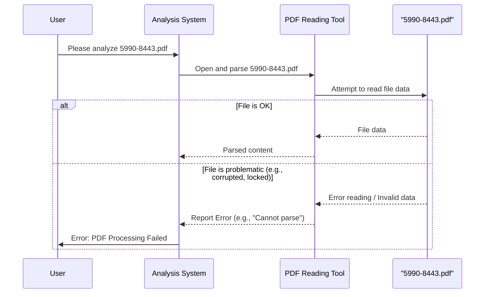

# Chapter 1: Error: PDF Processing Failed

Welcome to your first step in understanding the `5990-8443` project! We're excited to have you here. In this chapter, we'll tackle a very important, and sometimes frustrating, hurdle you might encounter right at the beginning: an error message stating "PDF Processing Failed."

## What's the Big Deal? Our Starting Point

Imagine you're an archaeologist, and you've just been handed an ancient, sealed scroll. This scroll, `5990-8443.pdf` in our case, is supposed to contain all the secrets and blueprints of the project we want to understand. Our main goal is to "read" this scroll (the PDF) to figure out how the `5990-8443` project works, what its main parts are, and how they fit together.

But what happens if the scroll is locked, written in an unknown language, or too damaged to read? That's exactly what the "Error: PDF Processing Failed" means for us.

**The Problem:** The primary document that describes our project, `5990-8443.pdf`, couldn't be opened or understood by our analysis tools.

Think of it like this:

*   **You want to:** Understand the `5990-8443` project.
*   **Your main source of information is:** The `5990-8443.pdf` file.
*   **The problem:** Our tools report "Error: PDF Processing Failed" when they try to read this file.

This means we're like an archaeologist with a locked treasure chest – we know there's something valuable inside, but we can't get to it yet! Because we can't "open" this PDF, we can't identify the core ideas or "abstractions" (the main building blocks) of the project from this file.

## Understanding "PDF Processing Failed"

When you see "PDF Processing Failed," it simply means that the computer program trying to read the PDF file encountered a problem it couldn't solve, and therefore, couldn't access the contents of the file.

Why might this happen? Here are a few common reasons:

1.  **Corrupted File:** The PDF file itself might be damaged. Imagine a book with pages torn out, smudged ink, or stuck together. If the file wasn't downloaded correctly, or if it got damaged on a storage device, it might be unreadable.
2.  **Invalid PDF Format:** While it might have a `.pdf` extension, the file might not actually be a proper PDF, or it could be a version that our tools don't recognize. It's like being given a book written in a secret code that our decoder ring (our PDF reader tool) doesn't understand.
3.  **Locked or Encrypted:** The PDF could be password-protected or encrypted. This is the "locked book" analogy from our concept description. Without the key (the password or decryption method), the contents remain hidden.

## What This Means for Analyzing `5990-8443`

Since `5990-8443.pdf` is our primary document, this error is a significant roadblock. It means:

*   We cannot automatically extract text or diagrams from it.
*   We cannot understand its structure or content.
*   Most importantly, we cannot identify the core concepts (often called "abstractions") that would form the basis of our understanding of the `5990-8443` codebase.

Think of trying to assemble a complex LEGO model without the instruction booklet. That's the situation we're in when the main PDF guide fails to process.

## How Can We Address This?

The solution to "PDF Processing Failed" usually involves getting a *good* version of the PDF file. Here are steps you (or the person who provided the file) can take:

1.  **Verify the File:**
    *   Try opening `5990-8443.pdf` with a standard PDF reader application (like Adobe Acrobat Reader, or even your web browser).
    *   If it doesn't open there, the file is almost certainly the problem.
2.  **Ensure It's Valid and Not Corrupted:**
    *   If you downloaded the file, try downloading it again.
    *   If someone sent it to you, ask them to send it again, perhaps from the original source.
3.  **Check for Passwords:**
    *   If the file is password-protected, you'll need the correct password to open and process it.

Essentially, we need to ensure the `5990-8443.pdf` file is valid, not corrupted, and can be parsed (read and understood) by standard tools.

## What Our System Sees (or Doesn't See)

When our analysis system attempts to process the problematic `5990-8443.pdf`, it encounters an issue. Conceptually, this is what it deals with:

```text
--- File: 5990-8443.pdf ---
[PDF CONTENT: 5990-8443.pdf]

This PDF file could not be processed due to an error.
```

This isn't "code" in the traditional sense that you'd write or run. Instead, it represents the situation:
*   **Input:** The file named `5990-8443.pdf` (which contains unreadable content for our tools).
*   **Output (from the attempt to process):** An error message, effectively saying, "I can't read this!"

Because of this error, no useful information about the project's design or codebase can be extracted from this specific file.

## Under the Hood: What Happens When Processing Fails?

Let's peek at what happens when a system tries, and fails, to process such a PDF.

**A Simple Step-by-Step:**

1.  **Request:** The analysis system is asked to process `5990-8443.pdf`.
2.  **Attempt to Open:** The system uses a PDF library (a specialized tool for reading PDFs) to try and open the file.
3.  **Encounter Error:** The PDF library hits a snag – maybe the file structure is wrong (corruption), or it requires a password it doesn't have.
4.  **Report Failure:** The PDF library signals an error back to the analysis system.
5.  **Notify User:** The analysis system then reports "Error: PDF Processing Failed" to you.

We can visualize this interaction with a simple diagram:



In our current situation, we're in the "File is problematic" path.

No specific code from `5990-8443.pdf` can be shown here because the very nature of the error is that its content is inaccessible. Any code that *would* try to process it (perhaps using a Python library like `PyPDF2` or a Java library like `Apache PDFBox`) would encounter an exception or return an error status, leading to the message you see.

For example, conceptually, a piece of code trying to open the PDF might look like this (this is pseudo-code, just for illustration):

```
function process_pdf(file_path):
  try:
    pdf_document = open_pdf_file(file_path) // Tries to open and read
    content = extract_text(pdf_document)
    // ... further processing ...
    return "Successfully processed"
  except PDFError: // Catches errors from the PDF library
    return "Error: PDF Processing Failed"

// When our system runs:
status = process_pdf("5990-8443.pdf")
print(status) // This would print "Error: PDF Processing Failed"
```
This simplified example shows how a program might try to open a PDF and how it would report an error if the `open_pdf_file` step fails.

## Conclusion

In this chapter, we've learned about a fundamental first hurdle: the "Error: PDF Processing Failed." We've seen that this error prevents us from accessing the primary design document, `5990-8443.pdf`. Understanding this error is crucial because it highlights the need for a valid and accessible primary document before any deeper analysis of the `5990-8443` project can begin based on that document.

The key takeaway is that to move forward with understanding the `5990-8443` project *from its PDF documentation*, we first need to ensure we have a PDF file that our tools can successfully open and read.

For now, we acknowledge this limitation. In future explorations or chapters, if this PDF remains unprocessed, we would have to rely on other sources of information or make educated guesses about the project's structure.

---

Generated by [AI Codebase Knowledge Builder](https://github.com/The-Pocket/Tutorial-Codebase-Knowledge)