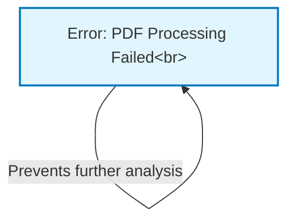

# Tutorial: 5990-8443

The project's main purpose and functionality *could not be determined* at this time.
This is because the primary document provided for analysis, `5990-8443.pdf`, **failed to process** due to an error.
As a result, it's *not possible* to identify any core ideas, functionalities, or further abstractions from this file.

**Source Repository:** [None](None)

## Chapters

1. [Error: PDF Processing Failed
](01_error__pdf_processing_failed_.md)

---

Generated by [AI Codebase Knowledge Builder](https://github.com/The-Pocket/Tutorial-Codebase-Knowledge)