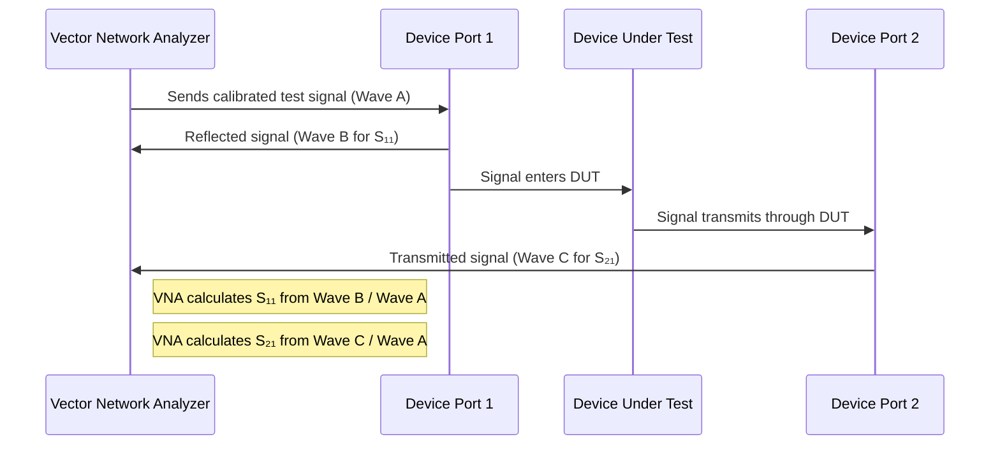

# Chapter 2: S-parameters (Scattering Parameters)

In our [previous chapter on Interconnects](01_interconnects_.md), we learned that the "signal highways" in our electronic devices aren't always simple, especially at high speeds. They can weaken, distort, or reflect signals. Now, you might be wondering: "How do we actually measure and describe these effects in a consistent way?" If an interconnect is like a pipe for data, how do we get a detailed report on how well it performs?

That's where **S-parameters**, or **Scattering Parameters**, come into play!

## The Challenge: Grading Our Signal Highways

Imagine you're a quality inspector for those signal highways (our [Interconnects](01_interconnects_.md)). You can't just say, "This cable looks okay." You need precise measurements. How much signal gets through? How much bounces back? How does the signal change as it travels?

This is crucial because, as the project `A Simple, Powerful Method to Characterize Differential Interconnects` highlights, understanding these details is key to making sure our high-speed gadgets work correctly. If we don't know how an interconnect behaves, we're designing in the dark!

## Introducing S-parameters: The Performance Report Card

**S-parameters are like a "performance report card" for electrical components**, especially interconnects, when they're dealing with high-frequency signals.

Think of it this way:
*   You send a test signal (like a little "ping" of energy) into one end of an interconnect.
*   The S-parameters tell you what happens to that signal.
    *   How much of it **reflects** back from the input (like an echo)?
    *   How much of it **transmits** (passes through) to the output?
    *   How do these signals change in **strength** (also called magnitude or amplitude)?
    *   How do these signals change in their **timing** (also called phase)?

S-parameters provide a standardized way for engineers to describe and predict how a component will interact with electrical signals.

## "Ports": The Doors for Signals

To understand S-parameters, we first need to understand "ports." A **port** is simply a point where an electrical signal can enter or exit a component.

For many common interconnects, like a simple cable or a trace on a circuit board, we often think of them as having **two ports**:
*   **Port 1:** The "input" end.
*   **Port 2:** The "output" end.

```mermaid
graph LR
    subgraph TwoPortDevice [Two-Port Device (e.g., a Cable)]
        Port1[Port 1 (Input)] -->|Signal Path| Port2[Port 2 (Output)]
    end

    style TwoPortDevice fill:#f0f8ff,stroke:#333,stroke-width:2px
    style Port1 fill:#e6ffed,stroke:#333
    style Port2 fill:#e6ffed,stroke:#333
```
This is a simplified view, and components can have more ports (e.g., a T-junction might have 3 ports), but for many interconnects, two ports are what we mainly care about.

## Meet the Key S-parameters for a Two-Port Device

For a typical two-port device, there are four main S-parameters that give us the "report card." They are written as `Sij`, where `j` is the port the signal *enters*, and `i` is the port where the signal is *measured*.

Let's break them down:

1.  **S₁₁ (S-one-one): Input Reflection Coefficient**
    *   **Question it answers:** If I send a signal into Port 1, how much of that signal bounces *back out* of Port 1?
    *   **Analogy:** Imagine shouting into a cave (Port 1). S₁₁ is like the echo you hear coming back to you from the cave entrance.
    *   A perfect interconnect would have a very small S₁₁ (no echo). A large S₁₁ means a lot of signal is being reflected, which is usually bad.

2.  **S₂₁ (S-two-one): Forward Transmission Coefficient**
    *   **Question it answers:** If I send a signal into Port 1, how much of that signal makes it *through* to Port 2?
    *   **Analogy:** If Port 1 is one end of a pipe and Port 2 is the other, S₂₁ tells you how much water you pour into Port 1 actually comes out at Port 2.
    *   A perfect interconnect would have an S₂₁ close to "1" (meaning all the signal gets through with no loss in strength). In reality, there's always some loss, so S₂₁ is less than 1.

3.  **S₂₂ (S-two-two): Output Reflection Coefficient**
    *   **Question it answers:** If I (for some reason) send a signal into Port 2, how much of it bounces *back out* of Port 2?
    *   **Analogy:** This is like shouting into the *other* end of the cave (Port 2) and listening for an echo at that same end.
    *   Similar to S₁₁, a smaller S₂₂ is generally better.

4.  **S₁₂ (S-one-two): Reverse Transmission Coefficient**
    *   **Question it answers:** If I send a signal into Port 2, how much of it makes it *through* to Port 1?
    *   **Analogy:** Pouring water into the "output" end of the pipe (Port 2) and seeing how much comes out the "input" end (Port 1).
    *   For many simple interconnects (called "passive" and "reciprocal" devices), S₁₂ will be the same as S₂₁.

```mermaid
graph TD
    subgraph Device [Two-Port Device]
        direction LR
        P1[Port 1]
        P2[Port 2]
        P1 -- S₁₁ --> P1_Echo((Echo))
        P1 -- S₂₁ --> P2
        P2 -- S₂₂ --> P2_Echo((Echo))
        P2 -- S₁₂ --> P1
    end

    Input1[Signal In @ Port 1] --> P1
    P2 --> Output1[Signal Out @ Port 2 (from Port 1 input)]

    Input2[Signal In @ Port 2] --> P2
    P1 --> Output2[Signal Out @ Port 1 (from Port 2 input)]


    style Device fill:#f0f8ff,stroke:#333,stroke-width:2px
    style P1 fill:#e6ffed
    style P2 fill:#e6ffed
    style P1_Echo fill:#ffe6e6
    style P2_Echo fill:#ffe6e6
```
*In this diagram, S₁₁ shows reflection at Port 1 when signal enters Port 1. S₂₁ shows transmission to Port 2 when signal enters Port 1.*

Each of these S-parameters (S₁₁, S₂₁, S₁₂, S₂₂) is actually a **complex number**. This means it has two parts:
*   **Magnitude:** How strong the reflected or transmitted signal is, compared to the input signal. Often expressed in decibels (dB). A value of 0 dB for S₂₁ means no loss in signal strength, while negative dB values mean the signal got weaker.
*   **Phase:** How much the timing (or phase) of the signal is shifted. Often expressed in degrees or radians. This relates to signal delay.

S-parameters also **depend on frequency**. An interconnect might behave very differently for a 100 MHz signal compared to a 10 GHz signal. So, a full S-parameter "report card" is actually a set of these values across a range of frequencies.

## How Are S-parameters Used? The "Under the Hood" Idea

You don't typically write a piece of simple code to *calculate* S-parameters for a physical cable from scratch. They are usually:
1.  **Measured:** Using a sophisticated instrument called a Vector Network Analyzer (VNA). The VNA sends known signals into the device's ports and precisely measures the reflected and transmitted signals at various frequencies.
2.  **Simulated:** Using specialized engineering software that models the physics of the interconnect.

The core idea of measurement can be visualized like this:



This process is repeated by sending a signal into Port 2 to determine S₂₂ and S₁₂.

**The "magic" of S-parameters is that once you have them, you can use math to predict how your component will behave in a larger system.**

As stated on page 4 of the project document (`A Simple, Powerful Method to Characterize Differential Interconnects.pdf`):
> "Most DUT + fixture structure can be described with a set of S-parameters, SD, for the DUT only, and a set of S-parameters associated with the fixture elements on each side of it, SA and SB, as shown in Figure 2."

This means we can represent our main component, the [Device Under Test (DUT)](03_device_under_test__dut__.md), with its own S-parameters (SD). And the things used to connect it for testing, the [Fixture](04_fixture_.md), can also be described by S-parameters (SA and SB).

```mermaid
graph LR
    Signal_In --> SA[Fixture A (Sᴀ)];
    SA --> SD[DUT (Sᴅ)];
    SD --> SB[Fixture B (Sʙ)];
    SB --> Signal_Out;

    style SA fill:#ccf, stroke:#333, stroke-width:2px
    style SD fill:#cfc, stroke:#333, stroke-width:2px
    style SB fill:#ccf, stroke:#333, stroke-width:2px
```
*This diagram, inspired by Figure 2 in the project PDF, shows how a system can be broken down into blocks, each described by its own S-parameters.*

The project's goal revolves around this. The PDF further explains:
> "The secret to successful de-embedding of the DUT S-parameters from the total S-parameters is knowing the S-parameters of the two fixture sections. If we have the total measurement of the cascaded network of the three S-parameter networks, (SA, SD, SB) and we have the values of the two sets of S-parameters of the fixture, SA and SB, using matrix math, we can extract just SD."

This process of extracting the DUT's performance (SD) from the measurement of the whole setup is called [De-embedding](05_de_embedding_.md), which is a central theme of this tutorial series!

## What S-parameter Data Looks Like (A Tiny Glimpse)

S-parameter data is usually a list of values (magnitude and phase, or real and imaginary parts) for each S-parameter (S₁₁, S₂₁, etc.) at many different frequencies. This data is often stored in a standard text file format called a **Touchstone file** (often with a `.s2p` extension for 2-port data, `.s4p` for 4-port, etc.).

You wouldn't typically write code *like this* in our project to *generate* S-parameters:
```python
# This is NOT how we get S-parameters for real devices
# This is just a conceptual placeholder
def get_s_parameters_for_my_cable():
    # In reality, this involves complex measurements or simulations!
    s11 = complex(0.05, -0.1) # Example: Small reflection
    s21 = complex(0.9, -0.05) # Example: Most signal passes, small loss/delay
    # ... and s12, s22
    # ... and these values would change with frequency!
    return {"S11": s11, "S21": s21, ...}
```
Instead, specialized tools provide this data. For instance, an S-parameter S₁₁ at 1 GHz might be `0.1 ∠ -90°`. This means at 1 GHz, 10% of the signal voltage amplitude is reflected from the input port, and this reflected signal is phase-shifted by -90 degrees relative to the input signal.

## Conclusion: The Language of High-Frequency Behavior

We've now learned that:
*   **S-parameters** are the "report card" describing how electrical components reflect and transmit signals at high frequencies.
*   For a **two-port device**, key S-parameters are S₁₁ (input reflection), S₂₁ (forward transmission), S₂₂ (output reflection), and S₁₂ (reverse transmission).
*   Each S-parameter has a **magnitude** (strength) and a **phase** (timing shift), and these values change with **frequency**.
*   S-parameters are crucial for understanding and predicting the behavior of [Interconnects](01_interconnects_.md) and are fundamental to techniques like [De-embedding](05_de_embedding_.md).

S-parameters give us the language to talk precisely about signal integrity. With this understanding, we can now look more closely at the specific thing we want to test.

In the next chapter, we'll formally introduce the star of our measurement show: the [Device Under Test (DUT)](03_device_under_test__dut__.md).

---

Generated by [AI Codebase Knowledge Builder](https://github.com/The-Pocket/Tutorial-Codebase-Knowledge)