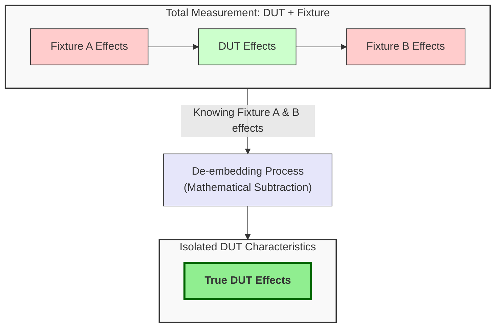
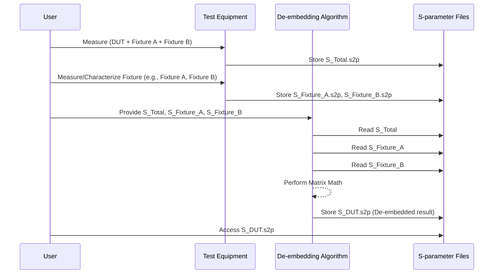

# Chapter 5: De-embedding

In our [previous chapter on the Fixture](04_fixture_.md), we learned that when we try to measure our [Device Under Test (DUT)](03_device_under_test__dut__.md), we're almost always measuring it *with* its "supporting cast" – the cables, connectors, and PCB traces that make up the fixture. This means our raw measurement is actually a combined result: "DUT + Fixture."

But what if we *only* want to know how the DUT behaves, without the fixture's influence? How can we see the star of the show clearly, without the supporting cast getting in the way? This is where a powerful technique called **De-embedding** comes to our rescue!

## The Challenge: Weighing Sugar in a Bowl

Imagine you want to know the exact weight of some sugar (our DUT). You don't have a way to weigh the sugar directly. Instead, you have to put it in a bowl (our Fixture) and then weigh the "bowl + sugar" combination on a scale (our test equipment).

Let's say:
*   The scale shows **150 grams** for the "bowl + sugar."
*   You then weigh the empty bowl, and it weighs **50 grams.**

To find the actual weight of the sugar, you'd simply subtract the bowl's weight:
`Sugar Weight = (Bowl + Sugar Weight) - Bowl Weight`
`Sugar Weight = 150g - 50g = 100g`

This process of subtracting the container's effect to find the item's true property is exactly what de-embedding does for electrical measurements!

## What is De-embedding?

**De-embedding is the process of mathematically removing the unwanted electrical effects of the fixture from the total measurement of the "DUT + Fixture" system.**

The goal is to isolate and obtain the true characteristics (e.g., [S-parameters](02_s_parameters__scattering_parameters__.md)) of *only* the DUT. It's like wanting to weigh a specific item (the DUT) that's inside a container (the fixture); de-embedding is the technique to subtract the container's weight to find the item's actual weight.

As stated in the project documentation (`A Simple, Powerful Method to Characterize Differential Interconnects.pdf`, Page 4):
> "The general process of extracting just the DUT performance from the composite performance is called de-embedding, as we “de-embed” the DUT from the total measurement."



## Why is De-embedding So Important?

De-embedding is crucial for several reasons:

1.  **Accurate Component Modeling:** If you want to create a computer model of your DUT (e.g., a new connector), that model needs to represent the DUT's behavior accurately. If your measurements include fixture effects, your model will be wrong. An inaccurate model can lead to designs that don't work in real life.
2.  **Reliable System Simulation:** Engineers use simulations to predict how an entire system (like a computer motherboard) will perform before building it. These simulations rely on accurate models of individual components. De-embedded DUT characteristics are essential for this.
3.  **Correct Performance Evaluation:** Without de-embedding, you might wrongly conclude that a good DUT is bad (because the fixture degrades the signal) or, less commonly, that a bad DUT is acceptable.
4.  **Comparing Apples to Apples:** If you want to compare two different DUTs (e.g., two types of connectors), you need to ensure you're comparing their intrinsic properties, not the properties of the different test fixtures they might have been measured in.

If we don't de-embed, it's like trying to judge the quality of a new type of coffee bean (DUT) but also tasting the paper filter and the coffee machine's pipes (Fixture) at the same time. You can't tell how good the bean itself is!

## The Basic Idea: How De-embedding Works (Conceptually)

Remember our system diagram from the [Fixture](04_fixture_.md) chapter, inspired by Figure 2 in the project PDF (Page 4):

```mermaid
graph LR
    Input_Signal --> S_A[Fixture A (Sᴀ)];
    S_A --> S_D[DUT (Sᴅ)];
    S_D --> S_B[Fixture B (Sʙ)];
    S_B --> Output_Signal;

    style S_A fill:#ccf, stroke:#333, stroke-width:2px,labelStyle:"font-style:italic"
    style S_D fill:#cfc, stroke:#333, stroke-width:2px, font-weight:bold,labelStyle:"font-style:italic"
    style S_B fill:#ccf, stroke:#333, stroke-width:2px,labelStyle:"font-style:italic"
```

*   Our test equipment (like a VNA) measures the [S-parameters](02_s_parameters__scattering_parameters__.md) of the whole chain: `Fixture A + DUT + Fixture B`. Let's call this `S_Total`.
*   What we *really* want are the S-parameters of just the DUT: `S_D`.
*   To get `S_D`, we need to know the S-parameters of `Fixture A` (let's call them `S_A`) and `Fixture B` (let's call them `S_B`).

De-embedding is the mathematical procedure that takes `S_Total`, `S_A`, and `S_B` and calculates `S_D`.

The project PDF (Page 4) explains this well:
> "The secret to successful de-embedding of the DUT S-parameters from the total S-parameters is knowing the S-parameters of the two fixture sections. If we have the total measurement of the cascaded network of the three S-parameter networks, (SA, SD, SB) and we have the values of the two sets of S-parameters of the fixture, SA and SB, using matrix math, we can extract just SD."

It's important to note that this isn't a simple arithmetic subtraction for S-parameters. Because S-parameters represent waves interacting, the math involves more complex operations, often using matrices. But don't worry about the complex math! The good news is that specialized instruments (like VNAs) and software often handle these calculations for you.

## "Under the Hood" of De-embedding (A Simplified View)

You typically don't write the de-embedding math from scratch. It's often a built-in function in your test equipment or analysis software. Here’s a simplified, step-by-step idea of what happens:

1.  **Measure the Whole System:** You use your VNA to measure the S-parameters of the entire "Fixture A + DUT + Fixture B" setup. This gives you `S_Total`.
2.  **Characterize Fixture A:** You need to determine the S-parameters of Fixture A (`S_A`). This might involve measuring Fixture A separately or using a known model for it.
3.  **Characterize Fixture B:** Similarly, you determine the S-parameters of Fixture B (`S_B`). Often, Fixture A and Fixture B are designed to be identical or very similar.
4.  **Apply De-embedding Algorithm:** The de-embedding algorithm (which uses matrix math) takes `S_Total`, `S_A`, and `S_B` as inputs.
5.  **Obtain DUT S-parameters:** The algorithm outputs `S_D`, the S-parameters of just the DUT.

Here's a visual way to think about the flow:


*This diagram shows a conceptual flow. The actual steps for characterizing the fixture can vary depending on the technique used, like the [2x Thru Reference Fixture](07_2x_thru_reference_fixture_.md) method which we'll discuss later.*

The project you're learning about, `A Simple, Powerful Method to Characterize Differential Interconnects`, focuses on a technique called [Automatic Fixture Removal (AFR)](06_automatic_fixture_removal__afr__.md). AFR is a clever way to determine the fixture's S-parameters (`S_A` and `S_B`) and then perform the de-embedding to get the DUT's S-parameters (`S_D`).

## No "De-embedding Code" in This Chapter

It's important to understand that de-embedding itself is a mathematical *process* or *algorithm*, rather than a simple piece of code you'd write in a few lines like `s_dut = s_total - s_fixture`. The underlying math is complex.

```python
# This is PSEUDOCODE to illustrate the concept, NOT real de-embedding code.
# Real de-embedding involves complex matrix operations on S-parameter data.

# 1. Get S-parameters of the total measurement (DUT + Fixture)
s_total_measurement = measure_with_vna("DUT_and_Fixture.s2p")

# 2. Get S-parameters of the fixture parts
s_fixture_A = characterize_fixture_part_A("Fixture_A.s2p")
s_fixture_B = characterize_fixture_part_B("Fixture_B.s2p")

# 3. Use a de-embedding function (often built into VNA/software)
# This function handles the complex matrix math "under the hood"
s_dut_only = debedding_algorithm(s_total_measurement, s_fixture_A, s_fixture_B)

# Now, s_dut_only ideally contains the S-parameters of just the DUT.
# print("De-embedded DUT S-parameters:", s_dut_only)
```
This simplified pseudocode shows the inputs and desired output. The `debedding_algorithm` is the black box that does the heavy lifting, and techniques like AFR provide a practical way to get the inputs for this algorithm.

## The Key: Knowing Your Fixture

The accuracy of your de-embedded DUT characteristics heavily depends on how accurately you know the characteristics of your fixture (`S_A` and `S_B`). If your "weight of the bowl" is wrong in our earlier analogy, your "weight of the sugar" will also be wrong.

This is why a significant part of high-frequency measurement involves careful fixture design and characterization. Techniques like using a [2x Thru Reference Fixture](07_2x_thru_reference_fixture_.md) are specifically designed to help accurately determine the fixture's properties so that de-embedding can be effective.

## Conclusion: Seeing the DUT Clearly

In this chapter, we've learned that:
*   **De-embedding** is a vital process for mathematically removing the unwanted electrical effects of the test fixture.
*   Its goal is to isolate the **true characteristics of the DUT**.
*   It's like subtracting the weight of a container to find the weight of its contents.
*   De-embedding relies on knowing the S-parameters of the fixture and uses matrix mathematics (usually handled by specialized tools) to extract the DUT's S-parameters.
*   The accuracy of de-embedding hinges on the accuracy of the fixture characterization.

De-embedding allows us to move from a "fuzzy" view of our DUT (obscured by the fixture) to a "clear" view, enabling accurate modeling and design. But how do we practically and accurately determine those fixture characteristics needed for de-embedding?

One powerful and user-friendly method is called Automatic Fixture Removal. Let's dive into that in our next chapter: [Automatic Fixture Removal (AFR)](06_automatic_fixture_removal__afr__.md)!

---

Generated by [AI Codebase Knowledge Builder](https://github.com/The-Pocket/Tutorial-Codebase-Knowledge)