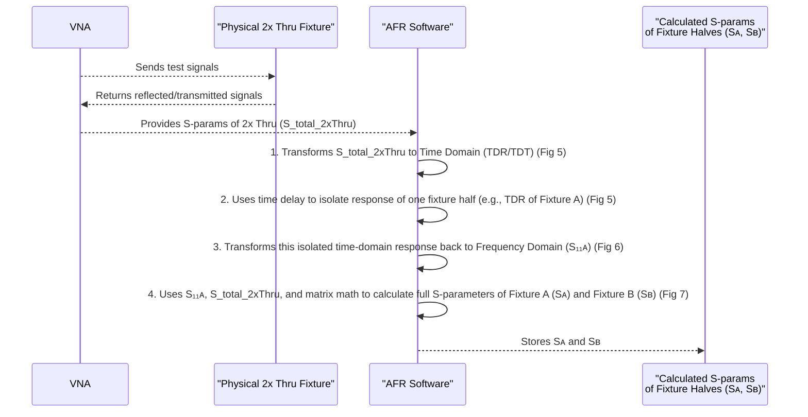

# Chapter 7: 2x Thru Reference Fixture

Welcome to Chapter 7! In our [previous chapter on Automatic Fixture Removal (AFR)](06_automatic_fixture_removal__afr__.md), we discovered a powerful and user-friendly technique that helps us see the true performance of our [Device Under Test (DUT)](03_device_under_test__dut__.md) by "automatically" subtracting the effects of the [Fixture](04_fixture_.md). We learned that AFR needs two main measurements: one of the DUT in its fixture, and another of a special structure.

But what is this "special structure"? And how does measuring it help AFR figure out the fixture's characteristics so precisely? This chapter dives into that crucial component: the **2x Thru Reference Fixture**.

## The "Secret Ingredient" for AFR: Characterizing the Fixture

Imagine you're a detective trying to identify a suspect (your DUT) from a blurry photo that also includes parts of the background (the Fixture). To get a clear image of the suspect, you first need to understand and remove the background's blur. How do you characterize that blur? You might take a separate, clear photo of *just the background*.

The 2x Thru Reference Fixture serves a similar purpose for AFR. It's a "calibration coupon" designed to let the AFR algorithm precisely learn the electrical characteristics of the fixture itself. Without accurately knowing the fixture, AFR can't accurately remove its effects.

The project documentation (`A Simple, Powerful Method to Characterize Differential Interconnects.pdf`, Page 5) introduces this concept clearly:
> "...it’s necessary to have a separate structure that is just the two fixtures connected together as a single thru. Since this thru reference structure is twice the length of either fixture connected to the DUT, it is often referred to as a 2x thru reference fixture."

## What is a 2x Thru Reference Fixture?

A **2x Thru Reference Fixture** (often just called "2x Thru") is a special calibration structure specifically designed for techniques like AFR. It's quite simple in concept:

*   It consists of **two identical fixture halves** connected directly to each other.
*   These "halves" are just like the fixture segments that would normally sit on either side of your DUT.
*   By connecting them directly, they form a continuous "through" connection that is **twice the electrical length** of a single fixture segment.

Think of it like this: Your DUT is usually sandwiched between Fixture A and Fixture B:
`[Fixture A] --- [DUT] --- [Fixture B]`

The 2x Thru structure is like taking Fixture A and a (typically identical or mirror-image) Fixture B and joining them directly:
`[Fixture A] --- [Fixture B_mirrored_or_identical_to_A]`

**Analogy: The Perfect Empty Container**
Imagine your fixture is like a special container (say, a uniquely shaped tube) that you use to pass signals to and from your DUT.
*   Fixture A is one half of the tube.
*   Fixture B is the other half.
The 2x Thru is like taking two identical halves of this tube and joining them mouth-to-mouth to form one longer, continuous tube. By studying how signals pass through this "double tube," we can learn precisely about the properties of the tube material and shape itself.

```mermaid
graph TD
    subgraph DUT_Setup [DUT in Fixture]
        direction LR
        Port1_DUT[Port 1] --> FA1[Fixture A] --> DUT_obj[DUT] --> FB1[Fixture B] --> Port2_DUT[Port 2]
    end

    subgraph TwoXThru_Setup [2x Thru Reference Fixture]
        direction LR
        Port1_2x[Port 1] --> FA2[Fixture A] --> FB2_as_FA_mirrored[Fixture A (mirrored)<br>or Identical Fixture B] --> Port2_2x[Port 2]
    end

    style FA1 fill:#ccf,stroke:#333
    style FB1 fill:#ccf,stroke:#333
    style DUT_obj fill:#cfc,stroke:#333,font-weight:bold

    style FA2 fill:#ccf,stroke:#333
    style FB2_as_FA_mirrored fill:#ccf,stroke:#333

    note right of FB1: Fixture B is often designed <br> to be a mirror image of Fixture A.
    note right of FB2_as_FA_mirrored: No DUT in between! <br> This is the 2x Thru.
```
This diagram illustrates the concept. The top shows the DUT with its fixture. The bottom shows the 2x Thru, where the two fixture halves are connected directly. Figure 3 on page 5 of the project PDF shows a practical example of a 2x Thru.

## Key Characteristic: Mirror Symmetry

For the AFR technique to work best, there's an ideal property for this 2x Thru structure: **mirror symmetry**.
This means that if you were to "cut" the 2x Thru in the middle, one half would be a mirror image of the other.

As stated in the project PDF (Page 5):
> "The most accurate results of the AFR technique are realized if the fixture elements on the two ends of the DUT are mirror symmetric."
And further, regarding the 2x Thru itself (Figure 3 caption):
> "Example of a 2x thru reference fixture with mirror symmetry..."

Why is symmetry important?
*   AFR often assumes that the fixture part before the DUT (Fixture A) and the fixture part after the DUT (Fixture B) are identical or mirror images.
*   The 2x Thru, built with this same symmetry, allows AFR to accurately characterize one "half" of the fixture (say, Fixture A) and then know that Fixture B is essentially the same.

This is like having two identical measuring cups. If you characterize one perfectly, you know the properties of the other.

## How the 2x Thru Helps AFR "See" the Fixture

When you measure the [S-parameters (Scattering Parameters)](02_s_parameters__scattering_parameters__.md) of the 2x Thru structure, the AFR algorithm cleverly uses this information.

1.  **It "looks" at the whole 2x Thru:** The AFR software analyzes the S-parameters of this `Fixture A + Fixture A (mirrored)` combination. (See Figure 4 on page 6 of the PDF for an S-parameter network diagram).
2.  **It figures out one "half":** Using smart signal processing (often involving a peek into the time domain, which we'll touch on in [Chapter 8: Time Domain Gating](08_time_domain_gating_.md)), AFR can deduce the S-parameters of a single fixture segment (e.g., Fixture A) from the measurement of the whole 2x Thru. (See Figure 5 on page 7 of the PDF).
3.  **It knows the fixture:** Once AFR knows the S-parameters of Fixture A (let's call them `S_A`) and assumes Fixture B (`S_B`) is a mirror image or identical, it now has the "fixture's signature."
4.  **De-embedding becomes possible:** With `S_A` and `S_B` known, AFR can then take your measurement of `Fixture A + DUT + Fixture B` and mathematically remove `S_A` and `S_B` to give you the S-parameters of *just the DUT*. (See Figure 8 on page 9 of the PDF).

## Building a 2x Thru: A Physical Thing

It's super important to remember that the 2x Thru Reference Fixture is a **physical object**, not something you "code."
*   It's typically designed and manufactured on a Printed Circuit Board (PCB), often on the same panel as the board containing your DUT and its fixture.
*   This ensures that the 2x Thru is made with the same materials and manufacturing processes as the actual fixture surrounding your DUT, making it a truly representative sample.

For example, if your fixture leading to the DUT is an SMA connector followed by a 2cm trace on a specific PCB material:
*   One half of the 2x Thru would be: `[SMA connector] --- [2cm trace]`
*   The other half would be a mirror image: `[2cm trace] --- [SMA connector]`
*   Connected together, the 2x Thru would be: `[SMA connector] --- [2cm trace] --- [2cm trace] --- [SMA connector]`

The accuracy of your de-embedded DUT results heavily relies on how well this 2x Thru fixture *actually represents* the fixture pieces connected to your DUT. If they are different, AFR will calculate an incorrect "fixture signature," and the de-embedding will be inaccurate. This is highlighted on pages 13-15 of the project PDF, emphasizing that the reference fixture must be identical to those connected to the DUT for best results.

## No "2x Thru Code" For You To Write

You won't be writing Python code like `create_2x_thru_fixture()` because it's a physical item. Instead, the process involves:

1.  Designing and fabricating the physical 2x Thru structure.
2.  Measuring its S-parameters using a Vector Network Analyzer (VNA). This measurement is usually saved as an S-parameter file (e.g., a `.s2p` or `.s4p` file).

This measurement file is then used as an *input* to the AFR software, as we saw in [Chapter 6](06_automatic_fixture_removal__afr__.md).

```python
# Conceptual: Illustrating how data FROM the 2x Thru is used.
# This is NOT code to create the 2x Thru itself.

# Step 1: Physically measure the 2x Thru reference fixture
# This is done using lab equipment (like a VNA).
# The result is an S-parameter file (e.g., "my_2x_thru_measurement.s2p").
s_parameter_file_of_2x_thru = "my_2x_thru_measurement.s2p"

# Step 2: This file is then loaded into the AFR software.
# (This part was covered conceptually in Chapter 6)
# s_params_2x_thru_data = load_s_parameter_file(s_parameter_file_of_2x_thru)

# Step 3: The AFR algorithm processes this data to characterize the fixture.
# (Conceptual function call within the AFR software)
# fixture_characteristics = afr_software_analyzes_2x_thru(s_params_2x_thru_data)

# Step 4: These fixture_characteristics are then used to de-embed the DUT.
# de_embedded_dut_data = de_embed_dut(s_params_of_dut_plus_fixture, fixture_characteristics)
```
This pseudocode just shows that the 2x Thru provides *data* that the AFR algorithm consumes.

## A Peek "Under the Hood": How AFR Uses the 2x Thru Measurement

Let's briefly sketch out what the AFR software does with the 2x Thru measurement, based on Figures 5, 6, and 7 in the project PDF (pages 7-9):


This is a simplified view. The AFR software performs these complex steps automatically once you provide it with the measurement file from your 2x Thru reference fixture. The key is that measuring the `Fixture A + Fixture A (mirrored)` structure allows the algorithm to mathematically solve for the properties of a single `Fixture A`.

## Conclusion: The Foundation for Accurate Fixture Characterization

In this chapter, we've unwrapped the "2x Thru Reference Fixture":
*   It's a special **physical calibration structure** required by the AFR technique.
*   It's made by connecting **two identical (or mirror-image) fixture halves** directly together, forming a "through" connection that is twice the electrical length of a single fixture segment.
*   **Mirror symmetry** in its design is ideal for the best AFR results.
*   By measuring the [S-parameters](02_s_parameters__scattering_parameters__.md) of this 2x Thru structure, the AFR algorithm can accurately determine the S-parameters of the individual fixture elements (S<sub>A</sub> and S<sub>B</sub>).
*   It's like creating a perfect "empty container" reference by joining two halves of the container, to precisely characterize the container itself.

The 2x Thru Reference Fixture is a cornerstone of the AFR method. It provides the critical information needed for AFR to "learn" about the fixture and then successfully remove its effects from your DUT measurement.

We mentioned that AFR often uses "time domain" analysis to understand the 2x Thru. What exactly does that mean? Our next chapter will introduce this fascinating concept.

Let's explore [Time Domain Gating](08_time_domain_gating_.md)!

---

Generated by [AI Codebase Knowledge Builder](https://github.com/The-Pocket/Tutorial-Codebase-Knowledge)