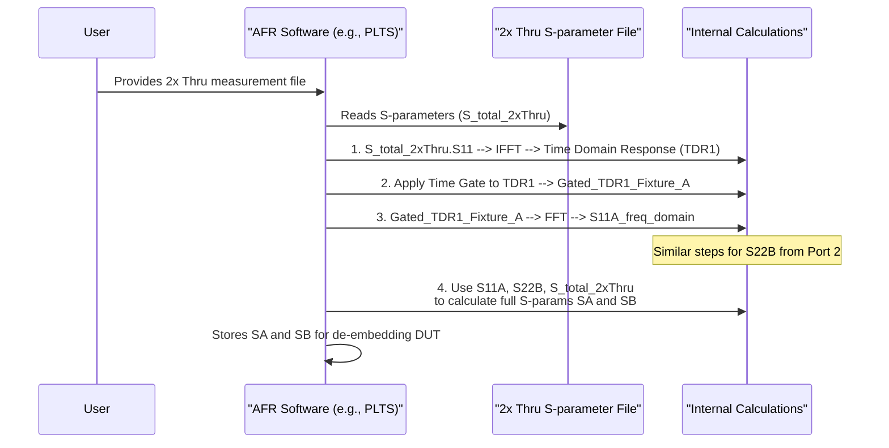

# Chapter 8: Time Domain Gating

Welcome to Chapter 8! In the [previous chapter on the 2x Thru Reference Fixture](07_2x_thru_reference_fixture_.md), we learned about the special calibration structure that is essential for the [Automatic Fixture Removal (AFR)](06_automatic_fixture_removal__afr__.md) technique. We saw that AFR needs to figure out the characteristics of the individual fixture halves from the measurement of this 2x Thru. But how does AFR "look inside" the 2x Thru to see just one half? A clever trick called **Time Domain Gating** is one of the keys!

## The Problem: Isolating One Piece of the Puzzle

Imagine your [2x Thru Reference Fixture](07_2x_thru_reference_fixture_.md) is like two identical Lego bricks snapped together: `[Brick A] --- [Brick A mirrored]`. Your measurement gives you information about the whole combined `Brick A + Brick A` structure. But for [De-embedding](05_de_embedding_.md), the [AFR](06_automatic_fixture_removal__afr__.md) technique needs to know the properties of *just one* `Brick A`.

[S-parameters (Scattering Parameters)](02_s_parameters__scattering_parameters__.md) are usually in the *frequency domain*. They tell us how the device responds to signals of different frequencies. Looking at these frequency-domain S-parameters for the whole 2x Thru, it's not immediately obvious how to separate out just the first "Brick A". It's like listening to a musical chord – you hear all the notes together, and it's hard to instantly pick out just one note's precise quality.

This is where Time Domain Gating comes in. It's a signal processing step that helps AFR isolate the response from just the first part of the fixture.

## From Frequencies to Time: A Different Perspective

Think about describing a journey. You could describe it by the *types of roads* you took (bumpy roads, smooth highways – like different frequencies). Or, you could describe it by *what you see at different times* during the journey (a tree at 1 minute, a house at 2 minutes, a river at 3 minutes).

[S-parameters (Scattering Parameters)](02_s_parameters__scattering_parameters__.md) usually give us the "types of roads" view (frequency domain). But we can mathematically convert them to a "timeline" view (time domain). This is often done using a mathematical tool called the **Inverse Fast Fourier Transform (IFFT)**. You don't need to worry about the math details! Just know it's like switching from one way of describing our signal's journey to another.

When we look at how signals reflect in the time domain, it's like using a super-fast radar. We send a tiny pulse of energy into our [2x Thru Reference Fixture](07_2x_thru_reference_fixture_.md) and watch for "echoes" (reflections) that come back over time. Each part of the fixture that's a bit different (like a connector, a bend, or the start of a trace) can cause a small echo. This time-domain view is often called a **Time Domain Reflectometry (TDR)** plot.

The project PDF (`A Simple, Powerful Method to Characterize Differential Interconnects.pdf`) shows many TDR plots (e.g., Figure 1, Figure 5, Figure 11). These plots show impedance (a measure of how much the signal is resisted) versus time (or distance, which is related to time by the signal's speed). Bumps in the TDR plot indicate reflections.

## "Gating": Using a Precise Stopwatch for Echoes

Now, imagine you're in a canyon and you shout. You'll hear echoes from different cliffs:
*   The echo from the *nearest* cliff comes back first.
*   Echoes from *further* cliffs come back later.

If you had a super-precise stopwatch and a very sensitive microphone, you could:
1.  Shout.
2.  Start your stopwatch.
3.  Only turn on your microphone for a very specific, short period – say, between 0.1 seconds and 0.2 seconds after you shouted.

If you set this "listening window" correctly, you might *only* capture the echo from the nearest cliff, and miss the echoes from the farther cliffs. This "listening window" is exactly what **time domain gating** is!

A **gate** is a specific window in time. When we apply a gate to our time-domain signal (our TDR plot), we are choosing to look *only* at what happens within that specific time slice.

In our [2x Thru Reference Fixture](07_2x_thru_reference_fixture_.md) (`[Fixture A] --- [Fixture A mirrored]`), when we send a pulse into Port 1:
*   The first reflection we see will be from the beginning of Fixture A (e.g., its input connector).
*   Later reflections will come from the middle of the 2x Thru (where the two halves meet) or from the far end (Port 2).

If we want to characterize just Fixture A, we are interested in that *first* reflection. We can set up a time gate to capture only that early part of the TDR response.

```mermaid
graph TD
    subgraph TDR_Plot [Conceptual TDR Plot of 2x Thru (S11 from Port 1)]
        direction LR
        Time_Start((Start)) --> Feature1{Reflection from<br>Fixture A entrance}
        Feature1 --> Feature2{Reflection from<br>middle of 2x Thru}
        Feature2 --> Feature3{Reflection from<br>far end of 2x Thru}
        Feature3 --> Time_End((End))
    end

    subgraph Gate_Window [Time Gate Applied]
        direction LR
        Gate_Start_Time((Gate Start)) -->|Only this part is kept| Gated_Feature1{Reflection from<br>Fixture A entrance}
        Gated_Feature1 --> Gate_End_Time((Gate End))
    end

    style Feature1 fill:#lightgreen
    style Gated_Feature1 fill:#lightgreen
    style Gate_Window fill:#lightblue,stroke:#333,stroke-width:2px

    Time_Start --> |Time Axis| Time_End
    Gate_Start_Time -.-> Feature1
    Gate_End_Time -.-> Feature1
    Gate_End_Time --> Feature2 % Visually show the gate ends before other features

    note right of Gate_Window
    The gate isolates the early reflection
    from Fixture A. Later reflections from
    the rest of the 2x Thru are "gated out."
    end note
```

This is precisely what's described in Figure 5 on page 7 of the project PDF:
> "Step 1: The measured S11 and S21 elements of the composite 2x thru reference fixture are transformed from the frequency domain into the time domain. ... This time is used to gate the TDR response looking into port 1. The gated TDR response looking into port 1 is the TDR response of just the T11 of fixture, T11A."

"T11A" here means the time-domain reflection response of Fixture A.

## Back to Frequencies: Getting the Fixture's S-parameter

So far, we've:
1.  Taken our [S-parameters (Scattering Parameters)](02_s_parameters__scattering_parameters__.md) of the whole 2x Thru.
2.  Converted them to the time domain (got a TDR plot).
3.  Applied a time gate to isolate the reflection from just the first fixture half (Fixture A).

Now we have the *time-domain* response of Fixture A's reflection (e.g., T11A). But S-parameters are usually expressed in the *frequency domain*. So, we need to convert this isolated time-domain piece back. This is done using another mathematical tool called the **Fast Fourier Transform (FFT)**. Again, no need to worry about the math details – it's just the reverse of what we did earlier.

This process gives us the frequency-domain S-parameter for that reflection of Fixture A, for example, S<sub>11A</sub> (the input reflection coefficient of Fixture A). This is shown in Figure 6 on page 8 of the project PDF:
> "Step 2: the gated T11A response of the fixture is transformed back into the frequency domain as the S11A term."

## How This Helps AFR "See" the Fixture

Once the [AFR](06_automatic_fixture_removal__afr__.md) software has S<sub>11A</sub> (and similarly S<sub>22B</sub>, which is the reflection from Port 2 of the other fixture half, if they are not perfectly symmetrical but of equal length), it's a huge step forward.
As mentioned on page 6 of the project PDF:
> "An essential element to the AFR technique is leveraging signal processing in the time domain to extract the unique values of S11A and S22B."

Knowing S<sub>11A</sub> and S<sub>22B</sub>, along with the *total* S-parameters of the 2x Thru, allows the AFR algorithm to use some clever matrix math to figure out the *complete* S-parameter models for both Fixture A (S<sub>A</sub>) and Fixture B (S<sub>B</sub>). This is described in Figure 7 (Page 9 of the PDF).

Once S<sub>A</sub> and S<sub>B</sub> are known, AFR can then perform the [De-embedding](05_de_embedding_.md) of your [Device Under Test (DUT)](03_device_under_test__dut__.md) from the "DUT + Fixture" measurement, as shown in Figure 8 (Page 9 of the PDF).

## "Under the Hood": The Gating Process in AFR

You, as a user of AFR software (like Keysight's PLTS mentioned in the PDF), don't typically perform these gating steps manually. You provide the measurement of the [2x Thru Reference Fixture](07_2x_thru_reference_fixture_.md), and the software does this "under the hood."

Here's a simplified conceptual flow of how the software might use gating:

```python
# This is conceptual PSEUDOCODE illustrating the steps INSIDE AFR software.
# Users don't write this; they use the AFR software's interface.

# AFR software receives the S-parameter measurement of the 2x Thru fixture
s_params_of_2x_thru = load_measurement_file("2x_thru_data.s2p")

# 1. Transform S11 of 2x Thru to the Time Domain (get TDR)
#    (This is like Figure 5 in the PDF)
tdr_response_port1 = perform_IFFT(s_params_of_2x_thru.S11)

# 2. Define and apply a time gate to isolate the first reflection
#    The software determines the start and end times for the gate
#    to capture the reflection from the first fixture half (Fixture A).
start_time_gate_A = calculate_gate_start_time(...) # Based on 2x Thru length/delay
end_time_gate_A = calculate_gate_end_time(...)
gated_tdr_fixture_A = apply_time_gate(tdr_response_port1,
                                        start_time_gate_A,
                                        end_time_gate_A)

# 3. Transform the gated time-domain response back to the Frequency Domain
#    This gives S11 of Fixture A (S11A). (This is like Figure 6 in the PDF)
s11_of_fixture_A = perform_FFT(gated_tdr_fixture_A)

# (A similar process would be done from Port 2 to get S22 of Fixture B - S22B)

# Now, s11_of_fixture_A (and s22_of_fixture_B) are used with the
# full s_params_of_2x_thru by the AFR algorithm to calculate
# the complete S-parameter matrices SA and SB for each fixture half.
# (This is like Figure 7 in the PDF)
# S_A, S_B = calculate_full_fixture_s_params(s_params_of_2x_thru,
#                                             s11_of_fixture_A,
#                                             s22_of_fixture_B)

# These S_A and S_B are then used to de-embed the DUT.
# (This is like Figure 8 in the PDF)
```
This pseudocode gives you an idea of the sequence of operations. The beauty of AFR is that these complex steps are automated.

Here's a simplified sequence diagram of these internal steps:



## Conclusion: A Key to Precise Fixture Characterization

In this chapter, we've explored **Time Domain Gating**:
*   It's a signal processing technique used within [Automatic Fixture Removal (AFR)](06_automatic_fixture_removal__afr__.md).
*   It involves transforming [S-parameters (Scattering Parameters)](02_s_parameters__scattering_parameters__.md) from the frequency domain to the time domain (like a TDR plot).
*   **Gates** (specific time windows) are then applied to this time-domain data to isolate the reflection (e.g., S11) coming from just one part of the [2x Thru Reference Fixture](07_2x_thru_reference_fixture_.md) (e.g., the first fixture half).
*   This isolated time-domain response is then transformed back to the frequency domain to get an accurate S-parameter (e.g., S<sub>11A</sub>) for that specific fixture section.
*   It's like using a very precise stopwatch to listen only for the echo from the nearest object, ignoring echoes from farther away.

Time Domain Gating is a powerful "under the hood" tool that allows AFR to "see" and characterize the individual fixture components with high precision. This accurate fixture characterization is the foundation for successfully [De-embedding](05_de_embedding_.md) your [Device Under Test (DUT)](03_device_under_test__dut__.md) and getting its true performance.

With this understanding of Time Domain Gating, you now have a much clearer picture of how the "Simple, Powerful Method" of AFR works, from measuring a [2x Thru Reference Fixture](07_2x_thru_reference_fixture_.md) to extracting the clean S-parameters of your DUT! This concludes our journey through the core concepts of this AFR technique. We hope this tutorial has helped you understand these important ideas in high-speed interconnect characterization.

---

Generated by [AI Codebase Knowledge Builder](https://github.com/The-Pocket/Tutorial-Codebase-Knowledge)