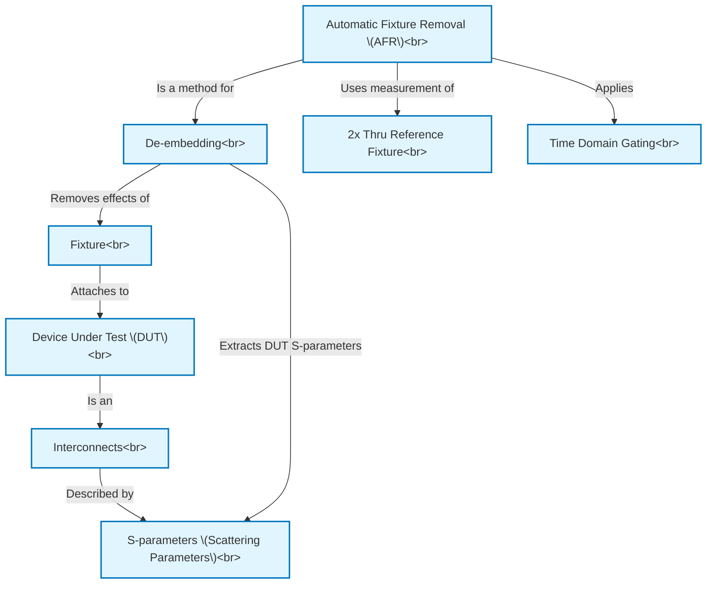

# Tutorial: A Simple, Powerful Method to Characterize Differential Interconnects

This project introduces a technique called **Automatic Fixture Removal (AFR)**, a simple yet powerful method for accurately measuring the electrical characteristics of *interconnects* (like traces, connectors, or cables) in high-speed electronic devices.
AFR helps engineers determine the true performance, often represented by *S-parameters*, of a specific *Device Under Test (DUT)* by mathematically removing the distorting effects of the *test fixture* (the cables and connectors used to connect the DUT to measurement equipment).

**Source Repository:** [None](None)

## Chapters

1. [Interconnects
](01_interconnects_.md)
2. [S-parameters (Scattering Parameters)
](02_s_parameters__scattering_parameters__.md)
3. [Device Under Test (DUT)
](03_device_under_test__dut__.md)
4. [Fixture
](04_fixture_.md)
5. [De-embedding
](05_de_embedding_.md)
6. [Automatic Fixture Removal (AFR)
](06_automatic_fixture_removal__afr__.md)
7. [2x Thru Reference Fixture
](07_2x_thru_reference_fixture_.md)
8. [Time Domain Gating
](08_time_domain_gating_.md)

---

Generated by [AI Codebase Knowledge Builder](https://github.com/The-Pocket/Tutorial-Codebase-Knowledge)