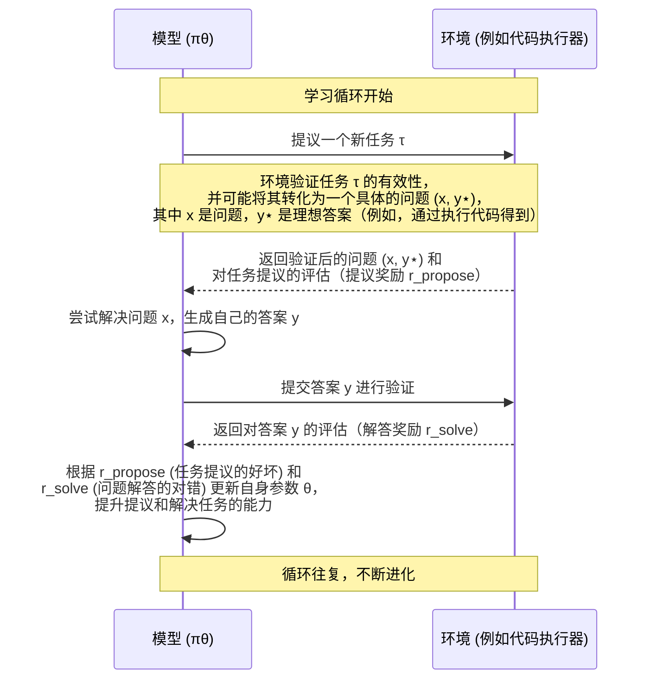

# Chapter 1: 绝对零范式 (Absolute Zero Paradigm)

欢迎来到“绝对零：零数据强化自博弈推理”项目的学习之旅！在本章中，我们将一起探索一个令人兴奋的全新概念——**绝对零范式**。

## 什么是绝对零范式？为什么它很重要？

想象一下，我们想教会一个人工智能（AI）一项新技能，比如编程或者解决复杂的数学问题。传统的方法通常需要我们为 AI 提供大量的学习材料：
*   **教科书和习题集**：成千上万的例题和标准答案，让 AI 模仿学习。
*   **老师手把手教学**：人类专家定义好问题，并给出详细的解题步骤。

这些方法在很多情况下都非常有效，但也存在一些局限性：
1.  **数据依赖**：高质量的人工标注数据非常昂贵且难以获取，尤其是在前沿领域。
2.  **人类知识瓶颈**：如果 AI 的目标是超越人类智能，那么由人类设计的问题和任务可能最终会限制 AI 的学习潜能。AI 怎么能学会人类都还不知道的东西呢？
3.  **缺乏真正自主性**：AI 只是在被动地“消化”我们喂给它的东西。

**绝对零范式 (Absolute Zero Paradigm)** 的提出，正是为了解决这些问题。

**核心思想**：
> 这是一种全新的强化学习范式。想象一个完全自学的学生，他不仅解决已有的难题，还会自己出题，题目难度逐步增加，整个过程完全不需要教科书或老师提供的任何现成问题和答案。模型在没有任何外部数据的情况下，通过自我提议任务并解决这些任务来进行学习和进化，旨在实现真正的自主智能。

简单来说，AI 不再仅仅是一个解题者，它同时还是一个出题者。它自己给自己找事做，自己评估做得怎么样，然后自己从中学习和进步。整个过程就像在一个“绝对零”数据输入的环境中进行一样，AI 完全依靠“自力更生”。

**一个核心用例：AI 自学编程**

让我们以 AI 学习编程为例。在绝对零范式下，我们不再需要给 AI 成千上万行人类编写的带注释的代码范例或者编程练习题。相反，这个 AI 会：
1.  **自己出题**：比如，它可能会先给自己定一个非常简单的目标：“写一个能输出‘你好，世界！’的程序。”
2.  **尝试解决**：它会尝试生成一段代码来实现这个目标。
3.  **自我检验**：它会运行这段代码，看看输出是不是真的是“你好，世界！”。（这里的“运行和检查”就是与“环境”的交互）
4.  **学习和进化**：
    *   如果成功了，它会获得“奖励”，知道这种写法是可行的。
    *   如果失败了，或者代码出错了，它也会从中学习，下次避免犯类似的错误。
    *   当它掌握了简单问题后，它会给自己出更难的题目，比如“写一个计算两个数字之和的程序”，然后是“写一个排序算法”，以此类推，不断挑战自己，能力也随之进化。

这种方式使得 AI 能够从“零”开始，自主地探索和学习，潜力无限。

## 绝对零范式的关键组成

要理解绝对零范式，我们可以把它拆解成几个关键的概念：

1.  **自我提议任务 (Self-Proposed Tasks)**：AI 系统内部有一个机制，能够自主地创造新的任务或问题。这些任务的难度会根据 AI 当前的能力水平进行动态调整。
2.  **解决任务 (Solving Tasks)**：AI 系统会尝试去完成这些自己提出的任务。
3.  **与环境交互并获得可验证反馈 (Interaction with Environment & Verifiable Feedback)**：这是至关重要的一环。AI 的行为（比如生成的代码、提出的解决方案）需要在某个“环境”中得到检验。这个环境能够提供客观的、可验证的反馈。
    *   在编程的例子中，这个环境就是[基于代码执行器的可验证奖励](06_基于代码执行器的可验证奖励__verifiable_rewards_via_code_executor__.md)。代码能不能运行？运行结果对不对？这些都是非常明确的反馈。
4.  **强化学习与进化 (Reinforcement Learning and Evolution)**：AI 根据环境的反馈来调整自己，就像学生根据考试成绩来改进学习方法一样。这个过程通常采用[强化自博弈](04_强化自博弈__reinforced_self_play__.md)的机制，AI 通过不断地“左右互搏”来提升自己。
5.  **零外部数据依赖 (Zero External Data Dependence)**：强调在学习的启动和持续进化过程中，不依赖于任何人工策划好的、带标签的数据集。这构成了[零数据学习](02_零数据学习__zero_data_learning__.md)的核心。

下面的图表（灵感来源于原始论文中的 Figure 2 和 Figure 3）描绘了这个核心循环：

在这个循环中，模型扮演着两个角色：一个是**任务提议者 (Proposer)**，负责创造新的、具有学习价值的任务；另一个是**任务解决者 (Solver)**，负责解决这些任务。这两个角色通常由同一个底层模型承担，这将在后续章节[双重角色：任务提议与解决](05_双重角色_任务提议与解决__dual_roles__proposer___solver__.md)中详细介绍。

## 绝对零范式的“引擎盖”之下

你可能会好奇，这个“自己出题、自己解答、自己学习”的过程，在概念层面是如何运作的呢？

在“绝对零”范式中，模型（我们用 `πθ` 表示，其中 `θ` 是模型的参数）的目标是最大化一个综合的期望奖励。这个奖励主要来自两部分（参考原始论文中的公式3）：

1.  **提议奖励 (r_propose)**：模型因为提出了一个“好”的任务而获得的奖励。什么样的任务是“好”的呢？通常是指那些对当前模型来说既不是太简单（学不到东西）也不是太难（根本无法解决），而是处于“学习区”的任务。
2.  **解答奖励 (r_solve)**：模型因为成功解决了任务而获得的奖励。例如，在编程任务中，如果生成的代码正确运行并得到预期结果，就能获得高奖励。

模型通过不断调整其内部参数 `θ`，力求在这两方面都做得越来越好。它需要学会：
*   **提出越来越有挑战性且适合学习的任务**。
*   **解决这些任务的能力越来越强**。

整个过程可以想象成一个永动机：模型通过解决自己提出的问题来提升能力，而能力的提升又使得它能提出更复杂、更有价值的新问题，如此循环，不断推动自身进化。

这个范式的美妙之处在于它不依赖人类的“喂养”。就像 AlphaZero 通过自我对弈学下围棋一样，绝对零范式下的 AI 通过与自己构建的“问题环境”互动来学习，完全无需人类的监督和预先准备的数据。

## 小结与展望

在本章中，我们初步认识了**绝对零范式**。它是一种让 AI 实现真正自主学习的强大框架，核心在于模型能够**自我提议任务、解决任务，并从与环境的交互中获得反馈以实现自我进化，整个过程不依赖任何外部标注数据**。我们通过 AI 自学编程的例子，理解了这个范式如何运作。

这种范式为解决当前 AI 发展中数据瓶颈和智能上限问题提供了一个全新的思路。

在接下来的章节中，我们将更深入地探讨构成绝对零范式的各个关键组件。下一章，我们将首先聚焦于这一范式得以实现的基础之一：[零数据学习 (Zero Data Learning)](02_零数据学习__zero_data_learning__.md)，看看 AI 是如何在没有“教科书”的情况下开始学习的。

---

Generated by [AI Codebase Knowledge Builder](https://github.com/The-Pocket/Tutorial-Codebase-Knowledge)