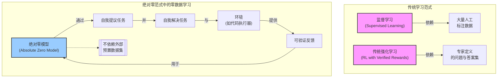

# Chapter 2: 零数据学习 (Zero Data Learning)


在上一章中，我们一起探索了[绝对零范式 (Absolute Zero Paradigm)](01_绝对零范式__absolute_zero_paradigm__.md)的宏伟蓝图，了解了AI如何通过自我提议和解决任务来实现自主学习和进化。这一章，我们将深入探讨支撑这一范式的核心基石之一 —— **零数据学习 (Zero Data Learning)**。正是因为有了零数据学习，AI才能真正摆脱对外部“教科书”的依赖，从零开始构建自己的知识体系。

## 什么是零数据学习？为何它如此特别？

想象一下，一位有志成为顶级大厨的学徒，他面前没有任何食谱秘籍，也没有任何教学视频可以参考。他所拥有的，仅仅是一个设备齐全的厨房，以及对烹饪的无限热情和好奇心。他通过一次又一次的尝试，自己琢磨食材的搭配，自己试验火候的控制，从最简单的煎蛋开始，逐渐到能够烹饪出令人惊叹的复杂菜肴。

**零数据学习 (Zero Data Learning)** 就与这位学徒的成长历程非常相似。

> **核心定义**：零数据学习是“绝对零”方法最显著的特点，指的是在模型的训练过程中，完全**不依赖任何人工标注的数据集或预先收集好的问题库**。模型从一个“空白”的状态开始，所有用于学习的“素材”和“练习题”都由模型自身在学习过程中动态生成。

在传统的机器学习，尤其是监督学习中，我们通常需要准备大量的“教材”喂给模型：
*   **对于图像识别模型**：数百万张标记好的图片（例如，这张是猫，那张是狗）。
*   **对于语言翻译模型**：大量的平行语料库（例如，一句英文及其对应的高质量中文翻译）。
*   **对于传统的AI解题模型**：海量的例题和标准答案。

这些“教材”的准备工作往往耗时耗力，成本高昂，而且在某些新兴领域或需要超越人类知识的场景中，高质量的、大规模的数据集本身就是稀缺品。

零数据学习的提出，正是为了突破这种“数据依赖”的困境。它让AI不再是被动地“消化”人类提供的知识，而是成为一个主动的“探索者”和“创造者”。

**与传统方法的简单对比：**

| 特点         | 传统数据驱动方法                               | 零数据学习 (Absolute Zero范式中)                |
| ------------ | ---------------------------------------------- | ----------------------------------------------- |
| **学习起点** | 需要大量预先准备、人工标注的数据集。             | 从“零”或极少量的“种子”信息开始，无需大规模预置数据。 |
| **学习素材** | 由人类专家提供和定义。                         | 主要由模型自我提议、自我生成。                      |
| **学习方式** | 学习人类提供的模式和答案。                       | 通过与环境的互动，在反复试验和摸索中学习。        |
| **知识来源** | 主要来源于外部输入的数据。                     | 主要来源于内部的自我探索和生成。                    |

这种“白手起家”的学习方式赋予了AI前所未有的自主性和潜力。

## 零数据学习如何运作？一切从“零”开始

你可能会问，如果没有任何外部数据，AI究竟是如何开始学习的呢？这听起来像是“无米之炊”。

关键在于，虽然没有“预先准备好的米”，但AI拥有一个“厨房”（环境）和“自己动手丰衣足食的能力”（自我生成任务和解决方案的机制）。

### 1. 启动：一个极简的开端

在“绝对零强化自博弈推理”项目中，模型（比如[绝对零推理器 (AZR)](03_绝对零推理器__absolute_zero_reasoner___azr__.md)）可以从一个非常简单的“种子”任务开始，甚至理论上可以从完全空白的状态启动。正如论文中提到的“种子AZR零元组 (Seed AZR Zero Triplet)” (参考论文 Figure 5, Page 6)：

```python
# 这是一个极度简化的示例，说明初始任务可以非常基础
# 初始种子可能只是一个最简单的“恒等”函数和一组输入输出
# 程序 (p):
def f(x):
  return x

# 输入 (i): "你好"
# 输出 (o): "你好"
```
这个初始种子可以看作是给白手起家的厨师提供的最基础的工具和食材，比如一个鸡蛋和一口平底锅。它仅仅是为了启动学习循环，后续的学习将完全依赖模型自身的创造力。论文中也提到，基础大语言模型完全有能力在没有任何种子程序的情况下启动AZR循环。

### 2. 学习素材的“自给自足”

一旦启动，模型就开始了它的“自学之旅”。它不再等待外部投喂数据，而是：
*   **自我提议任务**：模型内部的“提议者”角色 ([双重角色：任务提议与解决](05_双重角色_任务提议与解决__dual_roles__proposer___solver__.md)) 会根据当前的学习状况，生成新的、具有学习价值的任务。这些任务最初可能很简单，但随着模型能力的提升，会逐渐变得复杂和富有挑战性。
*   **尝试解决任务**：模型的“解决者”角色会尝试完成这些自己提出的任务。
*   **从经验中学习**：通过与“环境”互动获得反馈。

### 3. “零数据”不等于“零互动”

这里需要强调一个非常重要的概念：**零数据学习指的是不依赖外部预先收集和标注的数据集，但它并不意味着模型在真空中学习，不与任何事物互动。**

模型需要一个“环境”来执行它的行为（比如运行它生成的代码）并得到客观的、可验证的反馈。这个环境就像厨师的厨房和品尝者：
*   **厨房（例如代码执行器）**：提供了烹饪（执行代码）的场所。
*   **品尝者（例如代码执行结果的验证机制）**：能够客观地评价菜品（代码输出）的好坏。这部分可以参考[基于代码执行器的可验证奖励](06_基于代码执行器的可验证奖励__verifiable_rewards_via_code_executor__.md)。

下图简单描绘了这个概念，对比了不同学习范式对数据的依赖：


在这个图中，我们可以清晰地看到，绝对零范式下的模型通过内部的自我提议和解决循环，并与环境互动来学习，从而摆脱了对外部预置数据集的依赖。这正是零数据学习的核心思想。

## 零数据学习在“绝对零范式”中的核心地位

在第一章[绝对零范式](01_绝对零范式__absolute_zero_paradigm__.md)中，我们提到了整个学习过程的目标是最大化一个综合奖励，这个奖励来自于**提议奖励 (r_propose)** 和 **解答奖励 (r_solve)**。

> J(θ):= max<sub>θ</sub> E<sub>z∼p(z)</sub> [ E<sub>(x,y⋆)∼f<sub>e</sub>(·|τ),τ∼π<sup>propose</sup><sub>θ</sub>(·|z)</sub> [ r<sup>propose</sup><sub>e</sub>(τ,π<sub>θ</sub>) + λE<sub>y∼π<sup>solve</sup><sub>θ</sub>(·|x)</sub> [ r<sup>solve</sup><sub>e</sub>(y,y⋆) ] ] ]
> (参考论文公式3, Page 4)

这里的关键在于，无论是任务 `τ` 的生成（通过 `π<sup>propose</sup><sub>θ</sub>`），还是问题 `x` 的解答（通过 `π<sup>solve</sup><sub>θ</sub>`），以及评估这些行为好坏的奖励信号（通过环境 `e`），都不依赖于外部预先定义的数据集。
*   **任务的来源**：`τ ∼ π<sup>propose</sup><sub>θ</sub>(·|z)`，任务 `τ` 是由模型自己提议生成的。`z` 可以是来自一个不断更新的任务记忆库中的少量过往（任务，答案）对，作为生成新任务的灵感或条件，但这仍然是内部产生的。
*   **答案的生成与评估**：模型自己生成答案 `y`，并通过环境 `e` 得到解答奖励 `r<sup>solve</sup><sub>e</sub>(y,y⋆)`。真实答案 `y⋆` 也是通过在环境 `e` 中执行任务 `τ` (或其转化的问题 `x`) 得到的。

整个学习闭环完全在模型和环境的互动中完成，没有任何“人类教师”提供预先准备好的“习题集”或“标准答案”。这就是零数据学习在“绝对零范式”中的完美体现。它使得AI能够像AlphaZero通过自我对弈学习围棋一样，通过与自我构建的“问题环境”互动来学习。

## 零数据学习的优势与挑战

**优势：**
1.  **打破数据瓶颈**：在许多前沿领域，获取大规模、高质量的人工标注数据非常困难且昂贵。零数据学习从根本上绕开了这个问题。
2.  **超越人类知识的潜力**：如果AI的学习素材不再局限于人类已有的知识和经验，那么它就有可能探索和发现全新的解决方案，甚至开创新的知识领域。
3.  **真正的自主性**：模型不再是被动的信息接收者，而是主动的学习者和探索者，这更接近通用人工智能的理想状态。
4.  **持续进化**：由于学习素材可以由模型自身根据需要不断生成，理论上模型可以进行永无止境的自我提升和进化。

**挑战：**
1.  **冷启动的有效性**：如何确保模型从一个极简的初始状态（甚至是“真空”状态）有效地启动学习过程，并快速进入有意义的探索阶段，是一个挑战。
2.  **探索效率与方向**：在没有外部数据引导的情况下，如何保证模型自我探索的方向是高效且有价值的，避免在无意义的任务空间中浪费计算资源。
3.  **奖励设计的复杂性**：在零数据学习中，奖励信号的设计至关重要。它需要精确地引导模型向正确的方向进化，同时鼓励创新和探索。
4.  **计算成本**：自我提议、自我解决、自我验证的整个过程可能需要巨大的计算资源。

## 小结与展望

本章我们深入探讨了**零数据学习**这一核心概念。它是指模型在训练过程中不依赖任何外部预先收集或人工标注的数据集，所有学习素材均由自身与环境互动生成。我们通过“白手起家的厨师”的类比，理解了零数据学习的本质，并看到了它如何使AI摆脱对传统“教科书式”数据的依赖，实现真正的自主学习。

零数据学习是[绝对零范式](01_绝对零范式__absolute_zero_paradigm__.md)能够实现其宏伟目标的关键所在。它为AI开辟了一条通过自我驱动、自我进化来达到更高智能水平的道路。

在理解了绝对零范式和零数据学习这两个基础概念之后，下一章我们将聚焦于实现这一切的核心智能体——[绝对零推理器 (Absolute Zero Reasoner - AZR)](03_绝对零推理器__absolute_zero_reasoner___azr__.md)，看看它是如何具体运作的。

---

Generated by [AI Codebase Knowledge Builder](https://github.com/The-Pocket/Tutorial-Codebase-Knowledge)