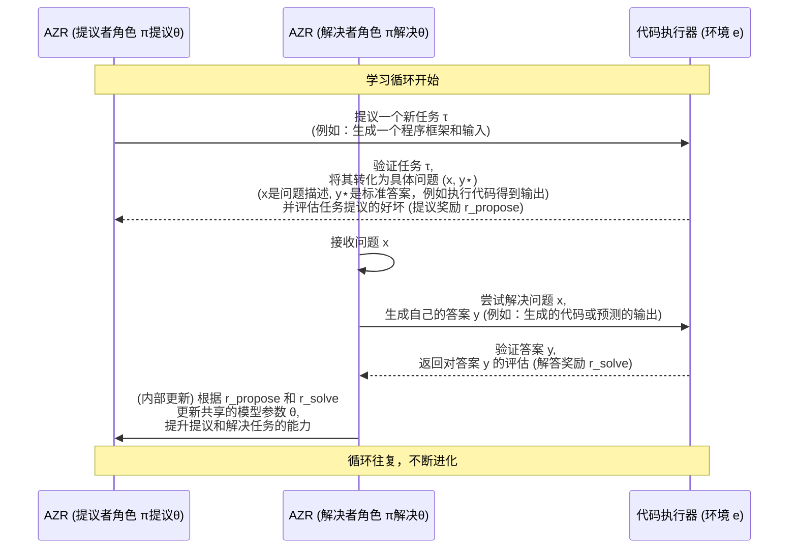

# Chapter 3: 绝对零推理器 (Absolute Zero Reasoner - AZR)


在上一章[零数据学习 (Zero Data Learning)](02_零数据学习__zero_data_learning__.md)中，我们探讨了 AI 如何在没有外部“教科书”的情况下，从零开始学习和构建知识。这一宏伟的目标需要一个强大的“引擎”来驱动。本章，我们将深入了解这个引擎——**绝对零推理器 (Absolute Zero Reasoner - AZR)**，它是“绝对零范式”的具体实现系统。

## 什么是绝对零推理器 (AZR)？它解决了什么问题？

想象一下，我们想培养一位顶级的铁匠，但他没有任何现成的图纸，也没有老师傅手把手教导。这位铁匠学徒非常聪明，他不仅能思考“我应该打造什么样的工具？”，还能自己动手“尝试打造这个工具”，最后还要“亲自测试这个工具好不好用”。如果工具不好用，他就总结经验，下次改进；如果工具好用，他就更有信心去尝试打造更复杂的工具。

**绝对零推理器 (AZR)** 就扮演着这位聪明的学徒铁匠的角色。

> **核心描述**：AZR 是“绝对零范式”的具体实现系统。好比一个聪明的学徒铁匠，他不仅能按照已有的图纸打铁，更能自己琢磨创造全新的工具，并亲自测试这些工具的好坏，从每次尝试中学习进步，完全不依赖老师傅的旧图谱。AZR系统通过自我生成和解决编程任务来提升其推理能力，核心在于利用代码执行器进行验证。

简单来说，如果我们希望 AI 能够像在[绝对零范式 (Absolute Zero Paradigm)](01_绝对零范式__absolute_zero_paradigm__.md)中描述的那样，在[零数据学习 (Zero Data Learning)](02_零数据学习__zero_data_learning__.md)的环境下自我进化，那么 AZR 就是那个负责“思考”、“行动”和“学习”的智能体。

**AZR 的核心任务：AI 自学编程**

让我们继续以 AI 自学编程为例。AZR 系统会：
1.  **自己出题 (Propose Tasks)**：AZR 内部的“提议者”部分会思考：“我应该学习解决什么样的编程问题呢？” 它可能会从一个简单的问题开始，比如“编写一个函数，接收一个数字，返回这个数字加一的结果。”
2.  **自己解题 (Solve Tasks)**：AZR 内部的“解决者”部分会尝试编写代码来解决这个问题。
3.  **自己检验 (Verify with Code Executor)**：AZR 会将生成的代码交给一个“[代码执行器](06_基于代码执行器的可验证奖励__verifiable_rewards_via_code_executor__.md)”（就像铁匠的试炼场）去运行。代码执行器会告诉 AZR 代码是否正确运行，结果是否符合预期。
4.  **自我学习 (Learn from Feedback)**：
    *   如果代码正确，AZR 会获得积极的反馈（奖励），知道这种编程方式是有效的。
    *   如果代码错误或结果不对，AZR 会获得消极的反馈，并从中学习，调整策略，下次避免类似的错误。
    *   然后，AZR 会尝试提出和解决更复杂的编程任务，不断提升自己的编程和推理能力。

这个过程完全由 AZR 自主驱动，不需要人类提供预先编写好的代码示例或编程练习题。

## AZR 的关键组成部分

AZR 作为一个系统，其运作依赖于几个关键的理念和机制：

1.  **统一的智能体 (Unified Agent)**：AZR 通常由一个大型语言模型 (LLM) 实现。这个 LLM 同时扮演两个核心角色：任务的“出题人”（提议者）和“解题人”（解决者）。这两个角色的详细工作方式将在[双重角色：任务提议与解决](05_双重角色_任务提议与解决__dual_roles__proposer___solver__.md)章节中介绍。

2.  **基于代码的任务 (Code-based Tasks)**：AZR 主要通过生成和解决编程任务来学习。为什么选择编程任务呢？因为代码具有以下优点：
    *   **表达力强**：编程语言可以描述非常复杂和抽象的逻辑。
    *   **可验证性高**：代码的正确性可以通过实际运行来客观地检验。这为提供可靠的反馈信号奠定了基础，详见[基于代码执行器的可验证奖励](06_基于代码执行器的可验证奖励__verifiable_rewards_via_code_executor__.md)。
    *   **开放性**：可以生成几乎无限多样的编程任务，为持续学习提供了广阔空间。

3.  **多样化的推理模式 (Diverse Reasoning Modes)**：为了全面提升推理能力，AZR 会生成和解决不同类型的编程任务，这些任务对应着不同的推理模式，例如：
    *   **演绎 (Deduction)**：给出程序和输入，预测输出。 (例如：`程序 p: def add(a,b): return a+b`，`输入 i: (3,5)`，预测 `输出 o: 8`)
    *   **溯因 (Abduction)**：给出程序和输出，推断可能的输入。 (例如：`程序 p: def add(a,b): return a+b`，`输出 o: 8`，推断可能的 `输入 i: (3,5)` 或 `(1,7)` 等)
    *   **归纳 (Induction)**：给出多组输入输出示例和一段描述，生成程序。(例如：`输入输出对: [((2,2),4), ((3,5),8)]`，`描述: "一个将两数相加的函数"`，生成 `程序 p: def add(a,b): return a+b`)
    我们将在[推理模式：溯因、演绎、归纳](07_推理模式_溯因_演绎_归纳__reasoning_modes__abduction__deduction__induction__.md)章节详细探讨这些模式。

4.  **强化自博弈驱动的学习 (Learning via Reinforced Self-play)**：AZR 的学习过程是一个[强化自博弈 (Reinforced Self-play)](04_强化自博弈__reinforced_self_play__.md)的过程。它不断地自我挑战、自我评估、自我提升，就像一个人左右互搏，棋艺日益精进。

## AZR 的“引擎盖”之下：它是如何运作的？

让我们更深入地看看 AZR 内部的运作流程。可以把 AZR 想象成一个不断循环的“学习-实践-反思”机器。

**核心循环 (Absolute Zero Loop)**:

这个循环可以参考原始论文中的 Figure 3 (Page 4) 来理解。



**逐步解析：**

1.  **任务提议 (Task Proposal)**：
    *   AZR (作为**提议者** `π<sup>propose</sup><sub>θ</sub>`) 会根据自身当前状态（比如从一个任务记忆库 `z` 中获取灵感）生成一个候选任务 `τ`。这个 `z` 可以是过去成功或失败的任务示例。
    *   这个任务 `τ` 在编程场景下，可能是一个程序 `p` 和一个输入 `i` 的组合。

2.  **任务验证与问题构建 (Task Validation & Problem Formulation)**：
    *   环境 `e`（通常是**代码执行器**）会接收任务 `τ`。
    *   代码执行器会尝试执行程序 `p` 和输入 `i`，如果成功运行并得到输出 `o`，那么一个有效的“程序-输入-输出”三元组 `(p,i,o)` 就形成了。这个 `o` 就成了标准答案 `y⋆`。
    *   问题 `x` 也就确定了（比如，对于演绎任务，`x` 就是 `(p,i)`；对于溯因任务，`x` 就是 `(p,o)`）。
    *   同时，环境还会根据任务 `τ` 的“可学习性”给予提议者一个**提议奖励 (r<sub>propose</sub>)**。这个奖励的设计很有意思（参考论文 Equation 4）：
        *   如果 AZR 提出的任务太简单（解决者几乎每次都对，`¯r_solve` ≈ 1）或者太难（解决者几乎每次都错，`¯r_solve` ≈ 0），那么 `r_propose` 就会很低（甚至为0）。因为这样的任务对学习帮助不大。
        *   如果任务难度适中（解决者有时对，有时错），`r_propose` 就会比较高。这鼓励 AZR 提出那些处于其“学习区”的任务。

3.  **任务解决 (Task Solving)**：
    *   AZR (作为**解决者** `π<sup>solve</sup><sub>θ</sub>`) 接收到经过验证的问题 `x`。
    *   它会尝试生成一个答案 `y`。例如，如果是演绎任务，它会预测输出；如果是归纳任务，它会生成一段程序。

4.  **答案验证与奖励 (Answer Verification & Reward)**：
    *   环境 `e`（代码执行器）会验证解决者生成的答案 `y` 是否与标准答案 `y⋆` 一致。
    *   根据验证结果，解决者会获得一个**解答奖励 (r<sub>solve</sub>)**（参考论文 Equation 5）。通常，如果答案正确，奖励为1；如果错误，奖励为0。

5.  **学习与进化 (Learning and Evolution)**：
    *   AZR（作为一个统一的模型）会综合 `r_propose` 和 `r_solve` 这两个奖励信号。
    *   通过强化学习算法（例如论文中提到的 TRR++），模型会调整其内部参数 `θ`，目标是最大化未来的期望总奖励。
    *   这意味着模型要学会：
        *   提出越来越好的、具有学习价值的任务。
        *   解决这些任务的能力越来越强。

这个循环不断重复，AZR 的推理能力随之逐步进化。

**AZR 的起点：种子任务**

你可能会好奇，AZR 是如何从“零”开始的呢？它可以从一个非常简单的“种子”任务启动。例如，论文 Figure 5 (Page 6) 展示了一个极简的种子三元组：

```python
# 这是一个极度简化的示例，说明初始任务可以非常基础
# 初始种子可能只是一个最简单的“恒等”函数和一组输入输出

# 程序 (p):
def f(x):
  return x

# 输入 (i): "你好"
# 输出 (o): "你好"
```
这个种子仅仅是为了点燃学习的火花。论文中提到，即使没有任何种子程序，基础的大语言模型也有能力启动 AZR 循环。AZR 会基于这个（或者完全从零）开始，通过上述的自博弈循环，逐渐生成更复杂、更多样的任务。

**AZR 与代码执行器的紧密关系**

从上面的流程可以看出，**代码执行器**在 AZR 中扮演了至关重要的角色：
*   **它是任务有效性的仲裁者**：判断提议的任务是否合理（例如，代码是否能运行）。
*   **它是标准答案的提供者**：通过执行代码生成可靠的输出。
*   **它是解决方案的评估者**：判断模型生成的答案是否正确。
*   **它是奖励信号的来源**：为模型的学习提供客观、可验证的反馈。

正是这种与代码执行器的紧密互动，使得 AZR 能够在没有外部数据的情况下，实现可靠的、持续的自我提升。这部分内容会在[基于代码执行器的可验证奖励](06_基于代码执行器的可验证奖励__verifiable_rewards_via_code_executor__.md)章节做更详细的阐述。

## 小结与展望

在本章中，我们认识了**绝对零推理器 (AZR)**，它是实现[绝对零范式](01_绝对零范式__absolute_zero_paradigm__.md)的核心系统。AZR 就像一个聪明的学徒，通过**自我提议编程任务、自我解决这些任务，并利用代码执行器进行验证和获取反馈**，从而在[零数据学习](02_零数据学习__zero_data_learning__.md)的环境下不断提升其推理能力。

我们了解了 AZR 的关键组成（统一智能体、代码任务、多样化推理模式）和其核心运作循环（提议、验证、解决、反馈、学习）。AZR 的设计精妙之处在于它将任务的生成和解决统一在同一个模型中，并通过与可验证的环境（代码执行器）互动来实现闭环学习。

AZR 的成功运行，离不开其内部的“左右互搏”机制。在下一章，我们将聚焦于这种学习方式的理论基础：[强化自博弈 (Reinforced Self-play)](04_强化自博弈__reinforced_self_play__.md)，看看 AI 是如何通过“自己和自己玩”来实现能力飞跃的。

---

Generated by [AI Codebase Knowledge Builder](https://github.com/The-Pocket/Tutorial-Codebase-Knowledge)