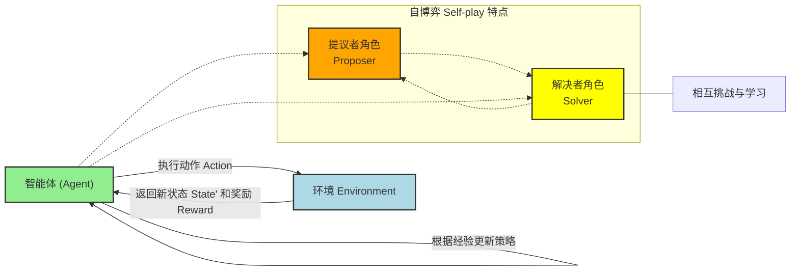
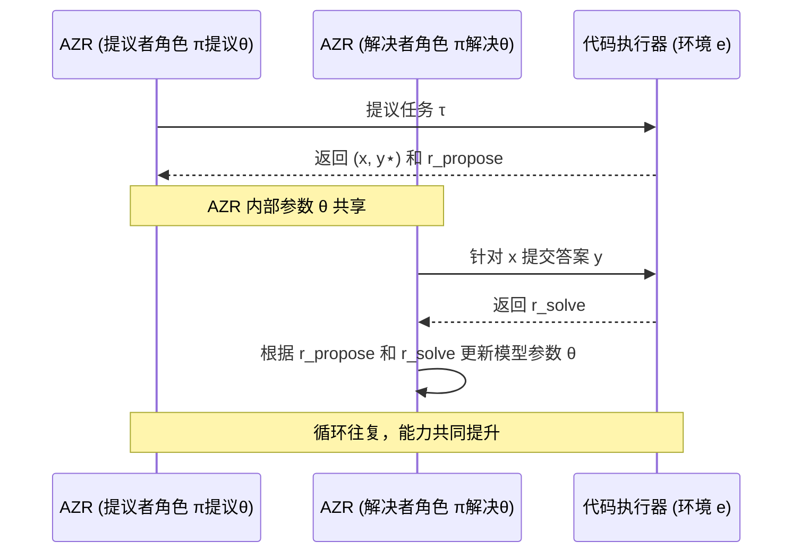

# Chapter 4: 强化自博弈 (Reinforced Self-play)


在上一章中，我们认识了[绝对零推理器 (Absolute Zero Reasoner - AZR)](03_绝对零推理器__absolute_zero_reasoner___azr__.md)，它是我们项目中负责思考、行动和学习的智能体。AZR 之所以能够做到在[零数据学习](02_零数据学习__zero_data_learning__.md)的环境下自我进化，其核心的学习机制就是本章将要介绍的——**强化自博弈 (Reinforced Self-play)**。

## 什么是强化自博弈？它为什么如此强大？

想象一位棋手，比如围棋大师。他如何不断精进自己的棋艺呢？一种非常有效的方法就是**和自己下棋**。
*   他可能尝试不同的开局策略。
*   他可能扮演进攻方，思考如何突破；然后又扮演防守方，思考如何化解。
*   每一盘棋局结束后，无论输赢，他都会复盘，分析哪些棋步是妙手，哪些是败着。

通过这样不断的“内部对局”，他从每一次的成功与失败中学习，不断挑战并优化自己的策略。久而久之，他的棋艺就会突飞猛进，甚至可能超越所有已知的对手和棋谱。

**强化自博弈 (Reinforced Self-play)** 正是借鉴了这种思想。

> **核心定义**：强化自博弈是模型学习的核心机制。如同一个棋手通过不断与自己下棋来提高技艺，在这些“内部对局”中，他既扮演进攻方也扮演防守方，从每一次的成功与失败中学习，不断挑战并优化自己的策略。在“绝对零”项目中，模型内部包含**提议任务**和**解决任务**两个角色，通过相互作用和反馈持续进步。

简单来说，模型不是等待外部的“老师”来出题和评分，而是自己给自己当陪练，自己跟自己“玩游戏”，并在游戏过程中学习如何玩得更好。

*   **“自博弈 (Self-play)”** 体现在模型与自身（或其变体）进行交互。在我们的项目中，这意味着模型内部的“提议者”角色创造任务，而“解决者”角色尝试完成这些任务。
*   **“强化 (Reinforced)”** 体现在模型会根据交互的结果（成功或失败，好或坏）获得某种形式的“奖励”或“惩罚”，并利用这些反馈来调整和优化自己的行为策略，力求在未来获得更好的结果。

这种机制的强大之处在于，它为模型提供了一个**持续自我提升的闭环**。只要有足够的时间和计算资源，模型理论上可以不断地通过自我挑战来达到越来越高的智能水平，而不完全依赖于外部预先准备好的数据。AlphaZero 就是通过强化自博弈学会下围棋、象棋和将棋，并达到了超越人类顶尖棋手的水平，而它开始学习时，除了游戏规则外，没有任何人类棋谱数据。

## 强化自博弈的关键要素

要理解强化自博弈是如何运作的，我们可以将其分解为几个关键要素：

1.  **智能体 (Agent)**：这是执行动作并从经验中学习的主体。在我们的项目中，[绝对零推理器 (AZR)](03_绝对零推理器__absolute_zero_reasoner___azr__.md) 就是这个智能体。
2.  **环境 (Environment)**：智能体与之交互的“世界”。智能体的行为会影响环境，而环境会给智能体反馈。在 AZR 中，这个环境部分由[代码执行器](06_基于代码执行器的可验证奖励__verifiable_rewards_via_code_executor__.md)构成，它负责验证任务和答案。
3.  **策略 (Policy)**：智能体根据当前状态选择下一步行动的规则或方法。例如，AZR 的“提议者”策略决定提出什么样的任务，而“解决者”策略决定如何生成答案。
4.  **奖励 (Reward)**：环境根据智能体的行为给予的即时反馈信号。奖励可以是正向的（鼓励某种行为）或负向的（抑制某种行为）。例如，成功解决一个任务会得到正奖励。
5.  **价值函数/目标 (Value Function/Objective)**：衡量一个状态或一个行为的长期价值。智能体的目标通常是最大化累积奖励。在 AZR 中，这个目标是最大化一个综合了提议奖励和解答奖励的期望值（参考论文 Equation 3）。

下图展示了强化自博弈的基本循环：


在这个循环中，智能体 (AZR) 通过其内部的“提议者”和“解决者”角色进行自博弈，从环境（代码执行器）获得奖励，并不断优化其策略。

## AZR 如何进行强化自博弈？

在[绝对零推理器 (AZR)](03_绝对零推理器__absolute_zero_reasoner___azr__.md) 的设计中，强化自博弈是其学习和进化的核心驱动力。整个过程可以看作是 AZR 自己和自己玩一个“提议-解决”的游戏：

1.  **AZR 的“提议者”角色 (`π^propose_θ`) 出场**：
    *   它会思考：“我应该提出什么样的编程任务，才能让自己（解决者角色）学到最多东西呢？”
    *   它根据当前的策略，生成一个任务 `τ`（比如，一个程序框架和一些输入）。

2.  **环境（代码执行器 `e`）进行评估和转化**：
    *   环境会验证这个任务 `τ` 是否有效（比如代码是否能运行）。
    *   如果有效，环境可能会将 `τ` 转化为一个具体的问题 `(x, y⋆)`，其中 `x` 是问题描述，`y⋆` 是通过执行代码得到的“标准答案”。
    *   同时，环境会根据任务 `τ` 的“可学习性”（比如，对当前模型来说是否难度适中）给予提议者一个**提议奖励 (`r_propose`)**。这个奖励的设计非常巧妙（参考论文 Equation 4）：
        *   如果任务太简单或太难，`r_propose` 会很低，因为对学习帮助不大。
        *   如果难度适中，`r_propose` 会比较高，鼓励模型提出有助于学习的任务。

3.  **AZR 的“解决者”角色 (`π^solve_θ`) 出场**：
    *   它接收到问题 `x`。
    *   它根据当前的策略，尝试生成一个答案 `y`（比如，预测的程序输出或生成的代码）。

4.  **环境（代码执行器 `e`）再次评估**：
    *   环境会将解决者生成的答案 `y` 与标准答案 `y⋆` 进行比较。
    *   根据比较结果，解决者会获得一个**解答奖励 (`r_solve`)**。通常，答案正确则奖励高，错误则奖励低（参考论文 Equation 5）。

5.  **AZR 进行学习和进化**：
    *   AZR（作为一个统一的模型，其参数为 `θ`）会综合考虑 `r_propose` 和 `r_solve`。
    *   它使用强化学习算法（例如论文中提到的 **TRR++**，一种为多任务优化的 REINFORCE++ 算法，详见论文 Section 3.3.5, Page 8）来更新其内部参数 `θ`。
    *   更新的目标是让模型在未来能够获得更高的综合奖励，即学会更好地提议任务和更好地解决任务。

这个“提议-验证-解决-验证-学习”的循环会不断重复。下面的序列图描绘了这个核心的自博弈过程：


在这个过程中，AZR 的提议者和解决者就像一个团队的两个成员，他们互相配合，共同进步。提议者努力提出有价值的“训练项目”，解决者努力完成这些项目，双方都从结果中学习，从而提升整个团队（即 AZR 模型）的整体能力。

### 目标函数：驱动自博弈的“指挥棒”

整个强化自博弈过程并非漫无目的，它由一个明确的目标函数 J(θ) 指导（参考论文 Equation 3, Page 4）：

```
J(θ):= max_θ E_z∼p(z) [ E_(x,y⋆)∼f_e(·|τ),τ∼π^propose_θ(·|z) [ r^propose_e(τ,π_θ) + λE_y∼π^solve_θ(·|x) [ r^solve_e(y,y⋆) ] ] ]
```

让我们用更通俗的方式理解这个公式：
*   `max_θ`：我们的目标是找到一组模型参数 `θ`，使得整个期望值最大。
*   `E_z∼p(z)`：表示从某种任务来源 `z`（比如一个不断更新的任务记忆库）中采样。
*   `E_(x,y⋆)∼f_e(·|τ),τ∼π^propose_θ(·|z)`：表示我们的提议者 `π^propose_θ` 根据 `z` 提出任务 `τ`，然后环境 `e` 将其转化为问题 `(x,y⋆)`。
*   `r^propose_e(τ,π_θ)`：提议者因提出任务 `τ` 而获得的奖励。
*   `λE_y∼π^solve_θ(·|x) [ r^solve_e(y,y⋆) ]`：解决者 `π^solve_θ` 针对问题 `x` 给出答案 `y`，并获得解答奖励 `r^solve_e`，`λ` 是一个平衡系数。

模型通过强化学习，不断调整 `θ`，试图让这个 J(θ) 越来越大。这意味着模型要同时学会：
1.  提出更有价值、更具“可学习性”的任务 (`r^propose` 尽可能高)。
2.  更准确、更高效地解决这些任务 (`r^solve` 尽可能高)。

这就是强化自博弈如何驱动 AZR 实现[绝对零范式](01_绝对零范式__absolute_zero_paradigm__.md)下的自主学习和进化。

## 强化自博弈的意义

强化自博弈机制使得 AZR 能够：
*   **自主生成学习课程**：不再依赖人类专家设计题目，模型自己创造适合当前水平的挑战。
*   **实现持续学习和进化**：随着能力的提升，模型可以提出和解决更复杂的任务，形成正向循环。
*   **探索超越人类的解决方案**：由于不受限于人类已有的数据和知识，模型有可能发现全新的、更优的策略。
*   **适应动态环境**：如果环境发生变化，强化自博弈机制也能帮助模型逐渐适应新的规则或挑战。

这就像一个永动机，不断地自我驱动、自我完善。

## 小结与展望

在本章中，我们深入探讨了**强化自博弈 (Reinforced Self-play)** 这一核心学习机制。我们了解到，它模仿了人类通过与自身对抗来提升技能的过程，模型在“内部对局”中扮演不同角色，从成功与失败中学习，并利用奖励信号不断优化策略。

在“绝对零”项目中，[绝对零推理器 (AZR)](03_绝对零推理器__absolute_zero_reasoner___azr__.md) 正是通过强化自博弈，驱动其“提议者”和“解决者”角色相互协作、共同进化。这个过程由一个明确的目标函数引导，并通过与[代码执行器](06_基于代码执行器的可验证奖励__verifiable_rewards_via_code_executor__.md)等环境组件的交互获得反馈。

强化自博弈是 AZR 能够在[零数据学习](02_零数据学习__zero_data_learning__.md)的条件下实现智能涌现和能力提升的关键。它赋予了模型一种“内生的”成长动力。

那么，AZR 内部的“提议者”和“解决者”这两个角色具体是如何分工与协作的呢？它们又是如何通过同一个底层模型来实现的呢？下一章，我们将详细探讨[双重角色：任务提议与解决 (Dual Roles: Proposer & Solver)](05_双重角色_任务提议与解决__dual_roles__proposer___solver__.md)。

---

Generated by [AI Codebase Knowledge Builder](https://github.com/The-Pocket/Tutorial-Codebase-Knowledge)