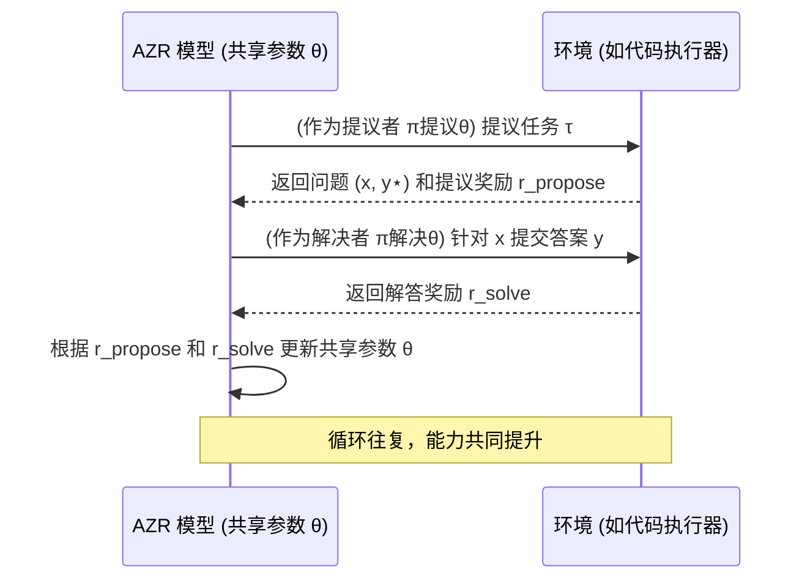

# Chapter 5: 双重角色：任务提议与解决 (Dual Roles: Proposer & Solver)


在上一章[强化自博弈 (Reinforced Self-play)](04_强化自博弈__reinforced_self_play__.md)中，我们学习了[绝对零推理器 (AZR)](03_绝对零推理器__absolute_zero_reasoner___azr__.md)如何通过“自己和自己玩”的方式来提升能力。你可能会好奇，这个“自己和自己玩”的过程具体是怎么分工的呢？是谁来出题，又是谁来解题呢？本章，我们将深入探讨 AZR 系统中一个非常核心的设计：**双重角色：任务提议与解决**。

## 问题的提出：AI 如何“自导自演”学习大戏？

想象一下，我们希望一个 AI 学会编程。在传统的教学模式下，我们需要一位老师来出编程题，然后学生来解答。但在[绝对零范式 (Absolute Zero Paradigm)](01_绝对零范式__absolute_zero_paradigm__.md)中，我们追求的是 AI 的完全自主学习，没有外部的老师。那么，AI 如何自己给自己出题，又自己解答呢？这就像一位高明的侦探，他不仅要解决别人提出的案件，还会自己设计一些复杂的谜题来锻炼自己的推理能力，从而实现自我提升。

在 AZR 系统中，单个模型就承担了这两个关键角色：
1.  **任务提议者 (Proposer)**：负责创造新的、具有学习价值的编程问题。
2.  **任务解决者 (Solver)**：负责尝试解决这些被提议出来的问题。

这两个角色由**同一个底层 AI 模型**扮演，这就像一个演员在一部戏里分饰两角，通过精湛的演技推动剧情发展。

## 核心概念解析

让我们分别了解一下这两个角色，以及它们是如何协同工作的。

### 1. 任务提议者 (Proposer)：聪明的“出题人”

“任务提议者”的角色，顾名思义，就是负责“出题”。但它不是随便出题，而是要出那些对当前模型来说**具有学习价值**的题目。

*   **目标**：创造新的编程任务 `τ`（例如，一个程序框架和一些特定的输入），这些任务应该能够帮助模型学习和进步。
*   **策略**：
    *   **避免太简单**：如果题目太简单，模型轻易就能解决，那就学不到什么新东西。
    *   **避免太难**：如果题目太难，模型完全无法解决，那也无法从中学习，反而会感到“挫败”。
    *   **追求“刚刚好”**：理想的任务应该处于模型的“学习区”（Zone of Proximal Development），即有一定挑战性，但通过努力又能够解决，或者至少能够从尝试中获得有益的反馈。
*   **类比**：
    *   可以把它想象成一位经验丰富的老师，他会根据学生当前的水平设计难度适中的作业。
    *   或者一个游戏设计师，他会设计出既能吸引玩家又能帮助玩家提升技能的关卡。

在 AZR 中，提议者会根据模型过去解决任务的表现（例如，解决者在类似任务上的平均成功率 `¯r_solve`）来调整出题策略。如果解决者对于某一类任务的解决成功率很高，提议者就应该出更难的、或者新类型的任务。反之，如果成功率很低，提议者可能需要适当降低难度或者从不同角度出题。这种动态调整确保了学习的持续性和有效性。

提议者因为提出了一个“好”的任务（即具有学习潜力的任务）而获得的奖励，我们称之为**提议奖励 (r<sub>propose</sub>)**。论文中的公式 (4) 给出了一个具体的计算方式：
> r<sub>propose</sub> = 0, 如果 ¯r<sub>solve</sub> = 0 或 ¯r<sub>solve</sub> = 1
> r<sub>propose</sub> = 1 - ¯r<sub>solve</sub>, 其他情况

这意味着，如果任务太容易 (¯r<sub>solve</sub>=1) 或太难 (¯r<sub>solve</sub>=0)，提议奖励为0。难度适中的任务 (¯r<sub>solve</sub> 介于0和1之间) 会获得正向奖励，鼓励提议者生成这类任务。

### 2. 任务解决者 (Solver)：勤奋的“解题人”

“任务解决者”的角色，就是努力去完成“提议者”出的题目。

*   **目标**：针对提议者给出的任务 `τ`（或者说，经过环境验证后形成的问题 `x`），生成一个解决方案 `y`（例如，一段Python代码，或者对代码行为的预测）。
*   **策略**：利用模型当前的知识和推理能力，尽力给出正确答案。
*   **类比**：
    *   可以把它想象成一个努力学习的学生，认真完成老师布置的作业。
    *   或者一个游戏玩家，想尽办法通过游戏关卡。

解决者完成任务后，其答案会由“环境”（例如[基于代码执行器的可验证奖励](06_基于代码执行器的可验证奖励__verifiable_rewards_via_code_executor__.md)中的代码执行器）来评判。如果答案正确，解决者会获得积极的反馈。

解决者因为成功解决了任务而获得的奖励，我们称之为**解答奖励 (r<sub>solve</sub>)**。论文中的公式 (5) 给出了一个简单的二元奖励：
> r<sub>solve</sub> = I(y = y⋆)

其中 `y⋆` 是标准答案，`I` 是指示函数（如果 `y` 等于 `y⋆` 则为1，否则为0）。这意味着答案正确，解决者获得奖励1，否则为0。

### 3. 单一模型，双重身份：高效的“自学者”

AZR 最巧妙的设计之一在于，“任务提议者”和“任务解决者”**并非两个独立的模型，而是同一个 AI 模型（通常是大型语言模型 LLM）在不同情境下扮演的不同角色**。这个统一的模型我们用 `πθ` 表示，其中 `θ` 是模型的共享参数。

*   **如何实现？** 模型会根据接收到的不同“提示 (Prompt)”来切换角色。
    *   当需要提议任务时，给模型的提示可能是：“请根据以下已有的编程任务示例，生成一个新的、具有挑战性的、与演绎推理相关的编程任务。”
    *   当需要解决任务时，给模型的提示可能是：“请解决以下编程问题：[问题描述]。”
*   **优势**：
    *   **知识共享与迁移**：因为是同一个模型，解决者在解题过程中学到的知识和经验，可以被提议者“感知”到，从而帮助提议者提出更合适的题目。反之亦然，提议者对“什么是一个好问题”的理解，也能间接提升解决者的解题思路。
    *   **高效学习**：模型参数 `θ` 的更新是基于两个角色的综合表现（通过 `r_propose` 和 `r_solve`）。这意味着模型在努力成为一个更好的“解题人”的同时，也在努力成为一个更好的“出题人”，两者相辅相成，共同进化。
    *   **资源节约**：只需要训练和维护一个模型，而不是两个。

这就像一个人在练习演讲，他既要自己写演讲稿（提议者），也要自己上台演讲（解决者），然后根据演讲效果和听众反馈来同时改进写稿和演讲的能力。

## 双重角色如何协同工作？—— 以 AI 学编程为例

让我们通过 AI 学习编程的例子，看看这两个角色是如何在[绝对零推理器 (AZR)](03_绝对零推理器__absolute_zero_reasoner___azr__.md)中协同工作的。这个过程在[强化自博弈 (Reinforced Self-play)](04_强化自博弈__reinforced_self_play__.md)的框架下不断循环：

1.  **提议者 (Proposer) 出马**：
    *   AZR 模型（扮演提议者 `π^propose_θ`）审视当前的学习情况（可能参考一个包含过去任务的记忆库 `z`）。
    *   它决定创建一个新的编程任务 `τ`。例如，它可能会生成一个任务：“编写一个 Python 函数，计算一个列表中所有偶数的和。” （这可能包括程序框架和一些示例输入）。

2.  **环境初步处理与提议奖励**：
    *   这个任务 `τ` 会被发送到[代码执行器](06_基于代码执行器的可验证奖励__verifiable_rewards_via_code_executor__.md)（环境 `e` 的一部分）。
    *   代码执行器会验证任务的有效性（比如，代码框架是否合理，示例输入是否可用），并可能将其转化为一个具体的问题 `(x, y⋆)`，其中 `x` 是清晰的问题描述，`y⋆` 是标准答案（例如，通过实际运行正确的代码得到）。
    *   同时，根据这个任务对当前模型（作为解决者）的“可学习性”（即难度是否适中），提议者会获得一个**提议奖励 (r<sub>propose</sub>)**。

3.  **解决者 (Solver) 登场**：
    *   AZR 模型（切换到解决者 `π^solve_θ` 角色）接收到问题 `x`（“计算一个列表中所有偶数的和”）。
    *   它尝试生成一段 Python 代码 `y` 来解决这个问题。比如：
        ```python
        # 解决者生成的代码示例
        def sum_even_numbers(numbers):
            total = 0
            for num in numbers:
                if num % 2 == 0:
                    total += num
            return total
        ```

4.  **环境验证与解答奖励**：
    *   解决者生成的代码 `y` 会被代码执行器运行和测试（用一些测试用例）。
    *   如果代码通过了所有测试，与标准答案 `y⋆` 一致，解决者就会获得一个较高的**解答奖励 (r<sub>solve</sub>)**（比如1分）。如果代码有错或者结果不对，奖励就很低（比如0分）。

5.  **模型学习与进化**：
    *   AZR 模型（作为统一的整体 `πθ`）会综合这两个奖励信号 `r_propose` 和 `r_solve`。
    *   使用强化学习算法（如论文中提到的 TRR++），模型会更新其共享的内部参数 `θ`。
    *   目标是让模型未来能够：
        *   提出更有学习价值的任务（最大化 `r_propose` 的期望）。
        *   更准确地解决这些任务（最大化 `r_solve` 的期望）。

这个“提议-解决-反馈-学习”的循环不断重复，模型在提议和解决两方面的能力都随之增强。

下面的序列图清晰地展示了这个过程：



在这个图中，`AZR 模型` 代表了同一个底层模型，它根据上下文扮演提议者或解决者的角色。这两个角色之间的互动，以及与环境的反馈，共同驱动了模型的学习和进化。这正呼应了论文第3.1节“Two Roles in One: Proposer and Solver”的核心思想。

## 双重角色的意义

这种由单个模型扮演双重角色的设计，是“绝对零”范式能够实现高效自我进化的关键之一：

*   **紧密的反馈循环**：提议的质量直接影响解决的难度和学习效果，解决的成果反过来又指导如何提议。由于是同一个模型，这种信息的传递和利用非常直接和高效。
*   **协同进化**：“出题”能力和“解题”能力不再是孤立发展的，而是相互促进，共同提升模型的整体推理智能。
*   **自主性的体现**：模型真正做到了“自己教自己学”，从问题的产生到问题的解决，再到从经验中学习，整个过程高度自治。

这就像一个全能的运动员，他不仅能完成高难度的动作（解决者），还能根据自己的身体状况和目标设计科学的训练计划（提议者），从而不断突破自己的极限。

## 小结与展望

本章我们深入了解了“绝对零”项目中一个至关重要的概念：**双重角色：任务提议与解决**。我们知道了在AZR系统中，是**同一个AI模型**同时扮演着“任务提议者”（负责出题）和“任务解决者”（负责解题）这两个角色。这种设计使得模型能够在一个紧密的反馈循环中，通过“自问自答”的方式高效地进行[强化自博弈](04_强化自博弈__reinforced_self_play__.md)，不断提升自身的推理能力。

我们通过AI学习编程的例子，具体看到了这两个角色是如何分工协作，以及它们如何依赖于提议奖励 (r<sub>propose</sub>) 和解答奖励 (r<sub>solve</sub>) 来驱动学习。

那么，这些任务的提议和解答，其正确性和有效性是如何被客观评估的呢？这就需要一个可靠的“裁判”和“实验场”。在下一章，我们将详细探讨这个“裁判”的角色：[基于代码执行器的可验证奖励 (Verifiable Rewards via Code Executor)](06_基于代码执行器的可验证奖励__verifiable_rewards_via_code_executor__.md)，看看它是如何为AZR的自主学习提供坚实基础的。

---

Generated by [AI Codebase Knowledge Builder](https://github.com/The-Pocket/Tutorial-Codebase-Knowledge)