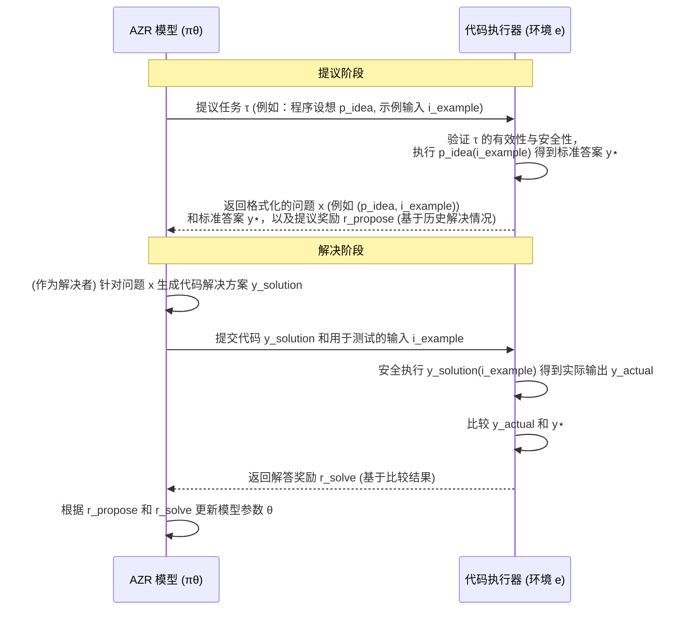

# Chapter 6: 基于代码执行器的可验证奖励 (Verifiable Rewards via Code Executor)


在上一章[双重角色：任务提议与解决 (Dual Roles: Proposer & Solver)](05_双重角色_任务提议与解决__dual_roles__proposer___solver__.md)中，我们了解到[绝对零推理器 (AZR)](03_绝对零推理器__absolute_zero_reasoner___azr__.md) 是如何通过扮演“出题人”和“解题人”这两个角色来进行自我学习的。但是，这里有一个关键问题：当 AZR 给自己出题并解答后，它怎么知道自己做得对不对呢？谁来充当那个公正的“裁判”呢？这就是本章我们要探讨的核心概念——**基于代码执行器的可验证奖励**。

## 奖励从何而来？代码执行器的“裁判”角色

想象一下，AZR 正在努力学习编程。它（作为提议者）可能会提出一个任务：“编写一个 Python 函数，计算两个数字的和。”然后它（作为解决者）会尝试写出如下代码：

```python
# AZR (解决者) 尝试编写的代码
def add(a, b):
  return a + b
```

现在，我们如何判断这段代码是否正确呢？如果只是让另一个 AI 模型来“看一看”，评价可能不够客观，也可能带有偏见。我们需要一个绝对公正、严格按照规则办事的“裁判”。

**代码执行器 (Code Executor)** 就扮演了这个“裁判”的角色。

> **核心定义**：代码执行器是确保模型学习有效性的关键机制。它就像一位严格的考官或一个精确的实验环境。模型提出的任务（例如代码问题）和给出的答案（例如代码解决方案）都会通过执行器来验证其正确性。如果代码能成功运行并得到预期结果，模型就会获得积极的奖励反馈；反之，如果代码运行出错或结果不符合预期，模型则会得到惩罚。这些奖励和惩罚会指导模型朝着正确的方向学习。

简单来说，代码执行器的工作流程如下：
1.  **接收任务和答案**：它接收 AZR 提议的任务和 AZR 给出的代码解决方案。
2.  **运行代码**：在一个安全、隔离的环境中执行 AZR 生成的代码。
3.  **检查结果**：将代码的实际运行结果与预期的正确结果进行比较。
4.  **给出反馈**：根据比较结果，生成一个“奖励”信号。

这个奖励信号是“可验证的 (verifiable)”，因为它是基于代码实际运行的客观结果，而不是主观评价。这种可验证性对于[零数据学习 (Zero Data Learning)](02_零数据学习__zero_data_learning__.md)至关重要，因为在没有外部“标准答案”的情况下，我们需要一个可靠的机制来评估学习效果。

## 代码执行器如何验证并提供奖励？

让我们通过一个具体的例子，看看代码执行器是如何工作的。

假设 AZR 的学习流程如下：

1.  **AZR (提议者角色)** 提出了一个任务 `τ`：
    *   任务描述：“编写一个名为 `calculate_sum` 的 Python 函数，该函数接收一个整数列表，并返回列表中所有元素的总和。”
    *   提议者可能还会提供一个示例输入和预期的输出，或者代码执行器自己会根据任务描述生成一个“标准答案” `y⋆`。例如，对于输入 `[1, 2, 3]`，标准答案 `y⋆` 应该是 `6`。

2.  **AZR (解决者角色)** 针对这个任务，生成了以下代码 `y`：
    ```python
    # AZR (解决者) 生成的代码 y
    def calculate_sum(numbers):
        total = 0
        for num in numbers:
            total = total + num # 故意写错一点，比如 total = total + num * 2
        return total
    ```
    (为了演示，我们假设解决者在累加时犯了个小错误，写成了 `total = total + num * 2`。)

3.  **代码执行器进行验证**：
    *   代码执行器接收到解决者生成的代码 `y`，以及测试输入（例如 `[1, 2, 3]`）和标准答案 `y⋆` (`6`)。
    *   它会尝试运行这段代码：
        ```python
        # 代码执行器内部的模拟执行
        # 假设已经加载了模型生成的 calculate_sum 函数
        test_input = [1, 2, 3]
        # actual_output = calculate_sum(test_input)
        # 第一次循环: total = 0 + 1*2 = 2
        # 第二次循环: total = 2 + 2*2 = 6
        # 第三次循环: total = 6 + 3*2 = 12
        # 所以 actual_output 是 12
        ```
    *   代码执行器得到实际输出 `y_actual` 为 `12`。
    *   它将实际输出 `y_actual` (`12`) 与标准答案 `y⋆` (`6`) 进行比较。

4.  **生成奖励信号**：
    *   因为 `12 != 6`，代码执行结果不正确。
    *   因此，代码执行器会给出一个负面或零奖励的信号给解决者 (例如，`r_solve = 0`)。
    *   如果解决者生成的代码是完全正确的（例如 `def calculate_sum(numbers): return sum(numbers)`），那么 `y_actual` 就会等于 `y⋆`，解决者就会得到一个正面奖励 (例如，`r_solve = 1`)。

这个奖励 `r_solve` 就是一个**可验证奖励**。它直接来源于代码的实际运行表现。

### 代码执行器的“严格性”体现在哪里？

代码执行器不仅检查最终结果，还会关注代码本身的“健康状况”。参考论文 `Section 3.3.3. Constructing Valid Tasks` 和 `Section 3.3.4. Answer Verification`，代码执行器在验证任务提议和解决方案时，会进行多项检查：

1.  **程序完整性 (Program Integrity)**：
    *   代码是否符合 Python 的语法规则？能不能被解释器成功解析？
    *   例如，如果模型生成的代码有语法错误，如括号不匹配，执行器会直接判定为无效。
    *   （参考论文 Figure 9 `VALIDATE_CODE_TEMPLATE`，用于检查基本代码有效性）

2.  **程序安全性 (Program Safety)**：
    *   代码是否尝试执行一些危险操作？比如访问文件系统、网络，或者导入一些被禁止的系统模块？
    *   为了保护执行环境，执行器会禁止这类操作。
    *   （参考论文 Figure 8 `Forbidden Python Modules`，列出了一些禁止的模块）

3.  **确定性检查 (Check for Determinism)**：
    *   对于相同的输入，程序是否总是产生相同的输出？
    *   如果程序包含随机因素（例如使用了 `random` 模块但没有固定种子），或者依赖于会变化的时间，那么它的行为就不是确定的，这会给验证带来困难。AZR 项目通常要求程序是确定性的。
    *   执行器可能会多次运行相同的代码和输入，检查输出是否一致。
    *   （参考论文 Figure 13 `CHECK_DETERMINISM_TEMPLATE`）

4.  **答案的精确匹配 (Answer Verification)**：
    *   这是最核心的验证。执行器会根据任务类型（演绎、溯因、归纳）采用不同的验证逻辑。
    *   **演绎 (Deduction)**：给定程序 `p` 和输入 `i`，模型预测输出 `oπ`。执行器会比较 `oπ` 和标准输出 `o⋆` 是否相等。（参考 Figure 11 `EVAL_OUTPUT_PREDICTION_TEMPLATE`）
    *   **溯因 (Abduction)**：给定程序 `p` 和输出 `o⋆`，模型推断输入 `iπ`。执行器会运行 `p(iπ)` 得到 `o_actual`，然后比较 `o_actual` 和 `o⋆` 是否相等。（参考 Figure 10 `EVAL_INPUT_PREDICTION_TEMPLATE`）
    *   **归纳 (Induction)**：给定输入输出对 `{(i_n, o_n)}` 和描述 `m`，模型生成程序 `pπ`。执行器会用多组（包括隐藏的）测试用例来测试 `pπ`，看其是否能正确处理所有情况。（参考 Figure 12 `EVAL_FUNCTION_PREDICTION_TEMPLATE`）

只有通过了这些严格检查，解决方案才被认为是“正确”的，模型才能获得积极的奖励。

### 奖励如何指导学习？

这些由代码执行器提供的可验证奖励，是[强化自博弈 (Reinforced Self-play)](04_强化自博弈__reinforced_self_play__.md)过程中的核心驱动力。
*   **正奖励 (`r_solve = 1`)** 会鼓励模型加强导致正确行为的“思考路径”和“代码生成策略”。
*   **零奖励或负奖励 (`r_solve = 0` 或更低，如论文 Equation 6 中对格式错误的惩罚)** 会让模型知道当前的做法是错误的，需要调整和改进。

同时，代码执行器也间接参与了对“任务提议者”的奖励评估。提议奖励 `r_propose` (论文 Equation 4) 的计算依赖于解决者在类似任务上的平均成功率 `¯r_solve`。而 `¯r_solve` 的每一次计算，都离不开代码执行器对解决者答案的验证。因此，一个好的任务提议者需要提出那些“难度适中”的任务——这些任务的解决方案可以被代码执行器频繁验证，从而让模型有效地学习。

## 代码执行器的工作流程图

下面是一个简化的序列图，展示了代码执行器在AZR的“提议-解决”循环中如何提供可验证的反馈：


在这个流程中，代码执行器不仅是答案的裁判，也是任务质量的间接评估者。它的存在使得整个学习过程能够在一个客观、可信的基础上进行，即使没有任何人工标注的数据。

## 为什么“可验证”如此重要？

在“绝对零”范式中，模型的目标是实现真正的自主学习，不依赖人类提供的“教科书”。这种情况下，如果反馈信号本身都不可靠、不客观，那么模型很可能会学到错误的东西，或者在原地踏步。

代码执行器提供的“可验证性”解决了这个问题：
*   **客观性**：代码的对错由其运行结果决定，这是一个不依赖于主观判断的客观事实。
*   **可靠性**：只要代码执行环境是稳定的，对于相同的代码和输入，验证结果总是一致的。
*   **自动化**：整个验证过程可以完全自动化，使得大规模的自我学习和进化成为可能。
*   **精确反馈**：能够精确地告诉模型“哪里做对了”或“哪里做错了”（虽然奖励本身可能只是一个标量，但错误的路径不会得到强化）。

这就像给AI配备了一个内置的、高度精确的“实验平台”和“自动评分系统”。AI可以不断地在这个平台上进行“实验”（生成代码），并从平台的反馈中学习。

## 小结与展望

本章我们探讨了**基于代码执行器的可验证奖励**机制。它是“绝对零”项目中确保模型学习有效性的核心。代码执行器像一位严格的考官，通过实际运行模型生成的代码来验证其正确性，并据此提供客观、可靠的奖励信号。这些奖励信号（如 `r_solve` 和间接影响的 `r_propose`）直接指导着[绝对零推理器 (AZR)](03_绝对零推理器__absolute_zero_reasoner___azr__.md) 在[强化自博弈](04_强化自博弈__reinforced_self_play__.md)中不断进化。

我们了解了代码执行器在验证过程中的多重检查，包括程序完整性、安全性、确定性以及最终答案的精确匹配。正是这种严格的可验证性，使得AZR能够在[零数据学习](02_零数据学习__zero_data_learning__.md)的条件下，依然能够朝着正确的方向学习和进步。

有了可靠的奖励机制，AZR就可以放心地探索各种任务了。那么，AZR具体会探索哪些类型的任务，以提升其不同的推理能力呢？下一章，我们将详细介绍AZR学习的三种核心[推理模式：溯因、演绎、归纳 (Reasoning Modes: Abduction, Deduction, Induction)](07_推理模式_溯因_演绎_归纳__reasoning_modes__abduction__deduction__induction__.md)。

---

Generated by [AI Codebase Knowledge Builder](https://github.com/The-Pocket/Tutorial-Codebase-Knowledge)