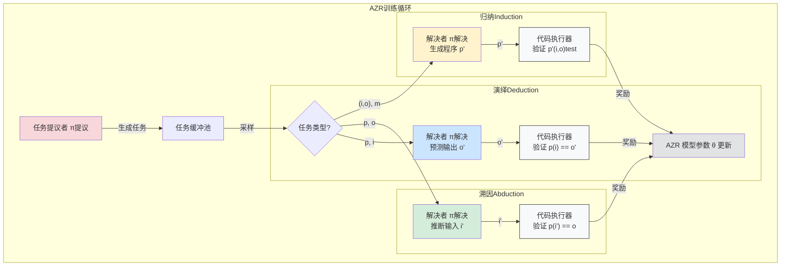

# Chapter 7: 推理模式：溯因、演绎、归纳 (Reasoning Modes: Abduction, Deduction, Induction)


欢迎来到“绝对零：零数据强化自博弈推理”项目的最后一章！在上一章中，我们探讨了[基于代码执行器的可验证奖励 (Verifiable Rewards via Code Executor)](06_基于代码执行器的可验证奖励__verifiable_rewards_via_code_executor__.md)，了解了 AZR 系统如何通过代码执行器获得客观、可靠的反馈，从而进行有效的学习。本章，我们将聚焦于 AZR 系统学习和训练其推理能力所围绕的三种核心推理模式：**溯因推理、演绎推理和归纳推理**。

## 为什么要学习不同的推理模式？

想象一下，我们希望培养一个全能的 AI 侦探。这位侦探不仅需要能够根据已有的线索和规则（比如“所有进入过案发现场的人都有嫌疑”）一步步推导出结论（比如“张三有嫌疑”），还需要能够根据一些零散的现象（比如“受害者桌上有一杯冷掉的咖啡”）反推出可能的解释（比如“受害者在案发前可能正在会客”），更需要能够从大量的案件中总结出普遍的作案规律（比如“连环盗窃案通常发生在周五晚上”）。

仅仅掌握一种思考方式是不够的。一个真正强大的推理者，需要具备多种推理能力，以适应不同类型的问题和情境。同样地，为了让[绝对零推理器 (AZR)](03_绝对零推理器__absolute_zero_reasoner___azr__.md) 具备全面而强大的推理能力，它被设计用来学习和掌握三种核心的推理模式。这三种模式共同构成了模型全面推理能力训练的基石。

这三种推理模式分别是：
1.  **演绎推理 (Deduction)**
2.  **溯因推理 (Abduction)**
3.  **归纳推理 (Induction)**

接下来，我们将逐一了解这些推理模式，并看看它们在 AZR 项目中是如何体现的。

## 1. 演绎推理 (Deduction)：从一般到特殊的逻辑推演

**演绎推理**就像一位工程师严格按照设计图纸和施工规范来建造一座大桥。图纸和规范是“一般规则”，工程师根据这些规则，结合具体的测量数据（“特定情况”），精确地计算出每个部件的尺寸和位置（“具体结论”）。

> **定义**：演绎推理是从一般性的前提（规则、公理）出发，通过逻辑推导，得出关于特定情况的结论的过程。如果前提为真且推理过程有效，那么结论必然为真。

**在 AZR 项目中**：
演绎推理任务通常表现为：**给定一个程序（规则）和一个或多个输入（特定情况），预测程序的输出（具体结论）**。

*   **程序 (p)**：代表了一套明确的规则或算法。
*   **输入 (i)**：代表了应用这些规则的具体情境。
*   **输出 (o)**：代表了在这些规则和情境下必然产生的结果。

**一个简单的例子**：
假设我们有以下 Python 函数（程序 `p`）和输入 `i`：

```python
# 程序 p: 一个简单的加法函数
def add_numbers(a, b):
  return a + b

# 输入 i: (5, 3)
```

对于演绎推理任务，AZR 需要预测调用 `add_numbers(5, 3)` 会得到什么输出。
正确的演绎推理结果是：输出 `o` 为 `8`。

AZR 的[双重角色：任务提议与解决 (Dual Roles: Proposer & Solver)](05_双重角色_任务提议与解决__dual_roles__proposer___solver__.md) 中的“提议者”会生成类似这样的`(程序, 输入)`对作为任务，而“解决者”则需要预测输出。预测的正确性由[基于代码执行器的可验证奖励 (Verifiable Rewards via Code Executor)](06_基于代码执行器的可验证奖励__verifiable_rewards_via_code_executor__.md) 来判断。

这种任务训练模型进行严格的、符合逻辑的逐步推理能力。

## 2. 溯因推理 (Abduction)：从现象到最佳解释的探索

**溯因推理**则像一位医生根据病人表现出的症状，反向推断最有可能导致这些症状的病因。医生看到病人发烧、咳嗽（“观察到的现象”），结合医学知识（“可能的规则和理论”），可能会推断出“病人可能患了流感”（“最佳解释”）。

> **定义**：溯因推理是从观察到的现象（结果）出发，结合已有的知识或规则，推断出导致这些现象的最可能的原因或前提的过程。它通常不是绝对正确的，而是提供一个“最佳解释”。

**在 AZR 项目中**：
溯因推理任务通常表现为：**给定一个程序（规则）和一个期望的输出（观察到的现象），推断出可能产生该输出的一个或多个输入（可能的原因）**。

*   **程序 (p)**：代表了一套已知的规则或变换过程。
*   **输出 (o)**：代表了我们观察到的结果或期望达成的目标。
*   **输入 (i)**：代表了能够导致这个结果的某种初始条件或原因。

**一个简单的例子**：
假设我们有以下 Python 函数（程序 `p`）和期望的输出 `o`：

```python
# 程序 p: 一个检查数字是否为偶数的函数
def is_even_and_positive(n):
  if not isinstance(n, int):
    return False
  return n > 0 and n % 2 == 0

# 期望输出 o: True
```

对于溯因推理任务，AZR 需要推断出什么样的输入 `i` 会使得 `is_even_and_positive(i)` 返回 `True`。
可能的溯因推理结果可以是：输入 `i` 为 `2`，或者 `4`，或者 `100` 等任何一个正偶数。

在 AZR 中，提议者生成`(程序, 输出)`对，解决者则需要找到一个合适的输入。由于一个输出可能对应多个有效输入（例如，程序不是单射的），验证通常是检查解决者提供的输入是否真的能产生给定的输出 (即 `p(i_solver) == o_target`)。

这种任务训练模型进行探索性、假设驱动的推理，以及从结果反推原因的能力。这在很多现实问题中非常重要，比如调试代码（从错误现象推断错误原因）或科学发现。

## 3. 归纳推理 (Induction)：从具体到一般的规律总结

**归纳推理**则像一位科学家通过观察大量苹果都从树上掉落到地上的现象，总结出“所有物体都会受到地球引力作用”这一普遍规律。科学家观察了许多“具体实例”，从中提炼出“一般规则”。

> **定义**：归纳推理是从一系列具体的观察或案例出发，总结、概括出一般性的规则、模式或原理的过程。归纳得到的结论通常具有一定的概率性，并不保证绝对正确，但能够提供有力的概括和预测。

**在 AZR 项目中**：
归纳推理任务通常表现为：**给定多组输入输出示例，以及可能的辅助描述信息，生成一个能够解释这些示例并能泛化到新情况的程序（一般规则）**。

*   **输入输出对 `{(i_n, o_n)}`**：代表了一系列具体的观察案例。
*   **描述 (m)**：可能提供关于期望程序功能的自然语言提示或约束。
*   **程序 (p)**：代表了从这些案例中总结出来的通用算法或规则。

**一个简单的例子**：
假设我们有以下输入输出对和描述：

```python
# 输入输出对:
# 示例1: 输入 i1 = [1, 2, 3], 输出 o1 = 6
# 示例2: 输入 i2 = [-1, 0, 1], 输出 o2 = 0
# 示例3: 输入 i3 = [10, 20], 输出 o3 = 30

# 描述 m: "这个函数计算一个整数列表中所有元素的和。"
```

对于归纳推理任务，AZR 需要生成一个 Python 函数（程序 `p`），这个函数能够正确处理上述所有示例，并且符合描述。
一个可能的归纳推理结果是：

```python
# 程序 p (由模型生成):
def sum_list_elements(numbers):
  total = 0
  for num in numbers:
    total += num
  return total
```

在 AZR 中，提议者会提供输入输出对和描述，解决者需要生成相应的程序。为了检验生成程序的泛化能力，通常会使用一些“隐藏”的测试用例（即未在训练时展示给解决者的输入输出对）来进行评估。

这种任务训练模型从具体数据中学习模式、抽象规则，并进行泛化的能力，这对于学习新概念和适应新环境至关重要。

## AZR 如何运用这三种推理模式？

[绝对零推理器 (AZR)](03_绝对零推理器__absolute_zero_reasoner___azr__.md) 系统通过其[双重角色：任务提议与解决 (Dual Roles: Proposer & Solver)](05_双重角色_任务提议与解决__dual_roles__proposer___solver__.md) 机制，围绕这三种推理模式进行训练：

1.  **任务提议**：AZR 的“提议者”角色会生成不同类型的编程任务，这些任务分别对应演绎、溯因和归纳推理。
    *   **演绎任务**：提议者生成程序 `p` 和输入 `i`。环境（代码执行器）运行 `p(i)` 得到标准输出 `o⋆`。问题是 `(p, i)`，目标是预测 `o⋆`。
    *   **溯因任务**：提议者生成程序 `p` 和输入 `i`（并得到输出 `o⋆`）。问题是 `(p, o⋆)`，目标是找到一个输入 `i'` 使得 `p(i') = o⋆`。
    *   **归纳任务**：提议者从已有的演绎或溯因任务中采样一个程序 `p`，然后生成一组新的输入 `{i_n}` 和一个描述 `m`。环境计算出对应的输出 `{o_n = p(i_n)}`。问题是 `({(i_n, o_n)}` 的一部分和 `m`)，目标是生成一个程序 `p'`，使其能正确处理所有（包括隐藏的）输入输出对。

2.  **任务解决与验证**：AZR 的“解决者”角色会尝试解决这些任务。
    *   解决方案的正确性由[基于代码执行器的可验证奖励 (Verifiable Rewards via Code Executor)](06_基于代码执行器的可验证奖励__verifiable_rewards_via_code_executor__.md) 来严格判定。例如：
        *   演绎：比较预测输出和实际执行输出。
        *   溯因：执行用推断的输入运行程序，看是否得到目标输出。
        *   归纳：用多组（包括隐藏的）测试用例测试生成的程序。

3.  **学习与进化**：通过[强化自博弈 (Reinforced Self-play)](04_强化自博弈__reinforced_self_play__.md)，AZR 从成功和失败中学习，不断提升其在所有三种推理模式下的表现。

下图（灵感来源于论文 Figure 4）展示了 AZR 如何结合这三种任务类型进行训练：


这个图表概括了 AZR 如何针对不同推理模式的任务进行提议、解决和学习。提议者产生不同类型的任务，解决者尝试解决它们，代码执行器提供验证和奖励，最终驱动模型参数的更新。

通过在[零数据学习 (Zero Data Learning)](02_零数据学习__zero_data_learning__.md) 的框架下，同时训练这三种互补的推理模式，AZR 旨在发展出一种更加通用和灵活的推理能力，使其能够应对更广泛和更复杂的挑战，而不仅仅是模仿特定数据集中的模式。这与论文 Section 3.2 "Learning Different Modes of Reasoning: Deduction, Induction, and Abduction" 中描述的原理一致。

## 为什么这三种模式很重要？

这三种推理模式——演绎、溯因和归纳——代表了人类智能中一些最核心的思考方式：
*   **演绎**确保了逻辑的严谨性和一致性，是精确执行已知规则的基础。
*   **溯因**赋予了我们探索未知、形成假设和创造性解决问题的能力。
*   **归纳**使我们能够从经验中学习，发现规律，并对未来做出预测。

一个只擅长演绎的 AI 可能像一个死板的计算器，缺乏灵活性；一个只擅长溯因的 AI 可能充满奇思妙想但缺乏根据；一个只擅长归纳的 AI 可能只能重复过去的模式而难以创新。

通过综合训练这三种模式，AZR 致力于培养一种更加平衡和全面的“智能”。这使得模型不仅能够“举一反三”，还能“无中生有”地提出新问题，并从过去的经验中总结出新的“方法论”。这种全面的推理能力对于实现[绝对零范式 (Absolute Zero Paradigm)](01_绝对零范式__absolute_zero_paradigm__.md)所追求的真正自主智能至关重要。

## 小结与展望

在本章中，我们学习了“绝对零”项目中模型训练所围绕的三种核心推理模式：
*   **演绎推理**：从一般规则到具体结论的推演（如工程师按图纸施工）。
*   **溯因推理**：从观察到的结果反推可能原因的探索（如医生诊断病情）。
*   **归纳推理**：从具体案例总结出一般规律的过程（如科学家发现定律）。

我们了解到，[绝对零推理器 (AZR)](03_绝对零推理器__absolute_zero_reasoner___azr__.md) 通过生成和解决对应这三种模式的编程任务，并利用[基于代码执行器的可验证奖励 (Verifiable Rewards via Code Executor)](06_基于代码执行器的可验证奖励__verifiable_rewards_via_code_executor__.md) 进行反馈，从而在[强化自博弈 (Reinforced Self-play)](04_强化自博弈__reinforced_self_play__.md) 的框架下全面提升其推理能力。

这三种推理模式的结合，为 AZR 在[零数据学习 (Zero Data Learning)](02_零数据学习__zero_data_learning__.md) 的条件下实现强大且通用的推理能力奠定了坚实的基础。

---

**教程总结与展望**

至此，我们已经完成了“绝对零：零数据强化自博弈推理”项目的核心概念学习之旅。让我们回顾一下我们共同探索的关键思想：

1.  **[绝对零范式 (Absolute Zero Paradigm)](01_绝对零范式__absolute_zero_paradigm__.md)**：我们首先认识了一种全新的 AI 学习范式，模型不再依赖外部数据，而是通过自我提议任务、解决任务，并在与环境的互动中获得反馈来实现自我进化。
2.  **[零数据学习 (Zero Data Learning)](02_零数据学习__zero_data_learning__.md)**：接着，我们深入理解了绝对零范式得以实现的核心基石——模型如何在没有任何预置“教科书”的情况下，从零开始构建知识。
3.  **[绝对零推理器 (Absolute Zero Reasoner - AZR)](03_绝对零推理器__absolute_zero_reasoner___azr__.md)**：然后，我们认识了这个范式的具体执行者 AZR，一个通过自我生成和解决编程任务来提升推理能力的智能系统。
4.  **[强化自博弈 (Reinforced Self-play)](04_强化自博弈__reinforced_self_play__.md)**：我们探讨了驱动 AZR 学习的核心机制，即模型如何通过“自己和自己玩”来不断优化和提升。
5.  **[双重角色：任务提议与解决 (Dual Roles: Proposer & Solver)](05_双重角色_任务提议与解决__dual_roles__proposer___solver__.md)**：我们了解到 AZR 内部的单个模型是如何同时扮演“出题人”和“解题人”这两个关键角色的。
6.  **[基于代码执行器的可验证奖励 (Verifiable Rewards via Code Executor)](06_基于代码执行器的可验证奖励__verifiable_rewards_via_code_executor__.md)**：我们学习了 AZR 如何通过与代码执行器交互，获得客观、可验证的奖励信号，从而指导其学习方向。
7.  **推理模式：溯因、演绎、归纳** (本章)：最后，我们理解了 AZR 为了发展全面推理能力而学习的三种核心推理模式。

这些概念共同描绘了“绝对零”项目如何致力于构建一个能够真正自主学习和进化的 AI 系统。它通过巧妙的设计，让 AI 摆脱了对大规模人工标注数据的依赖，开辟了一条通过自我驱动、自我挑战来实现更高智能水平的道路。

虽然本教程系列到此告一段落，但“绝对零”范式及其应用的研究才刚刚开始。我们希望通过这个入门教程，能够帮助您理解这一前沿领域的核心思想。未来，我们期待看到更多基于类似理念的创新，推动人工智能向着更自主、更通用、更强大的方向发展。

感谢您的学习！如果您对项目的具体实现细节感兴趣，可以进一步阅读项目相关的论文和代码。祝您在探索人工智能的道路上一切顺利！

---

Generated by [AI Codebase Knowledge Builder](https://github.com/The-Pocket/Tutorial-Codebase-Knowledge)