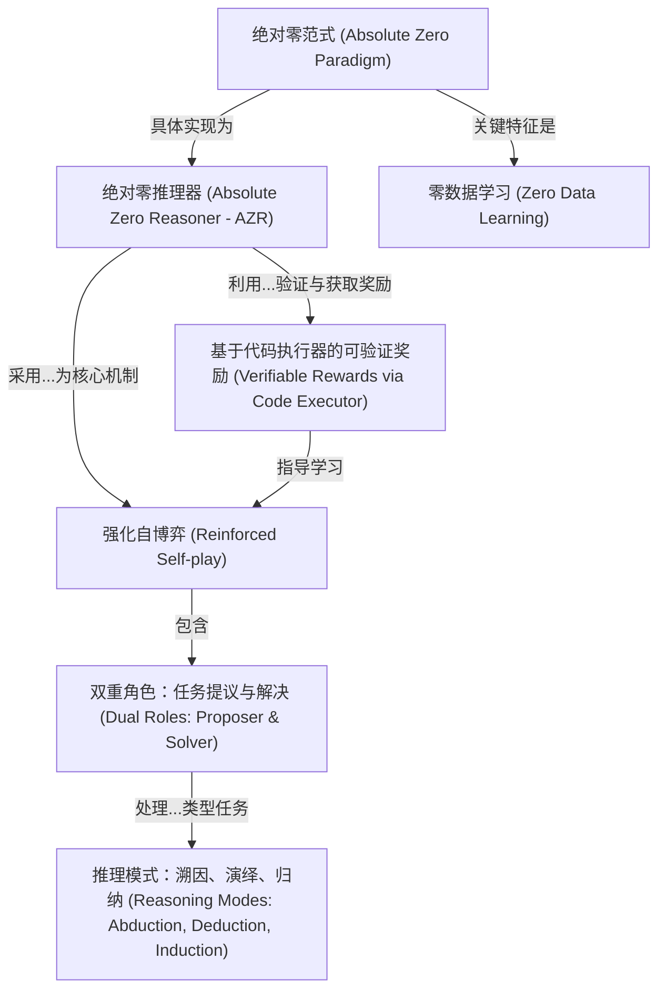

# Tutorial: Absolute Zero Reinforced Self-play Reasoning with Zero Data

该项目介绍了一种名为“**绝对零**”的*全新强化学习范式*。其核心思想是，一个模型能够*在没有任何外部数据的情况下*，通过自我学习来提升其推理能力。它通过一种“自我博弈”的方式实现这一点：模型内部同时扮演“*提议者*”角色负责出题（例如编程问题），和“*解决者*”角色尝试解决这些问题。解决方案会被一个“*代码执行器*”自动验证，并据此给出奖励或惩罚作为反馈，从而指导模型学习。通过这种持续的自我提议、自我解决和自我修正的循环，模型能够自主进化，并学习如演绎、溯因、归纳等多种推理模式。

**Source Repository:** [None](None)

## Chapters

1. [绝对零范式 (Absolute Zero Paradigm)
](01_绝对零范式__absolute_zero_paradigm__.md)
2. [零数据学习 (Zero Data Learning)
](02_零数据学习__zero_data_learning__.md)
3. [绝对零推理器 (Absolute Zero Reasoner - AZR)
](03_绝对零推理器__absolute_zero_reasoner___azr__.md)
4. [强化自博弈 (Reinforced Self-play)
](04_强化自博弈__reinforced_self_play__.md)
5. [双重角色：任务提议与解决 (Dual Roles: Proposer & Solver)
](05_双重角色_任务提议与解决__dual_roles__proposer___solver__.md)
6. [基于代码执行器的可验证奖励 (Verifiable Rewards via Code Executor)
](06_基于代码执行器的可验证奖励__verifiable_rewards_via_code_executor__.md)
7. [推理模式：溯因、演绎、归纳 (Reasoning Modes: Abduction, Deduction, Induction)
](07_推理模式_溯因_演绎_归纳__reasoning_modes__abduction__deduction__induction__.md)

---

Generated by [AI Codebase Knowledge Builder](https://github.com/The-Pocket/Tutorial-Codebase-Knowledge)