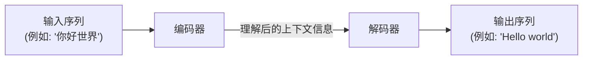
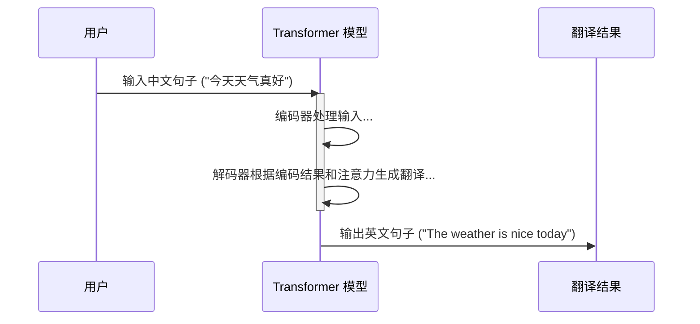

# Chapter 1: Transformer 模型

欢迎来到 `Attention_Is_All_You_Need` 项目的教程！在本系列中，我们将一起探索 Transformer 模型的奥秘。今天，我们从基础开始，了解什么是 Transformer 模型。

想象一下，你正在尝试将一段中文翻译成英文。你不仅仅是逐字翻译，还会理解整个句子的语境，词语之间的关联，甚至是一些微妙的含义。Transformer 模型就像一位能**洞察全局的翻译大师**，它也是一种强大的神经网络架构，专门为处理序列数据（如文本翻译、文章摘要、对话生成等）而设计。

它的独特之处在于，它**完全摒弃了以往模型中常见的循环（Recurrence）和卷积（Convolution）结构，仅依赖一种叫做“注意力机制”（Attention Mechanism）的强大工具来捕捉输入和输出序列间的全局依赖关系**。这使得它在理解长距离依赖（比如一句话开头和结尾的词语之间的关联）方面表现得尤为出色。

## 我们为什么要学习 Transformer？

在 Transformer 出现之前，处理序列数据（比如一句话中的词语顺序）主要依赖循环神经网络 (RNN) 或长短期记忆网络 (LSTM)。这些模型逐个处理序列中的元素，就像我们一个字一个字地阅读一样。

**核心痛点：理解长距离的“弦外之音”**

考虑一个句子：“那个小猫，它昨天在公园里追逐一只五彩斑斓的蝴蝶，玩得不亦乐乎，结果把晚餐都忘了，现在**它**饿坏了。”

这里的“它”指的是谁？很明显是“小猫”。但“小猫”和“它”之间隔了好多个词。传统的序列模型在处理这么长的依赖关系时，可能会“忘记”句子开头提到的“小猫”，从而难以准确理解“它”的指代。这就好比一位翻译在翻译长篇大论时，记不清前面提到的人物细节，导致翻译出现偏差。

Transformer 的出现，就是为了更好地解决这类长距离依赖问题。它能够同时关注到输入序列中的所有部分，并判断哪些部分对于当前正在处理的词语（或要生成的词语）最为重要。

## Transformer 的核心魅力：“注意力”的力量

让我们再次回到“洞察全局的翻译大师”这个比喻。当这位大师翻译句子时，他不会只看当前的词。相反，他会审视整个句子，思考每个词与其他词的关系，判断哪些词是理解当前部分的关键。

例如，翻译句子 "The bank by the river is beautiful."
*   如果只看 "bank"，它可能指“银行”，也可能指“河岸”。
*   但如果同时注意到 "river"（河流），那么 "bank" 很可能指的是“河岸”。

Transformer 模型的“注意力机制”就扮演了类似的角色。它允许模型在处理一个词时，动态地评估输入序列中所有其他词对当前词的重要性，并给予更重要的词更高的“关注度”。这使得模型能够捕捉到词语之间复杂的依赖关系，无论它们在序列中相隔多远。

这种“一次看清全局”的能力，与 RNN 那种“一步一个脚印”的处理方式形成了鲜明对比。也正是因为这种设计，Transformer 在并行计算方面具有巨大优势，训练起来也更快。

## Transformer 的宏观结构：一个概览

虽然我们会在后续章节中深入探讨 Transformer 的各个组件，但现在让我们先对其整体结构有一个初步的印象。你可以将 Transformer 模型想象成一个由两部分组成的系统：

1.  **编码器 (Encoder)**：负责“阅读”和“理解”输入序列（例如，一句待翻译的中文）。它会把输入序列转换成一种包含丰富上下文信息的内部表示（我们称之为“上下文向量”或“记忆”）。
2.  **解码器 (Decoder)**：负责根据编码器提供的“理解”和已经生成的部分，逐步“生成”输出序列（例如，翻译后的英文句子）。

这个结构我们会在下一章 [编码器-解码器结构](02_编码器_解码器结构_.md) 中详细讨论。

下面是一个非常简化的示意图，展示了信息如何在 Transformer 中流动：

## "Attention Is All You Need"：不仅仅是一个标题

这个模型的开创性论文标题就是“Attention Is All You Need”（注意力就是你所需要的一切）。这个标题非常精辟地概括了 Transformer 的核心思想：**它表明模型仅仅通过注意力机制，就足以在序列到序列的任务上达到甚至超越以往依赖循环或卷积结构的模型。**

这在当时是一个相当激进的想法，但事实证明非常成功，并为后续大量的自然语言处理（NLP）甚至计算机视觉领域的模型（如 BERT, GPT, ViT 等）奠定了基础。

## 一个简单的翻译例子

让我们看看 Transformer 如何在概念上处理一个翻译任务：

1.  **输入（中文）：** "今天天气真好"
2.  **Transformer 模型进行处理：**
    *   编码器读取这句话，理解其含义和上下文。
    *   解码器接收编码器的理解，并开始逐词生成英文翻译。在生成每个英文词时，它会“关注”输入中文句子的相关部分以及已生成的英文部分。
3.  **输出（英文）：** "The weather is nice today"

我们可以用一个简单的序列图来表示这个过程：

## 总结与展望

在本章中，我们初步认识了 Transformer 模型。我们了解到：

*   Transformer 是一种专为处理序列数据设计的强大神经网络架构。
*   它抛弃了传统的循环和卷积结构，完全依赖**注意力机制**来捕捉序列中的依赖关系。
*   它像一位能洞察全局的翻译大师，能够理解词句并把握上下文的深层联系。
*   它主要由编码器和解码器两部分组成。

Transformer 模型内部还有许多有趣的细节和组件，例如它是如何表示词语的 ([词嵌入与 Softmax 输出](03_词嵌入与_softmax_输出_.md))，如何理解词语顺序的 ([位置编码](04_位置编码_.md))，以及注意力机制的具体实现 ([自注意力机制](05_自注意力机制_.md) 和 [多头注意力](06_多头注意力_.md)) 等等。

在接下来的章节中，我们将逐一揭开这些组件的神秘面纱。首先，让我们更深入地了解 Transformer 的核心架构：[编码器-解码器结构](02_编码器_解码器结构_.md)。

---

Generated by [AI Codebase Knowledge Builder](https://github.com/The-Pocket/Tutorial-Codebase-Knowledge)