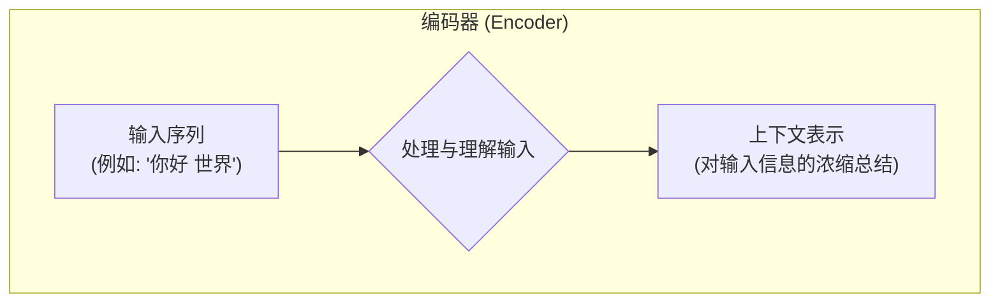
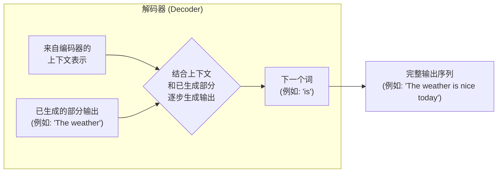
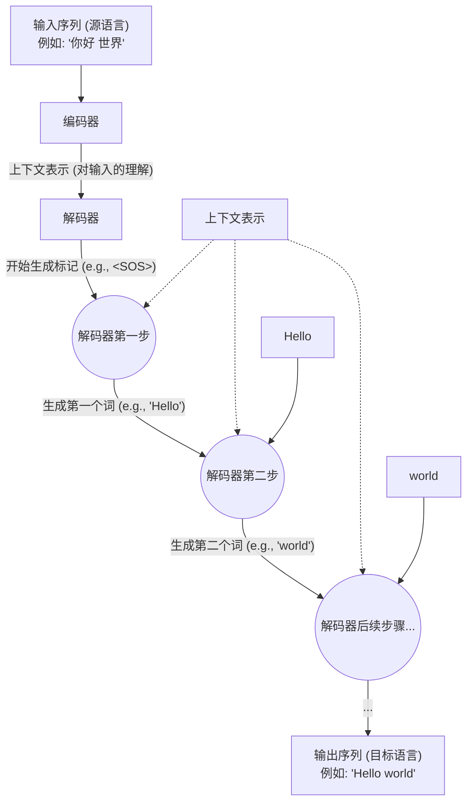
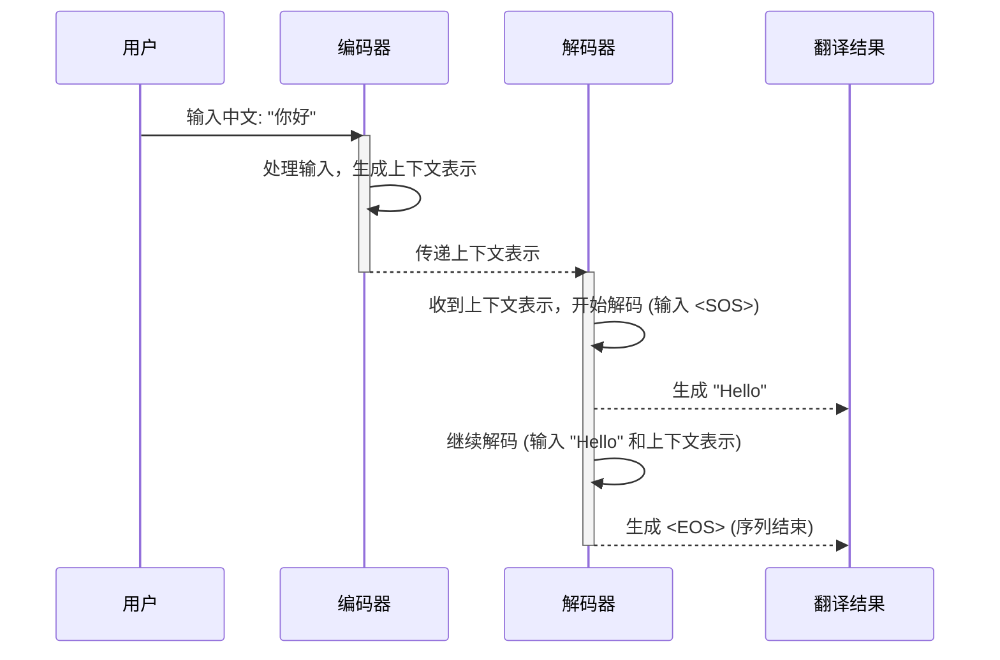
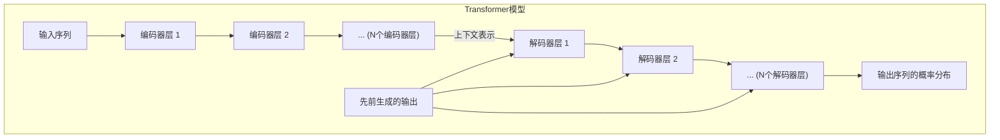

# Chapter 2: 编码器-解码器结构


在上一章 [Transformer 模型](01_transformer_模型_.md) 中，我们初步认识了 Transformer，了解了它是一种不依赖传统循环或卷积结构，仅通过“注意力机制”来处理序列数据的强大模型。我们还提到，Transformer 的宏观结构可以看作一个由编码器和解码器两部分组成的系统。

本章，我们将深入探讨这个核心框架：**编码器-解码器 (Encoder-Decoder) 结构**。这是一种在序列到序列 (Sequence-to-Sequence, Seq2Seq) 任务中非常经典且广泛应用的架构，Transformer 正是沿用了这一思想。

## 为什么需要编码器-解码器结构？

想象一下我们最常接触的序列到序列任务：**机器翻译**。我们需要将一种语言的句子（输入序列）转换成另一种语言的句子（输出序列）。

例如，将中文句子 “你好，世界” 翻译成英文 “Hello, world”。

这两个句子的长度可能不同，词语的对应关系也可能不是简单的一对一。模型需要先完整理解输入句子的含义，然后才能准确地生成目标语言的句子。

这就引出了编码器-解码器结构的核心思想：

1.  **理解输入 (编码)：** 首先，需要一个模块来“阅读”并“理解”整个输入序列。这个模块就像一位翻译家在翻译前仔细阅读原文，捕捉其核心意思和上下文信息。我们将这个过程称为“编码”，执行这个任务的模块称为“编码器”。
2.  **生成输出 (解码)：** 在充分理解了输入之后，需要另一个模块来“逐字逐句”地生成目标序列。这位翻译家在理解原文后，开始用目标语言组织并写出译文。这个过程称为“解码”，执行这个任务的模块称为“解码器”。

编码器-解码器结构为这类需要“先理解，后生成”的任务提供了一个清晰而强大的框架。

## 编码器 (Encoder)：理解大师

编码器的主要职责是处理输入序列，并将其转换成一个或一组固定大小的、包含了上下文信息的**中间表示** (通常称为“上下文向量”或“思想向量”)。你可以把它想象成编码器在“消化”了整个输入句子后，形成的一个对句子含义的浓缩总结。



*   **输入 (Input)：** 原始的序列数据，例如一句中文：“今天天气真好”。
*   **处理 (Processing)：** 编码器内部会通过一系列复杂的计算（在 Transformer 中，这包括了我们后续会讲到的 [自注意力机制](05_自注意力机制_.md) 和 [按位置前馈网络](07_按位置前馈网络_.md)）来捕捉输入序列中词语之间的依赖关系和整体语境。
*   **输出 (Output)：** 一个（或多个）能够代表整个输入序列信息的向量。这个向量就像是编码器对输入信息的“理解精华”。

**打个比方：**
想象编码器是一位非常博学的学者，他阅读了一整篇中文文章（输入序列）。阅读完毕后，他并没有直接开始翻译，而是在脑海中形成了一个对这篇文章主旨、关键论点和情感色彩的全面理解（上下文表示）。

## 解码器 (Decoder)：生成巧匠

解码器的任务是接收编码器生成的上下文表示，并在此基础上，一步一步地生成目标输出序列。在生成每个词的时候，解码器不仅会参考编码器给出的“理解精华”，还会参考它自己已经生成的那部分内容。



*   **输入 (Input)：**
    *   编码器输出的上下文表示。
    *   解码器到目前为止已经生成的部分输出序列（例如，在翻译 “今天天气真好” 时，如果已经生成了 "The weather"，那么 "The weather" 就是下一步的输入之一）。
*   **处理 (Processing)：** 解码器同样会进行复杂的计算，它会“关注”输入句子的哪些部分对于生成当前目标词最重要，同时也会考虑已经生成的词，以保证输出的连贯性和准确性。
*   **输出 (Output)：** 目标序列中的下一个词。这个过程会一直重复，直到生成一个特殊的“序列结束”标记，或者达到预设的最大长度。

**继续上面的比方：**
那位博学的学者（编码器）现在将他对中文文章的理解（上下文表示）传达给一位精通英文的作家（解码器）。这位作家不会一下子写出整篇译文，而是会根据学者的理解，并结合自己已经写出的英文句子片段，一句一句、一个词一个词地斟酌并写下对应的英文内容。在写每一个英文词的时候，他都会回顾学者的核心思想，确保翻译不偏离原文，同时也确保自己写出的句子通顺自然。

## 编码器与解码器的协同工作

编码器和解码器就像一个配合默契的团队，共同完成序列到序列的转换任务。

下面是一个简化的流程图，展示了它们在机器翻译任务中如何协同工作：



**解释:**

1.  **编码阶段：** 输入序列（如中文句子 "你好 世界"）首先被送入编码器。编码器处理整个句子，并生成一个富含信息的上下文表示。
2.  **解码阶段：**
    *   解码器接收这个上下文表示。
    *   通常，解码器会以一个特殊的“开始符”（Start-of-Sequence, `<SOS>`）作为初始输入，开始生成第一个目标词。
    *   在生成每个词时，解码器都会利用编码器的上下文表示和它之前已生成的词。例如，生成 "Hello" 之后，解码器会基于上下文表示和 "Hello" 来生成 "world"。
    *   这个过程持续进行，直到解码器生成一个特殊的“结束符”（End-of-Sequence, `<EOS>`），表示句子翻译完成。

**用一个更生动的序列图来描绘这个过程：**

假设我们要将 "你好" 翻译成 "Hello"。


在这个图中：
*   用户提供源语言句子给编码器。
*   编码器将其处理成一种内部理解（上下文表示）。
*   解码器接收这种理解，并逐步生成目标语言的词语，直到完成整个句子的翻译。

## Transformer 中的编码器和解码器

在 "Attention Is All You Need" 论文中提出的 Transformer 模型，其编码器和解码器内部结构更为复杂，它们并不是单一的组件，而是由多层相同的模块堆叠而成（论文中默认是6层）。

**一个简化的概念图：**



*   **编码器 (Encoder):**
    *   由 N 个相同的层堆叠而成。
    *   每一层都有两个主要的子层：一个 [自注意力机制](05_自注意力机制_.md) (Self-Attention Mechanism) 和一个 [按位置前馈网络](07_按位置前馈网络_.md) (Position-wise Feed-Forward Network)。我们会在后续章节详细学习它们。
    *   自注意力机制帮助编码器在处理一个词时，权衡输入序列中其他词对该词的重要性。
    *   前馈网络则对自注意力层的输出进行进一步的非线性转换。

*   **解码器 (Decoder):**
    *   同样由 N 个相同的层堆叠而成。
    *   每一层有三个主要的子层：
        1.  一个带掩码的 [自注意力机制](05_自注意力机制_.md) (Masked Self-Attention Mechanism)：确保在预测当前词时，只能关注到已经生成的词，不能“偷看”未来的词。
        2.  一个编码器-解码器注意力机制 (Encoder-Decoder Attention)：允许解码器的每个位置关注到输入序列的所有位置（即编码器的输出）。这使得解码器能够根据输入句子的相关部分来生成输出。这通常被称为“交叉注意力”(Cross-Attention)。
        3.  一个 [按位置前馈网络](07_按位置前馈网络_.md)。

虽然听起来组件很多，但核心思想仍然是：编码器负责理解，解码器负责生成。这些内部的复杂机制（如各种注意力）都是为了让这个理解和生成的过程更加精准和高效。

**我们暂时不需要深入这些子层的具体实现，只需记住：**
编码器将输入序列转换成一系列上下文表示。解码器则利用这些上下文表示，并结合已经生成的部分，来逐步构建输出序列。

## 概念性代码演示（伪代码）

为了更直观地理解，我们可以用非常简化的伪代码来表示编码器和解码器的工作流程。请注意，这远非真实 Transformer 的实现，仅仅是为了说明概念。

```python
# 这是一个非常简化的概念性伪代码，并非实际可运行的 Transformer 代码

def  encoder(input_sequence_tokens):
    """
    编码器函数（概念性）。
    接收输入序列的词元 (tokens)，输出上下文表示。
    """
    print(f"编码器开始处理输入: {input_sequence_tokens}")
    # 在实际 Transformer 中，这里会进行词嵌入、位置编码、
    # 多层自注意力和前馈网络等复杂操作。
    # 我们这里简化为直接返回一个表示“理解”的字符串。
    context_representation = f"对'{' '.join(input_sequence_tokens)}'的理解"
    print(f"编码器生成上下文表示: {context_representation}")
    return context_representation

def decoder_step(context_representation, previously_generated_tokens):
    """
    解码器单步生成函数（概念性）。
    接收上下文表示和已生成的词元，输出下一个词元。
    """
    print(f"解码器接收上下文: {context_representation}, 已生成: {previously_generated_tokens}")
    # 实际 Transformer 解码器会使用注意力机制关注上下文，
    # 并通过 Softmax 输出下一个词的概率分布。
    # 这里我们根据输入和上下文简单模拟生成。
    if not previously_generated_tokens: # 如果是第一步
        if "你好" in context_representation:
            next_token = "Hello"
        else:
            next_token = "[未知词]"
    elif previously_generated_tokens[-1] == "Hello":
        if "世界" in context_representation:
            next_token = "world"
        else:
            next_token = "."
    else:
        next_token = "<EOS>" # 序列结束标记

    print(f"解码器生成下一个词: {next_token}")
    return next_token

# --- 模拟翻译过程 ---
source_sentence_tokens = ["你好", "世界"]
target_language_tokens = []
max_length = 5 # 防止无限循环

# 1. 编码输入
encoded_context = encoder(source_sentence_tokens)

# 2. 解码输出 (逐步生成)
current_generated_tokens = []
for _ in range(max_length):
    next_token = decoder_step(encoded_context, current_generated_tokens)
    if next_token == "<EOS>": # 如果是结束标记
        break
    current_generated_tokens.append(next_token)

print(f"\n源句子: {' '.join(source_sentence_tokens)}")
print(f"翻译结果: {' '.join(current_generated_tokens)}")

```

当你运行（或在脑海中模拟）上面的伪代码时，你会看到：

1.  `encoder` 函数接收中文词元 `["你好", "世界"]`，并模拟生成一个代表其理解的 `context_representation`。
2.  然后进入一个循环，`decoder_step` 函数被反复调用：
    *   第一次调用，`previously_generated_tokens` 是空的，解码器根据上下文生成 "Hello"。
    *   第二次调用，`previously_generated_tokens` 是 `["Hello"]`，解码器根据上下文和 "Hello" 生成 "world"。
    *   第三次调用，`previously_generated_tokens` 是 `["Hello", "world"]`，解码器模拟生成序列结束标记 `<EOS>`。
3.  循环结束，最终输出翻译结果。

这个例子极大地简化了实际的复杂性，但它展示了编码器负责整体理解，解码器负责基于这份理解逐步生成输出的核心流程。在真实的 Transformer 中，编码器和解码器内部充满了精密的数学运算和神经网络层，尤其是各种强大的注意力机制。

## 总结与展望

在本章中，我们学习了 Transformer 模型的核心框架——编码器-解码器结构：

*   **编码器 (Encoder)** 的任务是阅读并理解整个输入序列，将其转换成一种富含上下文信息的中间表示。它像一位深入研读原文的学者。
*   **解码器 (Decoder)** 的任务是利用编码器提供的上下文表示，并结合已生成的部分，逐步地构建输出序列。它像一位根据理解精心撰写译文的作家。
*   这种结构非常适合处理“输入一个序列，输出另一个序列”的任务，如机器翻译、文本摘要等。
*   Transformer 中的编码器和解码器都是由多层相同的模块堆叠而成，每一层内部都包含着更复杂的组件，如自注意力机制和前馈网络。

现在我们对 Transformer 的整体骨架有了清晰的认识。但是，计算机如何理解“词语”呢？模型是如何知道“你好”和“世界”是不同的词，并且如何将它们表示为可以进行数学运算的形式呢？

在下一章 [词嵌入与 Softmax 输出](03_词嵌入与_softmax_输出_.md) 中，我们将探讨计算机表示词语的第一个关键步骤——词嵌入（Word Embedding），以及模型如何最终决定生成哪个词（Softmax 输出）。这将为我们理解 Transformer 如何处理文本信息打下更坚实的基础。

---

Generated by [AI Codebase Knowledge Builder](https://github.com/The-Pocket/Tutorial-Codebase-Knowledge)