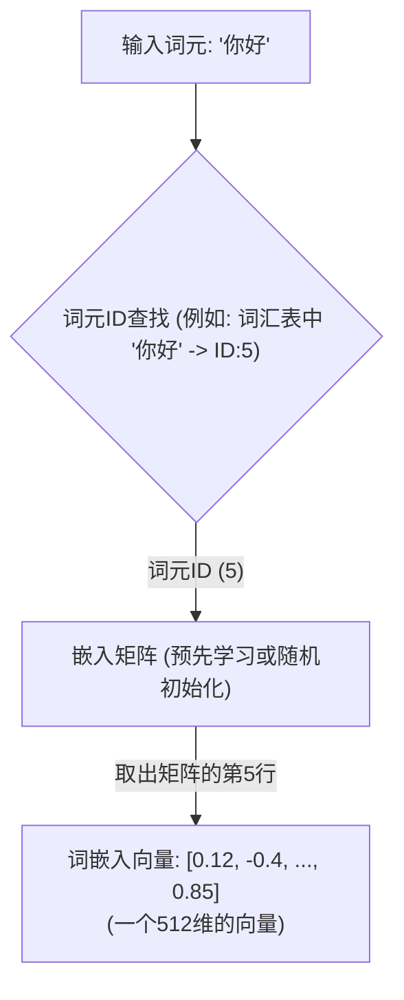
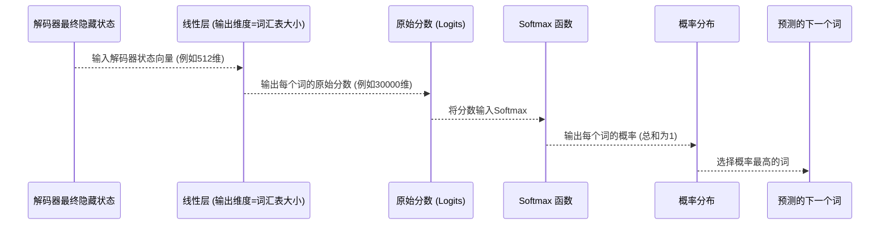

# Chapter 3: 词嵌入与 Softmax 输出


在上一章 [编码器-解码器结构](02_编码器_解码器结构_.md) 中，我们了解了 Transformer 模型宏伟的骨架：编码器负责理解输入，解码器负责生成输出。这就像一个翻译团队，一位理解原文，一位撰写译文。但是，计算机毕竟不是人类，它们如何“阅读”和“理解”像“你好”这样的词语呢？当解码器要“写下”翻译结果时，它又是如何在成千上万的词汇中选择最合适的那个词呢？

本章，我们将深入探讨这两个关键步骤：**词嵌入 (Word Embedding)** 和 **Softmax 输出 (Softmax Output)**。它们是连接文本世界和数字世界的桥梁，也是模型进行预测的基础。

## 计算机如何理解词语？—— 词嵌入

想象一下，我们要让计算机翻译句子 “你好，世界！”。计算机并不直接理解汉字或字母。它更擅长处理数字。那么，第一步就是把 “你好” 和 “世界” 这样的词语转换成计算机能够处理的数字形式。这就是“词嵌入”要做的事情。

**词嵌入 (Word Embedding) 的核心思想：将词语转换为固定维度的数字向量。**

这个向量就像是词语在某个“语义空间”中的坐标。在这个空间里，意思相近的词语，它们的坐标也倾向于彼此靠近。

**打个比方：**
把词语想象成宇宙中的星星。“词嵌入”就像是给每颗星星都分配一个在三维宇宙中的坐标 (x, y, z)。
*   “国王”和“王后”在语义上很接近，所以它们的坐标可能也离得不远。
*   而“国王”和“香蕉”意思相差很远，它们的坐标可能就相隔遥远。

这个“语义空间”的维度通常远不止3维，可能是几百甚至上千维。每个维度都可能捕捉了词语某种特定的语义特征，尽管这些特征往往不是人类能直接解释的。

### 词嵌入层是如何工作的？

在 Transformer 模型中，输入序列（无论是源语言句子还是目标语言句子的一部分）中的每个词元（token，可以理解为一个词或一个字）首先会通过一个**词嵌入层 (Embedding Layer)**。

这个嵌入层通常可以被看作一个巨大的**查询表 (lookup table)**。
1.  首先，我们会为我们词汇表中的每一个词分配一个唯一的ID（一个整数）。例如，“你好”可能是ID 5，“世界”可能是ID 27。
2.  然后，我们创建一个嵌入矩阵。这个矩阵的行数等于词汇表的大小，列数等于我们想要的嵌入向量的维度（例如，512维，这是 Transformer 论文中常用的 `d_model`）。矩阵的每一行都是对应ID词语的嵌入向量。
3.  当一个词（比如“你好”，ID为5）输入时，嵌入层就直接从嵌入矩阵中取出第5行作为“你好”的词嵌入向量。



这些嵌入向量通常不是人工设定的，而是在模型训练过程中**学习**得到的。模型会调整这些向量，使得它们能更好地帮助完成最终任务（比如翻译）。

**一个简单的概念性代码示例：**

假设我们的词汇表很小，嵌入维度也很小（比如3维）。

```python
# 概念性词嵌入演示 (非真实代码)

# 1. 定义词汇表和词语到ID的映射
vocab = {"<PAD>": 0, "你好": 1, "世界": 2, "爱": 3, "你": 4} # <PAD> 是填充符
vocab_size = len(vocab)
embedding_dim = 3 # 假设嵌入向量的维度是3

# 2. 嵌入矩阵 (通常随机初始化，然后在训练中学习)
# 每一行对应一个词的嵌入向量
embedding_matrix = [
    [0.0, 0.0, 0.0],  # <PAD> 的向量
    [0.1, 0.8, 0.3],  # "你好" 的向量
    [0.7, 0.2, 0.5],  # "世界" 的向量
    [0.4, 0.6, 0.1],  # "爱" 的向量
    [0.5, 0.5, 0.2]   # "你" 的向量
]

def get_word_embedding(word_token):
    word_id = vocab.get(word_token)
    if word_id is not None:
        return embedding_matrix[word_id]
    else:
        return [0.0, 0.0, 0.0] # 返回一个默认向量给未知词

# 获取 "你好" 的词嵌入
embedding_nihao = get_word_embedding("你好")
print(f"词语 '你好' 的ID: {vocab.get('你好')}")
print(f"'你好' 的嵌入向量: {embedding_nihao}")

embedding_ai = get_word_embedding("爱")
print(f"词语 '爱' 的ID: {vocab.get('爱')}")
print(f"'爱' 的嵌入向量: {embedding_ai}")
```

**代码解释：**
*   我们定义了一个小词汇表 `vocab`，将每个词映射到一个整数ID。
*   `embedding_matrix` 是我们的嵌入矩阵，这里我们手动填写了一些数字，但在真实模型中它们是学习出来的。
*   `get_word_embedding` 函数通过词的ID从矩阵中查找对应的向量。

**在 Transformer 中：**
*   编码器的输入序列会经过一个输入词嵌入层。
*   解码器的输入序列（目标语言中已经生成的词）也会经过一个类似的词嵌入层。

通过词嵌入，原本离散的文本符号就被转换成了连续的、包含语义信息的向量，为后续的神经网络计算铺平了道路。

## 模型如何决定下一个词？—— Softmax 输出

经过编码器和解码器内部一系列复杂的计算（我们将在后续章节如 [自注意力机制](05_自注意力机制_.md) 学习），解码器最终会生成一个向量。这个向量可以看作是解码器对“接下来应该生成哪个词”的思考结果。但是，这个向量本身并不是一个直接的词语选择，它通常是一个高维的浮点数向量。我们需要一种方法将其转换为对词汇表中每个词的概率。

这就是 **Softmax 函数** 和它之前的 **线性层 (Linear Layer)** 的作用。

**流程：**
1.  **解码器最终输出：** 解码器在某个时间步处理完信息后，会输出一个向量（通常维度是 `d_model`，例如512）。
2.  **线性层转换：** 这个输出向量会首先通过一个线性层（也叫全连接层）。这个线性层的特殊之处在于，它的输出维度等于我们**整个词汇表的大小 (vocab_size)**。例如，如果我们的词汇表有30000个词，那么这个线性层就会输出一个包含30000个值的向量。这个向量中的每一个值可以被看作是对应词汇表中相应词语的一个“原始分数”或“得分”（通常称为 **logits**）。分数越高，代表模型认为这个词是下一个词的可能性越大。
3.  **Softmax 函数：** 接下来，Softmax 函数会作用于这个“原始分数”向量。Softmax 会做两件事：
    *   将所有的分数转换为正数（通过指数函数 `e^score`）。
    *   将这些转换后的正数进行归一化，使得它们加起来等于1。

这样，Softmax 的输出就是一个**概率分布**：词汇表中每个词都有一个对应的概率值，表示它是下一个输出词的可能性。所有这些概率加起来是100%。

**打个比方：**
想象一场比赛有多个选手（词汇表中的词）。
1.  解码器的输出是评委对每个选手表现的初步印象（一个抽象向量）。
2.  线性层就像是根据这些初步印象，给每个选手打出一个具体的分数（logits）。
3.  Softmax 函数则像是把这些分数转换成每个选手获胜的概率。例如，选手A获胜概率60%，选手B获胜概率30%，选手C获胜概率10%，总和100%。

最后，模型通常会选择概率最高的那个词作为当前时间步的输出。

### Softmax 输出的内部流程

我们可以用一个序列图来更清晰地展示这个过程：



**一个简单的概念性代码示例：**

假设解码器最终输出一个向量，我们的词汇表只有3个词："Hello", "world", "<EOS>" (序列结束符)。

```python
import math # 用于计算指数 e^x

# 假设这是解码器某一时刻的输出，经过线性层后得到的原始分数 (logits)
# 对应词汇表: ["Hello", "world", "<EOS>"]
logits = [2.0, 1.0, 0.1] # "Hello"得分最高，"<EOS>"最低

def softmax_function(scores):
    """计算 Softmax 概率"""
    exp_scores = [math.exp(s) for s in scores] # e^score
    sum_of_exp_scores = sum(exp_scores)
    probabilities = [es / sum_of_exp_scores for es in exp_scores] # 归一化
    return probabilities

# 应用 Softmax 函数
probabilities = softmax_function(logits)

print(f"原始分数 (Logits): {logits}")
print(f"Softmax 概率: {probabilities}")

# 打印每个词的概率
vocab_list = ["Hello", "world", "<EOS>"]
for word, prob in zip(vocab_list, probabilities):
    print(f"  P({word}) = {prob:.4f}")

# 选择概率最高的词 (这里仅为演示，实际会用 argmax)
predicted_word_index = probabilities.index(max(probabilities))
predicted_word = vocab_list[predicted_word_index]
print(f"\n模型预测的下一个词是: {predicted_word}")
```

**代码解释：**
*   `logits` 代表线性层为词汇表中每个词计算出的原始分数。
*   `softmax_function` 实现了Softmax的计算：先对每个分数取指数，然后除以所有指数分数之和，得到概率。
*   最终，我们可以看到 "Hello" 的概率最高，因此模型会选择它作为下一个词。

在解码过程中，这个“线性层 + Softmax -> 选择词”的步骤会不断重复，直到生成一个特殊的序列结束标记（如 `<EOS>`）或者达到预设的最大输出长度。

### 词嵌入与 Softmax 层的权重共享

在《Attention Is All You Need》论文中，作者提出了一个有意思的优化：**输入词嵌入层、解码器输出词嵌入层（如果目标序列也先做嵌入的话，这里更准确地说是指解码器最终线性层之前的那个“输出嵌入”，在某些架构中存在）和最后那个将解码器输出映射到词汇表分数的线性层的权重可以共享。**

具体来说，Transformer模型中：
1.  源语言输入的词嵌入矩阵。
2.  目标语言输入的词嵌入矩阵（解码器在训练时或生成时接收的“前一个真实/预测词”的嵌入）。
3.  解码器最终输出之前的那个线性投影层的权重矩阵（这个线性层将解码器隐藏状态投影到词汇表大小的 logits）。

这三个矩阵可以使用相同的权重。这样做有几个好处：
*   **减少模型参数数量：** 共享权重意味着模型需要学习的参数更少，可以减少过拟合的风险，尤其是在词汇表非常大的时候。
*   **提升效率：** 因为输入和输出都映射到同一个语义空间，可以使得学习更有效。

你可以把这个最终的线性层看作是“反向的词嵌入”：词嵌入是将词（ID）映射到向量，而这个线性层（结合Softmax）则是将一个内部表示向量映射回最可能的词（ID）。如果它们共享权重，意味着从词到向量，和从向量（的某种表示）到词的“距离”或“相似度”计算方式是统一的。

## 总结与展望

在本章中，我们揭开了 Transformer 模型处理文本两端的神秘面纱：

*   **词嵌入 (Word Embedding)**：它像一位翻译官，将人类的词语（如“你好”）翻译成计算机能理解的数字向量。这些向量不仅仅是随机数字，它们在训练后能捕捉到词语之间的语义关系。这是模型理解输入文本的第一步。
*   **Softmax 输出 (Softmax Output)**：在解码器生成每个词时，它首先通过一个线性层得到词汇表中每个词的“原始分数”，然后 Softmax 函数将这些分数转换成概率分布，最终模型选择概率最高的词作为输出。这确保了模型能从众多可能性中做出合理的选择。
*   我们还提到了一个重要的细节：在 Transformer 中，输入词嵌入、目标词嵌入和输出线性层的权重可以共享，以提高效率和减少参数。

现在我们知道了计算机如何“读懂”词语（词嵌入）以及如何“说出”词语（Softmax输出）。但是，仅仅将词语转换成向量还不够。考虑句子“国王爱王后”和“王后爱国王”，它们包含相同的词，但顺序不同，意思也可能略有差异。词嵌入本身并不包含词语在句子中位置的信息。

那么，Transformer 是如何理解和利用词语的顺序信息的呢？这就要引出我们下一章要讨论的关键技术：[位置编码](04_位置编码_.md)。

---

Generated by [AI Codebase Knowledge Builder](https://github.com/The-Pocket/Tutorial-Codebase-Knowledge)