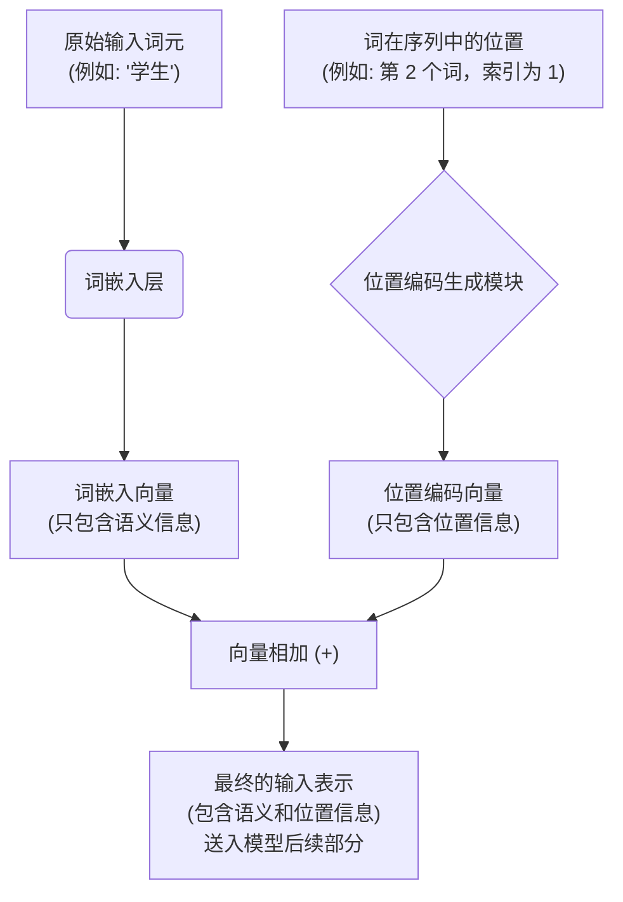
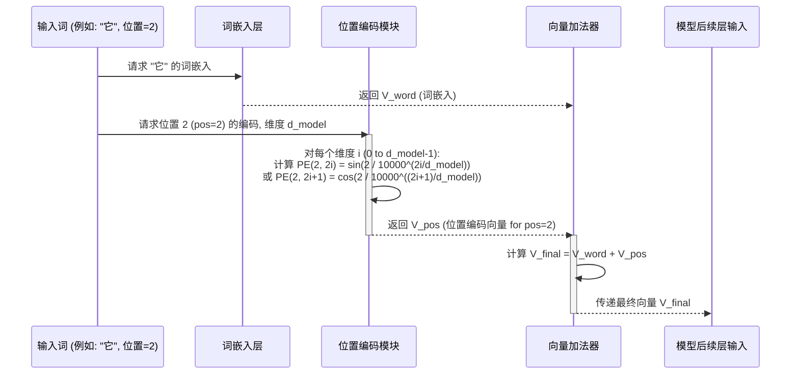

# Chapter 4: 位置编码


在上一章 [词嵌入与 Softmax 输出](03_词嵌入与_softmax_输出_.md) 中，我们学习了计算机如何通过词嵌入将词语转换成数字向量，以及如何通过 Softmax 函数决定输出哪个词。词嵌入捕捉了词语的“含义”，但它们本身并不包含词语在句子中顺序的信息。

然而，句子的顺序至关重要。思考一下这两个句子：
1.  “我 爱 你”
2.  “你 爱 我”

这两个句子用了完全相同的词，但顺序不同，意思也截然不同。如果模型无法区分词语的顺序，它就不能正确理解和生成有意义的文本。特别是 Transformer 模型的核心机制——自注意力机制（我们将在下一章学习），它在处理词语时是并行计算的，本身并不直接捕获序列的顺序。

那么，Transformer 是如何解决这个问题的呢？答案就是**位置编码 (Positional Encoding)**。

## 位置编码是什么？—— 给词语打上“位置标签”

想象一下，有一队士兵排队报数。即使他们后来随意站位，只要我们知道每个士兵原来的编号，就能还原他们最初的队列顺序。

**位置编码**就是给输入序列中的每个词嵌入向量添加一个额外的特定向量，这个向量代表了该词在序列中的位置。它就像给每个词的“语义向量”贴上了一个“位置标签”。

这个过程可以这样表示：

**最终输入向量 = 词嵌入向量 + 位置编码向量**

这个最终的、包含了位置信息的向量，才是真正送入 Transformer 后续结构（如编码器或解码器）进行处理的输入。



通过这种方式，即使两个相同的词出现在句子的不同位置（例如，“那只猫追逐另一只猫”中的两个“猫”），它们的最终输入表示也会因为位置编码的不同而有所区别，模型因此能够区分它们。

## 为什么不用简单的数字编号？

一个自然的想法是，为什么不直接用词在句子中的索引（比如0, 1, 2, 3...）作为位置信息呢？比如把索引值直接加到词嵌入上，或者拼接起来。

这种简单方法有几个问题：
1.  **数值范围不确定：** 句子的长度各不相同。如果句子很长，位置索引会变得很大。这些大的数值可能会不成比例地影响词嵌入本身的值，使得模型难以平衡语义信息和位置信息。
2.  **模型泛化能力差：** 如果模型在训练时只见过最大长度为50的句子，那么当它遇到长度为100的句子时，它可能不知道如何处理位置索引50之后的值。
3.  **难以表达相对位置：** 简单的索引值之间的差值是固定的（例如，位置5和位置6的差是1，位置50和位置51的差也是1）。但模型可能需要更灵活的方式来理解不同距离的相对位置关系。

因此，原版 Transformer 论文采用了一种更巧妙的方法：**使用正弦和余弦函数来生成位置编码**。

## 神奇的三角函数：正弦和余弦位置编码

Transformer 使用以下公式来计算位置编码向量 `PE`：

对于一个在序列中位置为 `pos`、在 `d_model` 维嵌入向量中维度索引为 `i` 的元素：

*   当 `i` 是偶数时 (例如 `2i`): `PE(pos, 2i) = sin(pos / 10000^(2i / d_model))`
*   当 `i` 是奇数时 (例如 `2i+1`): `PE(pos, 2i+1) = cos(pos / 10000^(2i / d_model))`

这里的参数：
*   `pos`: 词在输入序列中的位置（索引，从0开始）。
*   `d_model`: 词嵌入向量的维度（例如，在 Transformer 论文中是512）。
*   `i`: 位置编码向量中每个维度的索引（从0到 `d_model-1`）。公式中的 `2i` 和 `2i+1` 是为了交替使用 `sin` 和 `cos` 函数，并确保每个维度对 (`2i`, `2i+1`) 使用相同的频率。

**初看起来这个公式可能有点吓人，但别担心，它的核心思想很简单：**

1.  **为每个位置生成独一无二的向量：** 对于不同的 `pos` 值，这个公式会产生不同的位置编码向量。
2.  **维度间的波长变化：**
    *   对于位置编码向量的低维度（`i` 较小），`sin` 和 `cos` 函数的波长较短（变化较快）。
    *   对于高维度（`i` 较大），波长较长（变化较慢）。
    *   这意味着位置编码向量的每个维度都以不同的频率振荡。这种设计使得模型能够通过观察这些不同频率的组合来推断出词语的相对或绝对位置。
3.  **数值有界：** `sin` 和 `cos` 函数的值都落在 `[-1, 1]` 区间内。这确保了位置编码的值不会过大而主导词嵌入的值。
4.  **允许模型推断相对位置：** 一个重要的特性是，对于任意固定的偏移量 `k`，`PE(pos+k)` 可以表示为 `PE(pos)` 的线性函数。这意味着模型可以很容易地学习到词语之间的相对位置关系，而不仅仅是绝对位置。例如，模型可以学会“当前词后面第3个词通常是什么类型”这样的模式。
5.  **可扩展到未见过的长度：** 因为这是个确定性公式，即使模型训练时没见过某个长度的序列，它也能为这个新长度的序列生成位置编码。

**打个比方：**
想象你在制作一种独特的乐曲来代表每个位置。
*   `pos` 是乐谱上的小节号。
*   `d_model` 是你拥有的乐器数量。
*   对于每个小节（`pos`），每种乐器（维度 `i`）都会根据 `sin` 或 `cos` 函数以特定的音高（频率）演奏一个音符。
*   低音的乐器（`i` 较大，波长长）演奏变化缓慢的旋律，而高音的乐器（`i` 较小，波长短）演奏变化快速的旋律。
*   所有乐器合奏出来的和弦（即位置编码向量）对于每个小节都是独一无二的，并且相邻小节的和弦听起来既有联系又有区别。

## 位置编码如何与词嵌入结合？

如前所述，位置编码向量会直接加到对应的词嵌入向量上。

假设我们的词嵌入和位置编码都是4维的（实际中是 `d_model` 维，比如512维）。

```python
# 这是一个概念性的 Python 演示，帮助理解向量相加
import numpy as np # 导入 numpy 库方便进行向量运算

# 假设这是词 "你好" 的词嵌入向量 (4维)
word_embedding_nihao = np.array([0.2, 0.8, 0.1, 0.7])
# 假设这是词 "世界" 的词嵌入向量 (4维)
word_embedding_shijie = np.array([0.5, 0.3, 0.9, 0.2])

# 假设我们已经用上面的 sin/cos 公式计算好了位置编码
# "你好" 在序列中的位置是 0 (pos=0)
# 位置 0 的位置编码向量 (4维)
positional_encoding_pos0 = np.array([0.0, 1.0, 0.0, 0.5]) # 这些值是示意性的

# "世界" 在序列中的位置是 1 (pos=1)
# 位置 1 的位置编码向量 (4维)
positional_encoding_pos1 = np.array([0.84, 0.54, 0.1, 0.9]) # 这些值是示意性的

# 将词嵌入向量与对应的位置编码向量相加
final_input_nihao = word_embedding_nihao + positional_encoding_pos0
final_input_shijie = word_embedding_shijie + positional_encoding_pos1

print(f"词嵌入 ('你好'): {word_embedding_nihao}")
print(f"位置编码 (pos 0): {positional_encoding_pos0}")
print(f"“你好”的最终输入向量: {final_input_nihao}\n")

print(f"词嵌入 ('世界'): {word_embedding_shijie}")
print(f"位置编码 (pos 1): {positional_encoding_pos1}")
print(f"“世界”的最终输入向量: {final_input_shijie}")
```

**代码解释：**
*   我们为“你好”和“世界”分别定义了词嵌入向量。
*   我们也为它们在序列中的位置（0和1）定义了（示意性的）位置编码向量。在实际的 Transformer 模型中，这些位置编码向量会根据 `sin/cos` 公式精确计算出来。
*   然后，我们将词嵌入和它对应位置的位置编码向量逐元素相加，得到最终的输入向量。
*   这个最终的向量 `final_input_nihao` 和 `final_input_shijie` 就同时包含了词的语义信息和它们在句子中的位置信息，然后它们会被送入 Transformer 的编码器或解码器进行进一步处理。

## 位置编码的生成过程（内部视角）

让我们用一个序列图来描绘为一个词生成并添加位置编码的流程：



在这个图中：
1.  输入的词（例如“它”，假设在序列中是第3个词，所以 `pos=2`）首先通过**词嵌入层**获得其语义向量 `V_word`。
2.  同时，**位置编码模块**根据该词的位置 `pos=2` 和预设的嵌入维度 `d_model`，使用 `sin/cos` 公式计算出对应的位置编码向量 `V_pos`。
3.  然后，`V_word` 和 `V_pos` 被**向量加法器**简单地相加，得到最终的向量 `V_final`。
4.  这个 `V_final` 向量随后被送入 Transformer 模型的后续层（比如编码器的第一层自注意力模块）。

## 为什么是正弦和余弦函数？

你可能会问，为什么偏偏选择正弦和余弦函数，而不是其他函数呢？
主要原因在于它们的美妙数学特性：
1.  **相对位置的线性关系**：对于固定的偏移量 `k`，`PE(pos+k)` 可以通过一个线性变换从 `PE(pos)` 推导出来。这意味着，对于模型来说，学习“相隔 `k` 个位置的词之间的关系”变得相对容易。模型不需要为每个绝对位置都学习一套独立的规则，而是可以学习到更通用的相对位置模式。
2.  **周期性与独特性**：不同频率的正弦/余弦波组合可以为每个位置生成一个足够独特的编码，同时保持一定的平滑过渡。
3.  **有界性**：它们的值总是在 [-1, 1] 之间，这有助于稳定训练过程。
4.  **外推能力**：即使模型在训练时只见过特定长度的序列，这个公式也能自然地为更长的序列生成编码，而不需要额外的学习。

虽然听起来很数学，但你可以简单地理解为：这些函数提供了一种优雅的方式，用固定长度的向量来编码无限长的序列位置，并且使得模型能够容易地理解词语之间的相对顺序。

## 另一种选择：可学习的位置编码

值得一提的是，并非所有模型都使用这种固定的 `sin/cos` 位置编码。有些模型，如 BERT，采用的是**可学习的位置编码 (Learned Positional Embeddings)**。

这种方法类似于词嵌入：
1.  为每个可能的位置（比如从0到最大序列长度511）创建一个位置嵌入向量。
2.  这些位置嵌入向量也是随机初始化的，并在模型训练过程中像词嵌入一样被学习和调整。
3.  一个词的最终表示也是其词嵌入和其对应位置的可学习位置嵌入相加。

**优点：**
*   模型可以根据训练数据自动学习到最适合该任务的位置表示。

**缺点：**
*   通常需要预先设定一个最大序列长度，对于超过这个长度的序列，泛化能力可能不如 `sin/cos` 编码。
*   增加了模型的参数数量。

原始的 Transformer 论文发现，固定的 `sin/cos` 位置编码和可学习的位置编码在实验中表现相似。因此，`sin/cos` 因其无需学习参数且具有良好外推性的优点而被广泛采用。

## 总结与展望

在本章中，我们深入探讨了**位置编码**：

*   我们理解了为什么需要位置编码：因为像自注意力这样的机制本身不处理词语的顺序。
*   我们学习了 Transformer 中经典的**基于正弦和余弦函数的位置编码方法**，了解了它的计算公式和核心优点（独特性、相对位置表达、有界性、外推性）。
*   我们知道了位置编码向量是如何与词嵌入向量**相加**，形成模型真正的输入。
*   我们还简要了解了另一种方法：**可学习的位置编码**。

现在，我们的词语不仅有了“意义”（通过词嵌入），还有了“在句子中的位置”（通过位置编码）。它们被打包成了信息丰富的向量。下一步，这些向量将进入 Transformer 的核心部件。

准备好了吗？在下一章 [自注意力机制](05_自注意力机制_.md) 中，我们将揭开 Transformer 模型“注意力就是你所需要的一切”这句口号背后的第一个关键技术——自注意力机制。它将告诉我们，模型是如何在处理一个词时，“关注”到句子中其他相关词语的。

---

Generated by [AI Codebase Knowledge Builder](https://github.com/The-Pocket/Tutorial-Codebase-Knowledge)