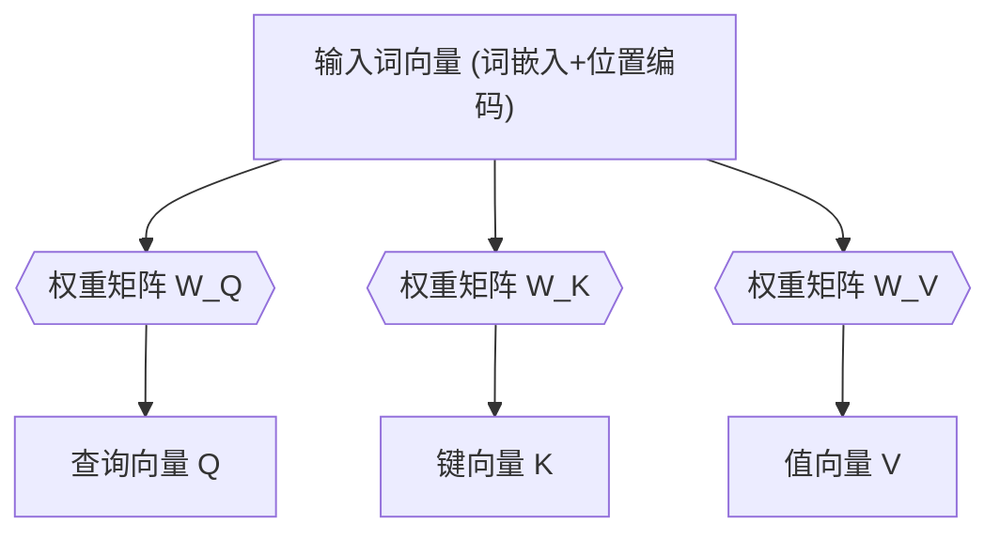
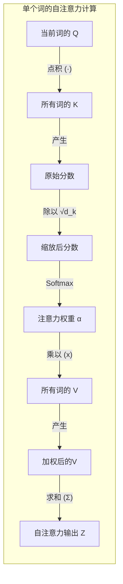
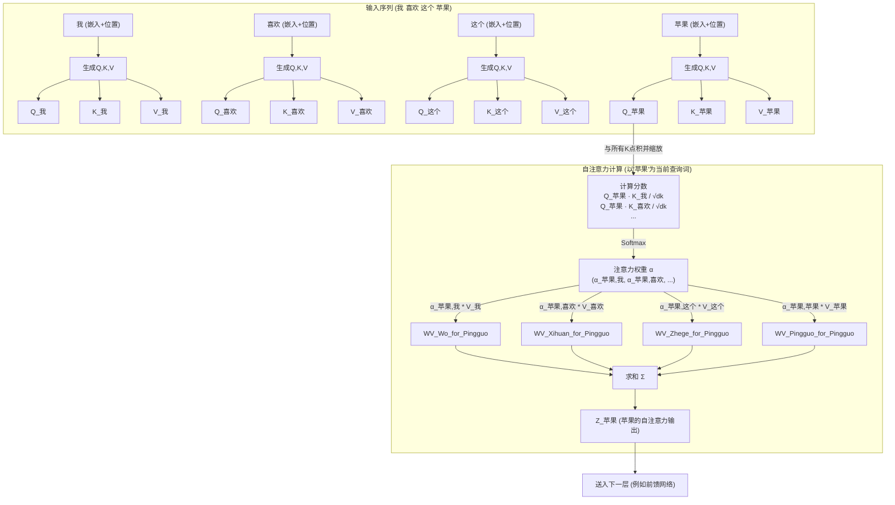
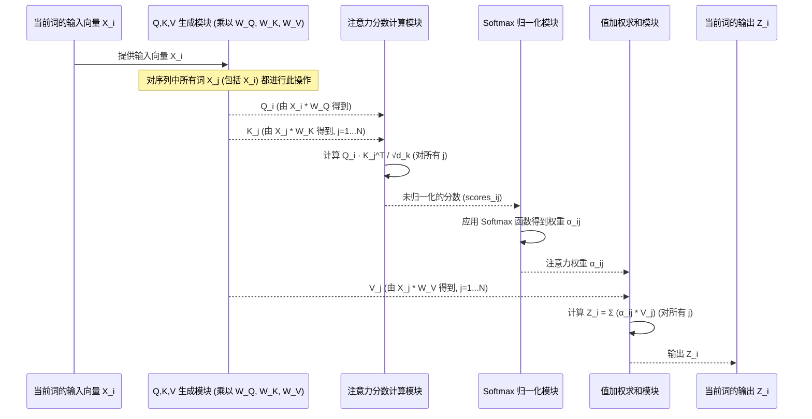

# Chapter 5: 自注意力机制


在上一章 [位置编码](04_位置编码_.md) 中，我们学习了 Transformer 如何通过给词嵌入添加位置信息，来理解句子中词语的顺序。现在，词语的向量表示既包含了它们的“语义”也包含了它们的“位置”。接下来，这些信息丰富的向量将进入 Transformer 模型真正的核心部件之一：**自注意力机制 (Self-Attention Mechanism)**。

你可能会问，我们为什么需要这个机制呢？

## 为什么需要自注意力？—— 理解上下文中的“弦外之音”

想象一下这句话：“那个小猫，它昨天在公园里追逐一只蝴蝶，玩得不亦乐乎，结果把晚餐都忘了，现在 **它** 饿坏了。”

当我们读到第二个“它”的时候，我们是如何知道这个“它”指的是“小猫”而不是“蝴蝶”或者“公园”呢？因为我们的大脑在处理“它”这个词时，会回顾前面出现过的词语，并判断哪个词和当前的“它”关系最密切。

传统的循环神经网络（RNN）试图通过按顺序处理词语来捕捉这种上下文依赖。但正如我们在 [Transformer 模型](01_transformer_模型_.md) 章节中提到的，RNN 在处理长距离依赖时可能会遇到困难，容易“忘记”前面很远的信息。

**自注意力机制**正是为了解决这个问题而设计的。它是 Transformer 的核心。它允许模型在处理序列中一个词时，能同时“关注”序列中所有其他的词，并根据它们与当前词的相关性赋予不同的“注意力权重”。就像你在阅读时，大脑会自动聚焦于对当前理解最关键的词语，而不是对所有词一视同仁。

通过自注意力，模型可以更有效地捕捉句子内部词语之间的复杂依赖关系，无论它们相隔多远。

## 自注意力机制的核心：查询、键和值

自注意力机制听起来可能有点抽象，但它的核心思想可以用一个大家熟悉的场景来类比：**在图书馆里查资料**。

假设你（代表当前正在处理的词）有一个研究课题（**查询 Query, Q**）。图书馆里有很多书（代表句子中的其他词），每本书的书脊上都贴着一些关键词（**键 Key, K**），书里面则有详细的内容（**值 Value, V**）。

你的查资料过程是这样的：
1.  你拿着你的研究课题 (Q)，去浏览书架上每本书的关键词 (K)。
2.  对于每一本书，你判断它的关键词 (K) 和你的研究课题 (Q) 有多相关。越相关的书，你越关注。
3.  最后，你根据相关性程度，把那些最相关的书的内容 (V) 整合起来，形成对你研究课题的答案。

自注意力机制做的事情非常相似。对于输入序列中的每一个词（更准确地说是这个词的输入向量，即词嵌入 + 位置编码），模型会为它生成三个特定的向量：
*   **查询向量 (Query Vector, Q)**：代表当前词，它要去“查询”其他词与自己的关系。
*   **键向量 (Key Vector, K)**：代表序列中所有词（包括当前词自己）的一个“标签”或“可被查询的特征”。
*   **值向量 (Value Vector, V)**：代表序列中所有词的实际“内容”或“信息”。

这些 Q, K, V 向量并不是凭空产生的，它们是通过将每个词的输入向量（词嵌入 + 位置编码）分别乘以三个不同的**权重矩阵**（`W_Q`, `W_K`, `W_V`）得到的。这些权重矩阵是模型在训练过程中学习到的参数，它们知道如何将原始输入转换成最适合进行注意力计算的 Q, K, V 表示。



重要的是，序列中的**每个词都会生成自己的一套 Q, K, V 向量**（或者更准确地说，每个词都会生成自己的 Q 向量，并用自己的输入向量生成 K 和 V 向量，以便与其他词的 Q 向量进行比较）。

## 自注意力计算的步骤

一旦我们为序列中的每个词都准备好了 Q, K, V 向量，自注意力机制的计算就可以分为以下几个步骤：

**假设我们正在计算序列中第 `i` 个词的自注意力输出。**

1.  **计算注意力分数 (Attention Scores)：**
    我们将第 `i` 个词的查询向量 `Q_i` 与序列中**所有**词（包括它自己）的键向量 `K_j` (其中 `j` 是序列中词的索引) 进行点积运算。
    `score_ij = Q_i · K_j`
    这个点积的结果 `score_ij` 反映了第 `i` 个词（查询方）和第 `j` 个词（被查询方）之间的相关性。点积越大，说明它们越相关。

2.  **缩放 (Scaling)：**
    为了防止点积结果过大导致梯度计算不稳定（尤其是在 Q, K 向量维度 `d_k` 较高时），我们会将上一步得到的分数除以 `√d_k` (键向量维度的平方根)。
    `scaled_score_ij = score_ij / √d_k`

3.  **应用 Softmax 函数：**
    将缩放后的分数输入到 [词嵌入与 Softmax 输出](03_词嵌入与_softmax_输出_.md) 章节中介绍过的 Softmax 函数中。Softmax 会将这些分数转换成一组总和为1的概率值，我们称之为**注意力权重 (attention weights)** `α_ij`。
    `α_ij = softmax(scaled_score_ij)`
    这个权重 `α_ij` 表示在计算第 `i` 个词的输出时，应该给予第 `j` 个词的“值”多大的关注度。

4.  **加权求和值向量 (Weighted Sum of Values)：**
    最后，用上一步得到的注意力权重 `α_ij` 去乘以序列中对应词（第 `j` 个词）的值向量 `V_j`。然后将所有这些加权后的值向量相加，就得到了第 `i` 个词的自注意力层输出 `Z_i`。
    `Z_i = Σ_j (α_ij * V_j)`

这个输出 `Z_i` 就是第 `i` 个词的新表示，它融合了整个输入序列中所有词的信息，并且根据相关性对这些信息进行了加权。它是一个“理解了上下文”的词向量。

这个完整的计算过程通常被称为**缩放点积注意力 (Scaled Dot-Product Attention)**，是 Transformer 论文 `Attention_Is_All_You_Need.pdf` 中描述的核心机制。



## 自注意力如何解决“它”指代不明的问题？

让我们回到之前的例子：“那个小猫，**它**昨天在公园里追逐一只蝴蝶...现在 **它** 饿坏了。”

当模型处理第二个“它”时：
1.  “它”会生成一个查询向量 `Q_it`。
2.  句子中的所有词（“小猫”，“它”，“昨天”...“饿坏了”）都会提供它们的键向量 `K_word` 和值向量 `V_word`。
3.  `Q_it` 会与所有 `K_word` 计算点积并进行缩放。
    *   `Q_it` 与 `K_小猫` 的点积可能会得到一个较高的分数，因为模型通过学习权重矩阵 `W_Q` 和 `W_K`，可能学会了让指代词和其指代对象之间产生高相似度。
    *   `Q_it` 与 `K_蝴蝶` 或 `K_公园` 的点积分数可能较低。
4.  通过 Softmax，与“小猫”对应键向量计算出的高分数会转换成一个较高的注意力权重 `α_it,小猫`。而“蝴蝶”、“公园”等词的注意力权重会较低。
5.  在最后计算加权和时，`V_小猫`（“小猫”的信息）会乘以一个较大的权重，而其他词的 `V` 向量乘以较小的权重。
6.  因此，第二个“它”的最终输出向量 `Z_it` 会更多地包含来自“小猫”的信息，从而帮助模型理解“它”指的就是“小猫”。

## 自注意力计算流程示意图

下面是一个更详细的示意图，展示了对输入序列中一个词（以“苹果”为例）计算其自注意力输出的过程：


**请注意：** 实际上，上述计算对输入序列中的**每一个词**都会并行地进行一次。例如，当“我”是当前查询词时，也会用 `Q_我` 与所有词的 `K` 计算注意力，得到 `Z_我`。

## 深入理解：一步步看自注意力内部运作

让我们用一个简化的序列图来梳理一下，当模型处理输入序列中的某个词 `X_i`（它已经是词嵌入+位置编码后的向量）时，自注意力机制内部发生了什么：



**解释:**
1.  **输入 (Input_Xi):** 序列中当前正在处理的词的向量表示 `X_i`。
2.  **Q, K, V 生成 (QKV_Gen):**
    *   `X_i` 分别与学习到的权重矩阵 `W_Q`, `W_K`, `W_V` 相乘，得到该词的查询向量 `Q_i`、键向量 `K_i` 和值向量 `V_i`。
    *   同样地，序列中的其他所有词 `X_j` 也会生成它们各自的 `K_j` 和 `V_j`（它们也会生成自己的 `Q_j`，用于它们作为查询方时的计算）。
3.  **分数计算 (Score_Calc):** 用 `Q_i` 与序列中所有词的 `K_j`（包括 `K_i` 自身）进行点积，然后除以 `√d_k` 进行缩放，得到原始的注意力分数。
4.  **Softmax 归一化 (Softmax_Norm):** 将这些原始分数通过 Softmax 函数转换为概率分布，即注意力权重 `α_ij`。这些权重表示 `Q_i` 对每个 `K_j` (即每个词 `X_j`) 的关注程度。
5.  **加权求和 (Weighted_Sum):** 将每个注意力权重 `α_ij` 乘以对应的 `V_j`（来自词 `X_j` 的值向量），然后将所有这些加权后的值向量相加，得到最终的输出 `Z_i`。

这个 `Z_i` 就是词 `X_i` 经过自注意力层“提炼”和“上下文感知”后的新表示。

## 概念性代码片段

为了更具体地理解这个计算过程，我们可以看一个非常简化的概念性 Python 代码片段，它模拟了缩放点积注意力的核心逻辑。

```python
import numpy as np # 导入 numpy 用于矩阵运算
import math

def scaled_dot_product_attention(query, key, value, d_k):
    """
    计算缩放点积注意力。
    query: 当前词的查询向量 Q (或者一批词的 Q 矩阵)
    key:   所有词的键向量 K (或者一批词的 K 矩阵)
    value: 所有词的值向量 V (或者一批词的 V 矩阵)
    d_k:   键向量的维度
    """
    # 1. 计算 Q 和 K 的转置的点积 (K.T 表示 K 的转置)
    #    scores 的形状通常是 (..., seq_len_q, seq_len_k)
    #    seq_len_q 是查询序列的长度 (通常是1，如果逐词处理，或 N 如果并行处理)
    #    seq_len_k 是键/值序列的长度 (即输入序列的长度)
    scores = np.matmul(query, key.T) # Q * K^T

    # 2. 缩放
    scaled_scores = scores / math.sqrt(d_k)

    # 3. 应用 Softmax (这里用一个简化的softmax)
    #    真实的 softmax 会在最后一个维度上操作
    exp_scores = np.exp(scaled_scores - np.max(scaled_scores, axis=-1, keepdims=True)) # 减去max为了数值稳定性
    attention_weights = exp_scores / np.sum(exp_scores, axis=-1, keepdims=True)

    # 4. 加权求和 V
    #    output 的形状通常是 (..., seq_len_q, d_v) d_v 是值向量的维度
    output = np.matmul(attention_weights, value)

    return output, attention_weights

# --- 概念性演示 ---
# 假设我们有3个词的输入，每个词的嵌入+位置编码是4维 (d_model=4)
# 并且假设 Q, K, V 向量的维度 d_q = d_k = d_v = 3 (为了简化)

# 假设这些是已经通过 W_Q, W_K, W_V 矩阵转换后的Q, K, V
# 假设我们正在计算第一个词的注意力输出 (所以 Q 来自第一个词)
q1 = np.array([[0.2, 0.5, 0.1]]) # 第一个词的 Q (1x3)

# 所有词的 K (3x3，每行是一个词的K)
k_all = np.array([
    [0.4, 0.1, 0.6], # 词1的K
    [0.8, 0.2, 0.3], # 词2的K
    [0.1, 0.7, 0.2]  # 词3的K
])

# 所有词的 V (3x3，每行是一个词的V)
v_all = np.array([
    [1.0, 2.0, 3.0], # 词1的V
    [4.0, 5.0, 6.0], # 词2的V
    [7.0, 8.0, 9.0]  # 词3的V
])

d_k_example = k_all.shape[-1] # K的维度，这里是3

# 计算第一个词的自注意力输出
output_z1, weights_for_q1 = scaled_dot_product_attention(q1, k_all, v_all, d_k_example)

print(f"Q (来自词1): {q1}")
print(f"K (所有词): \n{k_all}")
print(f"V (所有词): \n{v_all}")
print(f"注意力权重 (词1对所有词的关注度): {weights_for_q1}") # (1x3)
print(f"词1的自注意力输出 Z1: {output_z1}") # (1x3)
```
**代码解释：**
*   我们定义了一个 `scaled_dot_product_attention` 函数，它接受 `query`, `key`, `value` 和 `d_k`。
*   在演示部分，我们创建了示例的 `q1` (代表第一个词的查询向量)，以及 `k_all` 和 `v_all` (代表序列中所有词的键向量和值向量)。
*   函数内部，它执行了我们之前讨论的四个步骤：点积、缩放、Softmax 和加权求和。
*   输出 `output_z1` 就是第一个词经过自注意力机制处理后的新向量表示。`weights_for_q1` 显示了第一个词在计算其输出时，对序列中每个词（包括它自己）所分配的注意力权重。

**重要提示：** 在实际的 Transformer 实现中，Q, K, V 的生成和注意力计算通常是针对整个序列（或一批序列）并行完成的，使用矩阵运算以提高效率，而不是像上面演示中那样一次只处理一个查询词。但其核心数学原理是一致的。

## 为什么叫“自”注意力？

这个机制被称为“自”注意力，是因为查询 (Q)、键 (K) 和值 (V) 都来源于**同一个输入序列**。序列中的元素在关注它们自己序列中的其他元素，以更新自身的表示。
*   在编码器中，自注意力层处理的是输入的源语言序列。
*   在解码器中，自注意力层处理的是已经生成的目标语言序列部分。

这与我们后续可能会接触到的“交叉注意力”（Cross-Attention）有所不同。在交叉注意力中（例如解码器关注编码器输出时），查询向量 Q 来自一个序列（如解码器），而键 K 和值 V 向量来自另一个序列（如编码器的输出）。但目前，我们关注的是序列内部的“自我审视”。

## 自注意力的优势

相较于传统的序列处理方法（如 RNN），自注意力机制有几个显著的优势：
1.  **高效捕捉长距离依赖：** 任何两个位置之间的依赖关系计算都只需要一次矩阵乘法操作，路径长度是 O(1)，而 RNN 需要 O(N) 步（N是序列长度）。这使得模型更容易学习到远距离词语间的关联。
2.  **并行计算能力强：** 对于序列中的所有词，它们的自注意力输出可以并行计算，不像 RNN 那样需要按顺序进行。这大大提高了训练和推理的效率，尤其是在现代 GPU 上。
3.  **可解释性：** 通过观察注意力权重，我们可以一定程度上理解模型在做决策时，认为哪些词对当前词的理解更重要。

## 总结与展望

在本章中，我们深入探索了 Transformer 的核心部件——**自注意力机制**：
*   我们理解了自注意力的动机：让模型在处理一个词时，能够同时考虑句子中其他所有词，并根据相关性赋予不同权重，从而更好地理解上下文。
*   我们学习了自注意力的核心概念：**查询 (Q)**、**键 (K)** 和 **值 (V)** 向量，以及它们是如何通过输入向量和权重矩阵产生的。
*   我们分解了自注意力计算的四个关键步骤：**计算分数**、**缩放**、**Softmax** 和 **加权求和**，这个过程被称为缩放点积注意力。
*   我们通过例子和代码片段，直观地感受了自注意力是如何工作的，以及它为何能帮助模型解决指代消解等上下文理解问题。
*   我们了解了其“自”的含义以及它相比传统方法的优势。

自注意力机制无疑是非常强大的。但是，只用一组 Q, K, V 权重矩阵来计算注意力，可能就像只用一种方式去理解词语间的关系。如果我们希望模型能够从多个不同的“角度”或“子空间”去审视词语间的关系呢？例如，一个词可能在语法上与另一个词相关，在语义上又与第三个词相关。

这就是下一章 [多头注意力](06_多头注意力_.md) 要解决的问题。它将自注意力机制进行了扩展，让模型能够同时关注来自不同表示子空间的信息，从而捕捉到更丰富、更细致的依赖关系。准备好进入更精彩的注意力世界吧！

---

Generated by [AI Codebase Knowledge Builder](https://github.com/The-Pocket/Tutorial-Codebase-Knowledge)