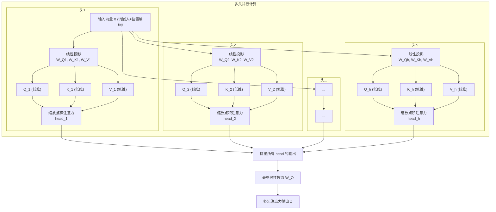

# Chapter 6: 多头注意力


欢迎来到 `Attention_Is_All_You_Need` 教程的第六章！在上一章 [自注意力机制](05_自注意力机制_.md) 中，我们学习了模型如何通过计算查询（Q）、键（K）和值（V）来“关注”输入序列中的相关部分。自注意力机制非常强大，它让模型能够捕捉词语之间的依赖关系，无论它们相隔多远。

但是，如果把句子比作一幅复杂的画，单一的自注意力机制可能就像只用一种颜色或一种笔触去描绘它。虽然能抓住主要特征，但可能会忽略一些细节和不同层面的信息。我们能不能让模型拥有“多双眼睛”，从不同的角度同时审视这幅画呢？

这就是**多头注意力 (Multi-Head Attention)** 机制要解决的问题。

## 为什么需要“多头”？—— 从不同视角理解信息

想象一下，你正在阅读一篇新闻报道。为了全面理解这篇报道，你可能会关注：
*   **事件的关键人物和他们的行为** (例如，“谁对谁做了什么？”)
*   **事件发生的时间和地点**
*   **事件的原因和可能的影响**
*   **作者的语气和潜在的偏向**

如果你只有一个“注意力焦点”，你可能一次只能关注其中一个方面。但如果你能同时从多个角度去分析，你对报道的理解就会更深刻、更全面。

多头注意力机制就是赋予模型这种“多视角”分析能力。它并非让模型进行一次单一的注意力计算，而是像组建了一个**专家小组**：
*   小组里有多位“专家”（称为“头”）。
*   每位专家都独立地对输入信息进行一次自注意力计算，但每位专家关注的“子空间”或“方面”可能不同。
*   最后，模型将所有专家的“意见”（即各个头的输出）整合起来，形成一个更丰富、更全面的信息表示。

正如概念描述中所说：“它并非单一视角，而是让模型同时从多个不同的表示子空间（“头”）学习信息，并将这些信息整合起来。如同一个专家小组，每位专家从不同角度分析问题，最终综合各方意见得出更全面的结论。”

## 多头注意力的核心构成

多头注意力机制主要包含以下几个关键步骤：

1.  **拆分与投影 (Splitting & Projecting)**：
    *   原始的输入词向量（词嵌入 + [位置编码](04_位置编码_.md)）首先会被分别投影到多个较低维度的子空间中。
    *   对于每一个“头”，我们都会有一组独立的、可学习的权重矩阵 `W_Q_i`, `W_K_i`, `W_V_i`（这里的 `i` 代表第 `i` 个头）。
    *   原始的 Q, K, V 会通过这些特定于每个头的权重矩阵，分别生成每个头自己的 `Q_i`, `K_i`, `V_i`。通常，这些投影后的 `Q_i`, `K_i`, `V_i` 的维度会是原始维度的 `1/h`（`h` 是头的数量）。例如，如果原始 `d_model` 是512，有8个头，那么每个头的 `Q_i, K_i, V_i` 维度就是64。

2.  **并行计算注意力 (Parallel Attention Calculation)**：
    *   每一个“头”都独立地执行一次我们上一章学到的 [自注意力机制](05_自注意力机制_.md) 中的“缩放点积注意力”计算。
    *   `head_i = Attention(Q_i, K_i, V_i) = softmax( (Q_i * K_i^T) / sqrt(d_k_head) ) * V_i`
    *   由于每个头有自己独立的权重，它们可以学习关注输入序列中不同的模式和关系。

3.  **拼接 (Concatenation)**：
    *   所有并行计算得到的注意力输出 `head_1, head_2, ..., head_h` 会被拼接在一起。
    *   如果每个头的输出维度是 `d_v_head` (通常等于 `d_k_head`)，那么拼接后的向量维度将是 `h * d_v_head`。如果 `d_v_head = d_model / h`，那么拼接后的维度又恢复到了原始的 `d_model`。

4.  **最终线性投影 (Final Linear Projection)**：
    *   拼接后的向量会再通过一个额外的线性投影层（权重矩阵为 `W_O`，也是可学习的），得到多头注意力机制的最终输出。
    *   这个最终投影层允许模型将来自不同头的信息进行整合和混合，并可能将维度调整回期望的输出维度（通常是 `d_model`）。

## 多头注意力的工作流程图示

下面是一个示意图，展示了多头注意力的完整计算流程：



**解释这个图：**
1.  **输入 (InputVec `X`)**：这是经过词嵌入和位置编码后的输入序列中某个词的向量表示。
2.  **线性投影 (Proj1, Proj2, ..., Projh)**：输入 `X` 被分别送入 `h` 组不同的线性层（由 `W_Q_i, W_K_i, W_V_i` 定义），为每个头生成一组低维度的 `Q_i, K_i, V_i`。
3.  **并行注意力计算 (Att1, Att2, ..., Atth)**：每个头 `i` 利用它自己的 `Q_i, K_i, V_i` 独立地执行缩放点积注意力计算，得到输出 `head_i`。
4.  **拼接 (Concat)**：所有头的输出 `head_1, ..., head_h` 在维度上被连接起来。
5.  **最终线性投影 (FinalProj)**：拼接后的向量通过一个最终的线性层（由 `W_O` 定义）得到多头注意力层的最终输出 `Z`。

这个输出 `Z` 相对于单头注意力来说，通常包含了从多个不同表示子空间学习到的更丰富的信息。

## 一个多头注意力的例子：理解“它”的不同侧面

让我们再次回到那个句子：“那个小猫，**它**昨天在公园里追逐一只蝴蝶，玩得不亦乐乎，结果把晚餐都忘了，现在 **它** 饿坏了。”

当模型处理第二个“它”时，多头注意力机制可能这样工作：
*   **头1 (指代关系专家)**：可能专注于找到“它”最直接的指代对象。它的 `W_Q1, W_K1` 经过学习后，使得 `Q_它` 和 `K_小猫` 之间的相似度非常高。所以 `head_1` 的输出会强烈地反映“小猫”的信息。
*   **头2 (动作-状态专家)**：可能关注“它”正在经历的状态或执行的动作。它的权重可能使得“它”与“饿坏了”以及上下文中的“玩得不亦乐乎”之间产生高注意力分数。`head_2` 的输出可能侧重于“它”的状态和行为。
*   **头3 (位置/时间关系专家)**：可能关注与“它”相关的地点或时间信息，比如“公园里”、“昨天”。`head_3` 的输出可能包含这些上下文信息。
*   **其他头...** 可能关注其他更细微的语法或语义联系。

最后，当这些不同“专家头”的输出 `head_1, head_2, head_3, ...` 被拼接并通过 `W_O` 投影后，生成的最终向量 `Z_它` 就会是一个融合了多个方面信息的、对“它”的更全面的理解。模型就能知道这个“它”既指“小猫”，也处于“饿坏了”的状态，并且这个状态与之前在“公园里”的活动有关。

## 概念性代码演示

为了更具体地理解，我们可以看一个简化的多头注意力伪代码。假设我们已经有一个 `scaled_dot_product_attention` 函数（如上一章所述）。

```python
import numpy as np # 导入 numpy 用于矩阵运算
import math

# 假设这是上一章定义的缩放点积注意力函数
def scaled_dot_product_attention(query, key, value, d_k_head):
    """计算单个注意力头的输出。"""
    # query, key, value 已经是特定于这个头的低维投影
    # d_k_head 是每个头的键向量维度
    scores = np.matmul(query, key.T) / math.sqrt(d_k_head)
    # 为了数值稳定性，通常在求exp前减去最大值
    exp_scores = np.exp(scores - np.max(scores, axis=-1, keepdims=True))
    attention_weights = exp_scores / np.sum(exp_scores, axis=-1, keepdims=True) # Softmax
    output = np.matmul(attention_weights, value)
    return output

# --- 多头注意力概念演示 ---
# 假设输入序列有两个词，每个词的 d_model (模型维度) = 4
# x_input 形状: (sequence_length=2, d_model=4)
x_input = np.array([[1, 2, 3, 4], [5, 6, 7, 8]])

num_heads = 2 # 我们使用2个注意力头
d_model = 4
d_k_head = d_model // num_heads # 每个头的 Q, K 向量维度 = 4 // 2 = 2
d_v_head = d_model // num_heads # 每个头的 V 向量维度 = 4 // 2 = 2

# 1. 为每个头初始化独立的权重矩阵 (W_Q, W_K, W_V) 和最终的 W_O
#    在真实模型中，这些是通过反向传播学习的。这里我们用随机数模拟。
#    注意：实际实现中，通常用一个大的权重矩阵然后切分或重塑，更高效。
WQ_matrices = [np.random.rand(d_model, d_k_head) for _ in range(num_heads)] # 列表，每个元素是 (4,2)
WK_matrices = [np.random.rand(d_model, d_k_head) for _ in range(num_heads)] # (4,2)
WV_matrices = [np.random.rand(d_model, d_v_head) for _ in range(num_heads)] # (4,2)
WO_matrix = np.random.rand(num_heads * d_v_head, d_model) # (2*2, 4) -> (4,4)

head_outputs = []
# 2. 对每个头并行计算
for i in range(num_heads):
    # 2a. 线性投影得到每个头的 Q, K, V
    Q_i = np.matmul(x_input, WQ_matrices[i]) # (2,4) x (4,2) -> (2,2)
    K_i = np.matmul(x_input, WK_matrices[i]) # (2,4) x (4,2) -> (2,2)
    V_i = np.matmul(x_input, WV_matrices[i]) # (2,4) x (4,2) -> (2,2)

    # 2b. 计算该头的注意力输出
    head_i_output = scaled_dot_product_attention(Q_i, K_i, V_i, d_k_head) # (2,2)
    head_outputs.append(head_i_output)

# 3. 拼接所有头的输出
#    np.concatenate 会沿着最后一个轴 (axis=-1) 拼接
concatenated_heads = np.concatenate(head_outputs, axis=-1) # (2, 2*2) -> (2,4)

# 4. 最终线性投影
multi_head_output = np.matmul(concatenated_heads, WO_matrix) # (2,4) x (4,4) -> (2,4)

print(f"输入 x_input (形状: {x_input.shape}):\n{x_input}")
print(f"头1的Q (形状: {np.matmul(x_input, WQ_matrices[0]).shape})") # 仅为演示形状
# ... 可以打印更多中间结果 ...
print(f"拼接后的输出 (形状: {concatenated_heads.shape}):\n{concatenated_heads}")
print(f"最终多头注意力输出 (形状: {multi_head_output.shape}):\n{multi_head_output}")
```

**代码解释：**
*   我们首先定义了输入 `x_input`，以及超参数 `num_heads`（头的数量）、`d_model`（模型的总维度）。
*   然后我们计算出每个头处理的向量维度 `d_k_head` 和 `d_v_head`。
*   接着，我们为每个头（`num_heads`个）创建了独立的（概念上的）权重矩阵 `WQ_matrices[i]`, `WK_matrices[i]`, `WV_matrices[i]`，以及一个用于最后整合的 `WO_matrix`。
*   在循环中，对每个头：
    *   输入 `x_input` 通过对应头的权重矩阵进行线性变换，得到该头的 `Q_i, K_i, V_i`。
    *   调用 `scaled_dot_product_attention` 函数计算该头的输出 `head_i_output`。
*   所有头的输出被收集到 `head_outputs` 列表中。
*   使用 `np.concatenate` 将所有 `head_i_output` 拼接起来。
*   最后，拼接后的结果通过 `WO_matrix` 进行最终的线性变换，得到 `multi_head_output`。

这个 `multi_head_output` 的维度与原始输入 `x_input` 的 `d_model` 维度相同，但它现在包含了从多个不同“视角”学习到的上下文信息。

在论文 "Attention Is All You Need" 中，作者为 Transformer 模型基础版本设置了 `h=8` 个注意力头。由于模型的 `d_model=512`，所以每个头处理的 `Q, K, V` 向量的维度是 `d_k = d_v = d_model / h = 512 / 8 = 64`。每个头输出一个64维的向量，8个头的输出拼接起来形成一个512维的向量，然后这个512维的向量再通过一个最终的线性层 `W_O`（输出也是512维）得到多头注意力的最终结果。

## 为什么多头注意力有效？

1.  **扩展了模型关注不同位置信息的能力**：不同的头可以学习关注输入的不同部分。例如，一个头可能专注于长距离依赖，另一个头可能专注于局部依赖。
2.  **提供了多个“表示子空间”**：由于每个头都有不同的权重矩阵，它们可以将输入信息投影到不同的表示子空间。这使得模型可以从不同的角度学习信息的不同方面。就像一个物体在三维空间中有长度、宽度和高度三个投影，多头注意力也允许模型从多个“特征维度”去理解输入。
3.  **增强了模型的表达能力**：综合多个头的输出通常比单个头的输出包含更丰富的信息，从而提高了模型的整体性能。

可以把多头注意力看作是对自注意力机制的一种“集成学习”（ensemble learning）的思路。多个相对简单的注意力机制（每个头）并行工作，然后它们的结果被有效地结合起来，产生比任何单个机制都更强大的效果。

## 总结与展望

在本章中，我们深入了解了**多头注意力机制**：
*   它通过并行运行多个独立的自注意力“头”来工作。
*   每个头使用自己独立的、学习到的权重矩阵将输入投影到不同的子空间，并独立计算注意力。
*   所有头的输出被拼接起来，并通过一个最终的线性层进行整合。
*   这种机制使得模型能够同时从多个不同的表示子空间（“专家视角”）学习信息，从而捕捉到更丰富、更细致的上下文依赖关系。

我们现在已经学习了 Transformer 中至关重要的注意力机制的两种形式：[自注意力机制](05_自注意力机制_.md) 和本章的多头注意力。这些机制使得模型能够智能地“关注”输入序列的相关部分。

然而，在 Transformer 的编码器和解码器的每一层中，除了注意力模块之外，通常还有一个重要的组件，它对注意力模块的输出进行进一步的处理和转换。这个组件就是**按位置前馈网络 (Position-wise Feed-Forward Network)**。

在下一章 [按位置前馈网络](07_按位置前馈网络_.md) 中，我们将探讨这个组件的作用和结构。

---

Generated by [AI Codebase Knowledge Builder](https://github.com/The-Pocket/Tutorial-Codebase-Knowledge)