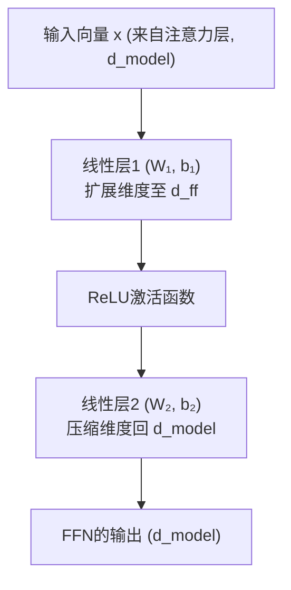
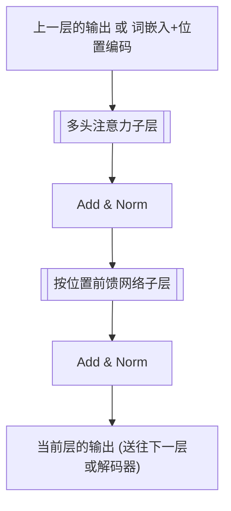
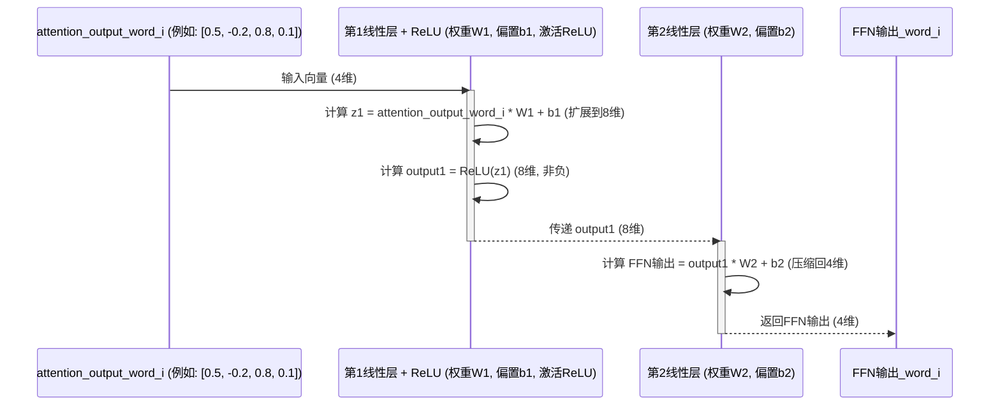

# Chapter 7: 按位置前馈网络


欢迎来到 `Attention_Is_All_You_Need` 教程的第七章！在上一章 [多头注意力](06_多头注意力_.md) 中，我们学习了模型如何通过多个“注意力头”从不同角度捕捉输入序列中词语之间的复杂关系。多头注意力机制的输出是一个包含了丰富上下文信息的向量序列，其中每个向量对应输入序列中的一个词。

现在，对于序列中的每一个词的表示（这个表示已经融合了上下文信息），我们是否可以对它进行一次独立的“深度加工”，以提取更复杂的特征呢？这就引出了我们本章的主角——**按位置前馈网络 (Position-wise Feed-Forward Network, FFN)**。

## 按位置前馈网络是什么？—— 给每个词一次“独立深加工”的机会

想象一下，在一个高效的团队（Transformer的编码器/解码器层）中，团队成员们（词的表示）刚刚开完一个富有成效的讨论会（[多头注意力](06_多头注意力_.md)），在会上大家充分交流了信息，对彼此有了更深的理解。会议结束后，每位成员都需要回到自己的工位，根据会议上获得的信息，独立地对自己的那部分工作进行进一步的思考、整理和深化。

**按位置前馈网络 (FFN)** 就扮演着这个“独立深加工”的角色。它是编码器和解码器中每一层都包含的一个全连接前馈网络。它的核心特点是：

1.  **按位置 (Position-wise)**：这个网络**独立地**应用于序列中的**每一个位置**（即每一个词的向量表示）。这意味着，对于句子 "我 爱 你"，FFN 会分别对 "我"、"爱"、"你" 的向量进行处理，而且处理 "我" 的时候，与处理 "爱" 和 "你" 的过程是相互独立的。
2.  **相同网络，不同输入 (Identical Network, Different Inputs)**：虽然 FFN 对每个位置的词都是独立应用的，但对于同一层内的所有位置，它们共享**完全相同**的 FFN（即相同的权重参数）。就好比团队中每位成员都使用同一套标准的思考工具和方法（FFN的结构和权重）来深化自己的工作，但他们处理的具体内容（词向量）是不同的。
3.  **进一步转换 (Further Transformation)**：它的主要作用是对注意力子层（例如多头注意力）的输出进行一次非线性变换，目的是提取更深层次的特征，或者说让模型学习到更复杂的函数映射。

简单来说，在多头注意力机制关注了“哪些词是相关的”之后，按位置前馈网络则对每个词自身的信息进行一次更深入的、非线性的“提炼”和“加工”。

## 按位置前馈网络的结构

一个典型的按位置前馈网络非常简洁，通常由两个线性变换（全连接层）和一个非线性激活函数（通常是 ReLU）组成：

**FFN(x) = max(0, xW₁ + b₁)W₂ + b₂**

其中：
*   `x` 是输入，即来自上一层（比如多头注意力子层）的某个特定位置的输出向量。它的维度通常是 `d_model`（例如512）。
*   `W₁` 和 `b₁` 是第一个线性变换的权重矩阵和偏置项。这个线性层通常会将输入从 `d_model` 维度扩展到一个更大的中间维度 `d_ff`（例如 `d_ff = 2048`）。
*   `ReLU` (Rectified Linear Unit) 是激活函数，计算公式是 `max(0, z)`。它引入非线性，使得网络能够学习更复杂的模式。
*   `W₂` 和 `b₂` 是第二个线性变换的权重矩阵和偏置项。这个线性层通常会将维度从 `d_ff` 压缩回原始的 `d_model` 维度。

我们可以用一个简单的图来表示这个结构：



这个FFN结构会独立地应用于输入序列中的每一个词向量。

**打个比方：**
假设多头注意力层输出了一组“半成品”零件（每个词的向量表示）。按位置前馈网络就像是一台精密的加工机器：
1.  零件 `x` 进入机器。
2.  第一道工序（`xW₁ + b₁`）将其打磨并延展，使其暴露出更多可加工的细节（扩展到 `d_ff` 维度）。
3.  一道特殊的处理（`ReLU`）确保只有积极的特征被保留。
4.  第二道工序（`output₁W₂ + b₂`）将其重新塑形，变回标准尺寸，但内部结构已经得到了优化（压缩回 `d_model` 维度）。

重要的是，序列中的每一个“半成品”零件都会经过这台**完全相同**的机器进行加工。

## 按位置前馈网络在编码器/解码器层中的位置

在 Transformer 的编码器和解码器的每一层中，通常包含两个主要的子层：
1.  多头注意力机制 ([多头注意力](06_多头注意力_.md))
2.  按位置前馈网络 (FFN)

这两个子层的周围通常还会有残差连接 (Residual Connection) 和层归一化 (Layer Normalization)。我们暂时不深入这两个辅助组件，但知道它们的存在有助于稳定训练和提升性能。

一个简化版的编码器层结构如下：


解码器层也类似，只是它的多头注意力部分会更复杂一些（包含对编码器输出的注意力）。

## 按位置前馈网络的运作流程 (以单个位置为例)

让我们看看当一个词的向量表示（假设是 `attention_output_word_i`）进入FFN时，内部发生了什么。假设 `d_model = 4`，`d_ff = 8`（为了简化）。



**解释：**
1.  来自注意力子层的某个词的输出向量 `attention_output_word_i` 作为FFN的输入。
2.  它首先通过第一个线性层（`W1`, `b1`），其维度通常会从 `d_model` 扩展到 `d_ff`。
3.  扩展后的结果通过 `ReLU` 激活函数，引入非线性。
4.  然后，这个结果再通过第二个线性层（`W2`, `b2`），将维度从 `d_ff` 压缩回 `d_model`。
5.  最终得到该词经过FFN处理后的新向量表示 `FFN_Output_word_i`。

对于输入序列中的每一个词向量，都会独立地重复这个过程，但使用的是**同一套** `W1, b1, W2, b2` 参数。

## 概念性代码演示

让我们用 Python 来模拟一个简单的按位置前馈网络，并看看它是如何独立应用于序列中每个位置的。

```python
import numpy as np # 导入 numpy 用于矩阵运算

# 定义ReLU激活函数
def relu(x):
    return np.maximum(0, x)

# 定义一个简单的按位置前馈网络类
class PositionWiseFeedForward:
    def __init__(self, d_model, d_ff):
        # d_model: 输入和输出的维度
        # d_ff: 中间层的维度 (隐藏层维度)
        # 实际中，这些权重是模型训练得到的，这里我们随机初始化
        self.w1 = np.random.rand(d_model, d_ff) # 权重矩阵 W1
        self.b1 = np.random.rand(d_ff)          # 偏置项 b1
        self.w2 = np.random.rand(d_ff, d_model) # 权重矩阵 W2
        self.b2 = np.random.rand(d_model)       # 偏置项 b2

    def forward(self, x_position):
        # x_position 是单个位置的输入向量 (d_model 维)
        # 第一个线性变换 + ReLU
        output_linear1 = np.dot(x_position, self.w1) + self.b1
        output_relu = relu(output_linear1)
        # 第二个线性变换
        output_ffn = np.dot(output_relu, self.w2) + self.b2
        return output_ffn

# --- 演示 ---
d_model_example = 4  # 模型维度 (例如，词向量维度)
d_ff_example = 8     # FFN中间层维度

# 创建一个FFN实例 (所有位置共享这一个实例)
ffn_layer = PositionWiseFeedForward(d_model_example, d_ff_example)

# 假设我们有一个序列，包含3个词的向量表示 (来自多头注意力层)
# 每个词向量是 d_model_example 维
sequence_vectors = np.array([
    [0.1, 0.2, 0.3, 0.4], # 词1的向量
    [0.5, 0.6, 0.7, 0.8], # 词2的向量
    [0.9, 1.0, 1.1, 1.2]  # 词3的向量
])
print(f"输入序列 (形状: {sequence_vectors.shape}):\n{sequence_vectors}\n")

output_sequence = []
# 独立地将FFN应用于序列中的每个位置
for i in range(sequence_vectors.shape[0]): # 遍历序列中的每个词向量
    word_vector = sequence_vectors[i, :]
    print(f"处理词 {i+1} 的向量: {word_vector}")
    
    ffn_output_for_word = ffn_layer.forward(word_vector)
    print(f"  词 {i+1} 经过FFN后的输出: {ffn_output_for_word}\n")
    output_sequence.append(ffn_output_for_word)

# 将结果转换回numpy数组
final_output_sequence = np.array(output_sequence)
print(f"整个序列经过FFN后的输出 (形状: {final_output_sequence.shape}):\n{final_output_sequence}")
```

**代码解释：**
*   `PositionWiseFeedForward` 类模拟了一个FFN层。在 `__init__` 中，我们初始化了权重 `w1`, `b1`, `w2`, `b2`（在真实模型中，这些是通过训练学习得到的）。`d_model` 是输入输出维度，`d_ff` 是中间层的维度。
*   `forward` 方法接收单个位置的输入向量 `x_position`，并执行两个线性变换和一次ReLU激活。
*   在演示部分，我们创建了一个 `ffn_layer` 实例。
*   `sequence_vectors` 代表一个包含3个词向量的序列，每个向量有4个维度 (`d_model_example = 4`)。
*   我们**循环遍历** `sequence_vectors` 中的每一个词向量。
*   对于每一个词向量，我们都调用**同一个** `ffn_layer.forward()` 方法进行处理。
*   最后，`final_output_sequence` 包含了序列中每个词经过FFN独立处理后的新向量。注意其维度仍然是 (`序列长度`, `d_model`)。

这个例子清晰地展示了FFN的“按位置”特性：网络本身（`ffn_layer` 及其权重）是固定的，但它被独立地应用于输入序列的每一个元素上。

## 为什么需要按位置前馈网络？

你可能会问，既然多头注意力已经很好地融合了上下文信息，为什么还需要一个FFN呢？
1.  **增加非线性**：注意力机制本身（尤其是缩放点积注意力）主要是线性的（Softmax是非线性的，但主要作用是归一化权重）。FFN中的ReLU激活函数为模型引入了更多的非线性，这使得模型能够学习输入和输出之间更复杂、更微妙的关系。没有非线性，深层网络的能力会大大受限。
2.  **维度变换与特征提取**：通过先扩展到 `d_ff` 再压缩回 `d_model`，FFN可以被看作是在一个更高维的空间中对特征进行操作和组合，然后再将这些学到的特征投影回原始维度。这可以帮助模型提取出注意力层可能没有完全捕捉到的更深层次的特征。
3.  **独立的逐位置处理**：在注意力机制全局地考虑了词间关系之后，FFN为每个词提供了一个独立“反刍”和“精炼”自身信息的机会。这种逐个处理的方式允许模型对每个词的表示进行细化，而不受其他词当前状态的直接干扰（除了通过注意力层间接传入的信息）。

在 "Attention Is All You Need" 论文 (Attention_Is_All_You_Need.pdf) 中，`d_model` 通常是 512，而FFN的内部维度 `d_ff` 通常是 2048。这种先扩展再压缩的结构是神经网络中常见的模式。

## 总结与展望

在本章中，我们学习了 Transformer 模型中编码器和解码器层内部的另一个关键组件——**按位置前馈网络 (FFN)**：

*   它是一个简单的全连接前馈网络，通常由两个线性层和一个ReLU激活函数组成。
*   它**独立地**应用于输入序列中的**每一个位置**（词向量）。
*   序列中的所有位置共享**相同**的FFN权重。
*   它的主要作用是在多头注意力之后，对每个词的表示进行进一步的非线性变换和特征提取。
*   它通过引入非线性和进行维度变换，增强了模型的表达能力。

到目前为止，我们已经详细探讨了构成 Transformer 编码器和解码器核心层的主要组件：
1.  [词嵌入与 Softmax 输出](03_词嵌入与_softmax_输出_.md) (数据的起点和终点)
2.  [位置编码](04_位置编码_.md) (赋予词语顺序感)
3.  [自注意力机制](05_自注意力机制_.md) (让词语关注彼此)
4.  [多头注意力](06_多头注意力_.md) (从多角度关注)
5.  以及本章的**按位置前馈网络** (对每个词进行深度加工)

这些组件（通常还伴随着残差连接和层归一化）共同构成了 Transformer 模型中编码器和解码器的基本构建模块——“层”。通过将这些层堆叠起来（例如，论文中默认堆叠6层编码器层和6层解码器层），Transformer 能够处理复杂的序列到序列任务，并在自然语言处理领域取得了革命性的成功。

我们已经对 Transformer 的核心架构和关键技术有了相当全面的理解。希望这个系列教程能帮助你更好地认识这个强大的模型！

---

Generated by [AI Codebase Knowledge Builder](https://github.com/The-Pocket/Tutorial-Codebase-Knowledge)