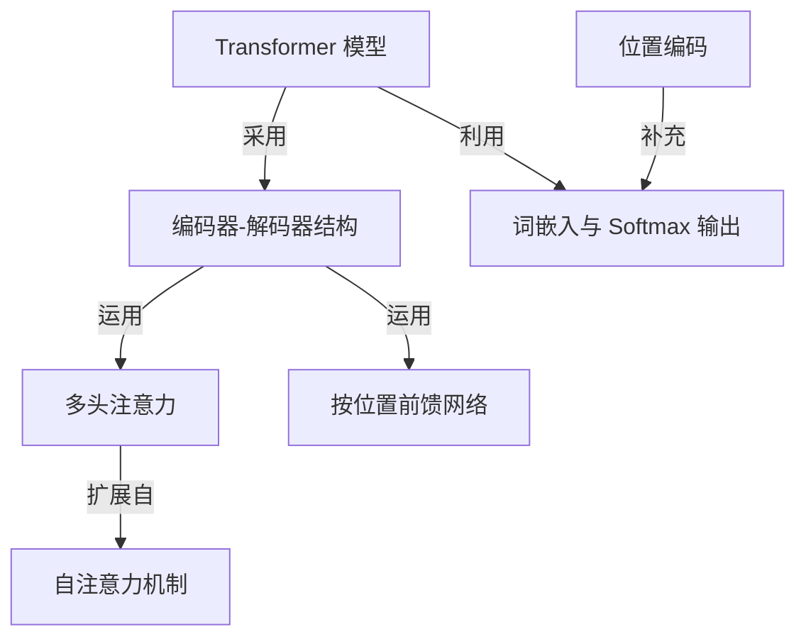

# Tutorial: Attention_Is_All_You_Need

本项目展示了 **Transformer 模型**，一种革命性的神经网络架构，专门用于处理序列数据，例如文本翻译。它完全摒弃了传统的循环和卷积网络，其核心在于巧妙地运用了*注意力机制*。该模型采用了经典的*编码器-解码器结构*：编码器负责理解输入序列，而解码器则逐步生成输出序列。由于注意力机制本身不处理顺序，Transformer 引入了*位置编码*来为序列中的词语提供位置信息。在编码器和解码器的每一层中，关键组件包括*多头注意力*（它是*自注意力机制*的一种高级形式，允许模型从不同角度关注信息）和*按位置前馈网络*（对每个位置的表示进行独立转换）。最后，输入和输出词元通过*词嵌入*层转换为向量，解码器的最终输出经过线性层和 *Softmax* 函数，生成预测下一个词元的概率分布。

**Source Repository:** [None](None)

## Chapters

1. [Transformer 模型
](01_transformer_模型_.md)
2. [编码器-解码器结构
](02_编码器_解码器结构_.md)
3. [词嵌入与 Softmax 输出
](03_词嵌入与_softmax_输出_.md)
4. [位置编码
](04_位置编码_.md)
5. [自注意力机制
](05_自注意力机制_.md)
6. [多头注意力
](06_多头注意力_.md)
7. [按位置前馈网络
](07_按位置前馈网络_.md)

---

Generated by [AI Codebase Knowledge Builder](https://github.com/The-Pocket/Tutorial-Codebase-Knowledge)