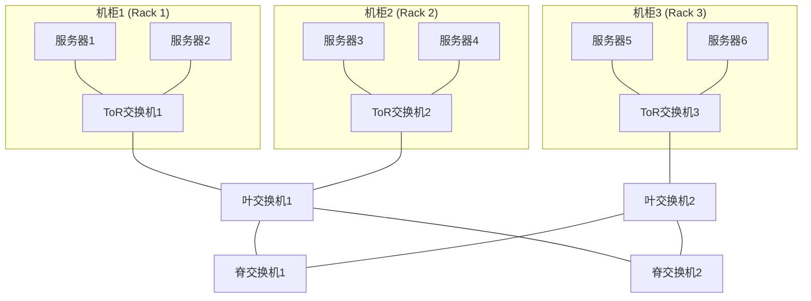
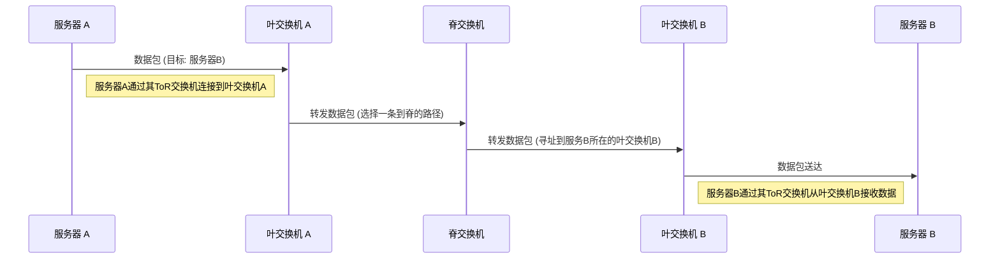

# Chapter 1: 数据中心互连架构

欢迎来到《数据中心以太网技术及向224 Gbps的演进》教程的第一章！在本章中，我们将一起探索现代数据中心的核心——它的互连架构。

## 1.1 什么是数据中心互连架构？为什么它很重要？

想象一下一个超大型的购物中心，里面有成百上千的店铺（服务器和存储设备）。顾客（用户请求）和店员（应用程序）需要在这些店铺之间快速、高效地传递商品和信息。如果道路规划混乱，到处都是死胡同和拥堵的小路，那么整个购物中心的运营效率会非常低下。

数据中心也面临类似的问题。一个现代数据中心可能容纳着数万台甚至更多的服务器、存储系统和网络设备。它们之间需要不断地交换海量数据。**数据中心互连架构** (Data Center Interconnect Architecture) 就是这些设备连接的蓝图和规则，它描述了服务器和网络设备是如何组织和连接起来的。

这就像一个精心规划的城市交通网络，有宽阔的主干道、畅通的支路和便捷的小巷，确保数据（如同城市中的车辆）能够在数据中心的不同部分之间高效、可靠地流动。一个良好的互连架构对于数据中心的性能、可扩展性和可靠性至关重要。

**主要目标：**
*   **高性能 (High Performance):** 确保数据传输的低延迟（快速响应）和高带宽（大数据量）。
*   **可扩展性 (Scalability):** 能够方便地增加更多的服务器和网络设备，以应对不断增长的需求。
*   **可靠性 (Reliability):** 即使部分链路或设备发生故障，也能保证数据中心持续稳定运行。
*   **成本效益 (Cost-Effectiveness):** 在满足性能需求的前提下，尽可能降低建设和运维成本。

## 1.2 主流架构：叶脊网络 (Leaf-Spine)

目前，**叶脊 (Leaf-Spine)** 架构是现代数据中心中最流行的一种互连设计。它源于一种称为 **CLOS 架构** (CLOS Topology) 的经典网络设计理念，旨在构建大规模、高性能、可预测的网络。

让我们用一个简单的比喻来理解叶脊架构：
*   **服务器 (Servers):** 可以看作是城市中的住宅楼或办公楼，它们是数据处理和存储的基本单元。
*   **机柜顶交换机 (Top-of-Rack, ToR Switches):** 每个服务器机柜顶部都有一个交换机，负责连接该机柜内的所有服务器。就像每栋楼都有自己的内部网络接口。
*   **叶交换机 (Leaf Switches):** ToR 交换机连接到叶交换机。叶交换机可以看作是社区或区域的交通枢纽，汇聚了来自多个机柜的流量。
*   **脊交换机 (Spine Switches):** 叶交换机连接到所有的脊交换机。脊交换机则像是城市的核心高速公路网，它们不直接连接服务器或ToR交换机，而是专门负责连接所有的叶交换机，为不同“社区”之间的数据交换提供高速通道。

**叶脊架构的关键特点：**
1.  **层级简单：** 通常只有两层交换网络（叶和脊），使得网络结构清晰。
2.  **全连接特性（叶与脊之间）：** 每个叶交换机都连接到每个脊交换机。这提供了大量的冗余路径和巨大的聚合带宽。
3.  **可预测的延迟：** 在一个典型的叶脊网络中，任何两台服务器之间的通信最多只需要经过“服务器 -> ToR -> 叶 -> 脊 -> 叶 -> ToR -> 服务器”这几个跳数。由于路径固定且短，延迟变得非常可预测。
4.  **易于水平扩展：**
    *   需要更多服务器端口时，可以增加叶交换机。
    *   需要更大整体带宽（东西向带宽，即服务器之间的通信带宽）时，可以增加脊交换机。

下面是一个简化的叶脊架构示意图：

*图1：简化的叶脊网络架构*

从上图可以看出，任何一个机柜顶（ToR）交换机都连接到一个或多个叶交换机。而每个叶交换机都连接到所有的脊交换机。这种结构确保了从任何一个叶交换机到另一个叶交换机都有多条路径通过脊交换机层。

## 1.3 连接的“道路”：物理链路与距离

数据中心内的连接并非完全一样。根据距离、带宽需求和成本考虑，会采用不同的物理连接技术。这就像城市道路有柏油路、水泥路，甚至高速公路一样。

以下是数据中心内部常见的连接层级和典型技术（参考自项目文档中的描述，例如 `Figure 1` 的上下文）：

1.  **机柜内 (Intra-Rack) / 服务器到ToR交换机:**
    *   **距离:** 通常在几米之内 (例如，小于5米)。
    *   **技术:** 早期常用**直连铜缆 (Direct Attach Copper, DAC)**，因为成本低且延迟小。随着速率提升，**有源光缆 (Active Optical Cable, AOC)** 和 **有源电缆 (Active Electrical Cable, AEC)** 也被用于更高速度的连接，如从25G、50G向100G、200G甚至400G演进。
    *   **解释:** 这是数据中心内最短的连接，就像你家里的电脑连接到路由器一样直接。

2.  **ToR交换机到叶交换机 (TOR to Leaf Switch):**
    *   **距离:** 通常可达50米左右。
    *   **技术:** 常用**多模光纤 (Multi-mode Optical Fiber)**配合相应的光模块。例如，100GBASE-SR4。早期速率（如100G及以下）可能使用**非归零 (NRZ)** 信号，但随着速率向200G、400G及更高（未来800G）发展，更高级的调制技术如 **[PAM4调制技术](05_pam4调制技术_.md)** 开始被采用。
    *   **解释:** 这相当于连接不同楼宇内网到社区交换中心的线路。

3.  **叶交换机到脊交换机 (Leaf to Spine):**
    *   **距离:** 可达500米，有时甚至更远，可能在一个园区内或相邻园区。
    *   **技术:** 由于距离更长，通常使用**单模光纤 (Single-mode Optical Fiber)**。为了提高带宽，可能会使用多条并行光纤（如100G-PSM4，400GBASE-DR4）。速率与ToR到Leaf类似，也在向200G/400G/800G演进。
    *   **解释:** 这好比社区交换中心连接到城市核心高速公路网的线路。

4.  **脊交换机到核心 (Spine to Core) / 数据中心互连 (Data Center Interconnect, DCI):**
    *   **脊交换机到核心:** 距离可达2公里。为了在单根光纤上传输更多数据并节省光纤成本，常使用**波分复用 (Wavelength Division Multiplexing, WDM)** 技术，如100GBASE-LR4, 400GBASE-FR4。
    *   **DCI:** 用于连接地理位置上分离的多个数据中心（例如，用于负载均衡或灾难备份），距离可以从几十公里到上百公里。会使用**密集波分复用 (Dense WDM, DWDM)**，以及更高级的相干光通信技术 (Coherent Communication)。
    *   **解释:** DCI 就像连接不同城市之间的高速公路，需要长距离、大容量的传输能力。

我们可以看到，随着连接距离的增加和带宽需求的提高，所采用的连接技术也变得更加复杂和昂贵。数据中心架构师需要仔细权衡这些因素。

## 1.4 架构如何工作？一个数据流的例子

让我们回到那个社交媒体应用的例子。假设用户A（连接到服务器A）想给用户B（其数据主要存储在服务器B上）发送一张图片。服务器A和服务器B位于数据中心内不同的机柜中。

数据流大致如下（基于叶脊架构）：
1.  服务器A处理完图片，将数据包发送给它所在机柜的ToR交换机A。
2.  ToR交换机A将数据包转发给它连接的叶交换机A。
3.  叶交换机A查看数据包的目的地址（服务器B），通过路由表得知服务器B位于叶交换机B之下。于是，叶交换机A会选择一条路径，将数据包发送给一个脊交换机。
4.  脊交换机接收到数据包后，将其转发给目标叶交换机B。
5.  叶交换机B将数据包发送给连接服务器B的ToR交换机B。
6.  ToR交换机B最终将数据包送达服务器B。

下面是一个简化的时序图来说明这个过程：

*图2：叶脊架构中的简化数据流*

这个过程看起来有很多跳，但由于叶脊架构中所有路径都是高速的，并且叶交换机和脊交换机都是高性能设备，所以整个传输过程非常快。而且，因为叶交换机和脊交换机之间有多条连接，即使某条链路出现故障，数据也可以通过其他路径传输，保证了网络的可靠性。

## 1.5 深入理解：CLOS架构的启示

正如前面提到的，叶脊架构是CLOS架构的一种现代实现。CLOS架构最初是为了电话交换系统设计的，目标是构建一个“无阻塞”或“低阻塞”的网络，即任何输入端口都能够以最大速率连接到任何未被占用的输出端口。

在数据中心场景下，这意味着服务器之间的通信应该尽可能地顺畅，减少因为网络拥塞而产生的瓶颈。叶脊架构通过其两层结构和叶脊间的全连接（或高密度连接）特性，很好地实现了这一目标，特别是对于“东西向流量”（服务器之间的流量）的优化，这在现代分布式应用和微服务架构中非常重要。

项目文档 `Data Center Ethernet Technology and Evolution to 224 Gbps.pdf` 的第4页 `Figure 1. Network architecture of a typical hyperscale data center` 所展示的正是这种基于CLOS的叶脊架构。图中清晰地展示了从服务器机柜（Server Cabinets）到机柜顶交换机（TOR），再到叶交换机（Leaf），最后到脊交换机（Spine）的层次结构。这种分层设计不仅优化了性能，还为未来的速率升级（如向800G甚至1.6T演进）打下了坚实的基础。这些速率的提升，离不开像 **[以太网速率提升技术](02_以太网速率提升技术_.md)** 中将要讨论的关键技术。

## 1.6 总结与展望

在本章中，我们了解了什么是数据中心互连架构，以及为什么它对现代数据中心如此重要。我们重点学习了目前主流的叶脊 (Leaf-Spine) 架构，包括它的组成部分、优势以及不同连接层级所使用的物理链路技术。通过一个数据流的例子，我们也看到了这种架构是如何高效地处理数据中心内部通信的。

数据中心互连架构为数据的高效流动搭建了“骨架”和“道路”。有了坚实的架构基础，我们才能在其上运行越来越高速的以太网技术。

在下一章 **[以太网速率提升技术](02_以太网速率提升技术_.md)** 中，我们将深入探讨为了满足日益增长的带宽需求，以太网速率是如何一步步提升的，以及其中涉及到的关键技术和挑战。敬请期待！

---

Generated by [AI Codebase Knowledge Builder](https://github.com/The-Pocket/Tutorial-Codebase-Knowledge)