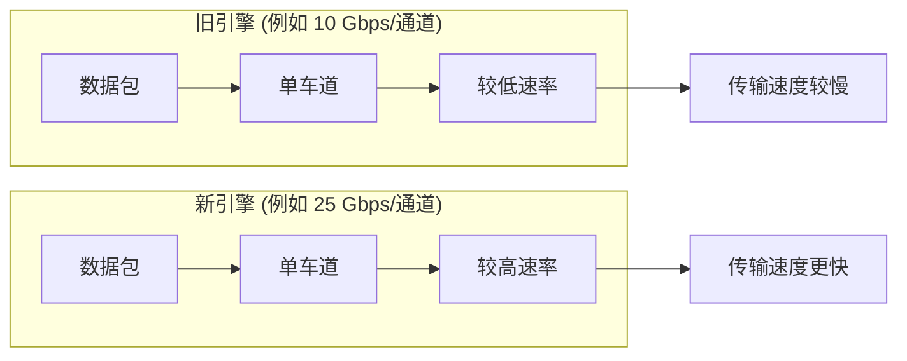
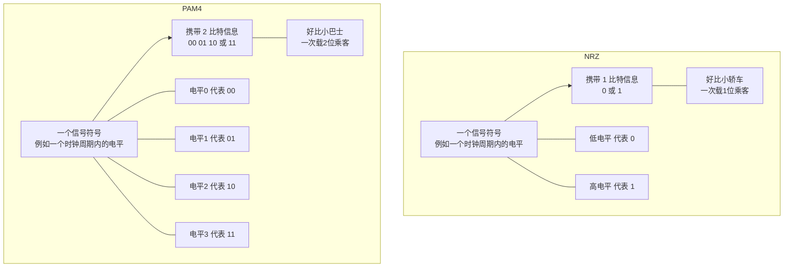

# Chapter 2: 以太网速率提升技术


在上一章 [数据中心互连架构](01_数据中心互连架构_.md) 中，我们了解了数据中心内部是如何通过叶脊架构等方式组织和连接服务器与网络设备的，这为数据的高效流动搭建了“骨架”和“道路”。然而，仅仅有好的道路规划还不够，我们还需要让“车流”（数据）跑得更快、运载得更多。本章将带你探索工程师们是如何施展“魔法”，让以太网这条信息高速公路变得越来越宽阔、越来越快速的。

## 2.1 为什么我们需要更快的以太网？

想象一下，你正在观看一部超高清的流媒体电影，或者在玩一款画面精美、需要快速响应的在线游戏。这些流畅体验的背后，都离不开数据中心内海量数据的快速传输。随着5G、人工智能、云计算和物联网等应用的飞速发展，我们对数据的需求呈爆炸式增长。如果数据传输速度跟不上，就像城市交通在高峰期遭遇大堵车一样，各种应用体验都会大打折扣。

因此，提升以太网的速率，确保数据能够快速、高效地在数据中心内部以及数据中心与用户之间流动，变得至关重要。这就像不断升级我们的公路系统，从坑洼小路到平坦大道，再到多车道高速公路，以满足日益增长的交通需求。

## 2.2 以太网提速的三大“法宝”

为了让数据传输得更快，工程师们主要采用了三种核心策略。这有点像给汽车提速：你可以升级引擎、增加车道，或者让每辆车载更多乘客。让我们逐一了解这些“法宝”，这些方法在项目文档 `Data Center Ethernet Technology and Evolution to 224 Gbps.pdf` 的第6页 `Figure 2` 中也有清晰的图示。

### 法宝一：升级引擎 (提高单个通道的数据速率或波特率)

最直接的方法就是提升**单个数据通道（也常被称为“lane”）本身传输数据的能力**。

*   **类比：** 就像给汽车换上一个更强劲的引擎。原来引擎的汽车每小时能跑100公里，换了新引擎后能跑200公里。
*   **解释：** 在以太网中，这意味着让构成连接的每一条“线路”或“通道”在单位时间内能够发送或接收更多的比特数据。例如，单个通道的速率从早期的1 Gbps（千兆比特每秒）发展到10 Gbps，再到25 Gbps、50 Gbps，甚至未来的112 Gbps和224 Gbps。这通常涉及到更先进的芯片技术、信号处理技术和物理介质的改进。
*   **挑战：** 正如项目文档第6页提到的，“通常情况下，所需的波特率提升可能领先于当时可用的技术”，这意味着单纯依靠提升单通道速率有时会遇到技术瓶颈和成本压力。


*图2.1：提升单通道速率示意图*

### 法宝二：增加车道 (增加并行通道数量)

当单个通道的速率提升遇到瓶颈，或者成本过高时，工程师们会采用“人多力量大”的策略——**并行使用多个通道**来共同传输数据。

*   **类比：** 就像在一条繁忙的单车道公路上旁边再修几条车道，形成多车道高速公路。虽然每辆车的速度（单个通道的速率）可能没有变，但公路整体的通行能力大大增强了。
*   **解释：** 这种方法通过同时使用多条物理线路（如多对铜线、多根光纤）或在单根光纤上利用不同“颜色”的光（即 [波分复用 Wavelength Division Multiplexing, WDM](04_行业标准与规范__oif_ieee__.md) 技术）来承载不同的数据流，从而实现总带宽的成倍增加。

**常见的并行技术：**

1.  **物理并行 (多光纤/多线对):**
    *   例如，早期的40G以太网接口很多采用4条10 Gbps的通道并行工作 (4x10G)。同样，100G以太网接口广泛采用4条25 Gbps的通道 (4x25G)。
    *   **优点：** 可以利用相对成熟的低速率通道技术来快速实现高速率接口。
    *   **缺点：** 需要更多的物理连接（更多的光纤或电缆），增加了布线复杂度和成本。对于电信号，更多的并行通道也可能引入串扰问题。

    ```mermaid
    graph TD
        subgraph 40GbE
            S1[数据源] --> P1[处理单元1]
            P1 --> C1[10G 通道1]
            P1 --> C2[10G 通道2]
            P1 --> C3[10G 通道3]
            P1 --> C4[10G 通道4]
            C1 --> R1[接收端]
            C2 --> R1
            C3 --> R1
            C4 --> R1
            P1 --- note1[数据被拆分成4份，并行传输]
        end
    ```
    *图2.2：物理并行通道示意图 (例如4x10G组成40G)*

2.  **波分复用 (WDM):**
    *   这种技术允许在一根光纤中同时传输多个不同波长（可以理解为不同颜色）的光信号，每个波长承载一路独立的数据。
    *   **类比：** 想象一条特殊的光纤隧道，里面可以同时跑着红色、蓝色、绿色的光“列车”，它们互不干扰，各自运送乘客（数据）。
    *   **优点：** 大大节省了光纤资源，特别适用于距离较长的连接。例如，100GBASE-LR4标准就使用4个不同波长的光在单模光纤上传输4x25G的数据。
    *   项目文档第6页提到：“对于光接口，可以通过并行多模或单模光纤实现短距离传输的多通道，并通过在单根光纤上使用波分复用（WDM）实现长距离传输。”

    ```mermaid
    graph LR
        subgraph "发送端 (Transmitter)"
            Data1["数据流1"] -- "波长λ1 (红光)" --> MUX["光合波器"]
            Data2["数据流2"] -- "波长λ2 (蓝光)" --> MUX
            Data3["数据流3"] -- "波长λ3 (绿光)" --> MUX
            DataN["数据流N"] -- "波长λN (黄光)" --> MUX
        end
        MUX -- "合并所有波长" --> SingleFiber["单根光纤<br>(多种颜色的光同时传输)"]
        subgraph "接收端 (Receiver)"
            SingleFiber -- "分离各波长" --> DEMUX["光分波器"]
            DEMUX -- "波长λ1" --> R_Data1["数据流1"]
            DEMUX -- "波长λ2" --> R_Data2["数据流2"]
            DEMUX -- "波长λ3" --> R_Data3["数据流3"]
            DEMUX -- "波长λN" --> R_DataN["数据流N"]
        end
    ```
    *图2.3：波分复用 (WDM) 原理示意图*

### 法宝三：让每辆车运载更多乘客 (使用更复杂的调制信号)

除了让车跑得更快（提升单通道速率）和修更多车道（增加并行通道），我们还可以想办法让每一辆“车”在一次行程中运载更多的“乘客”（数据比特）。这就是通过**更高级的调制技术**来实现的。

*   **类比：** 以前每辆小轿车（信号符号）只能载1名乘客（1比特数据）。现在我们换成了小型巴士，每辆车（信号符号）能载2名甚至更多乘客（2比特或更多数据）。这样，即使车速（波特率）和车道数（通道数）不变，单位时间内运送的总乘客数量（数据速率）也增加了。
*   **解释：**
    *   传统的数字信号通常使用 **NRZ (Non-Return-to-Zero，不归零)** 调制。它只有两个信号电平（比如高电平和低电平），分别代表比特0和比特1。每个信号状态（符号）携带1个比特的信息。
    *   为了在不显著提高信号变化速度（波特率）的情况下传输更多数据，工程师们引入了更复杂的调制方案，如 **PAM4 (Pulse Amplitude Modulation 4-level，4电平脉冲幅度调制)**。PAM4使用四个不同的信号电平，每个电平可以代表2个比特的信息（例如，电平0代表00，电平1代表01，电平2代表10，电平3代表11）。这样，在相同的波特率下，PAM4的数据速率是NRZ的两倍。
    *   正如项目文档第7页所述：“PAM4 4电平调制使每个数据符号能够携带2比特/符号，从而在通道数和波特率相同的情况下使接口数据速率加倍。”
    *   我们将在后续章节 [PAM4调制技术](05_pam4调制技术_.md) 中更详细地探讨PAM4。


*图2.4：NRZ与PAM4调制对比示意图*

*   **挑战：** 更复杂的调制方案（如PAM4）对信号质量要求更高，信号更容易受到噪声干扰，因此需要更复杂的发送和接收电路，以及更强的 [前向纠错 (FEC) 与均衡技术](06_前向纠错__fec__与均衡技术_.md) 来保证数据传输的准确性。

## 2.3 技术组合：打造高速以太网的“配方”

在实际的以太网标准发展中，这三种提速“法宝”往往是组合使用的，以在性能、成本和技术可行性之间取得平衡。

以100G以太网为例（参考项目文档 `Data Center Ethernet Technology and Evolution to 224 Gbps.pdf` 第7页 `Figure 3` 的演进思路）：
*   **早期方案 (例如 100GBASE-SR10):**
    *   10个并行通道 (法宝二：增加车道 - 物理并行)
    *   每个通道速率为10 Gbps (法宝一：当时的单通道速率)
    *   采用NRZ调制 (法宝三：基础调制)
    *   总速率 = 10通道 × 10 Gbps/通道 × 1比特/符号 = 100 Gbps

*   **主流方案 (例如 100GBASE-SR4, QSFP28):**
    *   4个并行通道 (法宝二：减少了物理通道数，但单通道速率更高)
    *   每个通道速率为25 Gbps (法宝一：单通道速率提升)
    *   采用NRZ调制 (法宝三：基础调制)
    *   总速率 = 4通道 × 25 Gbps/通道 × 1比特/符号 = 100 Gbps

随着技术向400G、800G甚至更高演进，PAM4调制技术（法宝三）开始扮演越来越重要的角色：
*   **400G以太网 (例如 400GBASE-DR4):**
    *   4个并行光纤通道 (法宝二)
    *   每个通道的光信号数据速率为100 Gbps (法宝一的进一步提升)
    *   采用PAM4调制 (法宝三)。这意味着每个光通道的波特率是50 Gbaud (50G符号/秒)，因为PAM4每个符号携带2比特，所以数据速率是 50 Gbaud * 2 比特/符号 = 100 Gbps。
    *   总速率 = 4通道 × 100 Gbps/通道 = 400 Gbps
    *   其电接口可能是8路50 Gbps PAM4信号 (即每路25 Gbaud PAM4)。

这种组合策略使得以太网技术能够在不同时期利用当时最成熟和最具成本效益的技术组合来满足不断增长的带宽需求。

## 2.4 总结与展望

在本章中，我们学习了以太网速率提升的三大核心技术策略：
1.  **提高单个通道的数据速率或波特率**（升级引擎）。
2.  **增加并行通道的数量**（增加车道），包括物理并行和波分复用。
3.  **使用更复杂的调制信号**（如PAM4，让每辆车运载更多乘客）。

我们了解到，这些技术并非孤立使用，而是经常组合起来，共同推动以太网速率从1G、10G发展到100G、400G，并向着更高的目标迈进。这为我们在 [第一章：数据中心互连架构](01_数据中心互连架构_.md) 中讨论的各种连接（如机柜内、ToR到Leaf、Leaf到Spine）提供了越来越快的“通路”。

理解了这些基础的速率提升技术后，我们将在下一章 [下一代以太网速率 (112/224 Gbps 每通道)](03_下一代以太网速率__112_224_gbps_每通道__.md) 中，更具体地探讨当前和未来以太网如何利用这些技术，特别是每通道速率向112 Gbps和224 Gbps演进的趋势和挑战。这将为我们后续理解 [PAM4调制技术](05_pam4调制技术_.md) 和 [前向纠错 (FEC) 与均衡技术](06_前向纠错__fec__与均衡技术_.md) 等关键技术打下坚实的基础。

---

Generated by [AI Codebase Knowledge Builder](https://github.com/The-Pocket/Tutorial-Codebase-Knowledge)