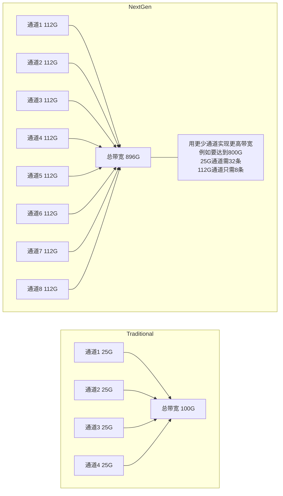
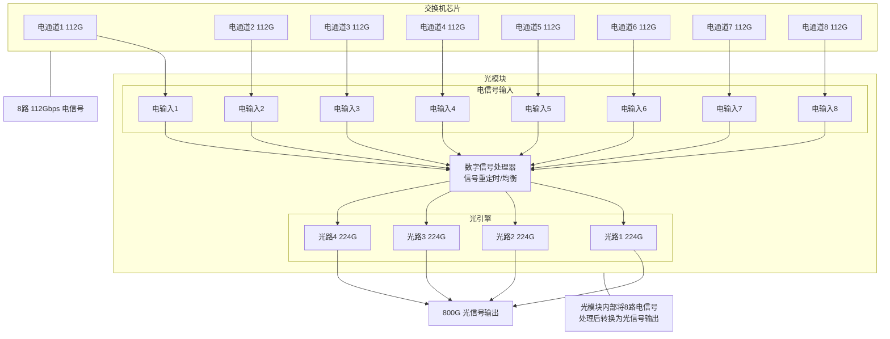
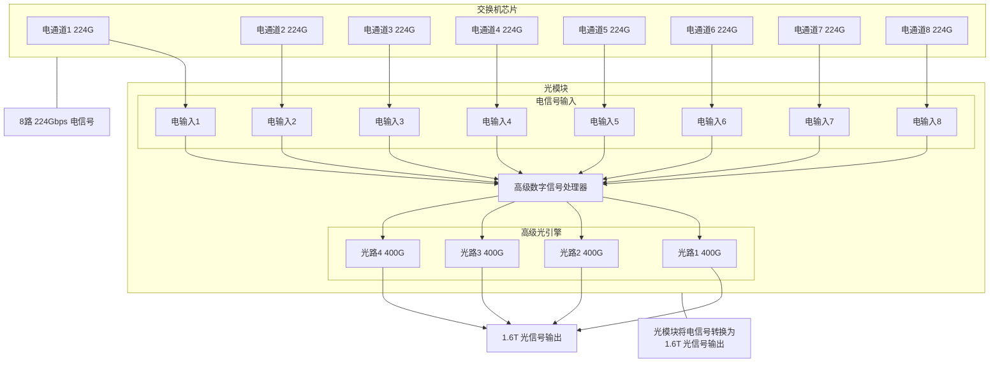
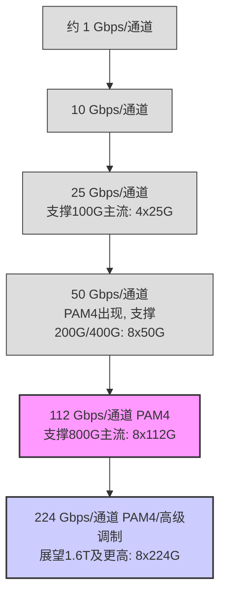

# Chapter 3: 下一代以太网速率 (112/224 Gbps 每通道)

在上一章 [以太网速率提升技术](02_以太网速率提升技术_.md) 中，我们一起探索了提升以太网整体带宽的三大“法宝”：升级引擎（提高单通道速率）、增加车道（增加并行通道数量）以及让每辆车运载更多乘客（使用更复杂的调制信号）。这些技术共同推动着以太网向更高速度发展。

本章我们将聚焦于其中一个至关重要的方面——“升级引擎”，也就是**单个数据通道 (lane) 速率的巨大飞跃**。我们将深入了解下一代以太网的核心驱动力：每通道 112 Gbps 和 224 Gbps 的速率。想象一下，数据中心就是一座信息高速流动的超级都市，而我们正在讨论如何将这座城市中每条独立车道的最高限速提升到一个全新的水平！

## 3.1 什么是“每通道速率”？为什么它如此重要？

首先，让我们理解“下一代以太网速率 (112/224 Gbps 每通道)”这个概念。

正如其名，它指的是数据中心以太网接口速度的最新进展，特别是**单个物理通道（lane）的数据传输速率达到了惊人的 112 Gbps，并已开始展望更快的 224 Gbps**。

这里的“通道”（lane）可以理解为一条独立的物理路径，它可以是一对铜导线（用于电信号），或者是一根光纤中的一个独立光通路（用于光信号）。

*   **112 Gbps 每通道：** 意味着在一条这样的通道上，每秒钟可以传输大约 1120 亿个比特（0或1）的数据。
*   **224 Gbps 每通道：** 则意味着这个数字翻倍，达到每秒钟 2240 亿比特！

让我们用一个生动的比喻来理解：

> 想象一条高速公路。最初，每条车道的限速可能是 50 公里/小时。现在，我们将这条车道的限速大幅提升到 112 公里/小时，未来甚至可能达到 224 公里/小时！
>
> 为什么要这么做呢？因为数据中心需要支撑像 800G (800 Gbps) 甚至 1.6T (1600 Gbps) 这样巨大的总带宽需求。如果单车道速度太慢，我们就需要修建极多数量的车道才能满足总运力，这不仅成本高昂，管理起来也非常复杂。而提升单车道的速度，就能用更少的车道实现同样甚至更高的总运力。

*图3.1：提升单通道速率对总带宽的影响*

因此，提升每通道速率是满足数据爆炸式增长需求、构建更高效、更经济的数据中心网络的关键。

## 3.2 为什么数据中心“痴迷”于 112/224 Gbps 每通道？

你可能会问，数据中心为什么如此迫切地需要这么高的单通道速率呢？主要有以下几个原因：

1.  **应对爆炸式增长的带宽需求：**
    *   随着人工智能 (AI)、机器学习 (ML)、云计算、高清视频流、物联网 (IoT) 等应用的普及，数据中心内部以及数据中心之间的数据流量正在以前所未有的速度增长。
    *   为了支撑这些应用，数据中心需要能够提供 800 Gbps、1.6 Tbps 甚至未来更高总带宽的接口。如果单通道速率过低（比如还停留在 10 Gbps 或 25 Gbps），要达到这样的总带宽，就需要集成非常多的并行通道。例如，一个 800G 的接口如果用 25G 的通道，就需要 32 条！这在物理实现上非常困难。

2.  **降低成本和功耗：**
    *   **更少的组件：** 更高的单通道速率意味着可以用更少的通道数量来实现目标总带宽。例如，实现 800G 带宽：
        *   若使用 25 Gbps/通道，需要 32 个通道。
        *   若使用 50 Gbps/通道，需要 16 个通道。
        *   若使用 112 Gbps/通道，只需要 8 个通道 (8 x 112 Gbps = 896 Gbps，通常称为 800G 级别)。
    *   更少的通道意味着更少的 SerDes（串行器/解串器）逻辑单元、更少的光学组件（如激光器、探测器）、更简单的印刷电路板 (PCB) 设计，这些都能显著降低硬件成本和整体功耗。这对于拥有成千上万台服务器和网络设备的超大规模数据中心来说至关重要。

3.  **简化系统设计和提高密度：**
    *   更少的并行通道可以简化交换机和光模块的设计，减少连接器的数量和布线的复杂性。
    *   这使得在有限的空间内容纳更多的端口成为可能，提高了端口密度，从而提升了整个数据中心的计算和存储能力。

4.  **为太比特 (Terabit) 时代铺平道路：**
    *   112 Gbps 和 224 Gbps 每通道不仅仅是眼前的需求，更是通向未来 Tbps（太比特每秒）级别以太网速率的关键基石。每一次单通道速率的飞跃，都为下一代更高速的网络标准奠定了技术基础。

正如项目文档 `Data Center Ethernet Technology and Evolution to 224 Gbps.pdf` 第8页所述：“800G 以太网的第一代将采用每通道 112 Gbps，支持 200G/400G/800G 链路，第二代将引入每通道 224 Gbps，支持高达 1.6T 的链路。”

## 3.3 112 Gbps 每通道：当前数据中心的高速引擎

目前，112 Gbps 每通道的技术已经相对成熟，并成为构建 800G 以太网接口的主流选择。

*   **如何实现？**
    *   这通常是通过将信号的**波特率**（每秒钟信号变化的次数）设定在约 53-56 Gbaud（千兆波特），并结合我们在上一章提到的 [PAM4调制技术](05_pam4调制技术_.md) 来实现的。
    *   回顾一下，PAM4 调制允许每个信号符号携带 2 个比特的信息。所以，大致计算：56 Gbaud × 2 比特/符号 = 112 Gbps。
    *   （注：IEEE 标准中定义的 100G 电接口速率（如 100GAUI-1 C2M）是 53.125 Gbaud PAM4，即 106.25 Gbps。但行业内通常将这一代技术统称为 112G 级别，OIF CEI-112G 标准也支持到 58 Gbaud PAM4，即 116 Gbps。为简化，本教程采用行业通用的“112 Gbps”描述。）

*   **应用场景：**
    *   **800G 接口：** 通常由 8 个 112 Gbps 的电通道组成 (8 x 112G)。
    *   **400G 接口：** 可以由 4 个 112 Gbps 的电通道组成 (4 x 112G)。
    *   **200G 接口：** 可以由 2 个 112 Gbps 的电通道组成 (2 x 112G)。

下图展示了一个典型的 800G 端口是如何基于 8 条 112 Gbps 的通道构建的：

*图3.2：基于 8 x 112 Gbps 电通道的 800G 接口示意图*

这种架构使得光模块（如 QSFP-DD800 或 OSFP）能够接收来自交换机芯片的 8 路 112 Gbps 电信号，然后在模块内部通过数字信号处理 (DSP) 和光电转换，输出总计 800 Gbps 的光信号。光信号的组织方式可能有多种，例如 8 路 100G 光信号（每路光信号速率约 100G，也采用 PAM4）或者 4 路 200G 光信号（每路光信号速率约 200G，采用更高速的 PAM4 或其他技术）。

## 3.4 224 Gbps 每通道：迈向 1.6T 时代的关键技术

如果说 112 Gbps 每通道是当前的“主力”，那么 224 Gbps 每通道就是通往未来的“先锋部队”。它被视为实现 1.6 Tbps 甚至更高速率以太网接口的核心技术。

*   **如何实现？（仍在探索中）**
    *   一种直接的思路是继续沿用 [PAM4调制技术](05_pam4调制技术_.md)，并将波特率翻倍至约 112 Gbaud (112 Gbaud × 2 比特/符号 = 224 Gbps)。项目文档第13页提到：“224 Gbps 的 PAM4 波特率为 112 GBd”。
    *   然而，如此高的波特率对整个链路上的器件带宽（如调制器、探测器、ADC/DAC）提出了极高的要求，系统带宽可能需要达到 80GHz 左右。
    *   因此，业界也在研究其他可能性，例如采用更高级的调制方案，如 PAM6（每个符号约携带 2.6 比特）或 PAM8（每个符号携带 3 比特）。这些方案可以在较低的波特率下实现 224 Gbps 的数据速率，从而降低对器件带宽的要求，但代价是信号电平数更多，对信噪比 (SNR) 更敏感，信号处理也更复杂。

*   **潜在应用场景：**
    *   **1.6T 接口：** 可能由 8 个 224 Gbps 的通道组成 (8 x 224G)。
    *   **800G 接口：** 未来也可能用 4 个 224 Gbps 的通道来实现 (4 x 224G)，这将进一步减少通道数，降低成本和功耗。

下图展示了未来 1.6T 端口可能如何基于 8 条 224 Gbps 的通道构建：

*图3.3：基于 8 x 224 Gbps 电通道的 1.6T 接口展望*

*   **面临的挑战：**
    *   **信号完整性：** 在如此高的速率下，信号衰减、反射、串扰等问题会更加严重。
    *   **功耗和散热：** 更高速的芯片和光器件通常意味着更高的功耗，这给模块和系统的散热设计带来了巨大挑战。
    *   **材料和制造工艺：** 需要更先进的半导体材料、PCB 材料和封装技术。
    *   **纠错和均衡：** 对 [前向纠错 (FEC) 与均衡技术](06_前向纠错__fec__与均衡技术_.md) 的要求将达到前所未有的高度，以确保在恶劣信号条件下的可靠传输。

尽管挑战重重，但业界正在积极投入研发，推动 224 Gbps 每通道技术的成熟和商用。

## 3.5 单通道速率的演进阶梯

从历史来看，以太网单通道速率的提升是一个持续不断的过程，每一代新的速率都为更高速的网络接口铺平了道路。

*图3.4：以太网单通道速率演进示意图*

这个演进过程体现了业界在平衡技术可行性、成本效益和市场需求方面所做的努力。每一级“台阶”的迈进，都离不开芯片技术、调制技术、信号处理技术、材料科学以及 [行业标准与规范 (OIF/IEEE)](04_行业标准与规范__oif_ieee__.md) 的共同进步。

## 3.6 总结与展望

在本章中，我们深入探讨了下一代以太网速率的核心驱动力——每通道 112 Gbps 和 224 Gbps。我们理解了为什么提升单通道速率如此重要：它不仅能够满足日益增长的带宽需求，还能有效降低系统成本、功耗和复杂性，并为未来的太比特以太网奠定基础。

我们分别了解了 112 Gbps 每通道作为当前 800G 以太网的主力技术，以及 224 Gbps 每通道作为迈向 1.6T 及更高速率的关键技术的现状、实现方式和面临的挑战。这些高速率的实现，都离不开像 [PAM4调制技术](05_pam4调制技术_.md) 这样的高级调制方案，以及强大的 [前向纠错 (FEC) 与均衡技术](06_前向纠错__fec__与均衡技术_.md) 来保障信号质量。

那么，这些令人兴奋的速率是如何被定义、规范化并最终在行业中推广应用的呢？这就需要各大标准组织的共同努力了。在下一章 [行业标准与规范 (OIF/IEEE)](04_行业标准与规范__oif_ieee__.md) 中，我们将一起了解这些幕后英雄——OIF 和 IEEE 等标准组织是如何制定和推动这些高速以太网技术标准的。敬请期待！

---

Generated by [AI Codebase Knowledge Builder](https://github.com/The-Pocket/Tutorial-Codebase-Knowledge)