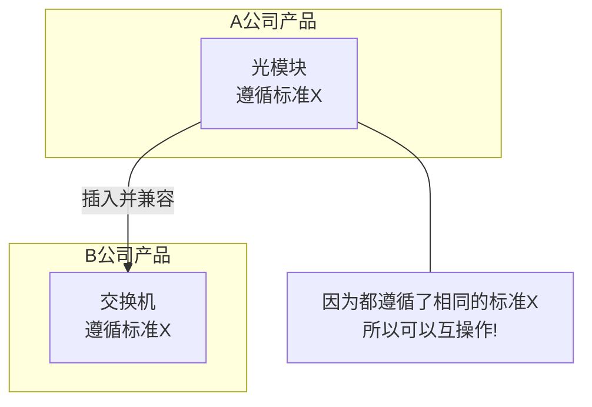
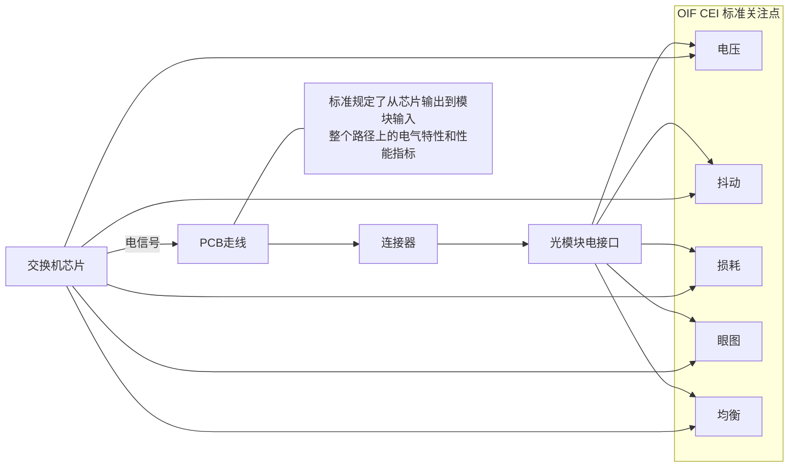
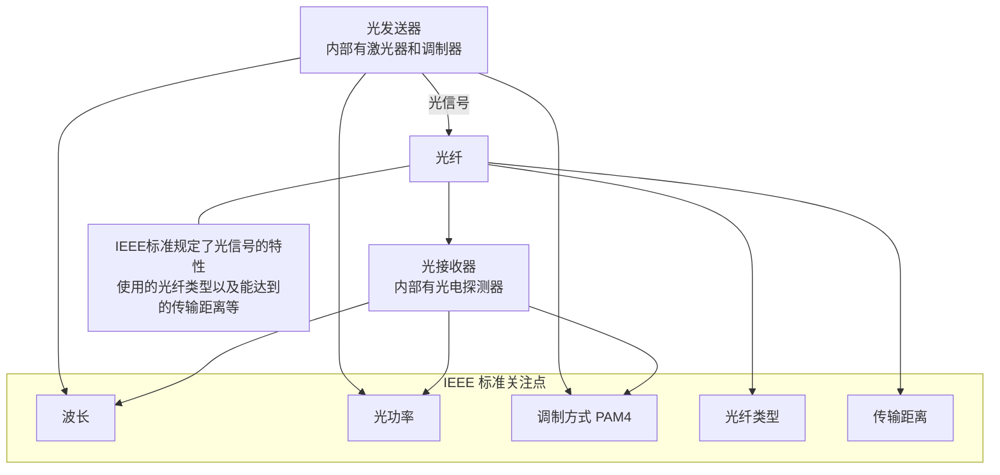
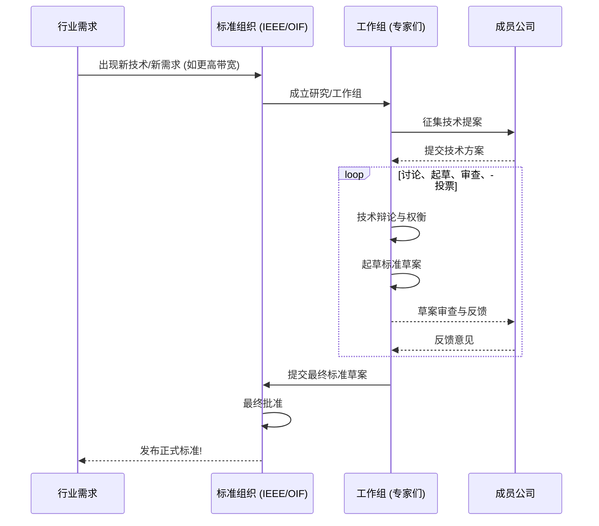

# Chapter 4: 行业标准与规范 (OIF/IEEE)

在上一章 [下一代以太网速率 (112/224 Gbps 每通道)](03_下一代以太网速率__112_224_gbps_每通道__.md) 中，我们了解了以太网单通道速率如何向 112 Gbps 甚至 224 Gbps 飞跃，为构建更高速的数据中心网络奠定了基础。但你可能会想，这么多不同的公司都在研发这些高速技术和设备，它们是如何确保彼此的产品能够兼容并协同工作的呢？这就引出了我们本章的主题——行业标准与规范。

## 4.1 为什么需要“共同的语言”？

想象一下，你去一个陌生的国家旅行，如果你不懂当地的语言，也看不懂路标，那将会非常困难。同样，在数据通信的世界里，如果每个制造商都按照自己的“方言”来设计设备，那么不同厂家的设备之间将无法沟通，整个网络就会陷入混乱。

**行业标准与规范**就扮演着这种“共同语言”和“交通规则”的角色。它们是由国际标准组织（如OIF和IEEE）制定的一系列技术规则、接口定义和性能要求。

**核心作用：确保互操作性 (Interoperability)**

让我们来看一个简单的场景：
*   **小明公司 (A公司)** 生产了一款支持 800G 以太网的光模块。
*   **小红公司 (B公司)** 生产了一台支持 800G 以太网的交换机。

如果没有任何标准，A公司的光模块很可能无法在B公司的交换机上正常工作，因为它们可能在信号电平、接口尺寸、通信协议等方面存在差异。

但如果A公司和B公司都遵循了由IEEE和OIF等组织发布的针对800G以太网和相关接口的**共同标准**，那么它们的产品即使来自不同厂家，也能够像拼图一样完美地配合，可靠地协同工作。

*图4.1: 标准确保不同厂商设备间的互操作性*

这就像全球通用的USB接口标准一样。无论你的U盘是哪个品牌生产的，只要它符合USB标准，就能插入任何一台符合USB标准的电脑并正常使用。这种互操作性对于推动整个数据通信生态系统的健康发展和技术迭代至关重要。它使得：
*   用户有更多的选择，不会被锁定在单一供应商。
*   促进了市场竞争，从而降低成本、推动创新。
*   加速了新技术的普及和应用。

## 4.2 主要的“规则制定者”：OIF 与 IEEE

在高速以太网领域，有两个非常重要的国际标准组织，它们像两位辛勤的园丁，不断为数据通信这片沃土制定和完善规则：

### 1. IEEE (电气和电子工程师协会 - Institute of Electrical and Electronics Engineers)

你可以把IEEE想象成一位“总规划师”。它主要负责制定**以太网的整体框架和规范**。

*   **主要工作：**
    *   定义不同速率的以太网标准，例如我们熟悉的 10G、100G、400G，以及正在发展的 800G 甚至 1.6T 以太网。这些标准通常以 "IEEE 802.3" 开头，后面跟着代表不同版本和速率的字母组合（例如，IEEE 802.3bs 定义了400G以太网的部分规范，IEEE 802.3ck 则涉及100 Gbps、200 Gbps 和 400 Gbps 的电接口和光接口）。
    *   规定以太网的物理层 (PHY) 特性，例如数据如何编码、使用什么样的光波长、传输距离等。
    *   定义介质访问控制 (MAC) 层的功能，确保数据包能够正确地在网络中发送和接收。
    *   定义各种接口类型，如我们在前面章节中提到的 `100GBASE-SR4` (表示100G速率，短距离，4对多模光纤) 或 `400GBASE-DR4` (表示400G速率，基于4路并行单模光纤，每路100G)。

*   **例子：** 当我们说一个设备支持 "400GBASE-DR4" 时，就意味着它符合IEEE 802.3标准中关于这种特定400G光接口的所有规定。

项目文档 `Data Center Ethernet Technology and Evolution to 224 Gbps.pdf` 第8页提到 "IEEE 802.3 Beyond 400 Gb/s Ethernet Study Group"，这表明IEEE正在积极研究和定义超出400G的更高速率以太网标准。

### 2. OIF (光互联论坛 - Optical Internetworking Forum)

如果说IEEE是“总规划师”，那么OIF更像是一位“精密工程师”。OIF专注于制定**实现这些高速互连所需的关键组件和接口的实施协议 (Implementation Agreements, IAs)**。

*   **主要工作：**
    *   定义**通用电接口 (Common Electrical I/O, CEI)** 规范。这些规范非常重要，因为它们规定了芯片与芯片之间、芯片与光模块之间电信号的传输标准。例如，如何确保一个来自交换机芯片的 112 Gbps 电信号能够被光模块正确接收和处理。
    *   定义光模块的封装、光器件的特性等。
    *   推动可插拔光模块的标准化，确保不同厂商的光模块在物理尺寸和电气特性上兼容。

*   **例子：** OIF CEI-112G-VSR 就是一个广为人知的标准，它定义了速率为 112 Gbps 的极短距离 (Very Short Reach) 电接口规范，常用于交换机芯片到其正面的可插拔光模块之间的连接。项目文档第8页也提到了 "OIF Common Electrical I/O (CEI)-112G and Common Electrical I/O (CEI)-224G"。

### IEEE 与 OIF 的协作

IEEE 和 OIF 并非孤立工作，它们更像是合作伙伴，共同推动着技术的发展。

*   IEEE 可能会定义一个高速以太网标准，比如 800G 以太网，并指出它需要例如 8 路 100G (准确地说是112G级别) 的电信号接口。
*   OIF 则会接力制定出具体的 CEI-112G 电接口实施协议，详细规定这 112G 电信号的各项参数和测试要求。

这样，芯片制造商可以根据OIF的CEI标准设计其SerDes（串行器/解串器），模块制造商可以根据OIF标准设计模块的电接口，而系统集成商则可以将符合IEEE标准的整体系统与这些符合OIF标准的组件集成起来。

项目文档第11页的 `Table 1. OIF-CEI-112G and IEEE 802.3ck equivalent clauses` 就很好地展示了这种互补关系：

| OIF-CEI 标准     | IEEE 802.3ck 标准       | 最大通道损耗 | 应用场景举例                     |
| ----------------- | ----------------------- | ----------- | -------------------------------- |
| CEI-112G-VSR      | 100GAUI-1 C2M           | 16 dB       | 芯片到模块 (Very Short Reach)     |
| CEI-112G-MR       | 100GAUI-1 C2C           | 20 dB       | 芯片到芯片 (Medium Reach)        |
| CEI-112G-LR       | 100GBASE-KR1 (背板)     | 28-30 dB    | 长距离 (例如通过背板)            |
| (N/A)             | 100GBASE-CR1 (铜缆)     | 24 dB       | 通过铜缆连接                     |

*表4.1: OIF CEI-112G 和 IEEE 802.3ck 等效条款示例 (简化版)*

这个表格显示，对于相似的应用场景（如芯片到模块的连接），OIF和IEEE都有相应的标准定义，它们共同确保了整个链路的电气性能。

## 4.3 标准都规定了些什么？——揭开神秘面纱

你可能会好奇，这些厚厚的标准文档里到底写了些什么呢？其实，它们就像一本非常详细的“产品说明书”和“行为准则”，规定了设备要能“说同一种话”所必须遵守的方方面面。

### 电气接口 (Electrical Interfaces) 的规范

当数据在芯片之间，或者从芯片传输到光模块时，是以电信号的形式存在的。OIF的CEI标准主要关注这些电信号的质量。

*   **信号完整性参数：**
    *   **电压摆幅 (Voltage Swing):** 信号高电平和低电平之间的差异。
    *   **抖动 (Jitter):** 信号在时间上的不期望的偏移，会影响数据采样的准确性。
    *   **损耗预算 (Loss Budget):** 信号在传输路径（如PCB走线、连接器）上允许的最大衰减量。
    *   **信噪比 (Signal-to-Noise Ratio, SNR):** 信号强度与噪声强度的比值。
    *   **眼图 (Eye Diagram):** 一种评估信号质量的图形化方法，标准会规定眼图的张开程度（眼高、眼宽）。
*   **连接器和PCB要求：** 对连接器的类型、引脚定义、PCB材料和布线提出建议或要求，以减少信号损失和串扰。
*   **均衡 (Equalization) 要求：** 高速信号在传输过程中会失真，标准会定义接收端需要具备什么样的均衡能力来补偿这些失真，我们将在 [前向纠错 (FEC) 与均衡技术](06_前向纠错__fec__与均衡技术_.md) 章节详细了解。

*图4.2: 电气接口标准化的关键方面*

### 光接口 (Optical Interfaces) 的规范

当数据需要通过光纤进行远距离传输时，就需要转换成光信号。IEEE的以太网标准（如 `400GBASE-DR4`）详细规定了光接口的特性。

*   **光特性：**
    *   **波长 (Wavelength):** 使用什么“颜色”的光进行传输 (例如，1310nm 附近)。
    *   **光功率 (Optical Power):** 发送端的光强度范围，接收端能灵敏检测到的最小光强度。
    *   **消光比 (Extinction Ratio):** 光信号逻辑“1”和逻辑“0”状态下光功率的比值。
    *   **光调制方式：** 如何将电信号加载到光信号上，例如使用NRZ还是 [PAM4调制技术](05_pam4调制技术_.md)。
*   **光纤类型和距离：**
    *   使用单模光纤 (Single-Mode Fiber, SMF) 还是多模光纤 (Multi-Mode Fiber, MMF)。
    *   支持的最大传输距离 (例如，DR4支持500米，FR4支持2公里，LR4支持10公里)。
*   **通道配置：**
    *   使用多少条光纤或多少个波长通道 (例如，DR4表示4个并行光通道)。
*   **光连接器类型：** 例如 LC 连接器或 MPO 连接器。

*图4.3: 光接口标准化的关键方面*

### 协议、速率和帧格式

IEEE 802.3 还定义了：
*   **以太网帧格式：** 数据包如何打包，包含哪些头部信息（如源地址、目标地址、校验和等）。
*   **MAC 层操作：** 设备如何共享网络介质，如何发送和接收帧。
*   **速率等级：** 10GbE, 25GbE, 100GbE, 400GbE, 800GbE 等。

### 测试与合规性

标准文档通常还会包含详细的**测试程序和合规性要求**。制造商需要按照这些程序测试他们的产品，以确保其符合标准。这就像产品的“期末考试”，通过了才能说自己是“标准兼容”的。我们将在 [高速信号测试与验证](08_高速信号测试与验证_.md) 章节中更多地了解这方面的内容。

## 4.4 标准是如何诞生的？——协作与共识

你可能会想，这些复杂的技术标准是谁拍脑袋想出来的呢？其实，标准的制定是一个非常严谨和协作的过程。

1.  **需求驱动：** 行业内出现新的需求，例如对更高带宽的渴望。
2.  **提案与研究：** 公司、研究机构或个人可以向标准组织（如IEEE或OIF）提交提案，成立研究小组或工作组。
3.  **讨论与起草：** 工作组的成员（通常是来自各个公司的工程师和专家）会定期开会，讨论技术方案，平衡性能、成本和可行性，并逐步起草标准文档。这个过程可能需要多轮的修改和投票。
4.  **共识达成：** 标准的通过通常需要达到广泛的共识。
5.  **发布与维护：** 标准一旦发布，就会成为行业共同遵循的依据。随着技术的发展，标准也会不断修订和更新。

这个过程确保了标准是行业集体智慧的结晶，能够被广泛接受和采纳。

*图4.4: 简化的标准制定流程*

## 4.5 标准带来的好处：不仅仅是互操作

遵循行业标准除了带来最直接的互操作性好处外，还有许多其他的积极影响：

*   **促进创新：** 标准提供了一个共同的基础平台，公司可以在此之上进行差异化创新，而不是在基础连接性上重复造轮子。
*   **降低成本：** 大规模生产符合标准的产品可以带来规模效应，降低单个组件的成本。
*   **加速市场成熟：** 清晰的标准有助于减少市场的不确定性，鼓励投资和快速采纳新技术。
*   **构建健康生态系统：** 围绕标准会形成一个包含芯片供应商、模块制造商、设备商、测试解决方案提供商在内的完整生态链。

## 4.6 总结与展望

在本章中，我们一起了解了行业标准与规范（特别是OIF和IEEE制定的标准）在高速以太网技术发展中的关键作用。它们就像是技术世界的“法律”和“通用语言”，确保了不同制造商的设备能够相互兼容、可靠工作，从而推动了整个数据通信生态系统的繁荣。我们探讨了IEEE主要负责定义以太网的整体框架和速率，而OIF则专注于关键组件（如电接口和光模块）的实施协议。我们还简要了解了标准是如何制定以及它们都规定了哪些内容。

这些标准不仅定义了物理连接的特性，还经常指定或推荐使用特定的关键技术。例如，为了在有限的带宽内传输更多数据，现代高速以太网标准（如支持112 Gbps每通道的接口）广泛依赖于更高级的调制技术。

在下一章 [PAM4调制技术](05_pam4调制技术_.md) 中，我们将深入探讨一种在当前高速以太网中至关重要的调制技术——PAM4。我们将了解它是如何工作的，以及为什么它能帮助我们在相同的“道路宽度”（波特率）下传输两倍的数据。敬请期待！

---

Generated by [AI Codebase Knowledge Builder](https://github.com/The-Pocket/Tutorial-Codebase-Knowledge)