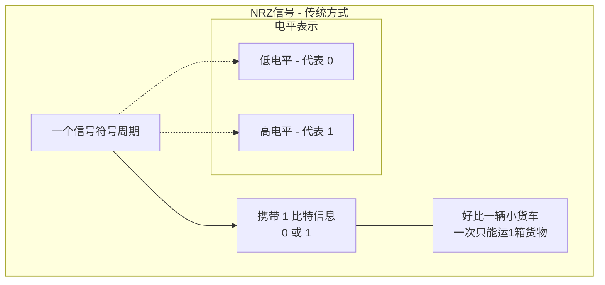
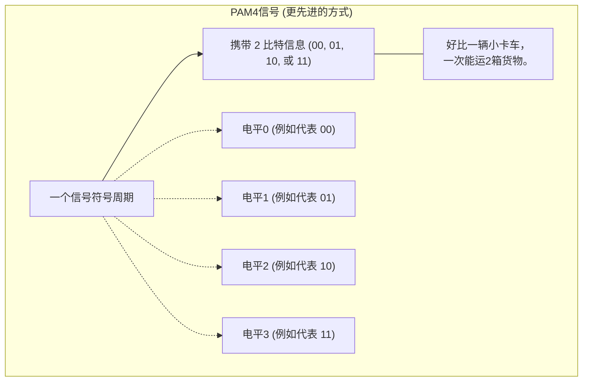
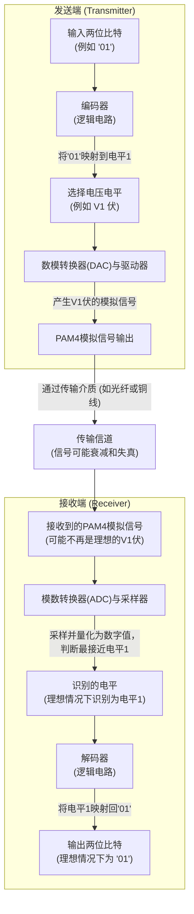

# Chapter 5: PAM4调制技术

在上一章 [行业标准与规范 (OIF/IEEE)](04_行业标准与规范__oif_ieee__.md) 中，我们了解到为了让不同厂商的高速以太网设备能够协同工作，行业标准扮演了多么重要的角色。这些标准定义了像 112 Gbps 甚至 224 Gbps 这样的惊人速率。但你可能会好奇，这些超高速率在物理层面是如何实现的呢？特别是在我们不希望无限提高信号本身开关频率（即波特率）的前提下，有没有更聪明的办法来传输更多的数据呢？答案是肯定的，而 PAM4 调制技术就是其中的关键钥匙之一。

## 5.1 为什么我们需要新的“信号语言”？——PAM4的需求

想象一下，我们有一条数字高速公路（数据通道），我们希望在单位时间内运送尽可能多的“货物”（数据）。在 [以太网速率提升技术](02_以太网速率提升技术_.md) 中我们知道，提高货物运输效率的一种方法是让每辆卡车本身装载更多货物。

传统的数字信号传输方式，比如 **NRZ (Non-Return-to-Zero，不归零编码)**，就像是一种简单的信号语言。在这种语言里，信号只有两种状态，比如高电平和低电平，分别代表数字世界里的“1”和“0”。每次信号变化（一个“符号”），只能传递1比特的信息。

*图5.1: NRZ信号示意图*

如果我们想用NRZ来传输两倍的数据，最直接的想法就是让信号变化的频率（波特率）也提高两倍。但这就像要求高速公路上的车速也提高两倍一样，对“道路”（传输介质）和“车辆”（电子元器件）的性能要求会急剧增加，成本和技术难度也会随之飙升，甚至可能遇到物理极限。

那么，有没有一种方法，在不显著提高信号变化频率（波特率）的前提下，让每个信号“符号”携带更多的信息呢？这就是PAM4调制技术登场的舞台。它提供了一种更“丰富”的信号语言，让我们的“小货车”升级成了“小卡车”，一次能运送更多货物。

## 5.2 什么是PAM4调制技术？

**PAM4 (Pulse Amplitude Modulation 4-level)**，中文叫做“4电平脉冲幅度调制”，是一种先进的信号传输方式。顾名思义，它的核心思想就是使用**四个不同的信号电平状态**来表示信息，而不是传统NRZ的两个。

*   **NRZ：** 只有两个电平，比如0伏代表“0”，1伏代表“1”。
*   **PAM4：** 有四个电平，比如0伏、1伏、2伏、3伏（具体电压值仅为示例）。

**PAM4如何携带更多信息？**

既然PAM4有四个不同的“状态”，那么每个状态就可以用来表示两位二进制数（dibit）：
*   电平0 (最低) 可以代表: **00**
*   电平1 (次低) 可以代表: **01**
*   电平2 (次高) 可以代表: **10**
*   电平3 (最高) 可以代表: **11**

正如本教程概念描述中所说的那样：好比以前的信号灯只有红和绿（代表0和1），PAM4信号灯有四种“颜色”（四个电平状态），所以在相同时间内能传递双倍信息。

*图5.2: PAM4信号示意图*

**数据速率翻倍的奥秘**

我们知道，数据传输速率（比特率）可以用以下公式表示：
`数据速率 = 波特率 × 每符号比特数`

*   对于 **NRZ**：每符号比特数 = 1。所以，数据速率 = 波特率 × 1。
*   对于 **PAM4**：每符号比特数 = 2。所以，数据速率 = 波特率 × 2。

这意味着，**在相同的波特率（信号每秒变化的次数）下，PAM4可以传输两倍于NRZ的数据量！**
这就是为什么PAM4成为实现400G、800G乃至 [下一代以太网速率 (112/224 Gbps 每通道)](03_下一代以太网速率__112_224_gbps_每通道__.md) 的关键技术之一。它允许我们在不急剧提高信号频率的前提下，大幅提升数据吞吐能力。正如项目文档 `Data Center Ethernet Technology and Evolution to 224 Gbps.pdf` 第7页所述：“PAM4 4电平调制使每个数据符号能够携带2比特/符号，从而在通道数和波特率相同的情况下使接口数据速率加倍。”

**一个形象的对比：NRZ vs PAM4 信号波形**

下图展示了NRZ和PAM4信号在传输相同比特序列（例如 `00 01 10 11`）时可能的波形样子。假设每个符号占用一个时间单位。

```mermaid
gantt
    title NRZ 与 PAM4 信号波形对比 (传输 "00011011")
    dateFormat X
    axisFormat %L
    section NRZ (每符号1比特)
    0  :n0, 0, 1
    0  :n1, 1, 1
    1  :n2, 2, 1
    0  :n3, 3, 1
    1  :n4, 4, 1
    1  :n5, 5, 1
    0  :n6, 6, 1
    1  :n7, 7, 1
    %% NRZ信号: 假设0对应低电平, 1对应高电平。
    %% 要传输 00011011，NRZ需要8个符号时间。
    %% 第一个0 (来自00)
    %% 第二个0 (来自00)
    %% 第三个0 (来自01)
    %% 第四个1 (来自01)
    %% 第五个1 (来自10)
    %% 第六个0 (来自10)
    %% 第七个1 (来自11)
    %% 第八个1 (来自11)
    %% 为了简化，我们这里用数字0和1代表电平。

    section PAM4 (每符号2比特)
    电平0 (00) :p00, 0, 2
    电平1 (01) :p01, 2, 2
    电平2 (10) :p10, 4, 2
    电平3 (11) :p11, 6, 2
    %% PAM4信号:
    %% 符号1: 00 -> 电平0
    %% 符号2: 01 -> 电平1
    %% 符号3: 10 -> 电平2
    %% 符号4: 11 -> 电平3
    %% PAM4只需要4个符号时间。
```

*图5.3: NRZ与PAM4信号波形示例 (概念图)*
*(请注意：上图仅为概念示意，实际波形会更复杂。NRZ传输"00011011"需要8个符号，PAM4传输"00 01 10 11"需要4个符号)*

从上图可以看出，为了传输相同的8个比特 (`00011011`)，NRZ信号需要8个时间单位（符号），而PAM4信号只需要4个时间单位（符号），每个符号携带两位比特。

## 5.3 PAM4信号的“长相”：眼图初探

在高速信号领域，工程师们经常使用一种叫做**眼图 (Eye Diagram)** 的工具来评估信号的质量。你可以把它想象成很多信号波形片段叠加在一起形成的图像。如果信号质量好，这个图像看起来就像一个睁开的“眼睛”。

*   对于**NRZ信号**，由于只有两个电平，它的眼图通常只有一个“眼睛”。这个“眼睛”越大越清晰，说明信号质量越好，接收端就越容易区分高低电平。

*   对于**PAM4信号**，由于有四个电平，它的眼图看起来像是三个垂直堆叠在一起的小“眼睛”。

# NRZ与PAM4眼图对比

<svg viewBox="0 0 800 400" xmlns="http://www.w3.org/2000/svg">
  <!-- 背景和标题 -->
  <rect width="800" height="400" fill="#f8f9fa" />
  <text x="400" y="30" font-family="Arial" font-size="20" text-anchor="middle" font-weight="bold">NRZ与PAM4眼图对比</text>
  
  <!-- NRZ眼图部分 -->
  <g transform="translate(200, 200)">
    <!-- NRZ标题 -->
    <text x="0" y="-160" font-family="Arial" font-size="16" text-anchor="middle" font-weight="bold">NRZ眼图</text>
    
    <!-- 坐标轴 -->
    <line x1="-150" y1="0" x2="150" y2="0" stroke="#666" stroke-width="1" />
    <line x1="0" y1="-120" x2="0" y2="120" stroke="#666" stroke-width="1" />
    
    <!-- 时间刻度 -->
    <line x1="-100" y1="-5" x2="-100" y2="5" stroke="#666" stroke-width="1" />
    <line x1="100" y1="-5" x2="100" y2="5" stroke="#666" stroke-width="1" />
    <text x="-100" y="20" font-family="Arial" font-size="12" text-anchor="middle">T₁</text>
    <text x="100" y="20" font-family="Arial" font-size="12" text-anchor="middle">T₂</text>
    
    <!-- 电平刻度 -->
    <line x1="-5" y1="-80" x2="5" y2="-80" stroke="#666" stroke-width="1" />
    <line x1="-5" y1="80" x2="5" y2="80" stroke="#666" stroke-width="1" />
    <text x="-15" y="-80" font-family="Arial" font-size="12" text-anchor="end" alignment-baseline="middle">+V</text>
    <text x="-15" y="80" font-family="Arial" font-size="12" text-anchor="end" alignment-baseline="middle">-V</text>
    
    <!-- NRZ眼图波形 -->
    <path d="M-150,-80 C-130,-80 -120,80 -100,80 L-100,80 C-80,80 -70,-80 -50,-80 L-50,-80 C-30,-80 -20,80 0,80 L0,80 C20,80 30,-80 50,-80 L50,-80 C70,-80 80,80 100,80 L100,80 C120,80 130,-80 150,-80" 
          fill="none" stroke="#0066cc" stroke-width="2" opacity="0.7" />
    <path d="M-150,80 C-130,80 -120,-80 -100,-80 L-100,-80 C-80,-80 -70,80 -50,80 L-50,80 C-30,80 -20,-80 0,-80 L0,-80 C20,-80 30,80 50,80 L50,80 C70,80 80,-80 100,-80 L100,-80 C120,-80 130,80 150,80" 
          fill="none" stroke="#0066cc" stroke-width="2" opacity="0.7" />
    
    <!-- 眼睛区域 -->
    <ellipse cx="0" cy="0" rx="70" ry="60" fill="#0066cc" fill-opacity="0.1" stroke="#0066cc" stroke-width="1" stroke-dasharray="5,3" />
    
    <!-- 标注 -->
    <text x="0" y="-100" font-family="Arial" font-size="14" text-anchor="middle" fill="#0066cc">大眼睛开口</text>
    <path d="M0,-90 L0,-30" stroke="#0066cc" stroke-width="1" stroke-dasharray="3,2" />
  </g>
  
  <!-- PAM4眼图部分 -->
  <g transform="translate(600, 200)">
    <!-- PAM4标题 -->
    <text x="0" y="-160" font-family="Arial" font-size="16" text-anchor="middle" font-weight="bold">PAM4眼图</text>
    
    <!-- 坐标轴 -->
    <line x1="-150" y1="0" x2="150" y2="0" stroke="#666" stroke-width="1" />
    <line x1="0" y1="-120" x2="0" y2="120" stroke="#666" stroke-width="1" />
    
    <!-- 时间刻度 -->
    <line x1="-100" y1="-5" x2="-100" y2="5" stroke="#666" stroke-width="1" />
    <line x1="100" y1="-5" x2="100" y2="5" stroke="#666" stroke-width="1" />
    <text x="-100" y="20" font-family="Arial" font-size="12" text-anchor="middle">T₁</text>
    <text x="100" y="20" font-family="Arial" font-size="12" text-anchor="middle">T₂</text>
    
    <!-- 电平刻度 -->
    <line x1="-5" y1="-90" x2="5" y2="-90" stroke="#666" stroke-width="1" />
    <line x1="-5" y1="-30" x2="5" y2="-30" stroke="#666" stroke-width="1" />
    <line x1="-5" y1="30" x2="5" y2="30" stroke="#666" stroke-width="1" />
    <line x1="-5" y1="90" x2="5" y2="90" stroke="#666" stroke-width="1" />
    <text x="-15" y="-90" font-family="Arial" font-size="12" text-anchor="end" alignment-baseline="middle">+3V</text>
    <text x="-15" y="-30" font-family="Arial" font-size="12" text-anchor="end" alignment-baseline="middle">+V</text>
    <text x="-15" y="30" font-family="Arial" font-size="12" text-anchor="end" alignment-baseline="middle">-V</text>
    <text x="-15" y="90" font-family="Arial" font-size="12" text-anchor="end" alignment-baseline="middle">-3V</text>
    
    <!-- PAM4眼图波形 -->
    <!-- 上层波形 -->
    <path d="M-150,-90 C-140,-90 -130,-30 -120,-30 C-110,-30 -100,30 -90,30 C-80,30 -70,90 -60,90 C-50,90 -40,-90 -30,-90 C-20,-90 -10,-30 0,-30 C10,-30 20,30 30,30 C40,30 50,90 60,90 C70,90 80,-90 90,-90 C100,-90 110,-30 120,-30 C130,-30 140,30 150,30"
          fill="none" stroke="#cc0066" stroke-width="1.5" opacity="0.6" />
    <!-- 中上层波形 -->
    <path d="M-150,-30 C-140,-30 -130,30 -120,30 C-110,30 -100,-90 -90,-90 C-80,-90 -70,-30 -60,-30 C-50,-30 -40,30 -30,30 C-20,30 -10,90 0,90 C10,90 20,-90 30,-90 C40,-90 50,-30 60,-30 C70,-30 80,30 90,30 C100,30 110,90 120,90 C130,90 140,-90 150,-90"
          fill="none" stroke="#cc0066" stroke-width="1.5" opacity="0.6" />
    <!-- 中下层波形 -->
    <path d="M-150,30 C-140,30 -130,90 -120,90 C-110,90 -100,-90 -90,-90 C-80,-90 -70,-30 -60,-30 C-50,-30 -40,30 -30,30 C-20,30 -10,90 0,90 C10,90 20,-90 30,-90 C40,-90 50,-30 60,-30 C70,-30 80,30 90,30 C100,30 110,90 120,90 C130,90 140,-30 150,-30"
          fill="none" stroke="#cc0066" stroke-width="1.5" opacity="0.6" />
    <!-- 下层波形 -->
    <path d="M-150,90 C-140,90 -130,-90 -120,-90 C-110,-90 -100,-30 -90,-30 C-80,-30 -70,30 -60,30 C-50,30 -40,90 -30,90 C-20,90 -10,-90 0,-90 C10,-90 20,-30 30,-30 C40,-30 50,30 60,30 C70,30 80,90 90,90 C100,90 110,-90 120,-90 C130,-90 140,-30 150,-30"
          fill="none" stroke="#cc0066" stroke-width="1.5" opacity="0.6" />
    
    <!-- 眼睛区域 -->
    <ellipse cx="0" cy="-60" rx="40" ry="20" fill="#cc0066" fill-opacity="0.1" stroke="#cc0066" stroke-width="1" stroke-dasharray="3,2" />
    <ellipse cx="0" cy="0" rx="40" ry="20" fill="#cc0066" fill-opacity="0.1" stroke="#cc0066" stroke-width="1" stroke-dasharray="3,2" />
    <ellipse cx="0" cy="60" rx="40" ry="20" fill="#cc0066" fill-opacity="0.1" stroke="#cc0066" stroke-width="1" stroke-dasharray="3,2" />
    
    <!-- 标注 -->
    <text x="80" y="-60" font-family="Arial" font-size="12" text-anchor="start" fill="#cc0066">上眼</text>
    <text x="80" y="0" font-family="Arial" font-size="12" text-anchor="start" fill="#cc0066">中眼</text>
    <text x="80" y="60" font-family="Arial" font-size="12" text-anchor="start" fill="#cc0066">下眼</text>
    <path d="M70,-60 L40,-60" stroke="#cc0066" stroke-width="1" stroke-dasharray="2,1" />
    <path d="M70,0 L40,0" stroke="#cc0066" stroke-width="1" stroke-dasharray="2,1" />
    <path d="M70,60 L40,60" stroke="#cc0066" stroke-width="1" stroke-dasharray="2,1" />
  </g>
  
  <!-- 对比说明 -->
  <text x="400" y="370" font-family="Arial" font-size="14" text-anchor="middle">PAM4: 三个较小眼睛，更高密度，但噪声容限降低</text>
</svg>

## 眼图对比说明

上图展示了NRZ与PAM4眼图的关键差异...

*图5.4: NRZ与PAM4眼图简化示意图*

PAM4的“眼睛”相比NRZ的“眼睛”要小得多。这意味着什么呢？这意味着PAM4信号对噪声和失真更加敏感。在NRZ中，高低电平之间有较大的容忍度；但在PAM4中，四个电平之间的“间隙”变小了，一点点的噪声就可能导致接收端错误地判断信号属于哪个电平，从而导致数据错误。

## 5.4 PAM4的优势与挑战

任何技术都有其两面性，PAM4也不例外。

**PAM4的优势：**

1.  **数据速率加倍：** 这是最核心的优势。在相同的波特率下，数据传输能力翻倍。
2.  **缓解带宽压力：** 因为不需要将波特率提高一倍来达到两倍的数据速率，所以对传输通道（如PCB走线、连接器、光纤）和元器件（如驱动器、接收器）的带宽要求相对较低。这有助于控制成本和技术实现的复杂度。
3.  **推动高速以太网发展：** PAM4是实现 [下一代以太网速率 (112/224 Gbps 每通道)](03_下一代以太网速率__112_224_gbps_每通道__.md) 等更高速率以太网标准（如400GbE, 800GbE, 1.6TbE）的基石技术。

**PAM4的挑战：**

1.  **信噪比 (SNR) 要求更高：** 由于PAM4的四个电平之间的垂直间距（即“眼高”）比NRZ的两个电平间距小（大约是NRZ的1/3），因此它对噪声的容忍度更低。信号更容易受到噪声干扰而出错。
2.  **接收端设计更复杂：** 接收器需要更精确地分辨四个紧密排列的电平，这对模数转换器 (ADC) 和判决电路的设计提出了更高要求。
3.  **对线性度要求更高：** 信号在传输路径中可能会发生非线性失真，这种失真对PAM4信号的影响比对NRZ信号更严重，因为它可能导致不同电平之间的界限模糊不清。
4.  **需要强大的纠错机制：** 由于PAM4信号本身更容易出错（原始误码率更高），因此几乎总是需要配合强大的 [前向纠错 (FEC) 与均衡技术](06_前向纠错__fec__与均衡技术_.md) 来检测和纠正错误，确保数据传输的可靠性。项目文档第13页也强调了这一点：“更高速率光接口的使用也需要引入新的误码率标准、新的FEC（前向纠错）编码方法以及更复杂的接收端均衡器。”

## 5.5 PAM4是如何工作的？（概念性解释）

让我们简单了解一下PAM4信号是如何产生和被解读的。

*图5.5: PAM4信号产生与接收的简化流程*

**在发送端：**
1.  **输入数据：** 串行的二进制数据流被两位两位地分组（例如，`00`, `01`, `10`, `11`）。
2.  **编码：** 一个编码器（通常是数字逻辑电路）将这两位比特映射到预先定义好的四个电压电平之一。
3.  **驱动：** 一个数模转换器 (DAC) 和驱动电路会产生实际的模拟电压信号，并将其发送到传输通道上。

**在接收端：**
1.  **接收与放大：** 信号经过传输后可能会衰减和失真，接收器首先会将其放大。
2.  **采样与判决：** 一个模数转换器 (ADC) 会在特定的时间点对接收到的模拟信号进行采样，并将其转换为数字值。然后，一个判决电路会判断这个采样值最接近四个预设电平中的哪一个。
3.  **解码：** 解码器将判决出的电平转换回对应的两位比特数据。

整个过程听起来简单，但在超高速率下，精确地产生和判决这四个靠得很近的电平是一项极具挑战性的工程任务。

## 5.6 PAM4在高速以太网中的应用

PAM4技术已经成为当前和未来高速以太网标准的关键组成部分。

*   在 [以太网速率提升技术](02_以太网速率提升技术_.md) 章节中，我们将PAM4称为提升速率的“法宝三”——让每辆车运载更多乘客。
*   **100 Gbps 每通道**的电信号和光信号通常就是基于 **50-56 Gbaud（吉波特，即每秒十亿符号）的PAM4** 实现的。例如，IEEE 802.3ck 标准中定义的 100GAUI-1 C2M 接口（芯片到模块）就使用 53.125 Gbaud PAM4，实际数据速率为 106.25 Gbps，行业内常称之为 112G 级别。项目文档第10页提到：“对于800G第一代，IEEE 802.3标准数据速率是53.125 GBd PAM4，即106.25 Gbps。而OIF CEI规范的数据速率范围是从38到58 GBd PAM4，即76到116 Gbps，但已将112 Gbps作为接口的描述性标题。”
*   **400G以太网**接口广泛采用PAM4。例如，一种常见的实现方式是其电接口使用8路50 Gbps的PAM4信号（即每路电信号波特率为25 Gbaud，每符号2比特），而光接口可能是4路100 Gbps的PAM4信号（每路光信号波特率为50 Gbaud）。项目文档第8页描述了400G以太网：“如今最常见的实现是在电端口使用8 x 50G PAM4（即25 GBd），在光端口结合使用8 x 50G PAM4或4 x 100G PAM4（50 GBd）。”
*   **800G以太网**及未来的 **1.6T以太网**，PAM4仍将扮演核心角色，甚至可能探索更高阶的PAM调制（如PAM6或PAM8）或将PAM4的波特率进一步提升至100 Gbaud以上以实现单通道224 Gbps的速率。

可以说，没有PAM4技术，我们很难经济高效地实现今天数据中心所需的海量带宽。

## 5.7 总结与展望

在本章中，我们一起探索了PAM4调制技术。我们了解到：
*   PAM4通过使用四个不同的信号电平，使得每个信号符号可以携带两位比特的信息。
*   在相同的波特率下，PAM4的数据传输速率是传统NRZ的两倍。
*   PAM4是实现现代高速以太网（如400G、800G及更高）的关键技术，它帮助我们在不急剧增加信号频率的前提下大幅提升了数据吞吐量。
*   PAM4的“三眼”眼图揭示了它对噪声更敏感的特性，因此带来了信噪比要求高、接收端设计复杂等挑战。

虽然PAM4技术非常强大，但它对信号质量的要求也更高，更容易受到各种干扰的影响。那么，工程师们是如何应对这些挑战，确保数据在如此“拥挤”的信号空间中依然能够准确无误地传输呢？这就需要我们下一章将要学习的“护航员”——[前向纠错 (FEC) 与均衡技术](06_前向纠错__fec__与均衡技术_.md)。敬请期待！

---

Generated by [AI Codebase Knowledge Builder](https://github.com/The-Pocket/Tutorial-Codebase-Knowledge)