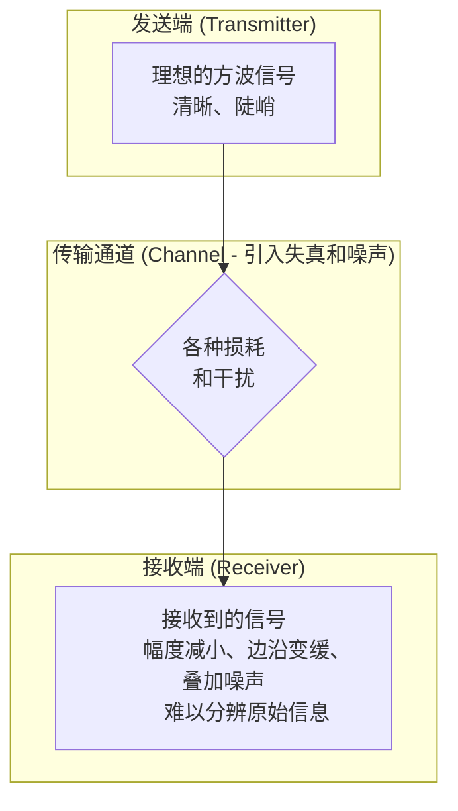
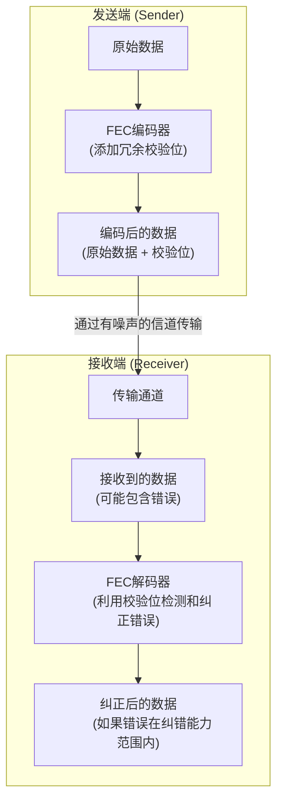
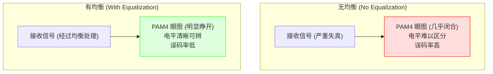
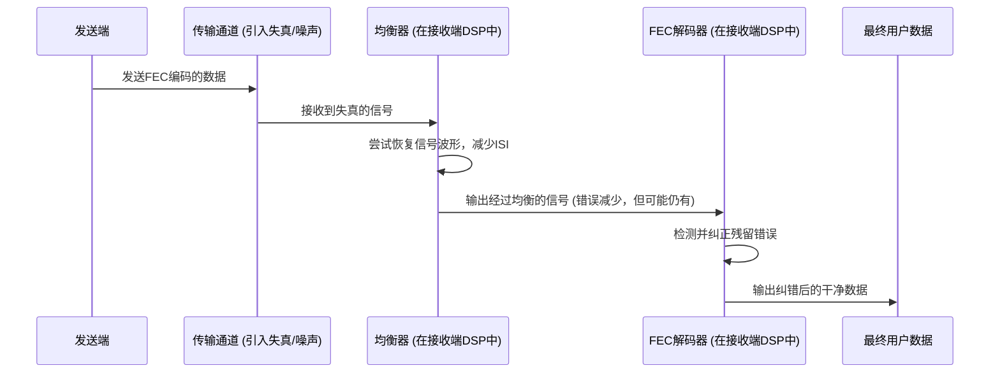

# Chapter 6: 前向纠错 (FEC) 与均衡技术

欢迎来到《数据中心以太网技术及向224 Gbps的演进》教程的第六章！

在上一章 [PAM4调制技术](05_pam4调制技术_.md) 中，我们学习了PAM4如何通过在每个信号符号中承载更多比特来帮助我们提升数据传输速率。然而，我们也提到，PAM4信号因为电平间距更小，所以对噪声和失真更加敏感，就像在一张更“拥挤”的纸上写字，更容易写错或看错。那么，我们如何在这些充满挑战的高速链路中确保数据能够准确无误地送达呢？这就是本章要介绍的两位“护航英雄”——前向纠错 (FEC) 和均衡技术——大显身手的地方了。

## 6.1 “信号杀手”：失真与噪声

想象一下，你正在用对讲机和远方的朋友通话。如果中间隔着很多障碍物，或者附近有很强的电磁干扰，你朋友听到的声音可能就会断断续续、模糊不清，甚至完全听错。高速数据传输也面临类似的问题。

当数据信号（无论是电信号还是光信号）在传输介质（如PCB电路板走线、连接器、光纤）中飞速前进时，它会遇到各种“艰难险阻”，导致信号波形发生变化，不再是发送端发送时的理想样子。这些不期望的变化统称为**信号失真 (Signal Distortion)**，同时还可能混入各种**噪声 (Noise)**。

主要的“信号杀手”包括：
*   **衰减 (Attenuation):** 信号在长距离传输后能量会减弱，就像声音传远了会变小。
*   **色散 (Dispersion):** 在光纤中，不同波长（颜色）的光或同一波长的不同模式传播速度略有不同，导致信号脉冲在时间上展宽、变形，就像一队人跑步，有的人快有的人慢，队伍就散了。
*   **码间干扰 (Inter-Symbol Interference, ISI):** 由于通道的带宽限制和反射等因素，前一个发送的信号符号的“尾巴”可能会拖延到当前符号的时间段，干扰当前符号的判决。就像说话太快，前一个字的音还没落，后一个字的音就出来了，听起来含混不清。
*   **串扰 (Crosstalk):** 相邻信号线上的信号会相互干扰，就像隔壁房间说话声音太大，影响到你一样。
*   **其他噪声源：** 例如元器件本身产生的热噪声、外部电磁干扰等，它们会随机地叠加在信号上。

下图展示了一个理想的数字信号和经过有损信道传输后可能产生的失真和噪声：

*图6.1: 信号在传输过程中的失真与噪声示意*

对于像 [PAM4调制技术](05_pam4调制技术_.md) 这样拥有多个紧密电平的信号来说，这些失真和噪声的影响尤为致命，很容易导致接收端把一个电平误判为另一个电平，造成数据错误。

那么，我们如何对抗这些“信号杀手”，确保数据传输的可靠性呢？这就需要前向纠错 (FEC) 和均衡技术联手出击了。

## 6.2 “智能校对员”：前向纠错 (FEC)

**前向纠错 (Forward Error Correction, FEC)** 是一种非常聪明的技术，它允许接收端在不需要发送端重传数据的情况下，自动检测并纠正一定数量的传输错误。

**核心思想：添加冗余信息**

FEC 的工作原理，简单来说，就是在原始数据中加入一些额外的、具有特定规律的**冗余信息**（也称为校验位或纠错码）。这些冗余信息就像给数据包穿上了一层“智能盔甲”。当数据包在传输过程中受到攻击（发生错误）时，接收端可以利用这些冗余信息来发现错误，甚至修复它。

*   **一个简单的比喻（概念性）：**
    假设你想通过一个不太可靠的信使传递一个重要的三位数号码，比如“123”。为了防止信使记错，你可以在纸条上额外写上这三个数字的和：“123 (和:6)”。
    *   如果信使送达的是“123 (和:6)”，接收方计算1+2+3=6，与记录的“和:6”一致，数据正确。
    *   如果信使送达的是“124 (和:6)”，接收方计算1+2+4=7，与记录的“和:6”不一致，检测到错误。如果FEC算法更强大，它甚至可能推断出是哪个数字错了并进行纠正（例如，如果只允许一位错误，它可能会尝试修改每一位看是否能匹配校验和）。

当然，实际的FEC算法比这个比喻复杂得多，但核心思想是相似的——**用额外的冗余信息来换取纠错能力。**

**FEC的工作流程：**

*图6.2: 前向纠错 (FEC) 工作流程示意图*

1.  **发送端：**
    *   原始数据被送入 **FEC编码器 (FEC Encoder)**。
    *   编码器根据特定的FEC算法（如里德-所罗门码 Reed-Solomon, RS-FEC；或低密度奇偶校验码 LDPC）计算出冗余的校验位，并将它们附加到原始数据后面，形成一个**码字 (Codeword)**。
2.  **传输通道：**
    *   编码后的数据（码字）通过有噪声和损耗的信道进行传输。在这个过程中，一些比特可能会发生错误（从0变成1，或从1变成0）。
3.  **接收端：**
    *   接收到的数据（可能已损坏）被送入 **FEC解码器 (FEC Decoder)**。
    *   解码器利用接收到的数据和校验位，根据与编码器相同的FEC算法进行计算。
    *   **如果检测到错误并且错误数量在FEC算法的纠错能力范围之内**，解码器就能自动纠正这些错误，恢复出原始数据。
    *   **如果错误太多，超出了FEC的纠错极限**，解码器可能只能检测到错误但无法纠正，或者更糟的情况是错误地“纠正”到一个错误的数据上（称为误纠错，但概率极低）。通常情况下，系统会标记这些不可纠错的帧。

**常见的FEC类型：里德-所罗门码 (RS-FEC)**

在高速以太网中，**里德-所罗门码 (Reed-Solomon codes)** 是一种非常常见的FEC类型。例如，400G以太网标准中广泛使用了称为 **RS(544,514) FEC** 的一种RS码，有时也称为 **KP4 FEC**。

*   **RS(544,514) 是什么意思？**
    *   它表示这个FEC码将数据分成块（符号块，每个符号通常是10比特）。
    *   **514**：代表每个码字中包含514个原始数据符号。
    *   **544**：代表每个码字的总长度是544个符号。
    *   那么，冗余的校验符号数量就是 `544 - 514 = 30` 个符号。
    *   这种FEC通常能够纠正最多 **15个符号错误** 在这544个符号组成的码字中。

**FEC的“双刃剑”：**

*   **好处：**
    *   **提高可靠性：** 显著降低误码率 (Bit Error Rate, BER)，即使在信号质量较差的链路上也能实现可靠通信。
    *   **减少重传：** 由于能自动纠错，避免了因错误而请求发送端重传数据，从而降低了延迟，提高了网络效率。这对于延迟敏感的应用尤其重要。
*   **代价：**
    *   **带宽开销 (Overhead):** 增加了冗余校验位，意味着实际传输的总比特数比原始数据要多，占用了额外的带宽。例如，RS(544,514) 的开销大约是 `(544-514)/514 ≈ 5.8%`。
    *   **处理延迟 (Latency):** FEC编码和解码过程需要进行复杂的计算，这会引入一定的处理延迟。
    *   **功耗增加：** 执行FEC运算的芯片会消耗额外的功率。

尽管有这些代价，但在高速数据传输中，FEC带来的好处远远大于其成本。没有FEC，许多现代高速接口（尤其是使用 [PAM4调制技术](05_pam4调制技术_.md) 的接口）将无法可靠工作。项目文档 `Data Center Ethernet Technology and Evolution to 224 Gbps.pdf` 第13页明确指出：“对于800G以太网，以及单通道速率为224 Gbps时，链路的原始误码率将会更高（例如1E-3），这将需要更强大的FEC纠错方法...”。

## 6.3 “信号整形师”：均衡技术

虽然FEC非常强大，能够纠正已经发生的错误，但我们更希望尽量减少错误的发生。这就需要**均衡技术 (Equalization)** 出马了。均衡技术就像一位技艺高超的“信号整形师”，它试图在信号到达判决器之前，修复或补偿信号在传输通道中产生的失真。

**核心思想：补偿信道损失，恢复信号形态**

想象一下，你戴的眼镜。如果你的视力不好（相当于信号经过了有损信道），看到的物体会模糊不清（信号失真）。眼镜（均衡器）通过特定的透镜组合，校正了光线的路径，让你重新看到清晰的图像（恢复的信号）。

均衡技术就是通过设计特殊的**滤波器 (Filter)** 来“反转”或补偿信道对信号造成的不良影响，尤其是码间干扰 (ISI)。它的目标是让接收到的信号波形尽可能地恢复到发送时的理想形状，从而更容易被接收端的判决器正确识别。

**均衡技术如何“睁开”信号的眼睛？**

我们之前在 [PAM4调制技术](05_pam4调制技术_.md) 中提到过**眼图 (Eye Diagram)**。一个“睁得大而清晰”的眼睛代表信号质量好。信道失真会导致眼图闭合，使得不同电平难以区分。均衡器的作用就是努力“睁开”这个闭合的眼睛。

*图6.3: 均衡技术对PAM4眼图的改善效果示意图*

**常见的均衡器类型（简化理解）：**

均衡器可以位于发送端（预均衡/预加重）或接收端（自适应均衡），通常在接收端的数字信号处理器 (DSP) 中实现。

1.  **连续时间线性均衡器 (Continuous Time Linear Equalizer, CTLE):**
    *   这是一种**模拟滤波器**，通常位于接收器的最前端。
    *   它的作用是调整信号的频率响应，例如，由于信道通常会衰减高频分量，CTLE会适当**增强高频分量**，以补偿信道的高频损耗。
    *   可以想象成音响上的高音调节旋钮，如果声音听起来太闷（高音不足），你可以调高高音。

2.  **前馈均衡器 (Feed-Forward Equalizer, FFE):**
    *   这是一种**数字滤波器**。它通过对当前和若干个**过去**的采样值进行加权求和来调整当前采样值，从而消除由过去符号引起的码间干扰。
    *   它有一系列可调节的“抽头” (tap)，每个抽头对应一个延迟的信号样本和一个权重系数。通过优化这些权重系数，FFE可以有效地消除前向的ISI。
    *   比如，一个5抽头的FFE会考虑当前符号和它之前的4个符号。

3.  **判决反馈均衡器 (Decision Feedback Equalizer, DFE):**
    *   这也是一种**数字滤波器**，通常与FFE结合使用。
    *   与FFE不同的是，DFE利用**已经判决出的过去符号**来估计它们对当前符号造成的干扰，然后从当前符号中减去这个估计的干扰值，再对当前符号进行判决。
    *   DFE对于消除后向的ISI（即由后续符号引起的干扰，虽然不直观，但可以理解为一种滤波效果）非常有效。
    *   **优点：** 通常比FFE更强大。
    *   **缺点：** 如果过去的判决是错误的，那么这个错误会反馈回来影响当前的判决，可能导致错误传播。

项目文档 `Data Center Ethernet Technology and Evolution to 224 Gbps.pdf` 第13页提到：“IEEE 802.3bs为400G以太网光符合性测试定义了一个具有5抽头FIR滤波器的参考均衡器。然而，在实践中，许多芯片公司实际实现的均衡器比这个参考均衡器复杂得多，例如10或20抽头。” 这说明了均衡技术在实际高速链路中的复杂性和重要性。

**均衡器的自适应性：**

许多现代均衡器都是**自适应 (Adaptive)** 的，这意味着它们可以根据信道特性的变化（例如温度变化、连接器插拔等引起的信道变化）自动调整其滤波器系数，以始终保持最佳的均衡效果。

## 6.4 黄金搭档：FEC与均衡的协同作战

FEC和均衡技术并不是孤立工作的，它们更像是一对“黄金搭档”，协同作战以确保数据的可靠传输。

1.  **均衡器先上场“清理战场”：**
    *   当失真和噪声严重的信号到达接收端时，均衡器首先努力“修复”信号波形，尽可能地减少码间干扰，提高信噪比，“睁开”信号的眼图。这为后续的FEC解码创造了更有利的条件。
2.  **FEC再来“查漏补缺”：**
    *   即使经过均衡处理，信号中可能仍然会残留一些错误，尤其是当信道条件非常恶劣或者噪声非常大时。
    *   这时，FEC解码器就接手了，它利用编码时加入的冗余信息来检测并纠正这些残留的错误。

可以这样理解它们的关系：
*   **均衡技术** 致力于 **预防错误** 的发生，通过改善信号质量来降低原始误码率 (Pre-FEC BER)。
*   **前向纠错 (FEC)** 致力于 **纠正已经发生** 的错误，将经过均衡后仍然存在的错误进一步消除，从而达到目标误码率 (Post-FEC BER，例如1E-12或更低)。

*图6.4: FEC与均衡协同工作流程示意图*

没有均衡技术，仅靠FEC可能难以应对高速链路中严重的信号失真，因为如果原始错误太多，超出了FEC的纠错能力，FEC也无能为力。反过来，如果没有FEC，即使有很好的均衡，一些随机噪声或残余失真仍可能导致错误，无法达到极低的误码率要求。

因此，在像 [下一代以太网速率 (112/224 Gbps 每通道)](03_下一代以太网速率__112_224_gbps_每通道__.md) 这样的超高速系统中，复杂而强大的均衡技术与高效的FEC方案是必不可少的组合。

## 6.5 为什么它们对224 Gbps如此重要？

随着单通道速率向112 Gbps甚至224 Gbps迈进，挑战也随之升级：
*   **更高的波特率/更复杂的调制：** 为了达到这些速率，我们需要更高的波特率（如112 Gbaud）或更复杂的调制（如PAM4，甚至未来的PAM6/PAM8）。无论是哪种情况，信号都更容易受到损伤。
    *   更高的波特率意味着信号在单位时间内变化更快，对信道带宽要求更高，ISI更严重。
    *   更复杂的调制（如PAM4的4个电平，PAM8的8个电平）意味着电平之间的间隔更小，对噪声更敏感，眼高更低。
*   **信道损耗更大：** 在更高的频率下，信号通过PCB走线、连接器和线缆时的衰减通常更大。
*   **更严格的误码率要求：** 尽管原始误码率可能较高，但最终用户应用（如数据中心存储、计算）通常要求极低的误码率（例如，10⁻¹² 到 10⁻¹⁵）。

在这种情况下：
*   **均衡技术** 必须更加强大和智能，才能有效地补偿更严重的信道损伤，并从噪声中“捞出”微弱的信号差异。这可能需要更多抽头的FFE/DFE，以及更精密的CTLE设计。
*   **FEC技术** 也必须具有更强的纠错能力（可能需要更低的编码率，即更多的冗余位，或者更先进的编码方案如LDPC码的不同变种），才能处理均衡后仍然较高的原始误码率，并将其降低到可接受的水平。

正如项目文档 `Data Center Ethernet Technology and Evolution to 224 Gbps.pdf` 第13页所强调的，为了实现224 Gbps的光信号传输，需要解决的关键技术包括“更复杂的接收端均衡器”和“新的FEC编码方法”。

## 6.6 总结与展望

在本章中，我们学习了前向纠错 (FEC) 和均衡技术这两大“护法神功”，它们是如何帮助我们在充满挑战的高速数据传输链路中确保数据可靠性的。
*   我们了解了信号在传输过程中会遭遇各种**失真和噪声**。
*   **前向纠错 (FEC)** 通过在数据中添加冗余信息，使得接收端能够自动检测并纠正一定数量的错误，就像一位“智能校对员”。
*   **均衡技术** 则通过滤波器补偿信道损耗和失真，努力恢复信号的原始形态，就像一位“信号整形师”。
*   这两者是**黄金搭档**，均衡器先清理战场，FEC再查漏补缺，共同为高速数据传输保驾护航。
*   对于 [PAM4调制技术](05_pam4调制技术_.md) 和向 [下一代以太网速率 (112/224 Gbps 每通道)](03_下一代以太网速率__112_224_gbps_每通道__.md) 演进而言，FEC和均衡技术是不可或缺的关键组成部分。

现在我们已经了解了数据如何在高速链路中被调制 (PAM4)、被保护 (FEC与均衡)，那么承载这些高速光信号的物理部件——光模块，它们又是如何设计和工作的呢？光模块内部有哪些关键组件？它们是如何将电信号转换成光信号，又如何将光信号转回电信号的？

在下一章 **[高速光模块与封装技术](07_高速光模块与封装技术_.md)** 中，我们将一起揭开这些精密“光电转换器”的神秘面纱。敬请期待！

---

Generated by [AI Codebase Knowledge Builder](https://github.com/The-Pocket/Tutorial-Codebase-Knowledge)