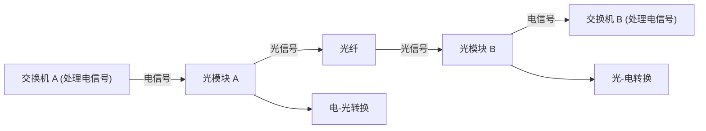
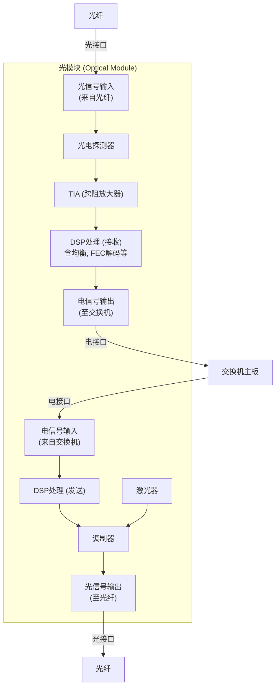
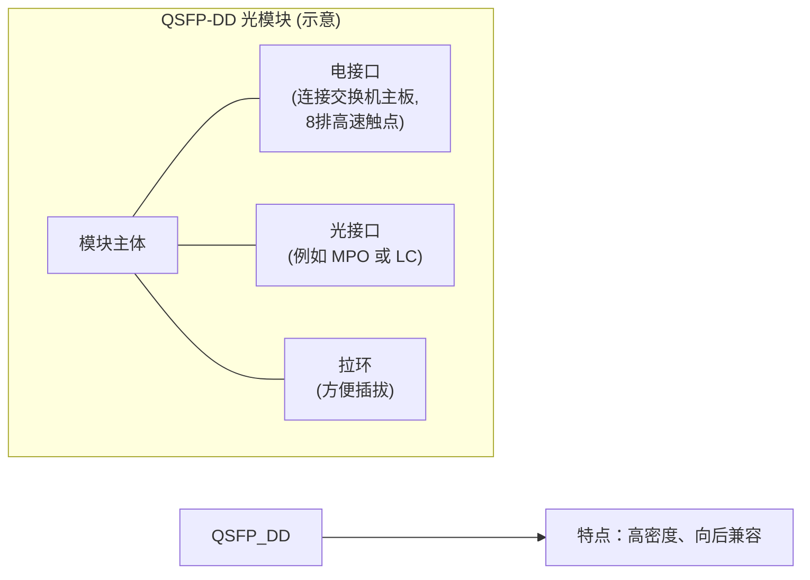
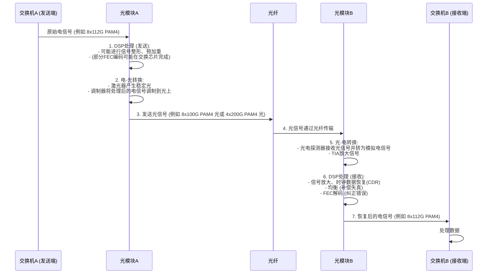
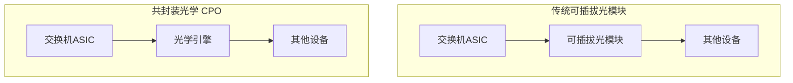

# Chapter 7: 高速光模块与封装技术

在上一章 [前向纠错 (FEC) 与均衡技术](06_前向纠错__fec__与均衡技术_.md) 中，我们学习了如何通过FEC和均衡技术来保护高速信号，确保数据在充满挑战的传输路径中依然能够准确无误。我们知道了如何“校对”和“整形”这些以 [PAM4调制技术](05_pam4调制技术_.md) 承载的复杂信号。但是，当数据需要在数据中心的不同设备之间，特别是相隔一定距离的设备之间（例如几十米到几公里）飞速传输时，仅仅依靠电信号已经力不从心了。这时，我们需要一种更高效的媒介——光纤，以及一种能将电信号与光信号巧妙转换的“魔盒”——高速光模块。本章，我们将一起探索这些数据传输的“翻译官”和“快递员”。

## 7.1 引言：光模块——数据中心的“光电信使”

想象一下，在一个超大规模的数据中心里，成千上万台服务器和网络交换机需要以极高的速度交换海量数据。正如我们在 [数据中心互连架构](01_数据中心互连架构_.md) 中看到的，叶交换机和脊交换机之间可能相隔数十米甚至数百米。如果使用传统的铜质电缆来传输像 400G、800G 甚至未来 1.6T 这样的超高速信号，信号衰减会非常严重，而且电缆会非常笨重且昂贵。

这时候，**光纤 (Optical Fiber)** 闪亮登场了！光纤以光的形式传输数据，具有损耗低、带宽高、抗电磁干扰能力强等优点，是长距离高速数据传输的理想选择。但是，我们的交换机芯片处理的是电信号，光纤传输的是光信号，它们之间如何沟通呢？

**高速光模块 (High-Speed Optical Module)** 就是解决这个问题的关键硬件组件。它们就像是插入在交换机等网络设备上的小型“转换器”，负责将设备内部的电信号转换成光信号发送到光纤中，或者将从光纤接收到的光信号转换回电信号供设备处理。

**核心用例：** 假设数据中心的一台叶交换机需要向500米外的另一台脊交换机发送大量数据（例如，一部高清电影的多个副本）。
1.  叶交换机将数据以电信号的形式传递给插入其中的高速光模块。
2.  光模块将这些电信号转换成特定波长的光信号。
3.  光信号通过连接在光模块上的光纤，以极快的速度传输到脊交换机。
4.  脊交换机上的光模块接收到光信号，并将其转换回电信号，供脊交换机处理。

没有光模块，数据中心内中长距离的高速互连将难以实现。它们是名副其实的“光电信使”。

## 7.2 光模块的核心任务：电与光的“翻译官”

光模块最核心、最基本的任务就是实现**电信号与光信号之间的相互转换**。

*   **电-光转换 (Electrical-to-Optical, E-O Conversion):** 当数据需要从网络设备发送出去时，光模块会将设备产生的数字电信号（例如，由 [PAM4调制技术](05_pam4调制技术_.md) 编码的信号）转换成光信号。
*   **光-电转换 (Optical-to-Electrical, O-E Conversion):** 当数据从光纤传输到网络设备时，光模块会将接收到的光信号转换回数字电信号，以便设备进行处理。

我们可以把光模块比作一位精通“电信号语”和“光信号语”的**翻译官**。它确保了电子设备的世界和光学传输的世界能够无缝沟通。

*图7.1: 光模块作为电光转换的“翻译官”*

## 7.3 探秘光模块内部：小身材有大能量

别看光模块通常只有火柴盒大小，其内部却集成了非常精密的光学和电子组件。它们就像一个微型的光通信系统。一个典型的光模块通常包含以下关键部件：

*   **激光器 (Laser Diode, LD):**
    *   **作用：** 产生光信号的源头。它能发出特定波长的稳定光束。
    *   **类比：** 就像一个微型手电筒，但发出的光是经过精确控制的。
*   **调制器 (Modulator):**
    *   **作用：** 将来自交换芯片的电信号（承载着数据）“叠加”或“调制”到激光器产生的光束上。这改变了光的一些特性（如强度），从而使光携带上数据信息。对于高速信号，如使用 [PAM4调制技术](05_pam4调制技术_.md) 的信号，调制器需要非常快速和精确地工作。
    *   **类比：** 像一个快速开关，根据数据信号的有无或电平高低来控制光束的亮暗或强度变化。
*   **光电探测器 (Photodetector, PD):**
    *   **作用：** 在接收端，它负责接收从光纤传来的光信号，并将其转换回电信号。
    *   **类比：** 像一个对光敏感的“眼睛”，能感知光的强度变化并产生相应的电流。
*   **数字信号处理器 (Digital Signal Processor, DSP):**
    *   **作用：** 这是光模块的“大脑”。对于高速光模块尤其重要。DSP负责处理复杂的电信号，例如：
        *   在发送端进行信号预处理（如预加重）。
        *   在接收端进行信号放大、时钟数据恢复 (CDR)、[均衡技术](06_前向纠错__fec__与均衡技术_.md)（补偿信号在光纤和模块内部的损耗和失真）以及 [前向纠错 (FEC)](06_前向纠错__fec__与均衡技术_.md) 解码（纠正传输中产生的错误）。
        *   对于多通道光模块（例如4x100G），DSP还可能负责将多路低速电信号“复用”成高速光信号，或反之。
    *   **类比：** 像一个多功能信号处理器，既能“美化”待发送的信号，又能“修复”和“解读”接收到的信号。
*   **光接口 (Optical Interface):**
    *   **作用：** 光模块与光纤连接的物理接口。常见的类型有LC（用于单/双纤）和MPO（用于多芯并行光纤）。
    *   **类比：** 光纤的“插座”。
*   **电接口 (Electrical Interface):**
    *   **作用：** 光模块与网络设备（如交换机）主板连接的物理接口。它负责传输电信号以及供电。
    *   **类比：** 模块插入交换机的“金手指”部分。
*   **其他组件：** 还包括跨阻放大器 (TIA)、驱动电路、微控制器 (MCU) 用于监控和控制等。

下图展示了一个简化的高速光模块内部主要功能部件示意图：

*图7.2: 高速光模块内部主要功能部件示意图*

正是这些精密组件的协同工作，使得小小的光模块能够承载起 [下一代以太网速率 (112/224 Gbps 每通道)](03_下一代以太网速率__112_224_gbps_每通道__.md) 甚至更高速率的数据传输。

## 7.4 光模块的“外衣”：封装形式 (QSFP-DD, OSFP)

光模块有许多不同的**封装形式 (Form Factor)**，你可以把它们理解为光模块的“标准身材”和“标准接口类型”。选择合适的封装形式对于数据中心的设备密度、功耗和散热都非常重要。就像买衣服要选对尺码一样。

随着以太网速率不断提升，对光模块的封装也提出了更高的要求：**小尺寸、低功耗且性能强大**。

对于现代数据中心常用的 400G、800G 甚至更高速度的接口，目前主流的封装形式主要有：

*   **QSFP-DD (Quad Small Form-factor Pluggable Double Density):**
    *   "Quad" 指的是它支持4个高速数据通道。
    *   "Small Form-factor Pluggable" 表示它是一种小尺寸的可插拔模块。
    *   "Double Density" 意味着它在QSFP封装的基础上将电接口的触点数量增加了一倍（从4排增加到8排），从而能够在相同的模块尺寸下支持更高的数据速率（例如8个电通道）。
    *   QSFP-DD800 支持8路100G (更准确地说是112G级别) 的电信号，总带宽达到800G。它向后兼容QSFP28 (100G) 和QSFP56 (200G) 模块，这意味着你可以在支持QSFP-DD的端口上插入旧的QSFP模块。
    *   项目文档第11页 `Figure 6` 展示了QSFP-DD800封装。

*   **OSFP (Octal Small Form-factor Pluggable):**
    *   "Octal" 指的是它支持8个高速数据通道。
    *   OSFP模块的尺寸比QSFP-DD略大一些，这使得它在散热和集成更复杂光学组件方面可能具有一些优势，尤其是在功耗较高的场景下。
    *   OSFP也支持800G及以上的速率。

**为什么封装形式很重要？**
*   **端口密度 (Port Density):** 交换机面板空间有限，更小尺寸的封装可以在一块面板上集成更多的端口，提高设备的处理能力。
*   **功耗与散热 (Power Consumption & Thermal Management):** 高速光模块会产生热量，封装设计需要考虑有效的散热，以保证模块稳定工作。OSFP因尺寸稍大，散热能力通常被认为更好。
*   **互操作性 (Interoperability):** 标准化的封装确保了不同厂商生产的符合相同封装标准的光模块可以在兼容的设备上互换使用。

下图是一个QSFP-DD封装的光模块简化示意图：

*图7.3: QSFP-DD光模块封装示意图*

选择QSFP-DD还是OSFP，往往取决于具体的应用场景、成本、功耗预算以及对未来升级路径的考虑。

## 7.5 光模块的工作流程：一次完整的数据“快递”之旅

让我们通过一个简化的时序图，来看看当数据从交换机A发送到交换机B时，光模块是如何完成一次完整的“快递”任务的。

*图7.4: 光模块数据传输流程示意图*

**发送过程 (交换机A -> 光模块A -> 光纤):**
1.  **电信号输入：** 交换机A的芯片将要发送的数据以高速电信号的形式（例如，多路并行的 [PAM4调制技术](05_pam4调制技术_.md) 信号）传递给光模块A的电接口。
2.  **DSP处理 (发送端)：** 光模块A内部的DSP对这些电信号进行处理，可能包括信号的重定时(Re-timing)、整形(Re-shaping)或预加重(Pre-emphasis)，以优化即将进行光调制的信号质量。
3.  **电-光转换：**
    *   激光器(LD)产生稳定的连续光波。
    *   调制器根据经过DSP处理的电信号，改变激光的特性（通常是光的强度），从而将数据信息“刻印”到光波上。
4.  **光信号输出：** 携带数据信息的光信号从光模块A的光接口输出，进入光纤。

**接收过程 (光纤 -> 光模块B -> 交换机B):**
5.  **光信号输入：** 经过光纤传输的光信号从光模块B的光接口进入模块。
6.  **光-电转换：**
    *   光电探测器(PD)接收到光信号，并将其转换成微弱的模拟电流信号。
    *   跨阻放大器(TIA)将这个微弱的电流信号转换成电压信号，并进行放大。
7.  **DSP处理 (接收端)：** 这是非常关键的一步。
    *   模拟信号被转换为数字信号。
    *   DSP进行时钟和数据恢复(CDR)，从带有噪声和失真的信号中准确地提取出时钟信号和数据。
    *   执行强大的 [均衡技术](06_前向纠错__fec__与均衡技术_.md) 来补偿信号在光纤和模块内部传输过程中产生的各种损耗和失真，努力“睁开”信号的眼图。
    *   执行 [前向纠错 (FEC)](06_前向纠错__fec__与均衡技术_.md) 解码，检测并纠正传输中可能发生的比特错误，确保数据的完整性。
8.  **电信号输出：** 经过DSP处理和恢复的干净电信号从光模块B的电接口输出，传递给交换机B的芯片进行后续处理。

这个“快递”过程虽然看起来步骤繁多，但得益于高度集成的光电器件和强大的DSP芯片，整个转换和处理过程在极短的时间内完成，确保了数据中心内高速、低延迟的通信。

## 7.6 未来趋势：共封装光学 (CPO)

随着数据速率的不断攀升（例如单通道向224 Gbps迈进，总带宽向1.6T甚至3.2T演进），传统的**可插拔光模块 (Pluggable Optics)** 面临着越来越大的挑战，尤其是在功耗和信号完整性方面。当电信号需要在交换机主板上从交换芯片传输到面板边缘的可插拔模块时，这段距离上的损耗和干扰会随着速率的提高而急剧增加。

为了应对这些挑战，**共封装光学 (Co-Packaged Optics, CPO)** 技术应运而生。

**CPO的核心思想：** 将光学引擎（包含激光器、调制器、探测器等核心光器件）尽可能地靠近（甚至集成在同一封装基板上）交换芯片或计算芯片。

*   **目标：**
    *   **缩短电信号路径：** 大幅减少高速电信号在PCB板上的传输距离，从而降低信号损耗和功耗。
    *   **提高信号完整性：** 更短的电连接意味着更少的失真和干扰。
    *   **提升带宽密度：** 可以在芯片周围集成更多的光I/O。
    *   **潜在的成本降低：** 长期来看，通过高度集成有望降低整体方案成本。

项目文档第12页也提到了CPO：“In future developments, the electrical output interface of the chip will be replaced by using co-packaged optics (CPO) technology. CPO will directly integrate laser engines on switch chips and computing chips, providing an optical connection interface.” （在未来的发展中，芯片的电输出接口将被共封装光学(CPO)技术所取代。CPO将直接在交换芯片和计算芯片上集成激光引擎，提供光连接接口。）

*图7.5: 传统可插拔光模块与共封装光学 (CPO) 对比示意图*

CPO被认为是未来实现更高速率（如Tbps级别光互连）和更低每比特功耗的关键技术路径之一。然而，CPO也面临着许多技术挑战，例如光源集成、散热管理、不同材料的集成工艺、可制造性和可维护性等。目前，CPO技术仍在积极发展和标准化过程中。

## 7.7 总结与展望

在本章中，我们深入了解了数据中心里的“光电信使”——高速光模块。我们学习了：
*   光模块的核心任务是进行**电信号与光信号的相互转换**，使得数据能够在光纤中高效传输。
*   光模块内部集成了**激光器、调制器、光电探测器和强大的DSP**等关键组件，协同完成复杂的信号处理和转换任务。
*   主流的高速光模块封装形式如 **QSFP-DD 和 OSFP**，它们致力于在小尺寸内实现高性能和低功耗。
*   我们通过一个数据“快递”的例子，了解了光模块发送和接收数据的完整工作流程。
*   最后，我们展望了未来的**共封装光学 (CPO)** 技术，它有望将光学引擎与交换芯片更紧密地集成，以应对未来更高速率带来的挑战。

这些精密的光模块是构建现代高速数据中心网络的基石。它们将电信号转换成可在光纤中远距离传输的光信号，又将接收到的光信号还原为电信号，默默地支撑着海量数据的流动。

那么，有了这些能够产生和接收高速光信号的精密模块，我们如何确保它们发出的信号质量符合标准？如何验证它们在各种压力条件下仍能可靠工作呢？这就需要一套完善的测试和验证方法。

在下一章 **[高速信号测试与验证](08_高速信号测试与验证_.md)** 中，我们将一起探讨工程师们是如何使用专业的测试仪器和方法，来为这些高速信号和光模块进行“体检”和“性能测试”的。敬请期待！

---

Generated by [AI Codebase Knowledge Builder](https://github.com/The-Pocket/Tutorial-Codebase-Knowledge)