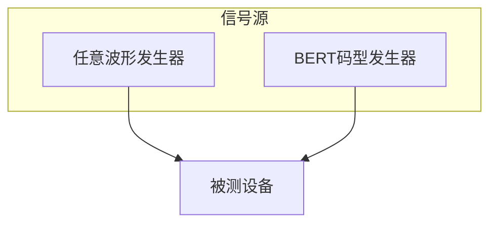
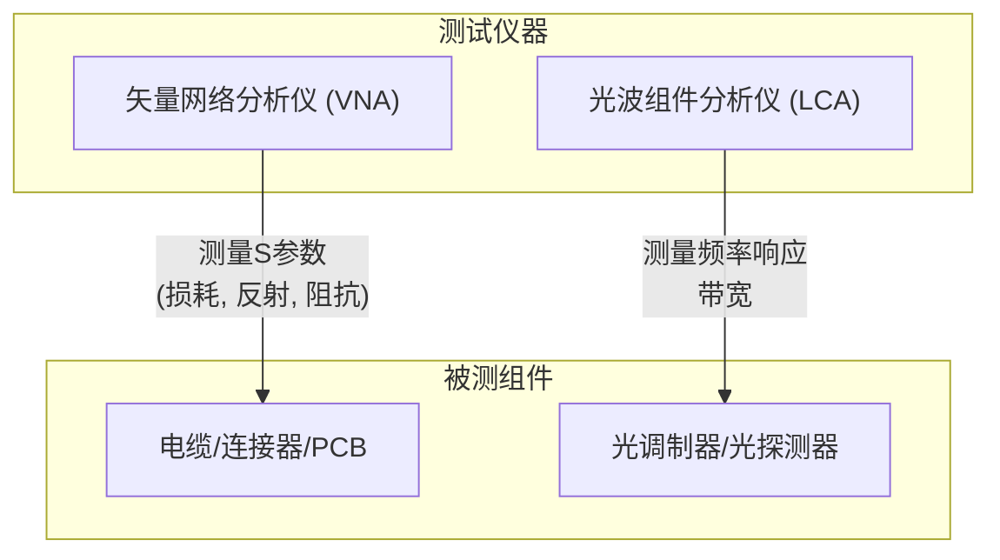
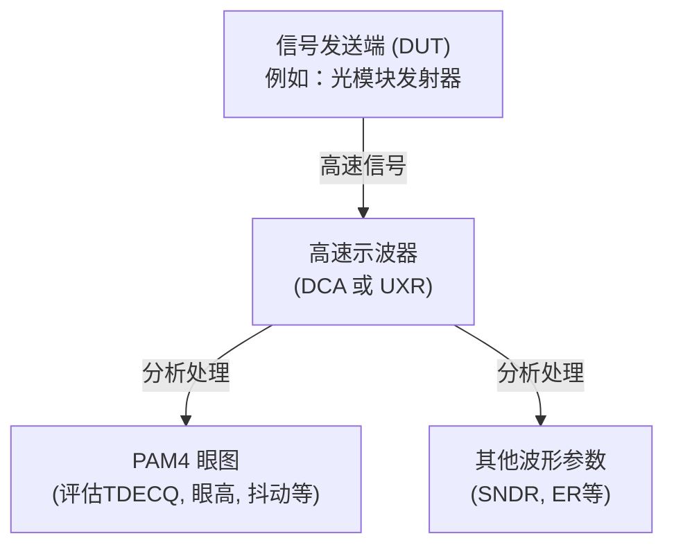
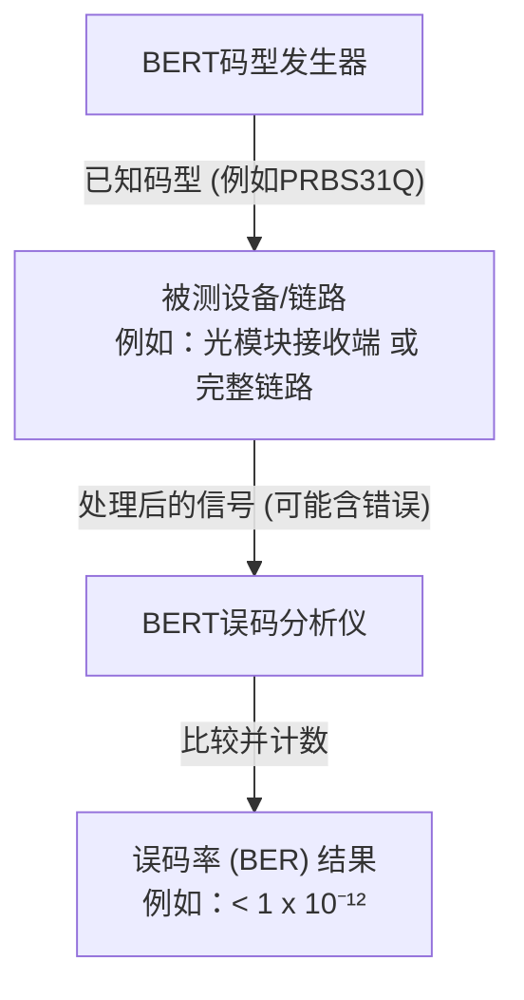
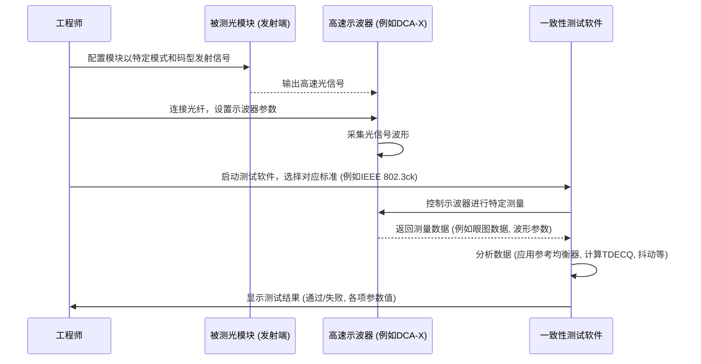

# Chapter 8: 高速信号测试与验证

在上一章 [高速光模块与封装技术](07_高速光模块与封装技术_.md) 中，我们一起探索了精密的高速光模块，它们是数据中心光通信的“心脏”。我们了解了它们如何将电信号转换为光信号，以及未来的共封装光学 (CPO) 技术。然而，这些先进的光模块和它们承载的超高速信号，在投入实际使用之前，必须经过严格的“体检”，以确保它们能够稳定、可靠地工作，并且符合行业标准。本章，我们将一同走进高速信号测试与验证的世界，看看工程师们是如何为这些“信息赛车”进行全方位精密检测的。

## 8.1 为什么要给高速信号做“体检”？—— 测试与验证的重要性

想象一下，你是一家顶尖赛车公司的工程师，刚刚设计并制造出一辆全新的F1赛车，目标是赢得下一场大奖赛。在赛车真正驶上赛道之前，你会怎么做？你肯定会进行无数次的测试：引擎的轰鸣是否正常？加速性能如何？刹车系统可靠吗？每个部件都符合设计规格吗？只有确保万无一失，赛车才能安全地发挥出最佳性能。

高速信号和相关的通信设备（如交换机芯片、[高速光模块与封装技术](07_高速光模块与封装技术_.md)）就像这辆F1赛车。随着数据传输速度飙升至每秒数百Gbps（千兆比特），甚至向着 [下一代以太网速率 (112/224 Gbps 每通道)](03_下一代以太网速率__112_224_gbps_每通道__.md) 这样的惊人速度迈进，确保信号质量和设备性能变得极具挑战性。任何微小的瑕疵都可能导致数据传输错误，进而影响整个数据中心的稳定运行。

**高速信号测试与验证** 就是这样一套复杂的方法学和专用测试仪器，用于全面检测和验证从芯片、组件到整个链路的各项性能指标是否达标。它的核心目标是：
*   **确保互操作性：** 不同厂商生产的设备如果都符合 [行业标准与规范 (OIF/IEEE)](04_行业标准与规范__oif_ieee__.md)，那么它们应该能够在一起协同工作。测试验证了这一点。
*   **保证性能：** 验证设备能否达到宣称的数据速率、传输距离和信号质量。
*   **提高可靠性：** 发现潜在的设计缺陷或制造问题，避免在实际应用中出现故障。
*   **加速产品上市：** 通过标准化的测试流程，帮助产品更快地通过认证并进入市场。

没有严格的测试与验证，我们就像在驾驶一辆未经检查的赛车，风险极高。

## 8.2 “体检项目”概览：高速信号测试的关键方面

对高速信号和设备进行的“体检”项目繁多且精密。就像F1赛车的全方位检测一样，主要包括以下几个关键方面（参考项目文档 `Data Center Ethernet Technology and Evolution to 224 Gbps.pdf` 第15-24页关于测试解决方案的描述）：

1.  **信号产生 (Signal Generation):** 精心“配制”测试用的信号。
2.  **组件特性分析 (Component Characterization):** 检查链路中每个“零件”的性能。
3.  **波形质量评估 (Waveform Quality Assessment):** 观察信号的“长相”是否健康。
4.  **误码率测试 (Bit Error Rate Testing, BERT):** 衡量数据传输的“准确率”。

接下来，让我们逐一了解这些核心的测试环节。

### 8.2.1 信号产生：一切测试的起点

要测试一个设备（我们称之为**被测设备 (Device Under Test, DUT)**）的性能，首先需要给它输入一个已知特性、符合规范的信号。这就好比医生给病人做听力测试时，需要播放标准强度的声音。

*   **目的：** 产生用于测试接收机灵敏度、抗干扰能力或用于校准其他测试仪器的精确信号。
*   **主要工具：**
    *   **任意波形发生器 (Arbitrary Waveform Generator, AWG):** 能够产生用户定义的各种复杂波形，非常灵活。例如，可以生成理想的 [PAM4调制技术](05_pam4调制技术_.md) 信号，或者带有特定损伤（如抖动、噪声）的“恶劣”信号，用以测试DUT的极限性能。项目文档第18页的 `Figure 11` 展示了AWG用于产生224 Gbps以上信号的场景。
    *   **高性能误码率测试仪的码型发生器 (BERT Pattern Generator):** 专门用于产生高速串行数据码型，如伪随机二进制序列 (Pseudo-Random Binary Sequence, PRBS)。它也可以添加校准过的抖动和噪声等损伤，形成“加压信号 (Stressed Signal)”，用于接收机压力测试。项目文档第18页的 `Figure 12` 展示了BERT码型发生器用于产生高达224 Gbps信号的场景。

*图8.1: 信号产生设备为被测设备提供输入*

工程师们会利用这些信号源，精确控制信号的速率、幅度、调制方式（如NRZ或PAM4）以及各种损伤的程度，从而全面评估DUT在不同条件下的表现。

### 8.2.2 组件特性分析：剖析链路中的“零件”

高速数据链路是由许多组件构成的，例如印刷电路板 (PCB) 上的走线、连接器、电缆、光纤，以及光模块内部的光学组件（如调制器、探测器）等。这些组件的性能直接影响最终的信号质量。

*   **目的：** 测量和分析这些无源和有源组件在高速信号下的电气或光学特性。
*   **主要工具：**
    *   **矢量网络分析仪 (Vector Network Analyzer, VNA):** 主要用于测试无源组件（如电缆、连接器、PCB走线）的频域特性。它可以测量S参数（Scattering parameters），包括：
        *   **插入损耗 (Insertion Loss):** 信号通过组件时衰减了多少。
        *   **回波损耗 (Return Loss):** 有多少信号因为阻抗不匹配被反射回来了。
        *   通过S参数，还可以分析阻抗、时域反射 (TDR) 等特性，帮助工程师优化高速通道设计，减少信号反射和损失。项目文档第20页的 `Figure 13` 展示了高达120 GHz的VNA系统。
    *   **光波组件分析仪 (Lightwave Component Analyzer, LCA):** 专门用于测试光电器件（如激光器、调制器、光电探测器）的频率响应、带宽等关键光学和电光转换特性。项目文档第21页的 `Figure 14` 展示了110 GHz的光波组件分析仪。

*图8.2: 组件特性分析工具与对象*

通过组件特性分析，工程师可以确保选用的每一个“零件”都符合高速传输的要求，不会因为某个组件的性能不佳而拖累整个链路。

### 8.2.3 波形质量评估：信号的“颜值”与“内涵”

当信号从发送端（例如光模块的发射器）发出，或者经过一段传输后，我们需要知道这个信号的“长相”如何，是否保持了良好的形态，携带的信息是否清晰可辨。

*   **目的：** 评估发送端输出信号或链路中某一点信号的质量，确保其符合标准定义的各项指标。
*   **主要工具：**
    *   **高速示波器 (High-Speed Oscilloscope):** 这是观察和分析高速信号波形的核心工具。主要有两种类型：
        *   **采样示波器 (Sampling Oscilloscope，例如DCA系列):** 对于周期性或重复性信号具有极高的带宽和非常低的噪声，是光信号测试的行业标准。
        *   **实时示波器 (Real-Time Oscilloscope，例如UXR系列):** 能够捕获非重复性信号，并进行复杂的实时处理，带宽也越来越高。
        项目文档第21-22页的 `Figure 15` 展示了带宽超过60GHz的示波器方案。
*   **关键测量参数 (以PAM4信号为例):**
    *   **眼图 (Eye Diagram):** 将大量信号波形叠加显示，形成类似“眼睛”的图形。PAM4信号有三个“小眼睛”。
        *   **TDECQ (Transmitter and Dispersion Eye Closure Quaternary):** 针对光信号，衡量发射机在存在色散情况下的眼图闭合程度，是评估PAM4光发射机质量的关键指标。
        *   **VEC (Vertical Eye Closure):** 针对电信号，衡量眼图垂直方向的张开程度。
        *   眼高 (Eye Height) 和眼宽 (Eye Width)。
    *   **抖动 (Jitter):** 信号在时间轴上的不期望的偏移，会影响数据采样的准确性。
    *   **SNDR (Signal-to-Noise and Distortion Ratio):** 信号与噪声和失真之比，反映信号的纯净度。
    *   **光信号参数：** 消光比 (Extinction Ratio, ER)、光调制幅度 (OMA) 等。

*图8.3: 使用示波器进行波形质量评估*

通过这些参数的测量，可以判断信号是否“健康”，能否被接收端正确解读。

### 8.2.4 误码率测试：数据传输的“终极考验”

无论信号波形看起来多么漂亮，最终衡量数据传输成功与否的“金标准”是**误码率 (Bit Error Rate, BER)**。误码率指的是在传输的数据中，错误比特所占的比例。例如，BER为10⁻¹² (常读作“十的负十二次方”) 意味着平均每传输1万亿个比特，最多只允许出现1个错误。

*   **目的：** 验证数据链路在实际工作条件下，能否达到[行业标准与规范 (OIF/IEEE)](04_行业标准与规范__oif_ieee__.md) 要求的极低误码率。
*   **主要工具和方法：**
    *   **误码率测试仪 (Bit Error Rate Tester, BERT):** 由一个**码型发生器 (Pattern Generator, PG)** 和一个**误码分析仪 (Error Detector, ED)** 组成。
        1.  PG发送一个已知的、特定格式的数据序列（如PRBS31Q，一种长串的伪随机码）。
        2.  这个信号经过被测设备 (DUT)，例如一个完整的光模块，或者一个接收机芯片。
        3.  ED接收DUT处理后的信号，将其与原始发送的码型进行逐比特比较。
        4.  统计在传输了大量比特后，出现了多少个错误比特，从而计算出BER。
    *   **DUT内部误码计数器：** 很多现代芯片和模块内部集成了误码计数功能，可以直接读取BER。
    *   **实时示波器作为误码分析仪：** 对于原始误码率较高（例如在 [前向纠错 (FEC) 与均衡技术](06_前向纠错__fec__与均衡技术_.md) 处理之前）的场景，实时示波器也可以捕获信号并进行软件解码和误码分析。项目文档第23页的 `Figure 16` 展示了用实时示波器进行PAM4误码率测试。

*图8.4: 误码率测试 (BERT) 原理示意图*

误码率测试通常需要在各种条件下进行，例如：
*   **接收机灵敏度测试：** 逐渐降低输入光模块的光功率，看在多低的光功率下仍能保持目标BER。
*   **加压眼图测试 (Stressed Eye Test):** 向输入信号中人为加入抖动、噪声等损伤，形成一个“恶劣”的信号（称为加压信号），测试接收机在这种压力下的误码率性能。这需要先用示波器精确校准这个加压信号的各项参数（如VEC、SNDR、抖动分量等），确保符合标准。项目文档第17页的 `Figure 9` 展示了112 Gbps电接口模块输入加压BER测试的设置。

FEC技术对BER测试有重要影响。通常我们会关注两个BER：
*   **FEC前误码率 (Pre-FEC BER):** 在FEC解码之前，链路的原始误码率。对于使用PAM4的链路，这个值可能相对较高（例如10⁻⁴ 到 10⁻⁶）。
*   **FEC后误码率 (Post-FEC BER):** 经过FEC解码纠错之后，最终用户数据体验到的误码率。这个值必须非常低（例如10⁻¹² 到 10⁻¹⁵）。

## 8.3 测试224 Gbps信号：挑战与应对

当单通道速率达到224 Gbps时，对测试技术和设备的要求也达到了新的高度：
*   **极高的带宽需求：** 测试仪器（如示波器、VNA、BERT）本身必须具有远超信号奈奎斯特频率（对于224 Gbps PAM4信号，波特率约为112 Gbaud，奈奎斯特频率为56 GHz）的带宽，通常需要80 GHz甚至110 GHz以上的带宽才能准确捕捉和分析信号。
*   **极低的噪声容限：** 信号电平间的间隔更小，对测试系统自身的噪声和精度要求极为苛刻。
*   **复杂的信号处理：** 需要更强大的 [前向纠错 (FEC) 与均衡技术](06_前向纠错__fec__与均衡技术_.md) 来补偿严重的信号损伤。测试时，需要能够模拟或移除这些均衡和FEC的影响，以评估器件或链路的真实性能。
*   **新的调制方式探索：** 除了PAM4，业界可能还会探索PAM6、PAM8等更高级的调制方式，测试方案需要具备相应的解调和分析能力。
*   **标准仍在演进：** 224 Gbps的相关 [行业标准与规范 (OIF/IEEE)](04_行业标准与规范__oif_ieee__.md) 仍在制定中，测试方案需要保持灵活性以适应标准的变化。

项目文档 `Data Center Ethernet Technology and Evolution to 224 Gbps.pdf` 第24页的 `Figure 17` 总结了800G（通常基于112 Gbps/通道）甚至未来基于224 Gbps/通道的设备/光模块/芯片的测试方案概览，显示了各种测试仪器（BERT、AWG、示波器、VNA、LCA等）在不同测试环节的应用。

## 8.4 一个简化的测试流程示例：光模块发射端一致性测试

让我们通过一个简化的流程，看看工程师如何对一个光模块的发射端 (Transmitter) 进行一致性测试，以确保其输出的光信号符合标准。

*图8.5: 简化的光模块发射端一致性测试流程*

**步骤解读：**
1.  **准备工作：** 工程师将被测光模块安装在测试夹具上，并根据标准要求配置其工作模式（如特定速率、PAM4调制、发送特定测试码型如PRBS13Q）。
2.  **连接设备：** 将光模块的光输出通过光纤连接到高速示波器的光输入端口。
3.  **信号采集：** 示波器采集光模块发射出来的光信号波形。
4.  **软件分析：** 运行在示波器上或与之连接的PC上的一致性测试软件，会按照选定标准（例如IEEE 802.3ck中关于100GBASE-DR光接口的规范）中定义的步骤进行分析：
    *   对采集到的信号应用标准中定义的**参考接收机均衡器**。
    *   生成眼图，并测量**TDECQ、眼高、眼宽**等参数。
    *   分析**抖动**的各个分量。
    *   测量其他光学参数如**OMA、消光比**等。
5.  **结果判定：** 测试软件会将所有测量结果与标准中规定的限值进行比较，并给出“通过 (Pass)”或“失败 (Fail)”的结论。

这只是众多测试中的一项。完整的验证过程还包括接收端测试、组件测试、环境测试（如高低温）等等，是一个系统而复杂的过程。

## 8.5 总结：为数据高速公路保驾护航

在本章中，我们了解了高速信号测试与验证的重要性，它就像是为数据中心这条信息高速公路上的“车辆”（信号）和“道路”（组件、链路）进行严格的质量把关和性能检测。我们探讨了测试的几个关键方面：
*   **信号产生：** 提供测试所需的“标准件”或“压力件”。
*   **组件特性分析：** 确保链路中的每个“零件”都合格。
*   **波形质量评估：** 检查信号的“健康状况”。
*   **误码率测试：** 衡量数据传输的最终“准确率”。

这些测试方法和专用的高精尖仪器，共同构成了确保现代数据中心（尤其是采用 [PAM4调制技术](05_pam4调制技术_.md) 和迈向 [下一代以太网速率 (112/224 Gbps 每通道)](03_下一代以太网速率__112_224_gbps_每通道__.md) 的系统）能够可靠、高效运行的基石。没有它们，我们就无法自信地构建和扩展支撑我们数字世界的庞大数据基础设施。

---

### 系列教程总结

恭喜你完成了《数据中心以太网技术及向224 Gbps的演进》这整个系列的教程！

回顾我们的学习旅程：
1.  我们从 **[数据中心互连架构](01_数据中心互连架构_.md)** 开始，了解了现代数据中心如何通过叶脊网络等结构组织起来，为海量数据流动搭建骨架。
2.  接着，在 **[以太网速率提升技术](02_以太网速率提升技术_.md)** 中，我们探索了提高单通道速率、增加并行通道和使用更复杂调制这三大法宝。
3.  然后，我们聚焦于 **[下一代以太网速率 (112/224 Gbps 每通道)](03_下一代以太网速率__112_224_gbps_每通道__.md)**，展望了单条“车道”速度的巨大飞跃。
4.  我们认识到 **[行业标准与规范 (OIF/IEEE)](04_行业标准与规范__oif_ieee__.md)** 如何为这些技术提供“共同语言”，确保互操作性。
5.  随后，我们深入研究了关键的 **[PAM4调制技术](05_pam4调制技术_.md)**，它如何在不显著提高信号频率的情况下使数据速率翻倍。
6.  面对PAM4带来的挑战，我们学习了 **[前向纠错 (FEC) 与均衡技术](06_前向纠错__fec__与均衡技术_.md)** 这对“护航英雄”如何保障信号质量。
7.  我们揭开了 **[高速光模块与封装技术](07_高速光模块与封装技术_.md)** 的神秘面纱，了解了这些光电信使如何将电信号与光信号巧妙转换，以及未来的CPO趋势。
8.  最后，在本章 **[高速信号测试与验证](08_高速信号测试与验证_.md)** 中，我们看到了工程师们如何通过精密的测试来确保这一切高速技术的可靠运行。

希望本教程能帮助你对数据中心以太网技术及其向224 Gbps的演进有一个清晰、全面的认识。数据通信技术仍在飞速发展，未来充满了更多激动人心的可能性。愿你在探索信息技术的道路上不断进步！

---

Generated by [AI Codebase Knowledge Builder](https://github.com/The-Pocket/Tutorial-Codebase-Knowledge)