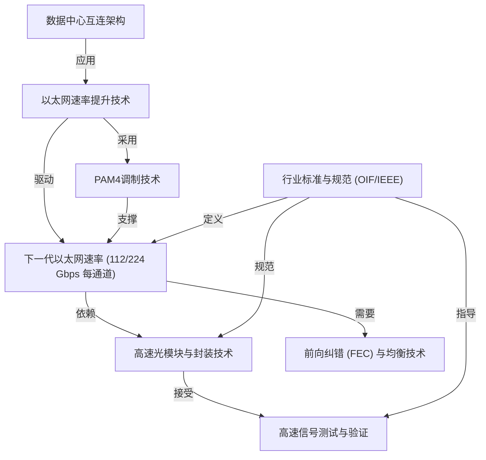

# Tutorial: Data Center Ethernet Technology and Evolution to 224 Gbps

这份文档主要介绍了**现代数据中心以太网技术**如何发展以满足日益增长的带宽需求，特别是向着单通道*112 Gbps乃至224 Gbps*的**超高速率**演进的过程。它解释了数据中心内部的*互连架构*，探讨了提升以太网速度的各种*关键技术*（例如PAM4调制），展望了*下一代速率目标*，并讨论了实现这些目标所需的高速光模块、封装技术、信号测试验证方法、前向纠错技术，以及起指导作用的*行业标准与规范*。

**Source Repository:** [None](None)

## Chapters

1. [数据中心互连架构
](01_数据中心互连架构_.md)
2. [以太网速率提升技术
](02_以太网速率提升技术_.md)
3. [下一代以太网速率 (112/224 Gbps 每通道)
](03_下一代以太网速率__112_224_gbps_每通道__.md)
4. [行业标准与规范 (OIF/IEEE)
](04_行业标准与规范__oif_ieee__.md)
5. [PAM4调制技术
](05_pam4调制技术_.md)
6. [前向纠错 (FEC) 与均衡技术
](06_前向纠错__fec__与均衡技术_.md)
7. [高速光模块与封装技术
](07_高速光模块与封装技术_.md)
8. [高速信号测试与验证
](08_高速信号测试与验证_.md)

---

Generated by [AI Codebase Knowledge Builder](https://github.com/The-Pocket/Tutorial-Codebase-Knowledge)