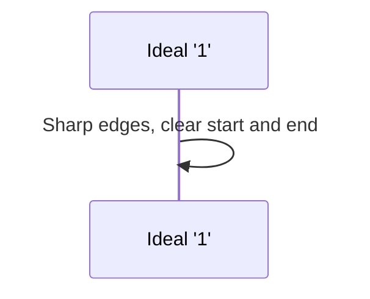

# Chapter 2: Inter-Symbol Interference (ISI)

In our last adventure, [Chapter 1: Channel](01_channel_.md), we learned that the "channel" is the physical path our data takes, like a tiny highway for electrical signals. We also discovered that these channels aren't perfect. They can be like old, bumpy roads that distort the signals, especially when we try to send data super fast. This distortion is where our next big challenge comes in: **Inter-Symbol Interference**, or **ISI**.

## What on Earth is Inter-Symbol Interference (ISI)?

Imagine you're in a very large, empty hall with a strong echo. If you shout one word, say "HELLO," you'll hear the echo "HELLO... ello... llo...". Now, what if you try to shout a series of different words very quickly, like "ONE," then "TWO," then "THREE"?

You shout: "ONE!"
Echo: "ONE... one... ne..."

Before the echo of "ONE" fades, you shout: "TWO!"
What you (and your listener) hear is something like: "ONE-**TWO**... one-**wo**... ne-**o**..."

Then you shout: "THREE!"
And it gets even messier: "ONE-TWO-**THREE**... one-wo-**hree**... ne-o-**ree**..."

See how the echo of "ONE" blurs into "TWO", and the combined echoes of "ONE" and "TWO" blur into "THREE"? It becomes really hard to tell each word apart clearly.

**Inter-Symbol Interference (ISI) is exactly like this echo effect, but for our data signals.**

When we send digital data, we're essentially sending a series of "symbols." For simple systems, a symbol could be a voltage level representing a '1' (high voltage) or a '0' (low voltage).
*   **Inter-Symbol Interference (ISI)** is a type of signal distortion where one symbol we send (like a bit '1') interferes with the symbols that come after it. The "signal energy" from one bit spills over or "echoes" into the time slots of its neighboring bits.

This makes it tough for the receiver at the other end to correctly figure out if a '1' or a '0' was originally sent for each specific bit.

## Why Does This Blurring Happen? The Channel is the Culprit!

Remember from [Chapter 1: Channel](01_channel_.md) how real-world channels cause **signal loss**, and this loss is often **frequency-dependent**? This means the channel doesn't treat all parts of our signal equally. High-frequency components of the signal (which give our digital pulses their sharp, square edges) often get weakened (attenuated) more than low-frequency components.

Think of our nice, sharp digital pulse for a '1':



When this sharp pulse travels through an imperfect channel:
1.  The sharp edges (high frequencies) get rounded off.
2.  The pulse loses some of its strength.
3.  The energy of the pulse gets "smeared" or "spread out" over time.

So, a single, quick pulse (our symbol) that starts out looking like this:

```mermaid
xychart-beta
    title "Ideal Transmitted Pulse (Symbol)"
    x-axis "Time"
    y-axis "Signal Strength"
    line [[0, 0], [1, 0], [1, 1], [2, 1], [2, 0], [3,0]]
```

After passing through a lossy channel, might look like this at the receiver:

```mermaid
xychart-beta
    title "Received Pulse (Symbol) after Channel Distortion"
    x-axis "Time"
    y-axis "Signal Strength"
    line [[0, 0], [0.8, 0], [1, 0.2], [1.5, 0.8], [2, 0.5], [2.5, 0.2], [3, 0.1], [3.5, 0.05], [4,0]]
```

Notice how the received pulse is weaker, rounded, and most importantly, **spread out**? It has a "tail" that lingers longer than the original pulse. This spreading is the root cause of ISI. The reference paper mentions that "as the data rates increase, these wires behave as lossy transmission lines severely degrading the transmitted data symbols." (Page 2). This degradation is largely due to ISI.

## Visualizing ISI: When Bits Collide

Now, let's see what happens when we send a sequence of bits, say "1", then "0", then "1", very quickly. Each bit is a pulse (or absence of a pulse for '0').

**Ideally (Perfect Channel):**
If the channel were perfect, the receiver would see nice, distinct pulses:

```mermaid
xychart-beta
    title "Ideal Signal: 101"
    x-axis "Time (Bit Slots)"
    y-axis "Signal Level"
    line "Bit 1 (1)" [[0,0],[0.5,0],[0.5,1],[1.5,1],[1.5,0],[5,0]]
    line "Bit 2 (0)" [[0,0],[1.5,0],[2.5,0],[5,0]]
    line "Bit 3 (1)" [[0,0],[2.5,0],[2.5,1],[3.5,1],[3.5,0],[5,0]]
```
*   At time slot 1, we see a clear '1'.
*   At time slot 2, we see a clear '0'.
*   At time slot 3, we see a clear '1'. Easy!

**Reality (Imperfect Channel with ISI):**
Because each pulse gets spread out, their "tails" (and sometimes even their "fronts") start to overlap:

```mermaid
xychart-beta
    title "Signal with ISI: 101"
    x-axis "Time (Bit Slots)"
    y-axis "Signal Level"
    line "Spillover from Bit 1 (1)" [[0.5,0],[0.7,0.2],[1,0.8],[1.3,0.5],[1.6,0.2],[1.9,0.1],[2.2,0.05],[5,0.01]]
    note "Original Bit 1 energy" at 1 0.8
    line "Spillover from Bit 3 (1)" [[2.5,0],[2.7,0.2],[3,0.8],[3.3,0.5],[3.6,0.2],[3.9,0.1],[4.2,0.05],[5,0.01]]
    note "Original Bit 3 energy" at 3 0.8
    %% For a '0' at bit 2, there's no intended pulse,
    %% but it will be affected by tails of bit 1 and leading edge of bit 3.
    %% For simplicity, we show the tails of bit 1 & 3 affecting bit 2's slot.

    rect R1 from 0.5,0 to 1.5,0 fill-opacity=0.1 color=#AAFFAA % Slot for Bit 1
    text "Bit 1 Slot" at 1, -0.2
    rect R2 from 1.5,0 to 2.5,0 fill-opacity=0.1 color=#FFAAAA % Slot for Bit 2
    text "Bit 2 Slot" at 2, -0.2
    rect R3 from 2.5,0 to 3.5,0 fill-opacity=0.1 color=#AAAAFF % Slot for Bit 3
    text "Bit 3 Slot" at 3, -0.2
```
*   **During Bit 1's time slot:** The signal is mostly from Bit 1.
*   **During Bit 2's time slot (should be '0'):** The tail of Bit 1's pulse might still be lingering, adding some unwanted voltage. Also, the beginning of Bit 3's pulse might start to creep in early. So, instead of a clean '0', the receiver sees some residual energy.
*   **During Bit 3's time slot:** It's mainly Bit 3's energy, but it's also got some leftover tail from Bit 1's pulse affecting it.

This unwanted energy from neighboring bits is ISI.

The reference paper (Figure 7, page 6) shows a conceptual picture of a single pulse's response and how its energy is distributed:
*   **Cursor:** This is the main, desired part of the pulse, where its energy *should* be concentrated.
*   **Post-cursor ISI:** The "tail" of the pulse that extends into the time slots of *following* bits. So, the energy from a current bit affects future bits.
*   **Pre-cursor ISI:** The part of a pulse's energy that might arrive a bit early, or more generally, interference on the current bit from the "front edges" of *upcoming* bits.

```mermaid
xychart-beta
    title "Conceptual Pulse Response with ISI Terms (Simplified from Fig. 7)"
    x-axis "Time (relative to symbol center)"
    y-axis "Signal Strength"
    line "Pulse" [[-2, 0.05], [-1.5, 0.1], [-1, 0.2], [0, 1], [1, 0.4], [2, 0.15], [3, 0.05], [4,0]]
    annotation "Pre-cursor ISI" (x=-1, y=0.2) { text="Energy affecting/from previous symbols" }
    annotation "Cursor" (x=0, y=1) { text="Main symbol energy" }
    annotation "Post-cursor ISI" (x=1.5, y=0.3) { text="Energy affecting/from subsequent symbols" }
```
When we talk about ISI affecting the *current* symbol we are trying to read:
*   **Post-cursor ISI** on the current symbol comes from the lingering tails of *previous* symbols.
*   **Pre-cursor ISI** on the current symbol comes from the early arrival of energy from *subsequent* (upcoming) symbols.

The paper states, "The biggest noise source in high-speed serial links is inter-symbol interference (ISI) caused by the frequency dependent attenuation of the channel." (Page 5). It's a big deal!

## The Impact: Why Is This "Echo" So Bad?

ISI is like a troublemaker for the receiver. The receiver's job is simple: at specific moments in time (sampling instants), it looks at the signal voltage and decides, "Is this a '1' or a '0'?"

*   If there's no ISI, the decision is easy. High voltage = '1', Low voltage = '0'.
*   With ISI, the voltage the receiver sees for the current bit is actually a mix:
    *   (Energy from the *actual* current bit)
    *   \+ (Lingering tail energy from the *previous* bit or bits)
    *   \+ (Early-arriving energy from the *next* bit or bits)

This unwanted, interfering energy can:
1.  **Reduce the clarity:** A '1' might not look as high as it should, or a '0' might not look as low. The difference between a '1' and a '0' becomes smaller. This is often called "reducing the noise margin."
2.  **Cause errors:** If the interference is bad enough, a '1' might be mistaken for a '0', or a '0' for a '1'. This is a **bit error**. Too many bit errors, and our data becomes corrupted!

Think back to the echoey hall. If the echoes are too strong, "ONE" might sound a bit like "WON'T" or "SUN" if parts of the previous or next words mix in.

It's important to note, as the paper mentions, "Even though ISI is fully deterministic, we will refer to it as noise here..." (Page 5, footnote). This means ISI isn't random like static on a radio. If we know the channel very well, we can actually predict how it will smear the signals. But from the receiver's point of view, trying to decipher one bit at a time, this smearing acts like noise because it corrupts the target bit.

## Conclusion: The Blurry Picture

So, we've learned that **Inter-Symbol Interference (ISI)** is a major problem in high-speed communication. It's caused by the imperfect channel spreading out our data signals (symbols) so that they overlap and interfere with each other. This is like echoes in a large hall making it hard to understand spoken words.

The main takeaways are:
*   ISI happens because channels don't pass all signal frequencies perfectly, leading to signal spreading.
*   This spreading causes energy from one bit to spill into the time slots of neighboring bits.
*   ISI makes it harder for the receiver to tell '1's and '0's apart, leading to potential errors.

Understanding ISI is crucial because if we can't "hear" our bits clearly, our communication link won't work reliably at high speeds. The question now is, how can we visually see the impact of ISI and other channel problems on our overall signal quality?

## Next Steps

In the next chapter, we'll explore a powerful tool that helps us visualize the quality of our received signal and see the effects of ISI: the [Eye Diagram](03_eye_diagram_.md). It's like putting on special glasses to see how clear or blurry our data has become!

---

Generated by [AI Codebase Knowledge Builder](https://github.com/The-Pocket/Tutorial-Codebase-Knowledge)