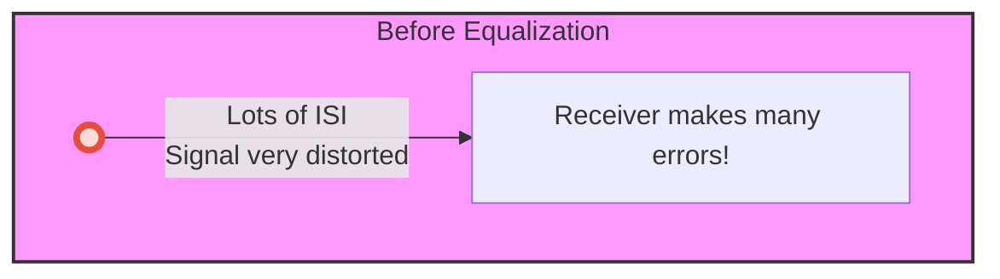
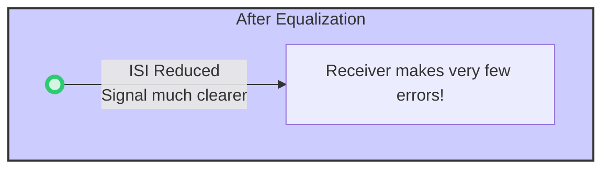

# Chapter 4: Equalization

Welcome back! In [Chapter 3: Eye Diagram](03_eye_diagram_.md), we learned how to use an "eye diagram" to see the quality of our data signal after it has traveled through the communication channel. We saw that problems like [Inter-Symbol Interference (ISI)](02_inter_symbol_interference__isi__.md) can cause the "eye" to become squished or "closed," making it very difficult for the receiver to understand the 1s and 0s we sent.

Imagine you're trying to read a sign from far away. If your vision is blurry (like a signal distorted by the channel), the letters will be hard to make out (like a closed eye diagram). What do you do? You might put on glasses! This chapter is all about the "glasses" for our data signals: **Equalization**.

## What is Equalization? Correcting the Signal's "Vision"

**Equalization** is a clever signal processing technique used to fight against the problems (like ISI and other distortions) introduced by the [Channel](01_channel_.md). Its main job is to try and "undo" the damage the channel has done to our signal.

Think of it like this:
*   **The Channel (Your Eye's Lens):** If your eye's natural lens isn't perfect, it might distort the light coming from an object, making the image you see blurry.
*   **The Signal (Light/Image):** This is the information (the picture of the object) trying to reach your brain (the receiver).
*   **The Equalizer (Corrective Lenses):** Your eyeglasses or contact lenses are like an equalizer. They are specially shaped to bend the light *before* it fully passes through your eye's lens, correcting for its imperfections.
*   **The Result (Clear Vision):** With the corrective lenses, your brain receives a clear, sharp image.

Similarly, an equalizer reshapes or "corrects" the electrical signal to counteract the distortions caused by the channel. The goal is to make the signal clear and understandable for the receiver.

The reference paper states that "Equalization is a well-known technique used to overcome non-idealities introduced by the channel." (Page 2).

## Why Do We Need to "Correct" the Signal?

Remember from [Chapter 1: Channel](01_channel_.md) that our communication channels (like copper traces on a circuit board) aren't perfect. One of the biggest issues is **frequency-dependent loss**. This means the channel weakens different frequency components of our signal by different amounts. Typically, higher frequencies (which give our digital pulses their sharp edges) are weakened much more than lower frequencies.

Imagine our signal as a song. If the channel muffled all the high notes (high frequencies) but left the low notes (low frequencies) mostly untouched, the song would sound distorted and unbalanced.

This unbalanced loss is what causes our nice, sharp digital pulses to become rounded, smeared, and to interfere with each other (ISI), as we saw in [Chapter 2: Inter-Symbol Interference (ISI)](02_inter_symbol_interference__isi__.md).

## The Goal: "Flattening" the Channel's Response

The main aim of equalization is to "flatten" the channel's frequency response. If the channel acts like a filter that cuts down high frequencies, the equalizer tries to do the opposite to compensate.

Imagine the channel has this effect on frequencies:

```mermaid
xychart-beta
    title "Channel's Natural (Bad) Effect"
    x-axis "Frequency" ["Low", "Medium", "High"]
    y-axis "Signal Strength Output / Input" [0, 0.5, 1]
    bar [1, 0.8, 0.3]
    note "High frequencies are weakened a lot!" at "High" 0.3
```
*   Low frequencies pass through relatively well.
*   High frequencies are severely weakened.

An equalizer will try to counteract this. Conceptually, it wants the *combined* effect of the channel *and* the equalizer to be flat, meaning all frequencies (up to a certain point, called the Nyquist frequency) are treated more equally.

The reference paper (page 8) puts it this way: "The frequency shaping filters that flatten the channel response till Nyquist frequency are called equalizers. These equalizers, therefore, reduce ISI and can increase the achievable data rates tremendously."

There are two main ways an equalizer can try to achieve this "flattening," as illustrated conceptually in Figure 9 of the reference paper:

1.  **Boost High Frequencies:** If the channel weakens high frequencies, the equalizer can try to amplify them. This is like turning up the treble on your stereo to compensate for muffled high notes.
2.  **Attenuate Low Frequencies:** Alternatively, the equalizer can reduce the strength of the low frequencies. If the high frequencies were weakened by the channel, making the low frequencies *relatively* weaker brings the signal back into balance.

Let's see the ideal outcome:

```mermaid
xychart-beta
    title "Channel + Equalizer (Good) Effect"
    x-axis "Frequency" ["Low", "Medium", "High"]
    y-axis "Signal Strength Output / Input" [0, 0.5, 1]
    bar [0.7, 0.7, 0.7]
    note "Frequencies are more evenly treated!" at "Medium" 0.75
```
By "flattening" the response, the signal distortion is reduced, the pulses become sharper again, and ISI is minimized.

## Where Does Equalization Happen?

Equalizers can be clever little circuits placed at different points in our communication link:

1.  **At the Transmitter (Tx Equalizer):** The signal can be "pre-corrected" or "pre-distorted" *before* it's even sent down the channel. This is like knowing your voice will get muffled by a wall, so you shout the high-pitched parts louder to begin with. We'll learn more about this in [Chapter 5: Transmit Equalizer (Pre-emphasis/De-emphasis)](05_transmit_equalizer__pre_emphasis_de_emphasis__.md).

2.  **At the Receiver (Rx Equalizer):** The signal can be corrected *after* it has traveled through the channel and picked up distortions. This is like using a hearing aid to boost the frequencies you have trouble hearing. We'll explore this in [Chapter 6: Receive Equalizer](06_receive_equalizer_.md).

3.  **At Both Transmitter and Receiver:** For very tough channels, sometimes a bit of equalization is done at both ends to share the burden of correction.

The choice depends on many factors, including the channel itself, power consumption, and complexity.

## The Big Payoff: Opening the Eye!

So, what's the ultimate visual proof that equalization is working? We look at the [Eye Diagram](03_eye_diagram_.md)!

If our channel was causing severe ISI, we might start with an eye diagram that looks nearly closed, like this:


A "closed eye" means tiny voltage margins (hard to tell '1' from '0') and tiny timing margins (hard to sample at the right time). This leads to many bit errors.

After applying equalization, we hope to see a much more open eye:


An "open eye" means:
*   **Taller opening:** Better voltage difference between '1's and '0's.
*   **Wider opening:** More tolerance for timing variations.

This means the receiver can more easily and reliably determine the correct sequence of bits, even at very high speeds!

## Conclusion: The Signal's Savior

We've learned that **equalization** is a crucial technique in high-speed serial links. It's like putting on corrective lenses to fix a blurry signal.
*   It combats **Inter-Symbol Interference (ISI)** and other distortions caused by the imperfect [Channel](01_channel_.md).
*   It aims to **"flatten" the channel's frequency response**, effectively undoing the damage by either boosting weakened high frequencies or attenuating less-affected low frequencies.
*   Equalization can be performed at the **transmitter, receiver, or both**.
*   The success of equalization is often visualized by a much more **"open" [Eye Diagram](03_eye_diagram_.md)**, indicating a clearer signal and better chances for error-free communication.

By understanding and applying equalization, engineers can push data through challenging channels at incredible speeds.

## Next Steps

Now that we understand *why* we need equalization and *what* it generally tries to do, let's start looking at *how* it's done. In the next chapter, we'll explore the first type: [Transmit Equalizer (Pre-emphasis/De-emphasis)](05_transmit_equalizer__pre_emphasis_de_emphasis__.md), where we try to fix the signal *before* it even enters the problematic channel.

---

Generated by [AI Codebase Knowledge Builder](https://github.com/The-Pocket/Tutorial-Codebase-Knowledge)