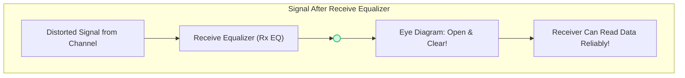
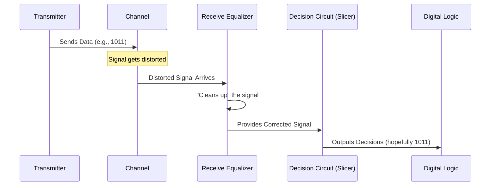

# Chapter 6: Receive Equalizer

Welcome back! In [Chapter 5: Transmit Equalizer (Pre-emphasis/De-emphasis)](05_transmit_equalizer__pre_emphasis_de_emphasis__.md), we saw how we could "prepare" our signal *before* sending it through the [Channel](01_channel_.md), giving it a fighting chance against distortions. This was like giving our signal a special "launch boost."

But what happens if, despite our best efforts at the transmitter, the signal still arrives at the receiver looking weak, distorted, and generally unwell? It's like sending a perfectly clear photo through a foggy lens – the picture received is blurry. This is where the **Receive Equalizer** steps in, acting like a photo editor that sharpens the blurry image *after* it's been received.

## What is a Receive Equalizer? The Post-Concert Sound Fix

A **Receive Equalizer** (often called **Rx EQ**) is a circuit or signal processing block located *at the receiver*. Its job is to process the signal *after* it has already passed through the troublesome communication channel and arrived at the receiver's doorstep. The receive equalizer tries to clean up the messy signal, restore its original shape, and make it easier for the receiver to understand the 1s and 0s that were sent.

**The Audio Engineer Analogy (Again!)**

Remember our audio engineer at a concert?
*   **Musicians (Transmitter):** They play their instruments, creating the original sound (our data signal).
*   **Air and Microphones (Channel):** The sound travels through the air, gets picked up by microphones, and maybe some cables. During this journey, the sound might get muffled, or some frequencies might get lost or over-emphasized.
*   **Sound Mixer at the Engineer's Desk (Receive Equalizer):** *After* the sound has traveled through the air and microphones (the channel), the audio engineer listens to it. If the high notes are too quiet or the bass is too boomy, the engineer adjusts knobs and sliders on the mixing desk. They might boost certain frequencies or cut others.
*   **Clear Music for the Audience (Clean Signal for Decision):** The result is that the audience hears clear, balanced music, even if the raw sound from the stage wasn't perfect.

A receive equalizer does something very similar for our electrical data signals. It "listens" to the distorted signal coming from the channel and tries to fix it.

The main goals of a receive equalizer are to:
1.  **Boost attenuated frequencies:** The channel often weakens high-frequency parts of our signal more than low-frequency parts. The Rx EQ can boost these high frequencies back up.
2.  **Reduce Inter-Symbol Interference (ISI):** By correcting the signal's shape, it helps to ensure that one bit doesn't "smear" into and corrupt its neighbors.
3.  **Filter out noise:** While its primary job is to combat channel distortion, some equalizers can also help in reducing the impact of noise.

## Why Do We Need It? The Signal's Rough Arrival

As we learned in [Chapter 1: Channel](01_channel_.md), the physical path our signal takes is far from perfect. It causes issues like:
*   **Frequency-dependent loss:** High-frequency components (the sharp edges of our digital pulses) get weakened more than low-frequency components.
*   This leads to **pulse spreading**, where our nice, sharp digital pulses become rounded and stretched out.

This pulse spreading is the main cause of [Inter-Symbol Interference (ISI)](02_inter_symbol_interference__isi__.md), where the "tail" of one bit spills over and interferes with the next bit.

If ISI is bad, our [Eye Diagram](03_eye_diagram_.md) might look nearly closed:

```mermaid
graph TD
    subgraph Before_Rx_EQ [Signal Arriving at Receiver (No Rx EQ)]
        direction LR
        A["Distorted Signal from Channel"] --> B(( ))
        style B fill:#FADBD8,stroke:#E74C3C,stroke-width:2px,width:40px,height:20px
        B --> C["Eye Diagram: Squished & Blurry"]
        C --> D["Hard for Receiver to Read Data!"]
    end
```
A "closed" eye means it's very hard for the receiver to tell a '1' from a '0', leading to lots of errors.

## How Does a Receive Equalizer Help? Sharpening the Picture

A receive equalizer works by applying a "corrective filter" to the incoming signal. If the channel acted like a filter that cut high frequencies, the receive equalizer tries to do the opposite: it boosts those high frequencies.

Imagine the channel has this effect on frequencies:

```mermaid
xychart-beta
    title "Channel's Effect: High Frequencies Weakened"
    x-axis "Frequency" ["Low", "Medium", "High"]
    y-axis "Signal Strength (Relative)" [0, 0.5, 1]
    bar [1, 0.7, 0.2]
    note "Channel Attenuates Highs" at "High" 0.25
```

A receive equalizer would try to apply a "boost" to counteract this, especially at high frequencies:

```mermaid
xychart-beta
    title "Receive Equalizer's Goal: Boost High Frequencies"
    x-axis "Frequency" ["Low", "Medium", "High"]
    y-axis "Gain of Equalizer (Relative)" [0, 1, 2, 3, 4, 5]
    bar [1, 1.5, 4.5]
    note "Rx EQ Boosts Highs" at "High" 4.7
```

The idea is that the *combined* effect of the (Channel + Receive Equalizer) results in a much flatter, more balanced frequency response. This means the different parts of our signal are treated more equally, reducing distortion and ISI.

The reference paper (page 11) explains this: "Receive-side equalization offers an alternate method to mitigate ISI without any peak power constraint. The loss in the channel is suppressed by boosting the high frequency signal spectrum rather than attenuating the low-frequency content."

After the receive equalizer does its magic, the [Eye Diagram](03_eye_diagram_.md) should look much healthier:


A nice, open eye means the 1s and 0s are distinct, and the receiver can make correct decisions.

## Where is the Receive Equalizer Placed?

The receive equalizer sits right at the front-end of the receiver, just after the signal arrives from the channel but *before* the circuit that makes the final decision about whether the bit is a '1' or a '0' (often called a "slicer" or "decision circuit").


This placement allows it to fix the signal before the critical decision-making step.

## Peeking Under the Hood (A Glimpse)

So, what's inside this "magic box" called a receive equalizer? Most receive equalizers are essentially specialized **filters**. These filters are designed to have a frequency response that is roughly the *inverse* of the channel's lossy response.

There are several ways to build these filters, and we'll explore some of them in detail in upcoming chapters:
*   **[Continuous-Time Equalizer](09_continuous_time_equalizer_.md):** These often use analog components like resistors, capacitors, and amplifiers. They work on the signal in its continuous, analog form. Think of an analog graphic equalizer on a stereo system. The reference paper (Fig. 21, page 17 and Fig. 23, page 19) shows examples of how these can be built to boost high frequencies.
*   **Discrete-Time Equalizers (like [Finite Impulse Response (FIR) Filter](07_finite_impulse_response__fir__filter_.md)s):** These sample the incoming analog signal at regular intervals (turning it into a sequence of digital values) and then use digital processing techniques to filter it.
*   **[Decision Feedback Equalizer (DFE)](08_decision_feedback_equalizer__dfe__.md):** This is a more advanced type of receive equalizer that uses past decisions (whether previous bits were 1s or 0s) to help cancel out ISI from those past bits.

For now, the key takeaway is that the receive equalizer intelligently manipulates the signal, often by boosting the high-frequency components that the channel tried to steal. The reference paper also notes (page 11), "Due to the inherent gain in the system this method [receive equalization] often results in larger noise margins." This means the signal becomes more robust against other forms of interference after passing through the Rx EQ.

## Advantages of Fixing it at the Receiver

Why bother with a receive equalizer if we already have [Transmit Equalizer (Pre-emphasis/De-emphasis)](05_transmit_equalizer__pre_emphasis_de_emphasis__.md)?
1.  **Sees the Real Damage:** The transmit equalizer has to *guess* what the channel will do. The receive equalizer, on the other hand, sees the signal *after* it has actually gone through the channel. It can therefore adapt to the real, measured distortion.
2.  **No Peak Power Constraint (like Tx EQ):** Transmit equalizers are limited by how "loud" they can make the signal at the transmitter. Receive equalizers can amplify the signal after it has been attenuated by the channel.
3.  **Can Provide Gain:** Because they often involve amplifiers, receive equalizers can boost the overall signal strength, which can be helpful if the signal has become very weak.

## A Little Word of Caution: Boosting Noise

One thing to keep in mind is that if a receive equalizer blindly boosts all high-frequency content, it might also boost any high-frequency **noise** that got picked up by the signal in the channel. It's like turning up the treble on your stereo to hear cymbals better, but also hearing more hiss.

Engineers have to carefully design receive equalizers to find a good balance: boost the signal frequencies we want, without overly amplifying unwanted noise. The reference paper discusses this "Noise enhancement" (page 22, Section 6.4), noting that "The gain-peaking transfer function of the equalizer amplifies the high frequency noise potentially degrading the noise margin."

## Conclusion: The Receiver's Rescue Mission

The **Receive Equalizer (Rx EQ)** is a powerful tool in our fight against channel distortions in high-speed serial links.
*   It operates **at the receiver**, processing the signal *after* it has passed through the channel.
*   Its primary job is to **undo the damage** caused by the channel, often by **boosting high-frequency components** of the signal that were attenuated.
*   This helps to **reduce Inter-Symbol Interference (ISI)** and "open up" the [Eye Diagram](03_eye_diagram_.md), making it easier for the receiver to correctly interpret the data.
*   It's like an audio engineer at a concert, carefully adjusting the sound mixer to ensure the audience hears clear music.

While transmit equalizers give the signal a good start, receive equalizers perform the crucial clean-up at the destination. Often, both types are used together for very challenging channels.

## Next Steps

Now that we understand the *concept* of receive equalization, you might be wondering exactly *how* these "corrective filters" are built. One very common and versatile type of filter used in many equalizers (both transmit and receive) is the Finite Impulse Response (FIR) filter.

In the next chapter, we'll dive into the details of the [Finite Impulse Response (FIR) Filter](07_finite_impulse_response__fir__filter_.md) and see how it can be used to shape signals.

---

Generated by [AI Codebase Knowledge Builder](https://github.com/The-Pocket/Tutorial-Codebase-Knowledge)