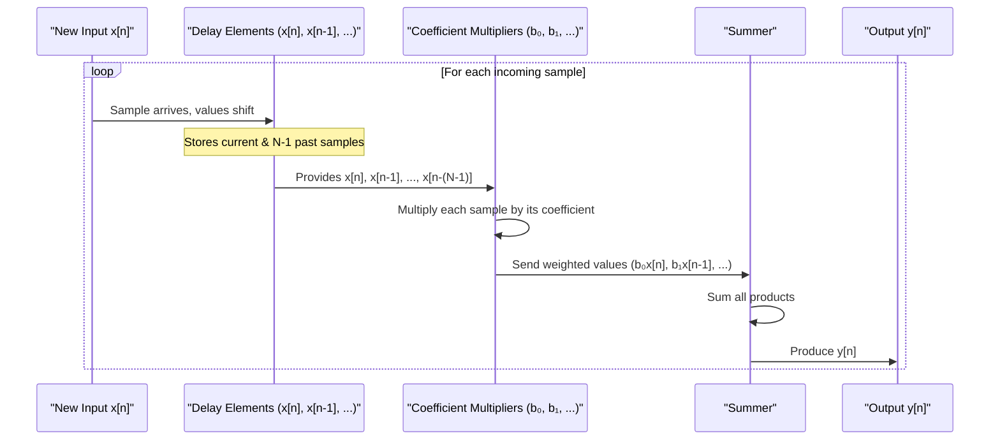

# Chapter 7: Finite Impulse Response (FIR) Filter

Welcome back! In [Chapter 6: Receive Equalizer](06_receive_equalizer_.md), we saw how equalizers at the receiver can clean up a distorted signal. These equalizers, as well as the [Transmit Equalizer (Pre-emphasis/De-emphasis)](05_transmit_equalizer__pre_emphasis_de_emphasis_.md) we discussed earlier, often rely on a fundamental building block to do their signal-shaping magic. That block is a type of filter, and one of the most common and versatile is the **Finite Impulse Response (FIR) Filter**.

Imagine you're trying to smooth out the daily temperature readings to see a clearer trend. You might calculate a "moving average" where today's average temperature isn't just today's temperature, but a mix of today's, yesterday's, and the day before's, each with a certain "importance" or "weight." An FIR filter works on a very similar principle, but for electrical signals!

## What is a Finite Impulse Response (FIR) Filter?

A **Finite Impulse Response (FIR) filter** is a type of digital (or sometimes analog) filter that produces an output signal based on a **weighted sum of the current input sample and a finite number of past input samples**.

Let's break that down:
*   **Filter:** Its job is to modify a signal, perhaps to remove unwanted parts or emphasize desired parts. In equalizers, we want to shape the signal's frequency content to combat channel distortion.
*   **Input Samples:** Our continuous data signal is often "sampled" – measured at regular, tiny intervals of time. Each measurement is a "sample."
*   **Weighted Sum:** This means we take the current input sample and some of the previous ones, multiply each by a specific number (its "weight" or "coefficient"), and then add them all up. This sum becomes the current output sample of the filter.
*   **Finite:** This is crucial. "Finite" means the filter only looks back at a specific, limited number of past input samples. It doesn't remember things from the ancient past of the signal.
*   **Impulse Response:** This part of the name comes from how the filter behaves if you feed it a perfect, single, sharp "spike" (an impulse). The filter's output in response to this impulse will last for a finite amount of time and then settle to zero.

**The Moving Average Analogy:**
If you're calculating a 3-day moving average of temperature:
`Avg_Temp_Today = (0.5 * Temp_Today) + (0.3 * Temp_Yesterday) + (0.2 * Temp_DayBeforeYesterday)`
Here:
*   `Temp_Today`, `Temp_Yesterday`, `Temp_DayBeforeYesterday` are like your input signal samples (`x[n]`, `x[n-1]`, `x[n-2]`).
*   `0.5`, `0.3`, `0.2` are the "weights" or "coefficients" (we'll call them `b0`, `b1`, `b2`).
*   `Avg_Temp_Today` is like your filter's output (`y[n]`).
This is a simple FIR filter! You only used a *finite* number of past temperatures (3 of them).

In an equalizer, the FIR filter's coefficients (weights) are carefully chosen to reshape the signal's spectrum – for example, to boost high frequencies that the [Channel](01_channel_.md) weakened, thereby reducing [Inter-Symbol Interference (ISI)](02_inter_symbol_interference__isi__.md).

## How an FIR Filter Works: The Basic Recipe

An FIR filter works by taking the current input sample and a few of its predecessors, multiplying each by a specific coefficient (also called a "tap weight"), and summing these products.

Mathematically, for an FIR filter with `N` taps (meaning it uses `N` coefficients and looks at the current input and `N-1` past inputs), the output `y[n]` at time `n` is calculated from the input `x[n]` as:

`y[n] = b₀ * x[n] + b₁ * x[n-1] + b₂ * x[n-2] + ... + b_(N-1) * x[n-(N-1)]`

Where:
*   `y[n]` is the output sample at the current time `n`.
*   `x[n]` is the input sample at the current time `n`.
*   `x[n-1]` is the input sample from one time step ago.
*   `x[n-2]` is the input sample from two time steps ago, and so on.
*   `b₀, b₁, b₂, ..., b_(N-1)` are the filter coefficients (the "weights" or "taps"). These numbers define what the filter does to the signal.

**Example: A Simple 3-Tap FIR Filter**
Let's say we have a 3-tap FIR filter (`N=3`). Its equation would be:
`y[n] = b₀ * x[n] + b₁ * x[n-1] + b₂ * x[n-2]`

Imagine the input signal `x` arrives one sample at a time. To calculate each output sample `y[n]`:
1.  The filter stores the current input `x[n]` and the two previous inputs, `x[n-1]` and `x[n-2]`.
2.  It multiplies `x[n]` by `b₀`.
3.  It multiplies `x[n-1]` by `b₁`.
4.  It multiplies `x[n-2]` by `b₂`.
5.  It adds these three products together to get `y[n]`.

When the next input sample `x[n+1]` arrives, what was `x[n]` becomes the new `x[n-1]`, what was `x[n-1]` becomes the new `x[n-2]`, and the process repeats.

## The Structure: A Tapped Delay Line

FIR filters are often visualized as a "tapped delay line." This structure consists of:
1.  **Delay Elements:** These hold past input samples. In digital filters, these are usually registers that pass their value along at each clock cycle. Each delay element holds the input from one time unit (`T` or `UI`) earlier.
2.  **Multipliers:** Each (current or delayed) sample is multiplied by its corresponding coefficient (`b_k`).
3.  **A Summer (Adder):** All the multiplied values are added together to produce the filter output.

Here's a conceptual diagram of a 3-tap FIR filter:

```mermaid
graph TD
    subgraph FIR_Filter_Structure [3-Tap FIR Filter]
        direction LR
        Input[Input x(n)] --> S0[Sample x(n)]

        S0 --> M0((x))
        Coeff0[b₀] --> M0
        M0 --> Sum((Σ))

        S0 --> Z1[Delay T] --> S1[Sample x(n-1)]
        S1 --> M1((x))
        Coeff1[b₁] --> M1
        M1 --> Sum

        S1 --> Z2[Delay T] --> S2[Sample x(n-2)]
        S2 --> M2((x))
        Coeff2[b₂] --> M2
        M2 --> Sum

        Sum --> Output[Output y(n)]
    end
```

*   `x(n)` is the current input signal sample.
*   `Delay T` represents a delay of one sample period.
*   `x(n-1)` is the input sample from one period ago, `x(n-2)` from two periods ago.
*   `b₀, b₁, b₂` are the filter coefficients (tap weights).
*   `((x))` represents multiplication.
*   `((Σ))` represents summation.
*   `y(n)` is the current output sample.

This structure is very common. The reference paper shows similar FIR structures for [Transmit Equalizer (Pre-emphasis/De-emphasis)](05_transmit_equalizer__pre_emphasis_de_emphasis_.md) (Figure 10, page 9) and for digital [Receive Equalizer](06_receive_equalizer_.md)s (Figure 14, page 12).

## FIR Filters in Equalization: Correcting the Signal

The magic of FIR filters in equalization lies in choosing the right **coefficients** (`b₀, b₁, ...`).
*   In [Chapter 1: Channel](01_channel_.md), we learned that channels often attenuate high frequencies more than low frequencies.
*   An FIR equalizer aims to counteract this by having a frequency response that boosts high frequencies.

How do coefficients do this?
*   **To boost high frequencies (typical for a receive equalizer):** You might have a large positive main coefficient (`b_k` for the "cursor" or main part of the pulse) and smaller negative coefficients for adjacent samples (`b_{k-1}`, `b_{k+1}`). This emphasizes differences between samples, which corresponds to high frequencies.
*   **For Transmit Pre-emphasis/De-emphasis:** As discussed in [Chapter 5](05_transmit_equalizer__pre_emphasis_de_emphasis_.md), a transmit FIR filter pre-distorts the signal. For de-emphasis, if the current bit is the same as the previous bit (low frequency), the output might be reduced. If it's different (a transition, high frequency), the output is stronger. For example, coefficients like `C = [-0.13, 0.66, -0.21]` (from page 10 of the reference paper) are used. Here, 0.66 is the main tap, and -0.13 and -0.21 are "post-cursor" and "pre-cursor" taps that effectively subtract scaled versions of future and past symbols (relative to the data bits fed into the Tx FIR) to shape the output pulse.

The reference paper (page 8) states, "The frequency shaping filters that flatten the channel response till Nyquist frequency are called equalizers." FIR filters are excellent for creating these precise frequency shapes.

## Under the Hood: A Step-by-Step Example

Let's trace how an FIR filter processes a sequence of input samples.
Suppose we have a 3-tap FIR filter with coefficients:
*   `b₀ = 0.5`
*   `b₁ = 0.3`
*   `b₂ = 0.2`

And our input signal `x` comes in as: `..., 0, 0, 10, 5, -2, 0, ...` (Let's say `x[0]=10`, `x[1]=5`, `x[2]=-2`).

**Step 1: Calculate `y[0]`** (assuming `x[-1]=0`, `x[-2]=0` initially)
*   `x[0] = 10`, `x[-1] = 0`, `x[-2] = 0`
*   `y[0] = (0.5 * 10) + (0.3 * 0) + (0.2 * 0) = 5 + 0 + 0 = 5`
    The output `y[0]` is 5. The delay line now contains `[10, 0, 0]` (from most recent to oldest).

**Step 2: Calculate `y[1]`**
*   New input `x[1] = 5`. The previous `x[0]=10` is now `x[n-1]`. The previous `x[-1]=0` is now `x[n-2]`.
*   So, for calculating `y[1]`: current `x` is `5`, previous `x` is `10`, pre-previous `x` is `0`.
*   `y[1] = (0.5 * 5) + (0.3 * 10) + (0.2 * 0) = 2.5 + 3 + 0 = 5.5`
    The output `y[1]` is 5.5. The delay line now contains `[5, 10, 0]`.

**Step 3: Calculate `y[2]`**
*   New input `x[2] = -2`. Previous `x` is `5`, pre-previous `x` is `10`.
*   `y[2] = (0.5 * -2) + (0.3 * 5) + (0.2 * 10) = -1 + 1.5 + 2 = 2.5`
    The output `y[2]` is 2.5. The delay line now contains `[-2, 5, 10]`.

And so on for every new input sample.

Here's a sequence diagram illustrating the general flow:


## Why is it called "Finite Impulse Response"?

This is an important characteristic. If you send a single, sharp "spike" called an **impulse** as input to an FIR filter, its output will also be of finite duration.
An impulse signal is typically represented as a '1' at time `n=0`, followed by all '0's for `n>0`.
So, `x[0]=1`, and `x[n]=0` for `n ≠ 0`.

Let's see what happens with our 3-tap filter: `y[n] = b₀x[n] + b₁x[n-1] + b₂x[n-2]`
*   `y[0] = b₀*x[0] + b₁*x[-1] + b₂*x[-2] = b₀*1 + b₁*0 + b₂*0 = b₀`
*   `y[1] = b₀*x[1] + b₁*x[0] + b₂*x[-1] = b₀*0 + b₁*1 + b₂*0 = b₁`
*   `y[2] = b₀*x[2] + b₁*x[1] + b₂*x[0] = b₀*0 + b₁*0 + b₂*1 = b₂`
*   `y[3] = b₀*x[3] + b₁*x[2] + b₂*x[1] = b₀*0 + b₁*0 + b₂*0 = 0`
*   And for all `n > 2`, `y[n]` will be `0`.

The output sequence (the "impulse response") is `[b₀, b₁, b₂, 0, 0, ...]`. It's exactly the sequence of filter coefficients, and then it stops (becomes zero). It is **finite** in length! This is why it's called a Finite Impulse Response filter.

## Advantages of FIR Filters for Equalization

FIR filters are very popular in digital signal processing and equalization for several reasons:
1.  **Stability:** They are always stable. This means their output will not grow uncontrollably, which is a very desirable property for any filter.
2.  **Linear Phase:** FIR filters can be easily designed to have a "linear phase" response. This means all frequency components of the signal are delayed by the same amount as they pass through the filter. This is important because it prevents "phase distortion," which can further corrupt the signal shape.
3.  **Flexibility and Simplicity:** The concept is relatively simple, and by changing the coefficients, a wide variety of frequency responses can be achieved. The structure (tapped delay line) is regular and well-suited for hardware implementation.
4.  **Adaptive Potential:** The coefficients of an FIR filter can be updated "on the fly," allowing the filter to adapt to changing channel conditions. We'll touch upon this in [Chapter 10: Adaptive Equalization](10_adaptive_equalization_.md).

## Conceptual "Code" for an FIR Filter Operation

While FIR filters in high-speed links are implemented in hardware (analog or digital circuits), here's a very simple pseudo-code snippet to illustrate the core calculation for one output sample of a 3-tap FIR filter:

```python
# Let's say we have stored input samples:
# x_current  (this is x[n])
# x_prev1    (this is x[n-1], from one time step ago)
# x_prev2    (this is x[n-2], from two time steps ago)

# And we have our filter coefficients (tap weights):
# b0, b1, b2

# Calculate the current output sample y_output (this is y[n])
y_output = (b0 * x_current) + \
           (b1 * x_prev1) + \
           (b2 * x_prev2)

# This y_output is the filtered signal sample at the current time.
# For the next time step, x_current will become x_prev1,
# x_prev1 will become x_prev2, and a new x_current will arrive.
```
This simple multiplication and addition is repeated for every new input sample that arrives, producing a continuous stream of filtered output samples.

## Conclusion

The **Finite Impulse Response (FIR) Filter** is a fundamental workhorse in digital signal processing and a key component in many equalizers for high-speed serial links.
*   It works by calculating a **weighted sum of the current input sample and a finite number of past input samples.**
*   The "weights" are called **coefficients or taps**, and they define the filter's behavior.
*   Its structure is often a **tapped delay line**.
*   It's called "Finite Impulse Response" because its response to a single input spike is finite in duration.
*   FIR filters are stable, can have linear phase, and are versatile for shaping signal spectrums, making them ideal for counteracting channel distortions like those causing [Inter-Symbol Interference (ISI)](02_inter_symbol_interference__isi__.md).

Both [Transmit Equalizer (Pre-emphasis/De-emphasis)](05_transmit_equalizer__pre_emphasis_de_emphasis_.md) and [Receive Equalizer](06_receive_equalizer_.md) designs frequently employ FIR filters to achieve their goals. Understanding how they work is crucial to understanding modern equalization.

## Next Steps

FIR filters are great at compensating for channel distortion based on the incoming signal itself. However, there's another clever type of equalizer that uses information about *past decisions* (what the receiver thought previous bits were) to help clean up the current bit. This is the [Decision Feedback Equalizer (DFE)](08_decision_feedback_equalizer__dfe__.md), and we'll explore it in the next chapter.

---

Generated by [AI Codebase Knowledge Builder](https://github.com/The-Pocket/Tutorial-Codebase-Knowledge)