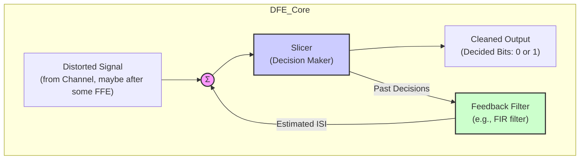
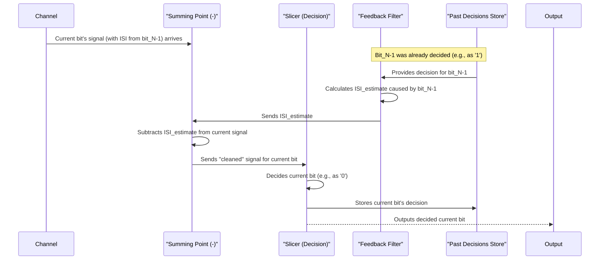

# Chapter 8: Decision Feedback Equalizer (DFE)

Welcome back! In the previous chapter, [Chapter 7: Finite Impulse Response (FIR) Filter](07_finite_impulse_response__fir__filter_.md), we learned about FIR filters, which are powerful tools for reshaping signals, often used in both transmit and receive equalizers. Now, we're going to explore a particularly clever type of *receive* equalizer that takes a different approach to cleaning up our data: the **Decision Feedback Equalizer (DFE)**.

## What is a Decision Feedback Equalizer (DFE)? The Echo Canceller

Imagine you're listening to a person speak with a very specific type of echo or stutter: the end of each word they say slightly bleeds into the beginning of the *next* word.
*   You hear: "WOR**D1**... d1-WOR**D2**... d2-WOR**D3**..."

This is similar to **post-cursor [Inter-Symbol Interference (ISI)](02_inter_symbol_interference__isi__.md)**, where the "tail" of a previously sent bit interferes with the current bit you're trying to understand.

Now, suppose you're quick-witted. Once you've figured out "WORD1", you know what its lingering "d1..." sound is. For the next word, you can mentally *subtract* that "d1..." sound from what you hear ("d1-WORD2"). This makes "WORD2" much clearer!

A **Decision Feedback Equalizer (DFE)** works on a similar principle for digital signals. It's a type of receive equalizer that uses the receiver's *decisions* about previously detected bits to cancel out the lingering interference (post-cursor ISI) those past bits cause on the current bit. It "feeds back" these decisions to help clean up the signal.

The key idea:
1.  The receiver makes a decision on a bit (e.g., "Okay, this bit was a '1'").
2.  The DFE knows how a '1' (or a '0') from that previous position typically distorts the *next* bit.
3.  It then *subtracts* this estimated distortion from the incoming signal for the current bit, right before the receiver tries to decide what the current bit is.

This helps to "un-blur" the current bit from the echoes of its predecessors.

## Why Use a DFE? The Problem with Just Boosting

In [Chapter 6: Receive Equalizer](06_receive_equalizer_.md), we learned that many receive equalizers (like continuous-time linear equalizers or FIR filters) work by boosting high frequencies to counteract the channel's tendency to weaken them. This is like turning up the treble on your stereo.

However, there's a catch: if you turn up the treble, you also turn up any high-frequency *noise* (like hiss). Boosting frequencies can amplify noise along with the signal, which isn't ideal.

The DFE offers an advantage here. As the reference paper mentions (page 22), "The problem of noise enhancement can be completely eliminated by using Decision Feedback Equalizer (DFE)... Since the ISI cancellation is based on previous decisions, without high-frequency boost, it is inherently immune to noise enhancement." Instead of blindly boosting parts of the signal (and any noise within them), the DFE tries to *subtract* a known source of interference – the ISI from past bits.

## How a DFE Works: The Feedback Loop

The DFE has a clever feedback mechanism. Here's a simplified view of its main parts and how they interact:


*This is a simplified block diagram. "FFE" stands for Feed-Forward Equalizer, which might be a linear equalizer handling pre-cursor ISI.*

Let's break down the components:
1.  **Input Signal:** This is the signal coming from the [Channel](01_channel_.md), possibly after some initial equalization by another filter (like a simple linear equalizer to handle pre-cursor ISI). It's still likely to contain post-cursor ISI from previously sent bits.
2.  **Summing Point (or Subtractor):** This is where the magic happens. It takes the incoming signal and *subtracts* an estimate of the ISI that the DFE thinks is caused by past bits.
3.  **Slicer (Decision Maker):** This is the heart of the receiver. After the ISI subtraction, the slicer looks at the "cleaned-up" signal level and makes a hard decision: "Is this bit a '1' or a '0'?"
4.  **Output Signal:** These are the decided bits, hopefully the correct data sequence.
5.  **Feedback Filter:** This is crucial. It takes the *past decisions* made by the slicer (e.g., the last few bits that were decided as '1', '0', '1', etc.). Based on these known past decisions, and a set of coefficients (taps, similar to an [Finite Impulse Response (FIR) Filter](07_finite_impulse_response__fir__filter_.md)), it calculates an *estimate* of the ISI that these past bits are currently imposing on the signal being processed at the summing point.
6.  **Feedback Path:** The estimated ISI from the feedback filter is fed back to the summing point to be subtracted.

The reference paper shows a similar block diagram in Figure 28 (page 23 of PDF).

## A Step-by-Step Conceptual Walkthrough

Let's follow a signal for one bit through the DFE:


1.  The signal for the *current bit* arrives at the summing point. It's "contaminated" by the lingering tail (post-cursor ISI) of the *previous bit* (and maybe bits before that).
2.  The DFE has already made a decision about that *previous bit*. Let's say it decided the previous bit was a '1'.
3.  This '1' decision is fed to the **Feedback Filter**. The filter has "tap weights" that are tuned to predict how much of a tail a '1' (or '0') from the previous position would create. It calculates an *ISI estimate*.
4.  This ISI estimate is subtracted from the incoming signal at the **Summing Point**.
5.  The **Slicer** now looks at this "cleaner" signal (with the previous bit's tail hopefully removed) and makes its decision for the *current bit*.
6.  This new decision for the current bit is then stored and will be used by the feedback filter to help clean up the *next* bit, and so on.

## Conceptual "Code" for DFE Operation

While DFEs are hardware circuits, here's a simplified Python-like snippet to illustrate the core logic of subtracting the estimated ISI before making a decision for one sample:

```python
# --- Inputs ---
# incoming_signal_sample: Current analog value (e.g., from channel)
# previous_decisions: A list/array of past decided bits, like [-1, 1, -1] (for '0', '1', '0')
# feedback_taps: Coefficients [c1, c2, c3, ...] for the DFE feedback filter

# --- 1. Estimate ISI from past decisions ---
isi_estimate = 0.0
# Example: if previous_decisions = [-1, 1] (bit N-2 was 0, bit N-1 was 1)
# and feedback_taps = [0.2, 0.1] (c1 for N-1, c2 for N-2)
# isi_estimate = (0.2 * 1) + (0.1 * -1) = 0.2 - 0.1 = 0.1
# This means we estimate past bits are adding 0.1V of ISI.
for i in range(len(feedback_taps)):
  # previous_decisions[0] is the most recent past decision (bit N-1)
  # previous_decisions[1] is bit N-2, and so on.
  isi_estimate += feedback_taps[i] * previous_decisions[i]

# --- 2. Subtract estimated ISI from the incoming signal ---
# If incoming_signal_sample was 0.9V, and isi_estimate was 0.1V
# corrected_signal_sample = 0.9 - 0.1 = 0.8V
corrected_signal_sample = incoming_signal_sample - isi_estimate

# --- 3. Make a decision on the corrected sample ---
# Slicer decides if 0.8V is a '1' (e.g., > 0V) or '0' (e.g., < 0V)
# Let's say it decides '1' (represented as +1)
current_decision = 0 # Placeholder for actual slicer logic
if corrected_signal_sample > 0.0: # Simple slicer threshold at 0V
    current_decision = 1.0
else:
    current_decision = -1.0

# --- 4. Update history for the next bit ---
# The 'current_decision' will become part of 'previous_decisions' for the *next* sample.
# (Implementation detail: shift previous_decisions and insert current_decision)

# print(f"Corrected signal: {corrected_signal_sample}, Decision: {current_decision}")
```
**Explanation of the "Code":**
*   `incoming_signal_sample`: This is the voltage level the DFE sees for the current moment in time.
*   `previous_decisions`: This is like a little memory, holding what the DFE decided for the immediately preceding bits (e.g., if +1 means '1' and -1 means '0').
*   `feedback_taps`: These are numbers (coefficients) that tell the DFE how much "echo" each past bit typically creates. For example, `feedback_taps[0]` is for the bit just before the current one, `feedback_taps[1]` for the bit before that, etc.
*   **Step 1 (Estimate ISI):** The code loops through the known past decisions and their corresponding tap weights. It multiplies them and adds them up to get a total `isi_estimate`. This is the DFE's best guess of the unwanted voltage contributed by the tails of past bits.
*   **Step 2 (Subtract ISI):** This estimated ISI is subtracted from the `incoming_signal_sample` to get a `corrected_signal_sample`.
*   **Step 3 (Make Decision):** A simple "slicer" then looks at the `corrected_signal_sample`. If it's above a certain threshold (here, 0.0V), it decides it's a '1'; otherwise, a '0'.
*   **Step 4 (Update History):** This new `current_decision` is then saved so it can be used to help decode the *next* incoming bit.

This process repeats for every bit, constantly using past knowledge to clarify the present!

## Benefits of Using a DFE

1.  **No Noise Amplification (for the feedback part):** Because the DFE subtracts an *estimated* ISI based on (hopefully) noise-free decisions, it doesn't amplify input noise in the same way a linear equalizer that boosts frequencies does. This is a significant advantage.
2.  **Effective against Post-Cursor ISI:** DFEs are very good at removing the "tails" of previous bits that interfere with the current bit.

## Challenges and Considerations with DFEs

While powerful, DFEs come with their own set of challenges:

1.  **Error Propagation:**
    *   **The Problem:** What if the slicer makes a mistake? For instance, it decides a bit was a '0' when it was actually a '1'. This wrong decision ('0') is then fed into the feedback filter. The DFE will then try to subtract the ISI it *thinks* a '0' would cause, instead of the ISI a '1' *actually* caused. This can make the ISI on the *next* bit even worse, potentially leading to another error, and then another... This chain reaction is called **error propagation**.
    *   **Mitigation:** For high-speed links that require very low bit error rates (BER, e.g., 1 error in 10^12 bits or fewer), the initial error rate is already so low that error propagation is often a manageable concern. The reference paper (page 22) notes, "in the case of serial-links with required BER < 10^-12 error propagation does not degrade the performance."

2.  **Only Cancels Post-Cursor ISI:**
    *   **The Limitation:** A DFE uses *past* decisions. It can't know about *future* bits to cancel pre-cursor ISI (where the beginning of a future pulse might interfere with the current one).
    *   **The Solution:** DFEs are often paired with a **Feed-Forward Equalizer (FFE)** – typically a linear equalizer like an [Finite Impulse Response (FIR) Filter](07_finite_impulse_response__fir__filter_.md) or a [Continuous-Time Equalizer](09_continuous_time_equalizer_.md). The FFE handles the pre-cursor ISI (and maybe some of the post-cursor ISI), and the DFE then takes care of the remaining post-cursor ISI. The reference paper (page 22) mentions, "a separate feed-forward filter is required to cancel pre-cursor ISI."

3.  **Feedback Loop Latency (Timing is Critical!):**
    *   **The Challenge:** Look at the DFE block diagram. The slicer makes a decision. That decision goes through the feedback filter. The filter's output goes to the summing junction to affect the *very next* input sample for the slicer. This whole loop (Slicer -> Feedback Filter -> Summer -> Slicer) needs to happen very, very fast – ideally within one bit period! If the loop is too slow (too much latency), the ISI cancellation for the immediately following bit will arrive late and be ineffective. The reference paper (page 22) highlights this: "The loop latency due to the input slicer regeneration time and the coefficient DAC settling time should be less than the bit period..."
    *   **Solutions:** For very high speeds where this loop is too slow, engineers use clever tricks like "decision look-ahead" or "loop unrolling." These techniques involve more complex hardware (e.g., multiple slicers making speculative decisions in parallel) to effectively "break" the tight timing loop for the first few post-cursor ISI taps. Figure 29 in the reference paper (page 23) shows an example of a 1-bit decision look-ahead scheme.

## DFE in the Grand Scheme

A DFE is a powerful component in a receiver's toolkit. It's not usually the *only* equalizer used, especially in very high-speed systems. A common strategy is:
1.  A [Transmit Equalizer (Pre-emphasis/De-emphasis)](05_transmit_equalizer__pre_emphasis_de_emphasis_.md) might give the signal an initial boost.
2.  At the receiver, a linear Feed-Forward Equalizer (FFE) might tackle some of the ISI, especially pre-cursor ISI.
3.  Then, a DFE comes in to clean up the remaining, often dominant, post-cursor ISI.

This combination allows each type of equalizer to play to its strengths.

## Conclusion: Smart Subtraction for Cleaner Signals

The **Decision Feedback Equalizer (DFE)** is a clever type of receive equalizer that uses past decisions to improve current ones.
*   It "feeds back" information about previously detected bits.
*   It estimates the **post-cursor ISI** (lingering tails) from these past bits.
*   It *subtracts* this estimated ISI from the current signal before a final decision is made.
*   A major advantage is that it **avoids amplifying noise** in the way linear equalizers might.
*   Key challenges include **error propagation**, its inability to handle **pre-cursor ISI** alone, and the critical **feedback loop timing**.

DFEs are a testament to the ingenious ways engineers overcome the challenges of sending data reliably at incredibly high speeds. They don't just fight the distortion; they learn from the past to make the present clearer!

## Next Steps

We've now seen FIR filters and DFEs, which often involve sampling the signal and processing it in discrete time steps or using digital-like decisions. However, some equalizers work directly on the continuous, analog signal as it comes in. In the next chapter, we'll explore the [Continuous-Time Equalizer](09_continuous_time_equalizer_.md), which does exactly that.

---

Generated by [AI Codebase Knowledge Builder](https://github.com/The-Pocket/Tutorial-Codebase-Knowledge)