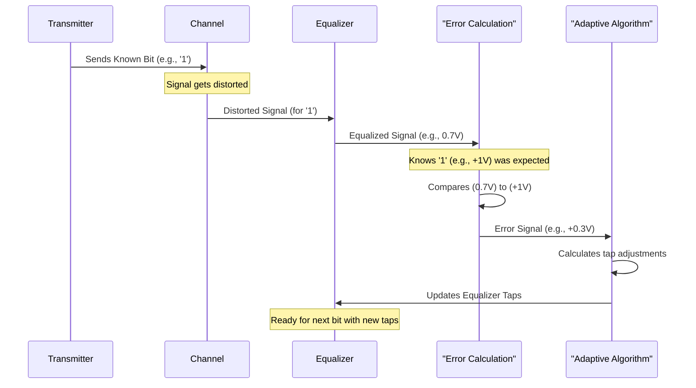

# Chapter 10: Adaptive Equalization

Welcome to our final chapter! In our journey so far, we've explored various types of "signal glasses" – equalizers like [Transmit Equalizer (Pre-emphasis/De-emphasis)](05_transmit_equalizer__pre_emphasis_de_emphasis_.md), [Finite Impulse Response (FIR) Filter](07_finite_impulse_response__fir__filter_.md)s, [Decision Feedback Equalizer (DFE)](08_decision_feedback_equalizer__dfe__.md)s, and most recently, the [Continuous-Time Equalizer](09_continuous_time_equalizer_.md). These tools are fantastic for cleaning up distorted signals. But a big question remains: how do we adjust these equalizers perfectly for *every* situation? What if the cable length changes, or the circuit board is slightly different? That's where **Adaptive Equalization** comes to the rescue!

## The Problem: One Size Doesn't Fit All

Imagine you have a pair of prescription glasses. They work great for you! But if you give them to your friend, they might find everything blurry. Or, what if your own eyesight changes over time? Your fixed prescription glasses won't be optimal anymore.

Similarly, our equalizers have settings – like the "tap weights" or "coefficients" in an [Finite Impulse Response (FIR) Filter](07_finite_impulse_response__fir__filter_.md) or the boost level in a [Continuous-Time Equalizer](09_continuous_time_equalizer_.md). We could try to find the *perfect* settings for one specific [Channel](01_channel_.md) in the lab. But in the real world:
*   **Channels vary:** The connection between two chips might be a short trace on one computer, and a much longer trace on another.
*   **Conditions change:** Temperature fluctuations can slightly alter a channel's properties.
*   **Manufacturing differences:** Tiny variations in making circuit boards or cables mean no two channels are exactly identical.

If we use fixed, pre-set equalizer settings, they might be "grossly sub-optimal," as the reference paper puts it (page 26). We need our equalizer to be smart and adjust itself!

**Our Use Case:**
You're designing a new super-fast USB port. Users might plug in a short 1-foot cable, or a long 6-foot cable. The signal distortion will be very different for each cable. How can your USB port automatically provide the best possible signal clarity for *whatever* cable the user connects? This is where adaptive equalization shines.

## What is Adaptive Equalization? The Auto-Focus for Signals

**Adaptive equalization** is a process where the equalizer's parameters (like its filter tap weights or coefficients) are **automatically adjusted in real-time or during a special setup phase (training phase)** to achieve the best possible performance for the *specific* channel it's connected to.

It's like an **auto-focus system in a camera**:
*   **The Scene (Channel):** The camera looks at a scene. The distance to your subject might change.
*   **The Lens (Equalizer):** The camera lens needs to be adjusted.
*   **The Picture (Received Signal):** The goal is a sharp, clear picture.
*   **Auto-Focus Mechanism (Adaptive Engine):** The camera continuously measures the sharpness and automatically adjusts its lens (the equalizer settings) based on the scene (channel characteristics) to ensure the picture (received signal) is as sharp as possible.

The equalizer "learns" how to best compensate for the current channel. This is crucial because, as the reference paper states (page 26), "In a practical transmission system, the exact channel characteristics are not known a priori."

## How Does the Equalizer "Learn"? The Feedback Loop

For an equalizer to adapt, it needs two things:
1.  A way to **measure how well it's doing** (is the signal getting clearer or worse?).
2.  A way to **adjust its settings** based on this measurement.

This is typically done using a feedback loop. The "adaptive engine automatically adjusts the coefficients by measuring the equalizer performance so as to improve the performance on an average." (Reference Paper, page 26).

Here's a general idea, often involving an "error signal":

```mermaid
graph TD
    InputSignal["Distorted Signal from Channel"] --> Equalizer["Equalizer (with current settings)"]
    Equalizer --> EqualizedSignal["Equalized Signal"]
    EqualizedSignal --> ErrorCalc["Error Calculation Logic"]
    ErrorCalc --> |Error Signal| AdaptiveEngine["Adaptive Engine/Algorithm"]
    AdaptiveEngine --> |New Settings| Equalizer

    subgraph IdealSignalSource [Source of "Ideal" Signal]
        direction LR
        A[What the signal *should* look like] --> ErrorCalc
    end
```
*   **Error Calculation Logic:** This block compares the `EqualizedSignal` to some reference of what the signal *should* look like. The difference is the "error."
*   **Adaptive Engine/Algorithm:** This "brain" takes the error signal and figures out how to tweak the `Equalizer`'s settings (e.g., its tap weights) to try and reduce this error.

There are two main ways the equalizer can get this "ideal" reference:

### 1. Training Phase: Learning with a Known Script

Often, when a communication link first starts up, it goes through a **training phase**.
*   The transmitter sends a **pre-defined, known sequence of bits** (like "10110010..."). Think of this as a test pattern.
*   The receiver *knows* this exact sequence.
*   The receiver's adaptive equalizer processes the incoming (distorted) training sequence.
*   The "Error Calculation Logic" compares the equalized signal to the *known* training sequence. If the equalized signal says '0' but it *should* have been a '1', that's an error.
*   The adaptive engine uses these errors to adjust the equalizer taps. It keeps doing this until the errors are minimized and the equalizer is "tuned" to the channel.

**Analogy: Tuning a Guitar**
Imagine you're tuning a guitar with an electronic tuner:
*   **Known Sequence:** You pluck a specific string (e.g., the E string). The tuner knows the correct E note.
*   **Equalized Signal:** The sound your string actually makes.
*   **Error:** The tuner tells you if your string is sharp (too high) or flat (too low).
*   **Adaptive Engine:** You turn the tuning peg (adjusting the equalizer tap) until the tuner says the note is correct (error is minimized).

The reference paper in Figure 33 (page 27) shows a block diagram for this: "Adaptive equalizer with a training sequence."

### 2. Decision-Directed Adaptation: Learning on the Fly

After training, or sometimes continuously, the equalizer can adapt using the receiver's *own decisions* about the data bits.
*   Once the equalizer is reasonably well-tuned, the receiver starts making decisions about the incoming random data (e.g., "I think this bit is a '1'").
*   The adaptive engine then *assumes* these decisions are mostly correct.
*   It uses these decided bits as the "ideal" reference.
*   It then tries to adjust the equalizer settings to make the signal *before* the decision point look even more like the ideal '1' or '0' it just decided upon.

This is called "decision-directed" adaptation. It's a bit like someone learning to speak a new language by listening to themselves and trying to correct their pronunciation based on what they *think* the words should sound like. It's powerful because it allows the equalizer to track slow changes in the channel even during normal data transmission.

## The Adaptive Algorithm: The "Brain"

The "adaptive engine" uses a specific algorithm to decide how to update the equalizer coefficients based on the calculated error. Two popular algorithms mentioned in the reference paper (page 26) are:

1.  **Least Mean Squares (LMS) Algorithm:**
    *   This is a very common and robust algorithm.
    *   Its goal is to adjust the equalizer taps to minimize the *mean (average) of the square of the error*. Squaring the error makes big errors count much more, and it doesn't care if the error is positive or negative.
    *   It iteratively nudges the tap weights in the direction that reduces this squared error.
    *   Equation 13 in the reference paper shows the update rule:
        `C(k+1,n) = C(k,n) + µ * e_k * X_{k-n}`
        *   `C(k+1,n)`: The new value for tap `n`.
        *   `C(k,n)`: The old value for tap `n`.
        *   `µ` (mu): The "learning rate" or step size – a small number that controls how big the adjustments are.
        *   `e_k`: The error signal at step `k`.
        *   `X_{k-n}`: The input signal sample that contributed to this tap's output (e.g., if tap `n` processes `x[k-n]`).

2.  **Zero-Forcing (ZF) Algorithm:**
    *   This algorithm has a more direct goal: it tries to adjust the taps so that the [Inter-Symbol Interference (ISI)](02_inter_symbol_interference__isi__.md) from other bits is forced to be zero at the exact moment the current bit is being sampled.
    *   It's like trying to make sure all "echoes" from previous sounds are perfectly silent when you're trying to hear the current sound.

A variation of LMS, called **Sign-Sign LMS**, is often used because it's simpler to implement in hardware. It uses only the *sign* (positive or negative) of the error and the sign of the input signal, avoiding complex multiplications. Equation 14 in the reference paper shows this:
`C(k+1,n) = C(k,n) + µ * sign(e_k) * sign(X_{k-n})`

## Conceptual "Code" for a Simple Tap Update (LMS-like)

Let's imagine a very simple [Finite Impulse Response (FIR) Filter](07_finite_impulse_response__fir__filter.md) with just *one* tap `c`.
The input to this tap at the current moment is `x_input_for_tap`.
The output of this one-tap equalizer is `y_equalized = c_old * x_input_for_tap`.
We have a `desired_output` (e.g., from a training sequence, or a previous decision).
Our `learning_rate` is a small positive number (e.g., 0.01).

```python
# --- Inputs for one update step ---
# c_old: The current value of our single tap
# x_input_for_tap: The relevant input signal value for this tap
# desired_output: What we want the equalized output to be (+1 or -1 for a bit)
# learning_rate: How big of a step to take (e.g., 0.01)

# --- 1. Calculate current equalized output (for this one tap) ---
y_equalized = c_old * x_input_for_tap

# --- 2. Calculate the error ---
# If desired is +1 and y_equalized is 0.8, error is 0.2
# If desired is -1 and y_equalized is -1.2, error is 0.2
error = desired_output - y_equalized

# --- 3. Update the tap ---
# This nudges 'c' in a direction to reduce the error for this input
c_new = c_old + learning_rate * error * x_input_for_tap

# --- Output ---
# c_new: The updated tap value, to be used for the next signal sample.
# This c_new will hopefully make the error smaller next time a similar
# x_input_for_tap and desired_output combination occurs.
```
**Explanation:**
*   The `error` tells us how far off our equalizer's output was from the `desired_output`.
*   We multiply this `error` by the `x_input_for_tap`. This term (`error * x_input_for_tap`) basically tells us which way to adjust `c_old`. If `x_input_for_tap` was large and contributed a lot to a large error, the adjustment will be larger.
*   The `learning_rate` scales down the adjustment. A small learning rate makes the adaptation slower but more stable. A large learning rate can be faster but might overshoot or become unstable.
*   This `c_new` is then used for the next bit, and the process repeats. Over many bits, `c` will hopefully converge to a value that minimizes the overall error.

In a real multi-tap FIR filter, this kind of update happens for *all* taps simultaneously.

## Step-by-Step: The Adaptive Process (Conceptual)

Here's how it might work during a training phase with a known sequence:


1.  **Transmit Known Bit:** The transmitter sends a bit from the training sequence (e.g., a '1').
2.  **Channel Distortion:** The signal travels through the channel and gets distorted.
3.  **Equalization:** The equalizer, with its current tap settings, processes the distorted signal.
4.  **Error Calculation:** The output of the equalizer (say, 0.7V) is compared to the ideal value for a '1' (say, +1V). An error signal (e.g., 1V - 0.7V = 0.3V) is generated.
5.  **Adaptive Algorithm:** The algorithm takes this error and the input signal values and calculates how to adjust the equalizer's tap weights.
6.  **Update Taps:** The tap weights of the equalizer are updated.
7.  **Repeat:** This process repeats for every bit in the training sequence. Over time, the tap weights converge to values that minimize the error, effectively "learning" how to compensate for the channel.

## Benefits of Going Adaptive

Why go through all this trouble?
*   **Automatic Tuning:** No need for a human to manually set up the equalizer for every different cable or system. It "just works."
*   **Optimal Performance:** The equalizer finds the best settings for the *actual* channel it's connected to, leading to a more open [Eye Diagram](03_eye_diagram_.md) and fewer bit errors.
*   **Robustness:** It can handle variations in channels due to manufacturing, different cable lengths, or even slow environmental changes like temperature.
*   **Higher Data Rates:** By always trying to optimize the signal, adaptive equalization allows systems to push for higher speeds on channels that would otherwise be unusable.

Adaptive techniques can be applied to various types of equalizers, including the FIR filters in [Transmit Equalizer (Pre-emphasis/De-emphasis)](05_transmit_equalizer__pre_emphasis_de_emphasis_.md) and [Receive Equalizer](06_receive_equalizer_.md)s, the feedback taps in a [Decision Feedback Equalizer (DFE)](08_decision_feedback_equalizer__dfe__.md), and even for tuning the parameters of a [Continuous-Time Equalizer](09_continuous_time_equalizer_.md) (as mentioned on page 27 of the reference paper, using different error detection mechanisms).

## Conclusion: Smart Equalizers for a Smarter World

**Adaptive Equalization** is the secret sauce that makes our high-speed communication links robust and reliable in the face of real-world imperfections and variations. By allowing the equalizer to "learn" and automatically adjust its settings, we can achieve optimal performance across a wide range of conditions.
*   It uses **feedback** about its performance (often an error signal) to guide adjustments.
*   It can learn during a **training phase** with known data or **on-the-fly** using its own decisions (decision-directed).
*   Algorithms like **LMS** or **ZF** provide the mathematical rules for updating equalizer settings.
*   The result is a communication link that is more tolerant, performs better, and ultimately enables the fast data transfer we rely on every day.

This chapter concludes our exploration of equalizers for high-speed serial links. From understanding the [Channel](01_channel_.md) and the dreaded [Inter-Symbol Interference (ISI)](02_inter_symbol_interference__isi__.md), to visualizing problems with the [Eye Diagram](03_eye_diagram_.md), and then diving into various [Equalization](04_equalization_.md) techniques – Transmit, Receive, FIR, DFE, CTLE – and finally, making them adaptive, we've covered the core concepts that help signals travel clearly and quickly. We hope this journey has given you a good foundation in this exciting field!

---

Generated by [AI Codebase Knowledge Builder](https://github.com/The-Pocket/Tutorial-Codebase-Knowledge)