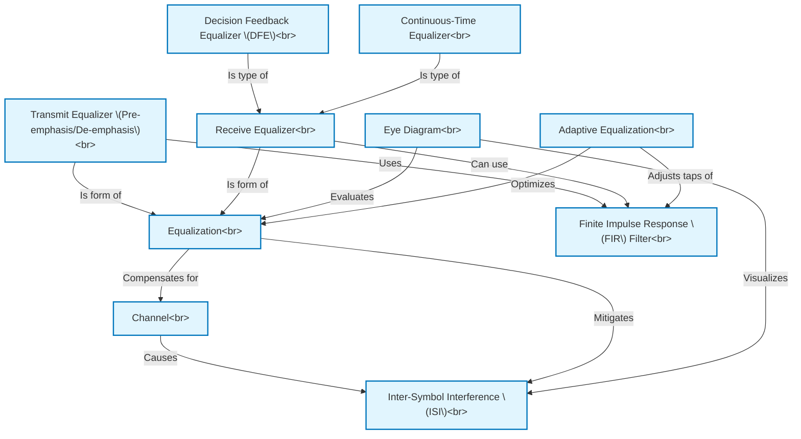

# Tutorial: EQUALIZERS FOR HIGH-SPEED SERIAL LINKS

This project details *equalization techniques* designed to overcome **Inter-Symbol Interference (ISI)** that arises in **high-speed serial links** due to **Channel** imperfections. It examines various approaches, including **Transmit Equalizers** (like pre-emphasis) and different **Receive Equalizers** such as **Decision Feedback Equalizers (DFE)** and **Continuous-Time Equalizers**. Many of these equalizers, particularly digital ones, are based on **Finite Impulse Response (FIR) Filters**. The **Eye Diagram** is presented as a key tool for assessing signal quality and the effectiveness of equalization. Finally, **Adaptive Equalization** methods are discussed for automatically tuning equalizer parameters to optimize performance.

**Source Repository:** [None](None)

## Chapters

1. [Channel
](01_channel_.md)
2. [Inter-Symbol Interference (ISI)
](02_inter_symbol_interference__isi__.md)
3. [Eye Diagram
](03_eye_diagram_.md)
4. [Equalization
](04_equalization_.md)
5. [Transmit Equalizer (Pre-emphasis/De-emphasis)
](05_transmit_equalizer__pre_emphasis_de_emphasis__.md)
6. [Receive Equalizer
](06_receive_equalizer_.md)
7. [Finite Impulse Response (FIR) Filter
](07_finite_impulse_response__fir__filter_.md)
8. [Decision Feedback Equalizer (DFE)
](08_decision_feedback_equalizer__dfe__.md)
9. [Continuous-Time Equalizer
](09_continuous_time_equalizer_.md)
10. [Adaptive Equalization
](10_adaptive_equalization_.md)

---

Generated by [AI Codebase Knowledge Builder](https://github.com/The-Pocket/Tutorial-Codebase-Knowledge)