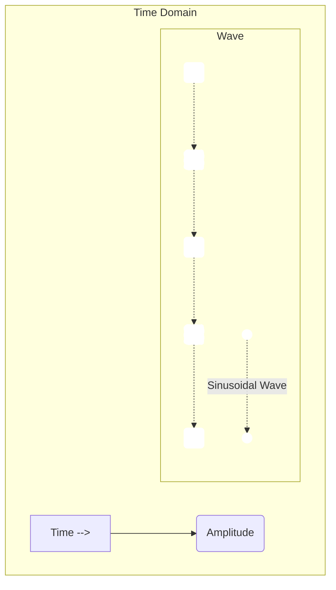

# Chapter 1: Fourier Transform (Definition)

Welcome to the fascinating world of the Fourier Transform! If you've ever wondered how we can "see" the hidden ingredients in a sound, an image, or many other types of signals, then you're in the right place.

## What's the Big Idea? The Problem We're Solving

Imagine you hear a musical chord played on a piano. It sounds like one, rich sound, right? But you also know that a chord is actually made up of several individual notes playing together. How could you figure out exactly which notes are in that chord and how loud each one is, just by listening to the combined sound?

This is the kind of problem the Fourier Transform helps us solve. It's like having a magical prism for signals.

Think about a glass prism:
*   White light goes in.
*   A rainbow of colors comes out.

The prism separates the white light into its basic color components (which are just different frequencies of light).

The **Fourier Transform** does something very similar for signals:
*   A complex signal (like our musical chord) goes in.
*   A breakdown of its basic frequency "ingredients" comes out.

It tells us which "pitches" (frequencies) make up our signal and how strong (amplitude) each pitch is. It can also tell us about the timing or alignment (phase) of these pitches.

## What is a Signal?

In this context, a "signal" is just a way of representing some information that changes. It could be:
*   **A sound wave**: The air pressure changing rapidly over time.
*   **An electrical signal**: The voltage in a wire changing over time.
*   **An image**: The brightness of pixels changing as you move across the image (changing over space).
*   **Stock prices**: The price of a stock changing over days or months.

For now, let's stick with our sound example. When you see a sound wave, it's often drawn as a wiggly line where the height of the line represents air pressure, and the horizontal axis represents time. This is called the **time-domain** view of the signal because we're looking at how it behaves over time.

A simple, pure musical note (like from a tuning fork) might look like a smooth, regular wave:


*(Imagine a smooth wave going up and down)*

A more complex sound, like our piano chord or your voice, is a much more complicated-looking wiggle because it's made up of many simple waves mixed together.

## What are Frequencies? The "Ingredients"

"Frequency" is just a measure of how fast something wiggles or oscillates.
*   A low-frequency sound (like a bass note) wiggles slowly.
*   A high-frequency sound (like a whistle) wiggles very quickly.

The Fourier Transform tells us which frequencies are present in our signal. For each frequency, it also tells us:
*   **Amplitude**: How strong or "loud" that particular frequency is in the mix.
*   **Phase**: The starting position or timing of that frequency's wiggle. (We'll explore phase more in later chapters, but it's good to know it's there!)

So, if our signal was a piano chord made of three notes, the Fourier Transform would help us identify those three specific frequencies (the notes) and their amplitudes (how loudly each note was played).

## The Fourier Transform: Our Signal Sorter

The Fourier Transform is a mathematical tool that takes a signal from its time-domain view (how it changes over time) and "transforms" it into a **frequency-domain** view. This new view shows us a map of all the frequencies present in the signal and their respective amplitudes and phases.

```mermaid
graph LR
    A[Original Signal (Time Domain) <br> e.g., complex sound wave] -- Fourier Transform --> B(Frequency Spectrum (Frequency Domain) <br> e.g., list of individual notes and their loudness);
```

Think of it like sorting a big pile of mixed LEGO bricks by color.
*   The original pile (our signal in the time domain) is a jumble.
*   The Fourier Transform is the sorting process.
*   The sorted piles (red LEGOs here, blue LEGOs there) represent the signal in the frequency domain – each "color" is a frequency, and the size of the pile is its amplitude.

The output of the Fourier Transform is itself a new function. If our original signal was `f(t)` (a function of time `t`), its Fourier Transform might be called `widehat{f}(ξ)` (pronounced "f-hat of xi"), where `ξ` (the Greek letter xi) represents frequency. This new function `widehat{f}(ξ)` tells us the amplitude and phase of each frequency `ξ` in the original signal.

This new perspective, looking at the frequencies, is so important that it has its own name: the [Frequency Domain](02_frequency_domain_.md), which we'll dive into in the next chapter.

## A Peek at the Math (The Definition)

Behind this powerful idea is some elegant mathematics. Don't worry about calculating this by hand right now! The goal here is just to see what the definition looks like and get a feel for its parts.

The Fourier Transform of a signal `f(x)` (where `x` could be time or space) is often written as:

`widehat{f}(ξ) = ∫ f(x) e^(-i2πξx) dx`

Let's break this down very simply:

*   `f(x)`: This is our original signal, the function we want to analyze (like our musical chord).
*   `widehat{f}(ξ)`: This is the result – the Fourier Transform! It's a new function that tells us about the frequencies present in `f(x)`. The symbol `ξ` (xi) represents frequency.
*   `∫ ... dx`: This long 'S' symbol is an integral. For now, just think of it as a special way of summing up the values of what comes after it, over all possible values of `x`.
*   `e^(-i2πξx)`: This is the most complex-looking part, but it's the "magic key" or the "frequency probe." It's a special mathematical function (a type of wave) that helps us "tune into" and measure how much of a specific frequency `ξ` is present in our signal `f(x)`. We'll learn much more about this amazing function when we discuss [Complex Sinusoids (Basis Functions)](03_complex_sinusoids__basis_functions__.md).
*   The whole formula essentially multiplies our signal `f(x)` by this "frequency probe" at a specific frequency `ξ` and then sums up (integrates) these products. If the signal `f(x)` contains a lot of the frequency `ξ`, this sum will be large. If not, it will be small.
*   By doing this for *all possible* frequencies `ξ`, we build up the entire `widehat{f}(ξ)`, which is our map of the frequency content.

The original function `f(x)` and its Fourier Transform `widehat{f}(ξ)` are so closely related they are called a **Fourier Transform Pair**.

It's important to know that just as we can transform a signal to see its frequencies, we can also go back! The process of getting the original signal from its Fourier Transform is called the [Inverse Fourier Transform](04_inverse_fourier_transform_.md).

## Why is it called a "Transform"?

It's called a "transform" because it changes our *perspective* on the signal.
*   We start by looking at the signal as it evolves over time (or space).
*   After the Fourier Transform, we look at the same signal in terms of which frequencies it contains.

It's the same information, just represented in a different, often more useful, way.

## Summary: What We've Learned

*   The **Fourier Transform** is a mathematical tool that acts like a prism for signals.
*   It **decomposes** a signal (like a sound wave or an image) into its constituent **frequencies**.
*   It tells us the **amplitude** (strength) and **phase** (starting point) of each frequency present.
*   It transforms our view of a signal from the **time domain** (or space domain) to the **frequency domain**.
*   The mathematical definition involves an integral with a special "frequency probing" function, but the concept is about revealing the signal's hidden frequency ingredients.

## Next Steps

Now that we have a basic idea of what the Fourier Transform is and why it's useful, we're ready to explore the new world it opens up for us. In the next chapter, we'll take a closer look at this new perspective: [Frequency Domain](02_frequency_domain_.md).

---

Generated by [AI Codebase Knowledge Builder](https://github.com/The-Pocket/Tutorial-Codebase-Knowledge)