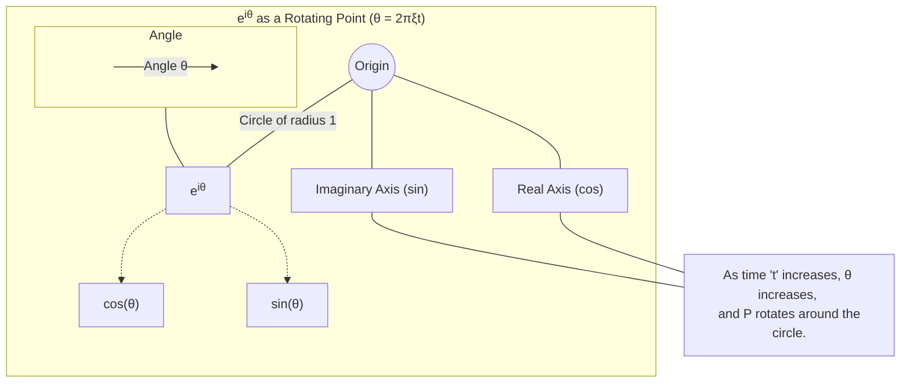

# Chapter 3: Complex Sinusoids (Basis Functions)

In the previous chapter, [Frequency Domain](02_frequency_domain_.md), we learned that the Fourier Transform takes us from a time-based view of a signal to a frequency-based view, like a chart showing all the "musical notes" and their "loudness" in a piece of music. But *how* does the Fourier Transform actually figure out this frequency information? What are the magical "frequency detectors" it uses? That's what this chapter is all about!

We're going to explore the fundamental building blocks of the Fourier Transform: **Complex Sinusoids**, which are also known as its **basis functions**.

## What Are We Trying To Do? The "Perfect Probes"

Imagine you have a very complex sound, like an orchestra playing. You want to know exactly which musical notes (frequencies) are present and how loud each one is. How would you do this?

One way could be to have a huge set of perfect tuning forks, one for every possible pitch. For each tuning fork:
1.  You'd strike it to make it ring at its specific pure frequency.
2.  You'd hold it near the orchestra's sound.
3.  You'd listen to see how much *your* tuning fork starts to vibrate in sympathy (resonate) with the orchestra's sound.

If the orchestra is playing the note corresponding to your tuning fork, your tuning fork will vibrate strongly. If not, it will barely vibrate.

The Fourier Transform does something very similar mathematically. The "perfect tuning forks" it uses are called **complex sinusoids**. These are perfectly pure "tones" with precise timing information.

## Sine and Cosine Waves: The Basic Wiggles

We're already familiar with simple waves like sines and cosines.
*   A **sine wave** (`sin(t)`) starts at zero, goes up to a peak, down through zero to a trough, and back to zero.
*   A **cosine wave** (`cos(t)`) starts at its peak, goes down through zero to a trough, back through zero, and up to its peak.

Both represent a single, pure frequency. The only difference is their starting point, or **phase**.

```mermaid
graph LR
    subgraph Sine Wave (Starts at 0)
        direction LR
        A_time[Time -->] --> B_amp(Amplitude)
        C1( ) -- Wave Up --> D1(Peak) -- Wave Down --> E1( ) -- Wave Down --> F1(Trough) -- Wave Up --> G1( )
        style C1 fill:#fff,stroke:#fff,height:30px
        style E1 fill:#fff,stroke:#fff,height:30px
        style G1 fill:#fff,stroke:#fff,height:30px
    end
    subgraph Cosine Wave (Starts at Peak)
        direction LR
        H_time[Time -->] --> I_amp(Amplitude)
        J1(Peak) -- Wave Down --> K1( ) -- Wave Down --> L1(Trough) -- Wave Up --> M1( ) -- Wave Up --> N1(Peak)
        style K1 fill:#fff,stroke:#fff,height:30px
        style M1 fill:#fff,stroke:#fff,height:30px
    end
```
*(Imagine smooth, repeating waves)*

If we want to describe a wave of a specific frequency `ξ` (xi, pronounced "ksee") over time `t`, we write them as `cos(2πξt)` and `sin(2πξt)`.
*   `2π` is a constant that helps relate frequency to how fast the angle changes.
*   `ξ` is the frequency (how many cycles per second, e.g., Hertz).
*   `t` is time.

## Introducing Complex Sinusoids: Euler's Formula

Mathematicians found a wonderfully compact way to represent both a cosine and a sine wave of the same frequency using something called **Euler's Formula**. It looks a bit scary at first, but the idea it represents is very elegant:

`e<sup>i2πξt</sup> = cos(2πξt) + i sin(2πξt)`

Let's break this down:
*   `e`: This is <a href="https://en.wikipedia.org/wiki/E_(mathematical_constant)" target="_blank">Euler's number</a>, a special mathematical constant approximately equal to 2.718. It's often used in situations involving growth or continuous change.
*   `i`: This is the <a href="https://en.wikipedia.org/wiki/Imaginary_unit" target="_blank">imaginary unit</a>, defined as `√(-1)`. It's the basis of complex numbers. Don't worry too much about *why* it's "imaginary" for now; think of it as a label that helps us keep two different types of information (cosine and sine parts) separate but related.
*   `2πξt`: This whole part is an angle (often represented by `θ` (theta)). As time `t` progresses, or as frequency `ξ` changes, this angle changes.
*   `cos(2πξt)`: This is the cosine wave part – it's the "real" part of the complex sinusoid.
*   `sin(2πξt)`: This is the sine wave part – it's the "imaginary" part (because it's multiplied by `i`).

So, a **complex sinusoid** `e<sup>i2πξt</sup>` is a special kind of wave that has two parts: a cosine part and a sine part, both at the same frequency `ξ`.

**Why "Complex"?**
Because it involves the imaginary unit `i`, these are complex numbers. For each moment in time `t`, the value `e<sup>i2πξt</sup>` is a point in the complex plane. As `t` varies, this point smoothly traces out a circle.
*   Its projection onto the real axis gives you `cos(2πξt)`.
*   Its projection onto the imaginary axis gives you `sin(2πξt)`.



Think of it like this: the complex sinusoid `e<sup>i2πξt</sup>` neatly packages a pure cosine wave (for amplitude/strength information) and a pure sine wave (for timing/phase information relative to the cosine) of a specific frequency `ξ` all into one mathematical expression.

## Why "Basis Functions"? The Building Blocks

The term **basis functions** means these complex sinusoids are the fundamental building blocks for signals, much like:
*   **LEGO Bricks:** Imagine you have a complex LEGO model (your signal). Basis functions are like the individual standard LEGO brick types (a 2x4 red brick, a 1x2 blue brick, etc.). Any complex model can be built from these standard bricks. Similarly, any complex signal can be "built" by adding up the right amounts of these complex sinusoids at different frequencies.
*   **Primary Colors:** Red, green, and blue light (basis colors) can be mixed in different amounts to create almost any other color. Complex sinusoids are like the "primary frequencies."

The [Fourier Transform (Definition)](01_fourier_transform__definition__.md) essentially figures out the "recipe" for your signal:
*   *Which* complex sinusoids (frequencies `ξ`) are needed?
*   *How much* of each (amplitude)?
*   What is their *starting alignment* (phase)?

The output of the Fourier Transform, `widehat{f}(ξ)`, gives you precisely this information for each frequency `ξ`. `widehat{f}(ξ)` is a complex number.
*   Its **magnitude** `|widehat{f}(ξ)|` tells you the amplitude of the complex sinusoid `e<sup>i2πξt</sup>` present in the original signal.
*   Its **angle** (or argument) `arg(widehat{f}(ξ))` tells you the phase (the starting offset) of that complex sinusoid.

So, the Fourier Transform analyzes a signal `f(t)` by "projecting" it onto each of these basis functions `e<sup>i2πξt</sup>` to see "how much" of that basis function is in the signal.

## The "Magic Key" in the Fourier Transform Formula

Remember the definition of the Fourier Transform from [Chapter 1: Fourier Transform (Definition)](01_fourier_transform__definition__.md)?

`widehat{f}(ξ) = ∫ f(t) e<sup>-i2πξt</sup> dt`

Look at the term `e<sup>-i2πξt</sup>`. This is our complex sinusoid! (The negative sign in the exponent, `-i`, is a mathematical convention used in the *analysis* formula. It's the complex conjugate of `e<sup>i2πξt</sup>`.)

Here's how it works as a "probe":
1.  For a specific frequency `ξ` you want to test for, you take the corresponding complex sinusoid probe `e<sup>-i2πξt</sup>`.
2.  You multiply your original signal `f(t)` by this probe at every point in time `t`.
3.  You then sum up (integrate) all these product values over all time.

*   **If your signal `f(t)` contains a strong component that matches the frequency `ξ` of the probe *and* aligns well with its cosine/sine parts:** The product `f(t) e<sup>-i2πξt</sup>` will tend to have a consistent, non-zero average. The integral (sum) will then be large. This large value becomes `widehat{f}(ξ)`, indicating a strong presence of frequency `ξ`.
*   **If your signal `f(t)` does *not* contain the frequency `ξ` (or if it's there but completely out of phase with both parts of the probe):** The product `f(t) e<sup>-i2πξt</sup>` will wiggle around, with positive and negative parts largely canceling each other out when summed up. The integral will be small, meaning `widehat{f}(ξ)` is small, indicating little or no presence of frequency `ξ`.

The Fourier Transform does this for *every possible frequency* `ξ` to build up the complete [Frequency Domain](02_frequency_domain_.md) picture, `widehat{f}(ξ)`.

## The Recipe for Any Signal

The core idea is that *any* reasonably well-behaved signal can be perfectly represented as a sum (or integral, for continuous signals) of these complex sinusoids, each with a specific amplitude and phase.

`e<sup>i2πξt</sup> = cos(2πξt) + i sin(2πξt)`

These complex sinusoids are the "perfectly pure tones" combined with their "timing information" (phase) that the concept description mentioned. The Fourier Transform `widehat{f}(ξ)` provides the recipe:
*   `|widehat{f}(ξ)|`: How much of the pure tone at frequency `ξ` to use (its amplitude).
*   `angle(widehat{f}(ξ))`: The starting phase for that pure tone.

When we combine all these complex sinusoids according to this recipe, we can get back our original signal. This process of putting the signal back together is called the [Inverse Fourier Transform](04_inverse_fourier_transform_.md), which we'll explore in the next chapter.

## Summary: What We've Learned

*   The fundamental building blocks (or **basis functions**) of the Fourier Transform are **complex sinusoids**.
*   A complex sinusoid is written as `e<sup>i2πξt</sup>` and, by **Euler's Formula**, can be expressed as `cos(2πξt) + i sin(2πξt)`.
*   It elegantly combines a cosine wave (real part) and a sine wave (imaginary part) of the *same frequency* `ξ`.
*   The "complex" nature (using `i`) allows us to capture both the **amplitude** (strength) and **phase** (timing) of each frequency component in the signal.
*   The Fourier Transform formula `widehat{f}(ξ) = ∫ f(t) e<sup>-i2πξt</sup> dt` uses these complex sinusoids (specifically, `e<sup>-i2πξt</sup>`) as "probes" to measure the content of each frequency `ξ` in the original signal `f(t)`.
*   The output `widehat{f}(ξ)` is the "recipe" that tells us the amplitude and phase of each complex sinusoid needed to reconstruct the original signal.

## Next Steps

We've now seen the basic ingredients the Fourier Transform uses to analyze signals. These complex sinusoids are like the individual notes, and the Fourier Transform tells us how to play them (amplitude and phase) to recreate the original musical piece.
In the next chapter, [Inverse Fourier Transform](04_inverse_fourier_transform_.md), we'll learn how to take this recipe (`widehat{f}(ξ)`) and use these complex sinusoid building blocks to reconstruct our original signal `f(t)`.

---

Generated by [AI Codebase Knowledge Builder](https://github.com/The-Pocket/Tutorial-Codebase-Knowledge)