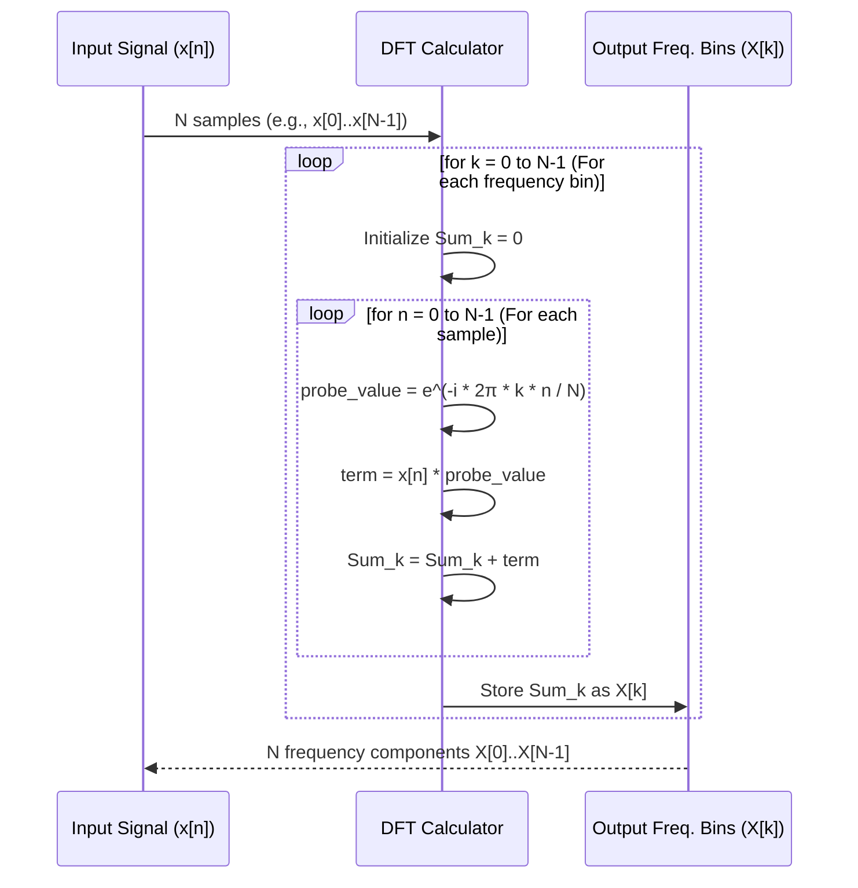

# Chapter 6: Discrete Fourier Transform (DFT) and Fast Fourier Transform (FFT)

Welcome to Chapter 6! In the previous chapter, [Plancherel and Parseval's Theorems](05_plancherel_and_parseval_s_theorems_.md), we saw how energy is wonderfully conserved when we switch between the time and frequency domains for continuous signals. But what about the signals our computers and digital devices work with? These are usually not continuous; they are *digital*.

Imagine you've recorded a short audio clip on your computer. This audio isn't a smooth, continuous wave like the ones we've mostly discussed. Instead, it's a series of numbers, each representing the sound's pressure at tiny, regular time intervals. How can we find out which musical notes (frequencies) are in this digital clip? The Fourier Transform tools we've learned so far, with their integrals, are designed for continuous functions. We need a version for these digital, or *discrete*, signals.

That's where the **Discrete Fourier Transform (DFT)** comes in! And to make it work efficiently on computers, we have a super-fast algorithm called the **Fast Fourier Transform (FFT)**.

## What are Discrete Signals?

Most signals in the digital world are **discrete**. This means:
1.  **Sampled**: The signal's value is only known at specific, regular points in time (or space). Think of taking snapshots of a changing scene at regular intervals. Each snapshot is a "sample".
2.  **Finite**: We usually deal with a limited number of these samples. For example, a 3-second audio clip sampled 44,100 times per second will give us a finite list of 3 * 44,100 = 132,300 numbers.

If we plotted a short snippet of a digital audio signal, it might look like this:

```mermaid
graph LR
    subgraph Time Domain (Discrete Signal)
        direction LR
        A[Time (sample number) -->] --> B(Amplitude)
        C((0)) --- D(Sample 0: Value 0.2)
        E((1)) --- F(Sample 1: Value 0.7)
        G((2)) --- H(Sample 2: Value 0.5)
        I((3)) --- J(Sample 3: Value -0.3)
        K((4)) --- L(Sample 4: Value -0.6)
        style C fill:#fff,stroke:#333,stroke-width:2px
        style E fill:#fff,stroke:#333,stroke-width:2px
        style G fill:#fff,stroke:#333,stroke-width:2px
        style I fill:#fff,stroke:#333,stroke-width:2px
        style K fill:#fff,stroke:#333,stroke-width:2px
        style D stroke-width:0px
        style F stroke-width:0px
        style H stroke-width:0px
        style J stroke-width:0px
        style L stroke-width:0px
    end
```
*(Imagine dots representing signal amplitude at discrete time points 0, 1, 2, 3, 4...)*

This is different from a continuous signal, which is defined for *all* points in time.

## The Discrete Fourier Transform (DFT): The Tool for Digital Signals

The **Discrete Fourier Transform (DFT)** is a version of the Fourier Transform specifically designed for discrete and finite signals.

> The DFT takes a finite sequence of samples (our discrete signal in the time domain) and transforms it into a finite sequence of complex numbers. This new sequence represents the signal in the frequency domain, telling us which discrete frequencies are present and their strength (amplitude) and timing (phase).

**The DFT Formula (A Little Bit of Math):**

If we have `N` samples of our signal, let's call them `x[0], x[1], ..., x[N-1]`, the DFT, `X[k]`, is calculated as:

`X[k] = Σ (from n=0 to N-1)  x[n] * e^(-i * 2π * k * n / N)`

For each frequency component `k` (where `k` goes from `0` to `N-1`).

Let's break this down simply:
*   `x[n]`: This is our input signal, the value of the `n`-th sample.
*   `N`: The total number of samples we have.
*   `k`: This is the "index" for the frequency we are calculating. It runs from `0` up to `N-1`. Each `k` corresponds to a specific frequency.
*   `e^(-i * 2π * k * n / N)`: This is our "frequency probe" again, similar to the one in the continuous Fourier Transform. It's a [Complex Sinusoid (Basis Function)](03_complex_sinusoids__basis_functions__.md) evaluated at discrete points. It helps us measure how much of frequency `k` is in our signal.
*   `Σ`: This symbol means "sum". For each frequency `k`, we're summing up `N` terms.
*   `X[k]`: This is the result for frequency index `k`. It's a complex number.
    *   Its **magnitude** `|X[k]|` tells us the amplitude (strength) of that frequency.
    *   Its **angle** tells us the phase (starting position) of that frequency.

So, the DFT gives us `N` frequency components, `X[0], X[1], ..., X[N-1]`.

**Analogy: Sorting Digital LEGOs**
Imagine our discrete signal is a bag containing a specific number (`N`) of LEGO bricks. The DFT is like a special sorting process that tells us how many bricks of each of `N` possible "digital colors" (frequencies) are in the bag.

**The DFT Spectrum:**
The output `X[k]` is the frequency spectrum of our discrete signal.
*   `X[0]` corresponds to the DC component (average value of the signal), or zero frequency.
*   The actual frequency (in Hertz) corresponding to `X[k]` depends on the sampling rate of your original signal. If `fs` is the sampling rate (e.g., 44100 Hz for CD audio), then the frequency for `X[k]` is `k * (fs / N)`.
*   **Nyquist Frequency**: The highest frequency we can meaningfully detect is `fs / 2`, known as the Nyquist frequency. Any frequencies in the original continuous signal above this will get "aliased" or folded back into lower frequencies, potentially distorting our results.
*   **Symmetry for Real Signals**: If our input signal `x[n]` consists of only real numbers (which is common for things like audio), the DFT output `X[k]` has a special symmetry: `X[k]` will be the complex conjugate of `X[N-k]`. This means the second half of the DFT output (from `k > N/2`) is redundant. We usually only look at the first `N/2 + 1` components.

A typical DFT magnitude spectrum might look like this:

```mermaid
graph LR
    subgraph Discrete Frequency Domain (DFT Output - Magnitudes)
        direction LR
        J[Frequency Index (k) -->] --> K(Magnitude |X[k]|)
        subgraph SpectrumGraph
            L(( )) --> M[Peak at k1] --> N(( )) --> O[Peak at k2] --> P(( ))
            style L fill:#fff,stroke:#fff,height:10px
            style M stroke:#000,stroke-width:4px,height:80px
            style N fill:#fff,stroke:#fff,height:10px
            style O stroke:#000,stroke-width:4px,height:50px
            style P fill:#fff,stroke:#fff,height:10px
        end
    end
```
*(Imagine a bar chart with bars at discrete frequency indices k=0, 1, 2...)*

## Why DFT Can Be Slow

If you look at the DFT formula, to calculate *each* `X[k]`, we perform `N` multiplications and `N-1` additions. Since there are `N` values of `k` to calculate, the total number of operations is roughly proportional to `N * N = N²`.

For a small number of samples (`N`), this is fine. But what if `N` is large?
*   If `N = 1000` (e.g., about 1/44th of a second of CD audio), `N² = 1,000,000`.
*   If `N = 44100` (1 second of CD audio), `N²` is almost 2 billion!

This `N²` complexity means the DFT can be very slow for long signals, making it unsuitable for real-time applications where results are needed quickly.

## The Fast Fourier Transform (FFT): Making DFT Practical

This is where the **Fast Fourier Transform (FFT)** saves the day!

> The **Fast Fourier Transform (FFT)** is NOT a different type of transform. It is an extremely clever and efficient **algorithm** (or a family of algorithms) to compute the DFT much, much faster.

Instead of `N²` operations, FFT algorithms can compute the DFT in roughly `N * log₂(N)` operations.
*   If `N = 1000`, `N * log₂(N)` is roughly `1000 * 10 = 10,000` (much better than 1 million!).
*   If `N = 44100`, `N * log₂(N)` is roughly `44100 * 15.4 = 680,000` (much, much better than 2 billion!).

**Analogy: Super-Efficient Sorting**
*   Calculating DFT directly from its formula is like sorting a huge pile of mail by hand, checking each letter one by one.
*   Using FFT is like having a highly optimized mail-sorting machine that does the job in a fraction of the time.

The FFT made it possible to perform Fourier analysis on computers for a wide range of applications, especially real-time ones like:
*   Digital audio processing (equalizers, effects)
*   Image processing (compression like JPEG, filtering)
*   Telecommunications (modems, wireless signals)
*   Scientific analysis

## Example: Analyzing a Simple Digital Sound with FFT

Let's say we have a very short, simple digital sound represented by 8 samples:
`x = [0.0, 0.707, 1.0, 0.707, 0.0, -0.707, -1.0, -0.707]`
This sequence looks like one cycle of a sine wave.

We can use Python with the NumPy library to compute its FFT (which gives us the DFT result):

```python
import numpy as np

# Our discrete signal (8 samples)
x = np.array([0.0, 0.707, 1.0, 0.707, 0.0, -0.707, -1.0, -0.707])

# Compute the DFT using the FFT algorithm
X = np.fft.fft(x)

# Print the complex DFT coefficients
print("DFT Coefficients (X[k]):")
for k_val, X_k in enumerate(X):
    print(f"X[{k_val}] = {X_k:.2f}")

# Calculate magnitudes (strength of each frequency)
magnitudes = np.abs(X)
print("\nMagnitudes |X[k]|:")
for k_val, mag in enumerate(magnitudes):
    print(f"|X[{k_val}]| = {mag:.2f}")

# (If we knew the sampling rate fs, we could calculate actual frequencies)
# frequencies = np.fft.fftfreq(len(x), d=1/fs) # d is sample spacing
```

**Expected Output (Conceptual):**

```
DFT Coefficients (X[k]):
X[0] = -0.00+0.00j  // DC component, close to zero for a centered wave
X[1] = -0.00-4.00j  // Strong component at frequency index 1
X[2] = -0.00+0.00j
X[3] = -0.00+0.00j
X[4] = -0.00+0.00j
X[5] = 0.00-0.00j
X[6] = 0.00+0.00j
X[7] = -0.00+4.00j  // Symmetric component for real input

Magnitudes |X[k]|:
|X[0]| = 0.00
|X[1]| = 4.00
|X[2]| = 0.00
|X[3]| = 0.00
|X[4]| = 0.00
|X[5]| = 0.00
|X[6]| = 0.00
|X[7]| = 4.00
```
*(Actual values may have small numerical errors, but the principle is shown. The 0.00 values are very close to zero)*

**Explanation:**
*   `X[0]` is the DC offset (average value). For our sine wave, it's close to zero.
*   We see a large magnitude at `X[1]` (and its symmetric counterpart `X[7]`). This indicates that the main frequency content of our signal is at the frequency corresponding to `k=1`.
*   If our 8 samples represented, for example, a signal sampled at 800 Hz, then `N=8`, `fs=800 Hz`. The frequency for `k=1` would be `1 * (800 Hz / 8) = 100 Hz`. So, our signal is mainly a 100 Hz wave.

To visualize this, we'd typically plot the `magnitudes` against the frequency index `k` (or the actual frequencies if `fs` is known), usually only up to `N/2` due to symmetry.

## How the DFT Works (A Peek Under the Hood)

The DFT formula `X[k] = Σ x[n] * e^(-i * 2π * k * n / N)` directly tells us the calculation.

Let's imagine it step-by-step for a small `N`, say `N=4`.
Our input is `x[0], x[1], x[2], x[3]`.
We want to find `X[0], X[1], X[2], X[3]`.

**To find `X[0]` (DC component, k=0):**
`X[0] = x[0]*e^(-i*2π*0*0/4) + x[1]*e^(-i*2π*0*1/4) + x[2]*e^(-i*2π*0*2/4) + x[3]*e^(-i*2π*0*3/4)`
Since `e^0 = 1`, this simplifies to:
`X[0] = x[0] + x[1] + x[2] + x[3]` (The sum of all samples)

**To find `X[1]` (first frequency component, k=1):**
`X[1] = x[0]*e^(-i*2π*1*0/4) + x[1]*e^(-i*2π*1*1/4) + x[2]*e^(-i*2π*1*2/4) + x[3]*e^(-i*2π*1*3/4)`
`X[1] = x[0]*e^0 + x[1]*e^(-iπ/2) + x[2]*e^(-iπ) + x[3]*e^(-i3π/2)`
This involves multiplying each sample by a specific complex number (a point on the unit circle) and summing the results.

And so on for `X[2]` and `X[3]`. Each `X[k]` is a "weighted sum" of all input samples, where the weights are complex numbers from our "frequency probe".



A *naive* Python-like implementation would look like this (conceptually):
```python
import numpy as np # For complex numbers and pi

def naive_dft(x_samples):
    N = len(x_samples)
    X_freq_bins = np.zeros(N, dtype=np.complex128) # Array to store complex DFT results

    for k in range(N): # For each frequency bin k
        sum_for_Xk = 0.0 + 0.0j # Initialize sum for this X[k]
        for n in range(N): # For each input sample x[n]
            # The "frequency probe" term: e^(-i * 2π * k * n / N)
            angle = -2 * np.pi * k * n / N
            probe = np.cos(angle) + 1j * np.sin(angle) # Euler's formula
            
            term = x_samples[n] * probe
            sum_for_Xk += term
        X_freq_bins[k] = sum_for_Xk
        
    return X_freq_bins

# Example usage (same as before)
# x = np.array([0.0, 0.707, 1.0, 0.707, 0.0, -0.707, -1.0, -0.707])
# X = naive_dft(x)
# print(X)
```
This `naive_dft` clearly shows the two nested loops, leading to the `N*N` or O(N²) complexity.

## The Magic of FFT (A Glimpse)

FFT algorithms are too complex to detail fully here, but their "magic" comes from being very smart about the DFT calculation. The most common FFT algorithms, like the Cooley-Tukey algorithm, use a **divide-and-conquer** strategy.

Imagine you need to calculate the DFT of `N` samples.
1.  The FFT might break this problem into calculating two smaller DFTs of `N/2` samples each.
2.  Then, it cleverly combines the results of these two smaller DFTs to get the final DFT for `N` samples.
3.  This "breaking down" process can be repeated. If `N` is a power of 2 (e.g., 8, 16, 1024, 4096), this works particularly well.

The key is that many of the `e^(-i * 2π * k * n / N)` terms (often called "twiddle factors") are related or repeat in specific ways. FFT algorithms exploit these symmetries and redundancies to avoid recalculating the same values over and over again, which is what the naive DFT does.

This reduces the number of calculations from `N²` down to `N * log₂(N)`, a huge saving for large `N`.

## Summary: What We've Learned

*   Real-world digital signals are **discrete** (sampled) and **finite** in length.
*   The **Discrete Fourier Transform (DFT)** is the tool to analyze the frequency content of such signals.
    *   It takes `N` time-domain samples `x[n]`.
    *   It produces `N` frequency-domain complex values `X[k]`.
    *   Each `X[k]` tells us the amplitude and phase of a specific frequency.
*   The DFT calculation can be slow (O(N²)) for many samples.
*   The **Fast Fourier Transform (FFT)** is a family of highly efficient algorithms to compute the DFT.
    *   FFT reduces complexity to O(N log N), making frequency analysis practical for large datasets and real-time applications.
*   Libraries like NumPy in Python provide ready-to-use FFT functions (`np.fft.fft`).

## Next Steps

The DFT and FFT are fundamental tools for digital signal processing. One of the most powerful properties of the Fourier Transform (and its discrete version) is how it relates to convolution – a common signal processing operation. In the next chapter, we'll explore the [Convolution Theorem](07_convolution_theorem_.md) and see how the Fourier Transform can simplify convolution operations.

---

Generated by [AI Codebase Knowledge Builder](https://github.com/The-Pocket/Tutorial-Codebase-Knowledge)