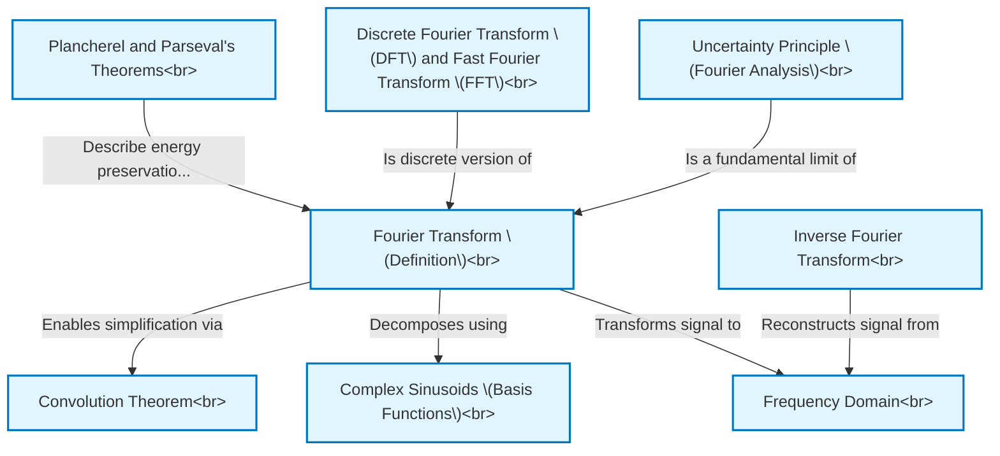

# Tutorial: Fourier_transform

The **Fourier Transform** is a fundamental mathematical concept that allows us to decompose a signal (like a sound wave or an image) into its constituent *frequencies*.
This project explores the definition of the Fourier Transform, its properties, and related concepts. It helps understand how signals can be analyzed in the **frequency domain**, how they can be reconstructed using the *Inverse Fourier Transform*, and how computational methods like *DFT/FFT* make this analysis practical. Important principles like the *Convolution Theorem* (for filtering) and the *Uncertainty Principle* (a fundamental trade-off in signal analysis) are also covered.

**Source Repository:** [None](None)

## Chapters

1. [Fourier Transform (Definition)
](01_fourier_transform__definition__.md)
2. [Frequency Domain
](02_frequency_domain_.md)
3. [Complex Sinusoids (Basis Functions)
](03_complex_sinusoids__basis_functions__.md)
4. [Inverse Fourier Transform
](04_inverse_fourier_transform_.md)
5. [Plancherel and Parseval's Theorems
](05_plancherel_and_parseval_s_theorems_.md)
6. [Discrete Fourier Transform (DFT) and Fast Fourier Transform (FFT)
](06_discrete_fourier_transform__dft__and_fast_fourier_transform__fft__.md)
7. [Convolution Theorem
](07_convolution_theorem_.md)
8. [Uncertainty Principle (Fourier Analysis)
](08_uncertainty_principle__fourier_analysis__.md)

---

Generated by [AI Codebase Knowledge Builder](https://github.com/The-Pocket/Tutorial-Codebase-Knowledge)