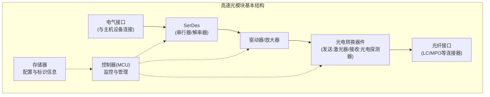

# Chapter 1: 高速光模块概述

欢迎来到 `High_Speed_Optical_Modules` 项目的教程！在本章中，我们将介绍高速光模块的基本概念、发展历史以及它们在现代通信系统中的重要性。

## 什么是高速光模块？

**高速光模块**是一种集成了光电转换、信号处理和传输功能的紧凑型设备，它能够将电信号转换为光信号（发送端）或将光信号转换为电信号（接收端）。这些模块是高速数据通信网络的关键组件，广泛应用于数据中心、电信网络和高性能计算系统中。

想象一下，如果数据是水流，那么传统的铜缆就像是水管，而光纤则是一条超级高速公路。高速光模块就是连接这两个不同世界的"翻译官"和"适配器"，它们能够将电子设备产生的"水流"（电信号）转换成能在"高速公路"上传输的"车辆"（光信号），反之亦然。

## 光模块的发展历史

高速光模块的发展历程反映了数据通信需求的快速增长：

1. **早期阶段（1990年代）**：最初的光模块体积较大，速率较低（如155Mbps到1Gbps），主要用于电信骨干网。

2. **标准化阶段（2000年代初）**：随着SFP（小型可插拔）标准的出现，光模块开始变得更加紧凑和标准化，速率提升到1-10Gbps。

3. **高速发展阶段（2010年代）**：随着数据中心的爆炸性增长，出现了SFP+、QSFP+等更高密度的标准，速率达到40-100Gbps。

4. **当前阶段**：现代光模块已经实现了200Gbps、400Gbps甚至800Gbps的传输速率，同时体积更小、功耗更低，如QSFP-DD和OSFP标准。

## 为什么需要高速光模块？

在当今数字世界中，高速光模块的重要性不言而喻，主要体现在以下几个方面：

### 1. 带宽需求爆炸性增长

随着云计算、人工智能、4K/8K视频流媒体和物联网的普及，全球数据流量呈指数级增长。根据行业报告，全球IP流量每年增长约25-30%。铜缆在高速传输时面临严重的信号衰减和干扰问题，而光纤则能提供几乎无限的带宽潜力。

### 2. 传输距离的优势

铜缆传输在高速率下受到严重的距离限制：
- 10Gbps的铜缆通常限制在7-10米
- 25Gbps的铜缆可能只能达到3-5米

相比之下，光纤可以轻松实现：
- 单模光纤：数十公里的传输距离
- 多模光纤：数百米的传输距离

这使得光模块成为数据中心内部和数据中心之间互连的理想选择。

### 3. 能源效率

随着数据中心规模的扩大，能源消耗成为一个关键问题。高速光模块相比等效带宽的铜缆解决方案，通常能提供更好的比特/瓦特性能，尤其是在长距离传输时。

### 4. 密度和可扩展性

现代光模块的小型化设计（如QSFP28可在一个标准交换机面板上提供36个100G端口）使网络设备能够实现极高的端口密度，从而提高数据中心的空间利用效率。

## 高速光模块的基本结构

一个典型的高速光模块包含以下核心组件：

### 1. 电气接口

这是光模块与主机设备（如交换机、路由器）连接的接口，通常遵循特定的电气规范，如SFI、CAUI-4等。这部分直接与主设备上的SerDes（串行器/解串器）接口相连。

### 2. SerDes（串行器/解串器）

在发送方向，SerDes将并行数据流转换为高速串行数据流；在接收方向，它将高速串行数据流转换回并行数据。这是光模块中处理高速电信号的关键部分，我们在[串行器/解串器 (SerDes)](../Serializer_Deserializer_Component_Design/01_串行器_解串器__serdes__.md)章节已经详细介绍过。

### 3. 驱动器和放大器

- **激光驱动器**：在发送路径上，将SerDes输出的电信号调制并驱动激光器
- **跨阻抗放大器(TIA)**：在接收路径上，将光电探测器产生的微弱电流信号转换并放大为电压信号

### 4. 光电转换器件

- **发送端**：通常是激光二极管(LD)或垂直腔面发射激光器(VCSEL)，将电信号转换为光信号
- **接收端**：光电探测器（如PIN二极管或雪崩光电二极管APD），将光信号转换回电信号

### 5. 光纤接口

这是光模块与光纤连接的物理接口，根据不同标准可能采用LC、SC、MPO等连接器类型。

### 6. 控制和监控电路

包括微控制器(MCU)和存储器，用于管理模块的操作参数、监控温度、电源和信号质量，以及存储模块的标识和配置信息。

## 光模块的分类

高速光模块可以根据多种因素进行分类：

### 按封装形式分类

- **SFP/SFP+**：小型可插拔，支持1G到25G速率
- **QSFP+/QSFP28**：四通道小型可插拔，支持40G到100G速率
- **QSFP-DD**：双密度QSFP，支持200G/400G速率
- **OSFP**：八通道小型可插拔，支持400G/800G速率
- **CFP/CFP2/CFP4**：C形可插拔，主要用于100G及以上速率

### 按传输介质分类

- **SR (Short Reach)**：短距离多模光纤传输，通常<100米
- **LR (Long Reach)**：长距离单模光纤传输，通常10公里
- **ER (Extended Reach)**：扩展距离单模传输，通常40公里
- **ZR (Zone Reach)**：超长距离单模传输，80公里以上
- **AOC (Active Optical Cable)**：有源光缆，两端集成光模块的预连接光缆

### 按波长分类

- **850nm**：主要用于多模光纤短距离传输
- **1310nm**：常用于单模光纤中距离传输
- **1550nm**：主要用于单模光纤长距离传输
- **CWDM/DWDM**：粗/密波分复用，在单根光纤上传输多个波长的光信号

## 高速光模块的应用场景

高速光模块在现代网络基础设施中无处不在：

### 1. 数据中心内部连接

- **服务器到顶架交换机 (ToR)**：通常使用短距离(SR)光模块或有源光缆(AOC)
- **交换机之间的互连**：根据距离需求使用SR、LR或ER模块
- **数据中心内部骨干网**：高密度QSFP或OSFP模块，提供高带宽连接

### 2. 数据中心互连 (DCI)

- 连接不同地理位置的数据中心，通常使用长距离(ZR)或DWDM光模块
- 需要支持更长距离和更高带宽的传输

### 3. 电信和运营商网络

- 骨干网传输
- 5G前传、中传和回传网络
- 边缘计算节点连接

### 4. 企业网络

- 园区网骨干连接
- 建筑物之间的高速连接
- 存储区域网络(SAN)

## 高速光模块的发展趋势

随着数据通信需求的持续增长，高速光模块技术也在不断演进：

### 1. 更高的数据速率

业界已经开始开发800G甚至1.6T的光模块，以满足不断增长的带宽需求。

### 2. 硅光子学集成

将光学组件直接集成到硅芯片上，大幅降低成本和功耗，提高集成度。

### 3. 共封装光学 (CPO)

将光学引擎与电子芯片（如交换ASIC）紧密集成在同一封装中，减少电信号传输损耗。

### 4. 智能化与可编程性

新一代光模块具有更强的数字信号处理(DSP)能力和软件可配置特性，支持远程监控和管理。

### 5. 降低功耗

随着数据中心规模的扩大，降低每比特能耗成为光模块设计的关键目标。

## 总结

在本章中，我们初步认识了高速光模块的基本概念、结构和应用。高速光模块作为现代通信网络的关键组件，将电子世界和光学世界无缝连接，支撑着全球数据通信基础设施的运行。

在接下来的章节中，我们将深入探讨光电转换的原理、各种模块标准与封装、SerDes与光模块的接口设计、信号完整性挑战以及在数据中心中的具体应用案例。

---

Generated by [AI Codebase Knowledge Builder](https://github.com/The-Pocket/Tutorial-Codebase-Knowledge)
