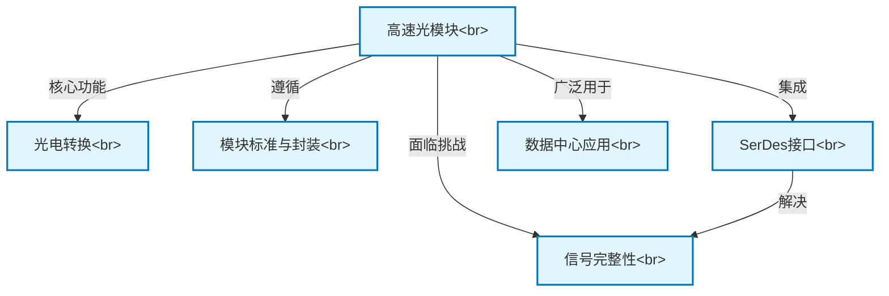

# Tutorial: High_Speed_Optical_Modules

本项目旨在介绍**高速光模块**的设计、工作原理和应用，特别是其与**串行器/解串器 (SerDes)** 技术的结合。
研究内容包括光模块的基本结构、光电转换原理、常见标准（如SFP、QSFP）、信号完整性挑战以及在数据中心和电信网络中的应用。

## Chapters

1. [高速光模块概述](01_高速光模块概述.md)
2. [光电转换原理](02_光电转换原理.md)
3. [模块标准与封装](03_模块标准与封装.md)
4. [SerDes与光模块接口](04_SerDes与光模块接口.md)
5. [信号完整性挑战](05_信号完整性挑战.md)
6. [数据中心应用案例](06_数据中心应用案例.md)

---

Generated by [AI Codebase Knowledge Builder](https://github.com/The-Pocket/Tutorial-Codebase-Knowledge)
