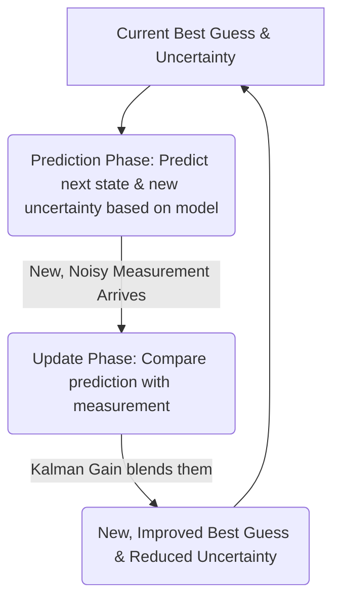

# Chapter 1: Kalman Filter

Welcome to the first chapter of our journey into understanding the `tmp_erm9wcp` project! We'll start with a fascinating and incredibly useful concept: the **Kalman Filter**.

## The Mystery of the Moving Dot

Imagine you're playing a simple computer game. There's a dot moving on your screen, but there's a catch:
1.  You only get to see the dot's position *occasionally*.
2.  When you *do* see it, the measurement isn't perfectly accurate – it's a bit "fuzzy" or "noisy."
3.  You also know that the dot generally tries to move smoothly, but it can also be affected by small, unpredictable "nudges."

Your goal is to have the best possible idea of where the dot *actually is* at any given moment, and even where it's likely to be next. How can you do this when your information is imperfect?

This is exactly the kind of problem the Kalman Filter is designed to solve!

## What is a Kalman Filter?

The **Kalman Filter** is a powerful algorithm that cleverly combines a series of noisy measurements over time with a model of how a system behaves. The result? It produces estimates of unknown variables (like our dot's position) that are more accurate than what any single measurement could provide on its own.

Think of it like this:
Imagine you're trying to track a friend in a crowded, foggy park.
*   **Your Knowledge (System Model)**: You know roughly how people move – they don't teleport, they generally walk at a certain pace, etc.
*   **Your Glimpses (Measurements)**: You get occasional, somewhat blurry glimpses of them through the fog. These glimpses are your measurements, but they're not perfect.
*   **The Kalman Filter (Your Smart Assistant)**: It's like a smart assistant that takes your knowledge of how people move AND your blurry glimpses, and continuously gives you a much clearer, updated idea of where your friend actually is.

This "smart assistant" is widely used in many fields, including:
*   **Navigation**: GPS systems in your phone or car use it to give you a smooth and accurate location, even if satellite signals are momentarily weak or noisy.
*   **Robotics**: Robots use it to understand their surroundings and their own position, even with imperfect sensor data.
*   **Signal Processing**: It can clean up noisy signals, like audio or financial data.
*   **Economics**: To estimate and forecast economic trends.

## How Does It Work? The Big Picture

At its heart, the Kalman Filter works in a repeating cycle of two main steps:

1.  **Predict**: Based on its current understanding of the system (e.g., the dot's last known position and speed) and its model of how things change (e.g., the dot tends to keep moving in the same direction), the filter *predicts* where the dot will be next and how uncertain this prediction is.
2.  **Update**: The filter then gets a new measurement (e.g., a new fuzzy sighting of the dot). It compares this new measurement with its prediction. Then, it cleverly *updates* its estimate, blending the prediction and the measurement. How much it trusts the prediction versus the measurement depends on how uncertain each one is.

This predict-update cycle happens over and over again, with each new measurement helping to refine the estimate. This ongoing process is why we say the Kalman Filter is [Recursive Nature](05_recursive_nature_.md).

Let's visualize this cycle:

## A Peek Under the Hood (Conceptually)

You don't need to dive into complex math right away to get the main idea. Let's stick with our foggy park example:

1.  **Initial Belief**: You have an initial guess where your friend is, and you're somewhat uncertain about it.
2.  **Prediction Step**:
    *   You think: "If my friend was at X, and they walk about Y meters per minute, they should now be around Z." This is your **predicted state**.
    *   You also know your prediction isn't perfect. Maybe they stopped, or turned. So, your **uncertainty** about their position increases a bit. (This is related to the [Prediction Phase](06_prediction_phase_.md) and the [Dynamic System Model](07_dynamic_system_model_.md)).
3.  **Measurement Step**:
    *   You catch a blurry glimpse! It looks like *someone* is over at position M. This is your **measurement**.
    *   The fog makes it hard to be sure. So, this measurement also has its own **uncertainty**. (This is related to [Measurement (Observation)](04_measurement__observation__.md) and the [Observation Model](09_observation_model_.md)).
4.  **Update Step**:
    *   Now, the "magic" happens. The Kalman Filter looks at your predicted position (Z) and its uncertainty, and the measured position (M) and its uncertainty.
    *   It calculates something called the **Kalman Gain**. This gain decides how much to "believe" the new measurement versus the prediction.
        *   If your glimpse (measurement) was very clear (low uncertainty), the filter will trust it more.
        *   If your prediction was already very confident (low uncertainty), the new glimpse might not change your mind much.
    *   The filter then combines your prediction and the measurement, weighted by this gain, to come up with a **new, updated estimate** of your friend's position.
    *   Crucially, this new estimate usually has *less uncertainty* than either the prediction alone or the measurement alone! We've gained more confidence. (This is the [Update Phase](08_update_phase_.md), using the [Kalman Gain](10_kalman_gain_.md) and knowledge about [Covariance (Error Covariance Matrix)](03_covariance__error_covariance_matrix__.md)).

This cycle repeats with every new piece of information.

## The "Ingredients" of a Kalman Filter

To make all this work, the Kalman Filter needs a few key pieces of information, which we'll explore in detail in later chapters:

*   **What we're trying to estimate**: These are the hidden variables we care about, like position and velocity. This is called the [System State (State Variables)](02_system_state__state_variables__.md).
*   **How the system changes over time**: A model that describes the physics or rules governing the system's behavior (e.g., how velocity changes position). This is the [Dynamic System Model](07_dynamic_system_model_.md), which is key to the [Prediction Phase](06_prediction_phase_.md).
*   **How we observe the system**: A model that relates our noisy measurements to the actual state of the system. This is the [Observation Model](09_observation_model_.md), used in the [Measurement (Observation)](04_measurement__observation__.md) step of the [Update Phase](08_update_phase_.md).
*   **Uncertainties**: How much "noise" or error we expect in the system's changes and in our measurements. This is captured by the [Covariance (Error Covariance Matrix)](03_covariance__error_covariance_matrix__.md).
*   **The "Secret Sauce"**: The [Kalman Gain](10_kalman_gain_.md), which intelligently weighs the prediction against the new measurement.

Don't worry if these terms seem a bit much right now! We'll break them down one by one. The core idea is that the Kalman Filter uses a mathematical model of the system and a model of the measurements, along with their uncertainties, to make the best possible guess.

## Why "Kalman"?

The filter is named after Rudolf E. Kálmán, who published a famous paper in 1960 describing this approach. While others had worked on similar ideas, Kálmán provided a comprehensive and practical solution that became incredibly influential, especially with the rise of digital computers that could perform the necessary calculations. It was famously used in the Apollo space program for navigating to the moon!

## Conclusion

The Kalman Filter is a remarkable tool for making sense of messy, real-world data. It provides a way to get surprisingly accurate estimates of things we can't measure perfectly by:
1.  **Predicting** how a system will behave based on a model.
2.  **Updating** that prediction with new, albeit noisy, measurements.
3.  Constantly **tracking and adjusting its own uncertainty** to make the best possible blend of information.

It might sound complex (and the math behind it can be!), but the core concept is about intelligently combining what you *think* will happen with what you *actually observe*, taking into account how sure you are about each.

In the next chapter, we'll start digging into the first key ingredient of the Kalman Filter: understanding what we mean by the [System State (State Variables)](02_system_state__state_variables__.md).

---

Generated by [AI Codebase Knowledge Builder](https://github.com/The-Pocket/Tutorial-Codebase-Knowledge)