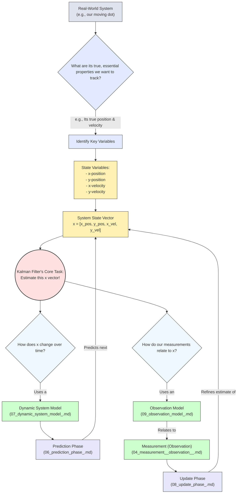

# Chapter 2: System State (State Variables)

Welcome to Chapter 2! In [Chapter 1: Kalman Filter](01_kalman_filter_.md), we got a bird's-eye view of the Kalman Filter and its amazing ability to make sense of noisy data. We learned that it's like a smart assistant helping us track things even when our information is fuzzy.

Now, let's zoom in on one of the most fundamental "ingredients" the Kalman Filter needs: the **System State**, often described by **State Variables**.

## What is the System State? The "True North" of Your System

Imagine you're trying to navigate a ship. Your "system state" would be the ship's *actual, precise* information at any given moment. This isn't just what your instruments *say*, but the real, ground-truth values.

The **system state** refers to the set of true, underlying variables that perfectly describe the system you're interested in at a particular moment in time. These are the hidden gems, the unknown quantities that the Kalman Filter is ultimately trying to figure out or, more accurately, *estimate*.

Think of it like this:
*   **A Car's Journey**:
    *   **System State**: The car's *actual, precise* speed (e.g., 60.345 mph) and its *exact* location (e.g., latitude 34.052235° N, longitude 118.243683° W) at a specific microsecond.
    *   **What you see (Measurements)**: Your speedometer might read 60 mph, and your GPS might show a slightly different location. These are measurements, and they have inaccuracies.
    *   The Kalman Filter's job is to use these imperfect measurements, along with a model of how cars move, to get the best possible estimate of that *true* speed and location.

*   **Our Moving Dot from Chapter 1**:
    *   **System State**: The dot's *actual, precise* position on the screen (e.g., x-coordinate 102.73 pixels, y-coordinate 345.12 pixels) and its *actual, precise* velocity (e.g., moving 2.1 pixels right and 0.5 pixels down per refresh cycle) at that exact moment.
    *   **Measurements**: The "fuzzy" sightings you get are noisy versions of its position.

The Kalman Filter doesn't know the true system state directly (if it did, we wouldn't need a filter!). Instead, it maintains an *estimate* of this state.

### State Variables: The Ingredients of Your State

The "system state" is usually a collection of individual numbers or quantities. Each of these individual numbers is called a **state variable**.

For our moving dot example, if we are tracking its position and velocity in 2D, the state variables could be:
*   `x_position` (the dot's true horizontal position)
*   `y_position` (the dot's true vertical position)
*   `x_velocity` (the dot's true horizontal speed)
*   `y_velocity` (the dot's true vertical speed)

We often group these state variables into a list or, more formally, a **state vector**. For the 2D moving dot, the state vector `x` (this is a common symbol for the state vector) might look like:

`x = [x_position, y_position, x_velocity, y_velocity]`

If we were tracking a simpler 1D dot (only moving left or right), the state vector might just be:

`x = [position, velocity]`

Or for a simple thermostat system, the key state variable we care about might just be the room's *actual* current temperature:

`x = [temperature]`

The choice of state variables is crucial! You need to include all the variables that are essential to describe your system's behavior and that you want to estimate.

## Why is the State "Hidden" or "Unknown"?

If we could perfectly know the true state of our system at all times, we wouldn't need a Kalman Filter! The reality is:

1.  **Imperfect Instruments**: Our sensors (like a GPS, a speedometer, a thermometer, or even our eyes looking for a fuzzy dot) are not perfect. They have noise and inaccuracies. So, a [Measurement (Observation)](04_measurement__observation__.md) is usually a noisy version of some aspect of the true state.
2.  **Unpredictable Influences**: Systems are often affected by small, random forces or disturbances that we can't perfectly model (like the "nudges" affecting our moving dot in Chapter 1).

This means there's a difference between:
*   The **true system state** (what we want to know but can't directly see).
*   Our **measurements** (what our instruments tell us, which are noisy clues about the state).

The Kalman Filter's job is to bridge this gap and give us the best possible estimate of that hidden true state.

## The Kalman Filter's Goal: Estimating the State

The Kalman Filter works by:
1.  Maintaining an **estimate of the system state vector**. This is its "best guess" of what the true state variables are at the current moment.
2.  Maintaining an **estimate of its own uncertainty** about this state estimate. This is super important! The filter doesn't just give a number; it also tells you how confident it is in that number. We'll explore this uncertainty in detail in the next chapter on [Covariance (Error Covariance Matrix)](03_covariance__error_covariance_matrix__.md).

The filter continuously refines its state estimate using a two-step process we touched upon in Chapter 1: Predict and Update. The system state is central to both of these steps.

## Defining Your System State: What Do You Care About?

When you decide to use a Kalman Filter for a problem, one of the very first things you need to do is define what constitutes the "system state." Ask yourself:
*   What are the key quantities that describe my system?
*   What are the variables I actually want to estimate the true values of?

Let's go back to the "mystery moving dot" from Chapter 1.
*   **If the dot only moves horizontally (1D)** and we want to know its position and how fast it's moving:
    *   State variables: `horizontal_position`, `horizontal_velocity`.
    *   System state vector could be: `[horizontal_position, horizontal_velocity]`

*   **If the dot moves in 2D (horizontally and vertically)**:
    *   State variables: `x_position`, `y_position`, `x_velocity`, `y_velocity`.
    *   System state vector could be: `[x_position, y_position, x_velocity, y_velocity]`

This state vector is the core piece of information the Kalman Filter will be working with. For example, in a Python-like conceptual representation, you might think of it as:

```python
# For a 1D moving dot
# state_k = [position_at_time_k, velocity_at_time_k]

# Example values at a certain time k:
# The dot is estimated to be at position 10.5 and moving at 2.1 units/sec
estimated_state_vector = [10.5, 2.1]
```
This `estimated_state_vector` is what the Kalman Filter would internally maintain and update.

## How the Kalman Filter "Sees" and Uses the State

The system state vector you define is the heart of the Kalman Filter's internal world. Here's a conceptual peek (we'll dive into these other components in later chapters):



As you can see, the System State (represented by the state vector `x`) is central.
*   The [Prediction Phase](06_prediction_phase_.md) uses a [Dynamic System Model](07_dynamic_system_model_.md) to predict how this state vector will change from one moment to the next.
*   The [Update Phase](08_update_phase_.md) uses an [Observation Model](09_observation_model_.md) to understand how a new [Measurement (Observation)](04_measurement__observation__.md) (like a fuzzy dot sighting) relates back to the state vector, allowing the filter to correct its estimate.

## Conclusion

The **System State** is all about defining *what you want to know*—the true, underlying variables that describe your system. These are collected into **State Variables**, typically forming a **state vector**. This state is "hidden" because we can't measure it perfectly.

The Kalman Filter's primary mission is to provide the best possible estimate of this hidden system state, even in the face of noisy measurements and unpredictable disturbances. Understanding and correctly defining your system state is the very first step in successfully applying a Kalman Filter.

In the next chapter, we'll explore a crucial companion to the state estimate: how the Kalman Filter quantifies its confidence (or uncertainty) about this estimate. This is done using something called the [Covariance (Error Covariance Matrix)](03_covariance__error_covariance_matrix__.md).

---

Generated by [AI Codebase Knowledge Builder](https://github.com/The-Pocket/Tutorial-Codebase-Knowledge)