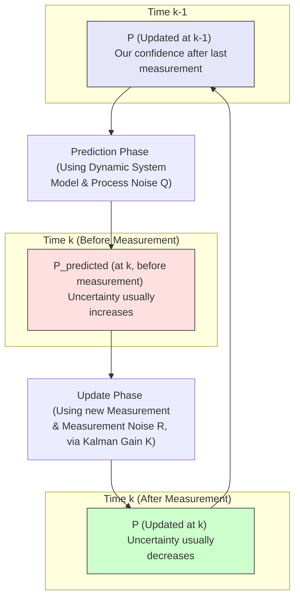
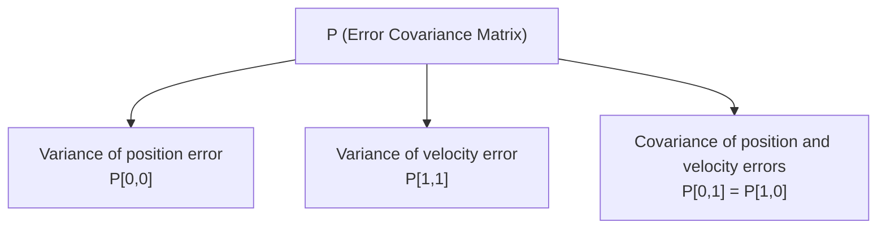

# Chapter 3: Covariance (Error Covariance Matrix)

Welcome to Chapter 3! In [Chapter 2: System State (State Variables)](02_system_state__state_variables__.md), we learned about defining what we want to track with our Kalman Filter – the system's true, hidden state (like our dot's actual position and velocity). We also saw that the Kalman Filter keeps an *estimate* of this state.

But a crucial question remains: how *sure* is the Kalman Filter about its estimate? If it estimates the dot is at `x=10`, is it `x=10 +/- 1 pixel` or `x=10 +/- 20 pixels`? This "plus-or-minus" idea is the gateway to understanding **Covariance**, specifically the **Error Covariance Matrix**, often denoted by the letter **P**.

## How Confident Are We? The "Plus-or-Minus" Idea

Imagine you're waiting for a friend, and you try to estimate their arrival time.
*   **Scenario 1 (High Certainty)**: Your friend is usually very punctual, and traffic is light. You might estimate they'll arrive at 3:00 PM, and you're pretty confident – say, give or take 2 minutes (i.e., between 2:58 PM and 3:02 PM). Your "uncertainty" is small.
*   **Scenario 2 (Low Certainty)**: Your friend is often late, and there's a major traffic jam reported on their route. You might still estimate 3:00 PM (perhaps that's their original plan), but your uncertainty is much larger – maybe give or take 15 minutes (i.e., between 2:45 PM and 3:15 PM).

In the world of Kalman Filters, this "uncertainty" or "confidence level" about the state estimate is quantified by the **Error Covariance Matrix (P)**.

*   **A smaller covariance (P) means higher certainty** (like the +/- 2 minutes example). The filter is more confident in its current guess.
*   **A larger covariance (P) means lower certainty** (like the +/- 15 minutes example). The filter is less confident.

The Kalman Filter doesn't just make a guess; it also keeps track of how good that guess is likely to be. This self-awareness of its own uncertainty is one of the most powerful aspects of the filter!

## What is the Error Covariance Matrix (P)?

The **Error Covariance Matrix (P)** quantifies the uncertainty in the filter's estimate of the [System State (State Variables)](02_system_state__state_variables__.md). The "error" part means it's specifically about the expected error between the filter's *estimated state* and the *true state* of the system.

Let's break this down:

*   **Error**: `Error = True State - Estimated State`. (The filter, of course, doesn't know the true state, but it models the statistical properties of this error).
*   **Covariance**: This is a statistical measure.
    *   If we have only one state variable (e.g., just the 1D position of a dot), `P` would be a single number: the *variance* of the estimation error. Variance is a measure of how spread out the errors are likely to be. A small variance means errors are typically small.
    *   If we have multiple state variables (e.g., position `p` and velocity `v` of a dot), `P` becomes a **matrix**.

### P for a 1D Dot (Position and Velocity)

Let's say our [System State (State Variables)](02_system_state__state_variables__.md) for a dot moving only horizontally is `x = [position, velocity]`.
The error covariance matrix `P` would be a 2x2 matrix:

```mermaid
P = [ [Var(error_in_position)  , Cov(error_in_pos, error_in_vel)],
      [Cov(error_in_vel, error_in_pos),  Var(error_in_velocity) ] ]
```

*   **Diagonal Elements (Variances)**:
    *   `P[0,0] = Var(error_in_position)`: This tells us the uncertainty about our position estimate. A small value means we're quite sure about the position. Think of it as (standard_deviation_of_position_error)².
    *   `P[1,1] = Var(error_in_velocity)`: This tells us the uncertainty about our velocity estimate. A small value means we're confident about the velocity.

*   **Off-Diagonal Elements (Covariances)**:
    *   `P[0,1] = Cov(error_in_pos, error_in_vel)` (which is equal to `P[1,0]`) tells us if the errors in our position estimate are related to errors in our velocity estimate.
        *   **Positive Covariance**: If we overestimate the position, we also tend to overestimate the velocity (and vice-versa). Or, if we underestimate position, we also tend to underestimate velocity.
        *   **Negative Covariance**: If we overestimate the position, we tend to underestimate the velocity (and vice-versa).
        *   **Zero (or near zero) Covariance**: Errors in position and velocity estimates are largely independent. An error in one doesn't tell us much about an error in the other.

**Analogy**: Think about estimating a person's height and weight.
*   `Var(error_in_height)`: Your uncertainty about their height.
*   `Var(error_in_weight)`: Your uncertainty about their weight.
*   `Cov(error_in_height, error_in_weight)`: This is likely to be positive. If you guess someone is taller than they are, you might also guess they are heavier than they are, because height and weight are often correlated.

## Visualizing Uncertainty (Conceptual)

If we were tracking a dot's 2D position (x, y) and `P` represented the uncertainty in just these two position components, we could visualize `P` as an "uncertainty ellipse":

```mermaid
graph LR
    subgraph "Low Uncertainty, No Correlation"
        A((x,y Estimate)) --- B{ellipse}
        style B fill:#eee,stroke:#333,stroke-width:1px,rx:10,ry:10
    end
    subgraph "Higher Uncertainty in X, No Correlation"
        C((x,y Estimate)) --- D{ellipse}
        style D fill:#eee,stroke:#333,stroke-width:1px,rx:20,ry:10
    end
    subgraph "High Uncertainty, Positive Correlation"
        E((x,y Estimate)) --- F{ellipse}
        style F fill:#eee,stroke:#333,stroke-width:1px,rx:20,ry:10,transform:rotate(45deg)
    end
```

*   A small, circular ellipse: We are quite certain about both x and y, and errors in x are not strongly related to errors in y.
*   A flat, wide ellipse: We are more uncertain about x than y.
*   A tilted ellipse: Errors in x and y are correlated. For example, if the ellipse tilts upwards to the right, it means if our x-estimate is too high, our y-estimate is also likely to be too high.

The actual math involves eigenvalues and eigenvectors of `P` to define this ellipse, but the core idea is that `P` captures both the *amount* of uncertainty in each state variable and how these uncertainties *relate* to each other.

## How the Kalman Filter Uses and Updates P

The error covariance matrix `P` is not static; it changes throughout the Kalman Filter's operation.

1.  **Initialization**:
    *   When the filter starts, we need to give it an initial `P_0`. This `P_0` reflects our initial uncertainty about the state.
    *   If we have no idea where the dot is or how fast it's moving, `P_0` will have large numbers on its diagonal (high variances).
    *   If we have a good starting guess, `P_0` will have smaller numbers.

2.  **Prediction Phase**:
    *   During the [Prediction Phase](06_prediction_phase_.md), the filter uses the [Dynamic System Model](07_dynamic_system_model_.md) to predict where the state will be next.
    *   Typically, making a prediction *increases* uncertainty. Think of driving a car in fog: the longer you drive without seeing landmarks, the less certain you become of your exact position.
    *   So, `P` generally grows during the prediction step. How much it grows depends on:
        *   How the system evolves (the `F` matrix in Kalman math, related to the system model).
        *   The **process noise covariance (Q)**. This `Q` represents uncertainty in the system model itself – those unpredictable "nudges" our dot might experience. If `Q` is large, it means our model of how the dot moves isn't perfect, and `P` will grow more to reflect this.

3.  **Update Phase**:
    *   During the [Update Phase](08_update_phase_.md), the filter gets a new [Measurement (Observation)](04_measurement__observation__.md) (e.g., a fuzzy sighting of our dot).
    *   This new information is used to correct the predicted state and, crucially, to *reduce* the uncertainty.
    *   So, `P` generally shrinks during the update step. How much it shrinks depends on:
        *   The predicted error covariance `P_predicted` (how uncertain we were *before* the measurement).
        *   The **measurement noise covariance (R)**. This `R` represents the uncertainty of our measurement itself. A very noisy sensor means `R` is large.
        *   The [Kalman Gain](10_kalman_gain_.md) (`K`), which decides how to blend the prediction and the measurement.

This continuous cycle of `P` growing (prediction) and shrinking (update) is central to the filter's ability to track the state.



The diagram above shows how the error covariance `P` evolves. It starts as `P (Updated at k-1)`. The [Prediction Phase](06_prediction_phase_.md) (which we'll cover in detail in Chapter 6) uses our knowledge of how the system moves (the [Dynamic System Model](07_dynamic_system_model_.md)) and how unpredictable that movement is (process noise `Q`) to calculate `P_predicted`. This `P_predicted` usually represents more uncertainty. Then, a new [Measurement (Observation)](04_measurement__observation__.md) arrives. The [Update Phase](08_update_phase_.md) (Chapter 8) uses this measurement, its own uncertainty (measurement noise `R`), and `P_predicted` to calculate a new, usually smaller, `P (Updated at k)`. This new `P` then becomes the starting point for the next cycle.

## Why P Matters: The Kalman Gain

We'll dive deep into the [Kalman Gain](10_kalman_gain_.md) (K) in Chapter 10, but it's important to know that `P` is a critical ingredient in calculating `K`.

The Kalman Gain is the "magic sauce" that decides how much to trust the new measurement versus how much to trust the filter's own prediction.
*   If `P_predicted` is **large** (filter is very uncertain about its prediction), `K` will be set to give **more weight to the new measurement**.
*   If `P_predicted` is **small** (filter is quite confident in its prediction), `K` will give **less weight to the new measurement** (unless the measurement itself is extremely precise, i.e., `R` is very small).

So, `P` directly influences how the filter learns from new data!

## Conceptual Code Representation

While the actual math to update `P` involves matrix operations with `F` (state transition matrix from the [Dynamic System Model](07_dynamic_system_model_.md)), `Q` (process noise covariance), `H` (observation matrix from the [Observation Model](09_observation_model_.md)), `R` (measurement noise covariance), and `K` (Kalman Gain), let's look at `P` conceptually as a data structure.

If we're using a library like NumPy in Python, `P` would be a NumPy array.

```python
import numpy as np

# For our 1D dot with state x = [position, velocity]
# P is a 2x2 matrix.
# Let's say at the end of time step k-1, our updated P was:
# (e.g., fairly certain about position, a bit less about velocity, small correlation)
P_updated_k_minus_1 = np.array([[2.0, 0.5],
                                [0.5, 3.0]])
print(f"P at end of step k-1:\n{P_updated_k_minus_1}\n")

# --- Prediction Step for time k ---
# Conceptually, P grows. The actual formula is: P_predicted = F @ P_updated_k_minus_1 @ F.T + Q
# Let's imagine F and Q cause it to become:
P_predicted_k = np.array([[5.0, 1.0],  # Uncertainty in position error grew from 2 to 5
                          [1.0, 6.0]]) # Uncertainty in velocity error grew from 3 to 6
print(f"P predicted for step k (before measurement):\n{P_predicted_k}\n")

# --- Update Step for time k (after getting a measurement) ---
# Conceptually, P shrinks. The actual formula is: P_updated = (I - K @ H) @ P_predicted_k
# Let's imagine K and H cause it to become:
P_updated_k = np.array([[1.5, 0.3],   # Uncertainty in position error reduced from 5 to 1.5
                        [0.3, 2.0]])  # Uncertainty in velocity error reduced from 6 to 2.0
print(f"P updated for step k (after measurement):\n{P_updated_k}\n")
```

This code snippet illustrates the *idea* of how `P` might change.
*   `P_updated_k_minus_1`: Our confidence after the last measurement update.
*   `P_predicted_k`: Our confidence *after* predicting the next state but *before* seeing the new measurement. Notice the diagonal values (variances) are larger, meaning more uncertainty.
*   `P_updated_k`: Our confidence *after* incorporating the new measurement. Notice the diagonal values are smaller, meaning less uncertainty and more confidence.

The actual calculations for `F`, `Q`, `H`, `K` will be covered in later chapters ([Dynamic System Model](07_dynamic_system_model_.md), [Prediction Phase](06_prediction_phase_.md), [Observation Model](09_observation_model_.md), [Update Phase](08_update_phase_.md), and [Kalman Gain](10_kalman_gain_.md)). For now, the key is to understand that `P` represents this evolving uncertainty.

## Conclusion

The **Error Covariance Matrix (P)** is the Kalman Filter's internal scorecard of its own uncertainty. It tells us:
1.  How uncertain the filter is about each individual [System State (State Variables)](02_system_state__state_variables__.md) (the diagonal elements of `P`).
2.  How the errors in these state variables might be related to each other (the off-diagonal elements of `P`).

This uncertainty measure is not just a passive report; it's actively used by the filter:
*   It **grows** during the [Prediction Phase](06_prediction_phase_.md) as the filter projects the state into the future.
*   It **shrinks** during the [Update Phase](08_update_phase_.md) as new information from a [Measurement (Observation)](04_measurement__observation__.md) is incorporated.
*   It plays a crucial role in calculating the [Kalman Gain](10_kalman_gain_.md), which determines how the filter balances its predictions with new measurements.

Understanding `P` is key to understanding how the Kalman Filter intelligently manages uncertainty to produce optimal estimates.

In the next chapter, we'll look at the other side of the coin: the [Measurement (Observation)](04_measurement__observation__.md) itself, and how the filter characterizes its reliability.# Chapter 3: Covariance (Error Covariance Matrix)

Welcome to Chapter 3! In [Chapter 2: System State (State Variables)](02_system_state__state_variables__.md), we explored how to define the essential properties of the system we want to track, like the position and velocity of our moving dot. The Kalman Filter aims to estimate this "true" state.

But how sure is the filter about its estimate? If it tells us the dot is at position `x=10.5`, is that a very precise guess, or a rough one? This is where the concept of **Covariance**, specifically the **Error Covariance Matrix (P)**, comes into play. It's the filter's way of saying, "I think the dot is here, and here's how confident I am about that."

## How Confident Are We? The "Plus-or-Minus" Idea

Imagine you're trying to guess when a friend will arrive at your house.
*   **High Certainty**: If your friend lives close by, always leaves on time, and there's no traffic, you might guess "3:00 PM, give or take 2 minutes." Your uncertainty is small.
*   **Low Certainty**: If your friend is coming from far away, during rush hour, and they are often unpredictable, you might guess "3:00 PM, give or take 15 minutes." Your uncertainty is much larger.

In the Kalman Filter, this "give or take" or "plus-or-minus" idea is captured by the **Error Covariance Matrix (P)**.
*   A **small `P`** means the filter has **high certainty** about its state estimate (like the +/- 2 minutes).
*   A **large `P`** means the filter has **low certainty** (like the +/- 15 minutes).

The filter doesn't just make a guess; it also keeps track of its own confidence. This is a vital part of how it works so effectively.

## What is the Error Covariance Matrix (P)?

The **Error Covariance Matrix (P)** quantifies the uncertainty in the filter's estimate of the [System State (State Variables)](02_system_state__state_variables__.md).
The term "Error" is key: `P` specifically relates to the expected (or estimated) error between the filter's *estimated state* and the *true, actual state* of the system. Of course, the filter never knows the true state perfectly (that's why we need a filter!), but it maintains a statistical understanding of how far off its estimate might be.

Let's break this down further:

*   **If we have only one state variable**: For example, if we're only tracking the 1D position of a dot, `P` would be a single number called the **variance** of the estimation error. Variance tells us how spread out our estimation errors are likely to be. A small variance means our estimates are usually very close to the true value.
*   **If we have multiple state variables**: For example, tracking both the position (`p`) and velocity (`v`) of our dot, `P` becomes a **matrix**.

### An Example: P for a 1D Dot (Position and Velocity)

Let's say our [System State (State Variables)](02_system_state__state_variables__.md) for a dot moving only horizontally is `x = [position, velocity]`. The Error Covariance Matrix `P` would be a 2x2 matrix that looks like this:




Let's unpack these terms:

*   **Diagonal Elements (Variances)**:
    *   `P[0,0] = Variance of position error`: This tells us about the uncertainty in our position estimate. "How wide is our guess for the position? +/- this much." A small value means we're quite sure about the estimated position. (Technically, variance is the square of the standard deviation, which is the "+/-" part).
    *   `P[1,1] = Variance of velocity error`: This tells us about the uncertainty in our velocity estimate. "How wide is our guess for the velocity?"

*   **Off-Diagonal Elements (Covariances)**:
    *   `P[0,1]` (which is equal to `P[1,0]` because the matrix is symmetric) is the `Covariance of position and velocity errors`. This tells us if the errors in our position estimate are related to errors in our velocity estimate.
        *   **Positive Covariance**: If our estimate for position is too high, is our estimate for velocity also likely to be too high? (And if position is too low, velocity is also too low?) If so, the covariance is positive.
        *   **Negative Covariance**: If our estimate for position is too high, is our estimate for velocity likely to be too low? (And vice-versa?) If so, the covariance is negative.
        *   **Zero Covariance**: The errors in our position estimate and velocity estimate are largely independent. Knowing we made an error in one doesn't tell us much about an error in the other.

**Analogy Time!** Think about estimating a person's height and weight.
*   *Variance of height error*: Your uncertainty if you guess their height.
*   *Variance of weight error*: Your uncertainty if you guess their weight.
*   *Covariance of height and weight errors*: This is probably positive. If you overestimate someone's height, you might also tend to overestimate their weight, because generally, taller people weigh more. This doesn't mean it's always true, but there's a tendency.

## Visualizing Uncertainty (A Conceptual Sketch)

If we were tracking a dot's 2D position (x, y), and `P` just focused on the uncertainty in these x and y coordinates (ignoring velocity for this visual), we could imagine this uncertainty as an ellipse around our estimated (x,y) point:

*   **Small Circle**: If `P` indicates low uncertainty in both x and y, and no correlation between their errors, the ellipse would be a small circle. We're pretty sure the true dot is close to our estimate, in any direction.
*   **Flat Ellipse**: If `P` indicates high uncertainty in x but low uncertainty in y (and no correlation), the ellipse would be flat and wide. We're unsure about the x-position but more certain about the y-position.
*   **Tilted Ellipse**: If `P` indicates that errors in x and y are correlated (e.g., if we overestimate x, we also tend to overestimate y), the ellipse would be tilted.

The actual shape and size of this "uncertainty ellipse" are determined by the values in the `P` matrix.

## How P Changes: The Filter's Learning Process

The Error Covariance Matrix `P` is not a fixed value; it's dynamic and changes at each step of the Kalman Filter's operation. This is how the filter "learns" and adjusts its confidence.

1.  **Initialization (`P_initial`)**:
    *   We have to give the filter a starting `P`. This represents our initial uncertainty about the system's state *before we've made any measurements*.
    *   If we're very unsure about the dot's starting position and velocity, `P_initial` will have large values (high variances).
    *   If we have a reasonably good idea where it starts, `P_initial` will have smaller values.

2.  **Prediction Phase (`P` usually grows)**:
    *   In the [Prediction Phase](06_prediction_phase_.md), the filter uses its understanding of how the system moves (the [Dynamic System Model](07_dynamic_system_model_.md)) to predict the next state.
    *   When we predict, our uncertainty generally *increases*. If our dot was at position 10 with some uncertainty, and it moves, our prediction of its *new* position will naturally be a bit fuzzier.
    *   This increase in uncertainty also depends on something called **Process Noise (Q)**. `Q` represents how unpredictable the system's movement is (those "nudges" our dot might get). If `Q` is large (meaning the system is very unpredictable), then `P` will grow more during prediction.

3.  **Update Phase (`P` usually shrinks)**:
    *   In the [Update Phase](08_update_phase_.md), the filter gets a new [Measurement (Observation)](04_measurement__observation__.md) (like a fuzzy sighting of the dot).
    *   This new piece of information helps to correct the prediction and, importantly, to *reduce* the uncertainty.
    *   So, `P` generally shrinks after incorporating a measurement. We've gained more confidence. How much it shrinks depends on:
        *   How uncertain our prediction was (`P_predicted`).
        *   How uncertain the measurement itself is (this is called **Measurement Noise (R)**, which we'll discuss more in the next chapter).
        *   The [Kalman Gain](10_kalman_gain_.md) (`K`), which intelligently blends the uncertain prediction with the uncertain measurement.

This cycle of `P` growing during prediction and shrinking during the update is fundamental to how the Kalman Filter refines its estimates over time.

Here’s a conceptual diagram of `P`'s journey:

```mermaid
graph TD
    P_k_minus_1_updated["P (Updated after measurement at time k-1) <br> Current Confidence"] -->|System Evolves| PREDICT["Prediction Phase for time k <br> (using Dynamic Model & Process Noise Q)"]
    PREDICT --> P_k_predicted["P_predicted (at time k, before new measurement) <br> Uncertainty Increases"]
    
    P_k_predicted -->|New Measurement Arrives (with Measurement Noise R)| UPDATE["Update Phase for time k <br> (using Kalman Gain K)"]
    UPDATE --> P_k_updated["P (Updated after measurement at time k) <br> Uncertainty Decreases, Confidence Increases"]
    
    P_k_updated --> P_k_minus_1_updated

    style P_k_minus_1_updated fill:#ccffcc,stroke:#333
    style P_k_predicted fill:#ffe0b3,stroke:#333
    style P_k_updated fill:#ccffcc,stroke:#333
```

## The Role of P in the Kalman Gain

We will cover the [Kalman Gain](10_kalman_gain_.md) (often denoted `K`) in detail in Chapter 10. For now, it's enough to understand that `P` is a crucial input for calculating `K`.

The Kalman Gain is like a knob that decides how much the filter should pay attention to its own prediction versus the new measurement.
*   If `P_predicted` is **large** (meaning the filter is very uncertain about its prediction before seeing the new measurement), the Kalman Gain will be set to give **more weight to the new measurement**. The filter says, "My prediction is shaky, so I'll lean more on this new data."
*   If `P_predicted` is **small** (meaning the filter is quite confident in its prediction), the Kalman Gain will give **less weight to the new measurement** (unless the measurement itself is known to be extremely precise). The filter says, "My prediction is pretty good, so this new data needs to be very compelling to change my mind a lot."

So, the filter's own assessment of its uncertainty (`P`) directly influences how it incorporates new evidence!

## Conceptual Code: P as a Container of Uncertainty

Let's imagine `P` in a Python-like setting, using a library like NumPy for matrices. This is just to show `P` as a data structure holding uncertainty values; the actual math for updating `P` is part of the [Prediction Phase](06_prediction_phase_.md) and [Update Phase](08_update_phase_.md).

```python
import numpy as np # We'll use NumPy for matrix-like structures

# For our 1D dot with state x = [position, velocity]
# P is a 2x2 matrix.
# P = [[Var(pos_error), Cov(pos_error, vel_error)],
#      [Cov(vel_error, pos_error), Var(vel_error)]]

# Initial state: Let's say we're very uncertain about everything.
# High variance for position error (e.g., 1000 units^2)
# High variance for velocity error (e.g., 100 units^2/sec^2)
# Assume no initial correlation between position and velocity errors.
P = np.array([[1000.0,    0.0],
              [   0.0,  100.0]])
print(f"Initial P (high uncertainty):\n{P}\n")

# --- Conceptual Prediction Step ---
# During prediction, uncertainty typically increases.
# The actual math is: P_predicted = F @ P @ F.T + Q
# For simplicity, let's just show an example of increased variances:
P_predicted = np.array([[1050.0,   10.0],  # Position uncertainty grew, maybe some correlation appeared
                        [  10.0,  120.0]]) # Velocity uncertainty grew
print(f"P after prediction (uncertainty grows):\n{P_predicted}\n")

# --- Conceptual Update Step (after a measurement) ---
# After incorporating a measurement, uncertainty typically decreases.
# The actual math is: P_updated = (I - K @ H) @ P_predicted
# For simplicity, let's show an example of decreased variances:
P_updated = np.array([[50.0,  2.0],   # Position uncertainty reduced significantly
                      [ 2.0, 15.0]])  # Velocity uncertainty also reduced
print(f"P after update (uncertainty shrinks):\n{P_updated}\n")

# This new P_updated would then be used as the starting P for the next prediction step.
```

In this conceptual example:
1.  We start with an initial `P` representing high uncertainty.
2.  After the **prediction step**, `P_predicted` shows larger variances (diagonal values), indicating increased uncertainty. The off-diagonal values might also change, indicating how the errors in position and velocity estimates might become correlated.
3.  After the **update step** (where a new measurement is processed), `P_updated` shows smaller variances, reflecting that the filter has become more confident in its estimates.

The specific matrices `F`, `Q`, `H`, `R`, and `K` and how they are used to mathematically transform `P` are topics for upcoming chapters. The crucial takeaway here is what `P` *represents*: the filter's evolving knowledge of its own estimation uncertainty.

## Conclusion

The **Error Covariance Matrix (P)** is the Kalman Filter's dynamic measure of its own confidence in the estimated [System State (State Variables)](02_system_state__state_variables__.md).
*   It quantifies the **variance** of the estimation error for each state variable (how "spread out" the errors are likely to be).
*   It quantifies the **covariance** between the estimation errors of different state variables (how errors in one variable relate to errors in another).
*   `P` is actively updated by the filter: it generally **increases during prediction** (as uncertainty about the future grows) and **decreases during the update** (as new information from measurements reduces uncertainty).
*   This evolving `P` is essential for calculating the [Kalman Gain](10_kalman_gain_.md), which in turn dictates how the filter balances its trust between its own predictions and incoming sensor data.

By keeping track of `P`, the Kalman Filter doesn't just give an estimate; it tells us how good that estimate is likely to be, and uses that information to improve future estimates.

Next, we'll explore the data that helps the filter reduce its uncertainty: the [Measurement (Observation)](04_measurement__observation__.md).

---

Generated by [AI Codebase Knowledge Builder](https://github.com/The-Pocket/Tutorial-Codebase-Knowledge)