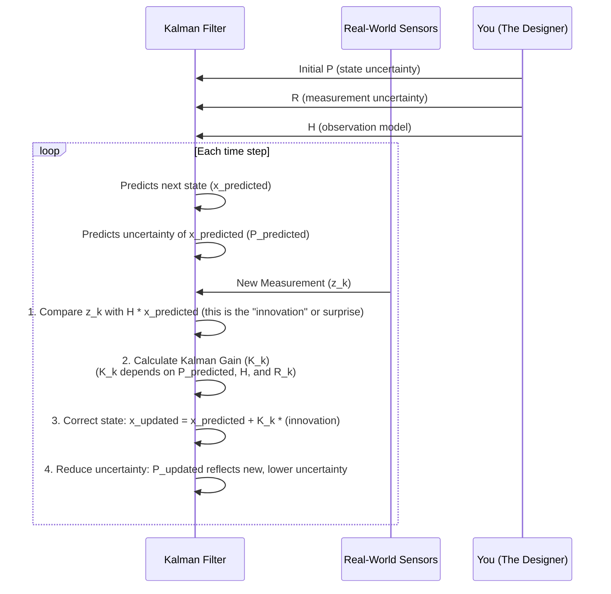

# Chapter 4: Measurement (Observation)

Welcome to Chapter 4! In [Chapter 3: Covariance (Error Covariance Matrix)](03_covariance__error_covariance_matrix__.md), we learned how the Kalman Filter keeps track of its own uncertainty about its estimate of the [System State (State Variables)](02_system_state__state_variables__.md). This uncertainty is represented by the Error Covariance Matrix `P`.

Now, a key question is: how does the filter get information from the outside world to actually improve its estimates and reduce this uncertainty? The answer lies in **Measurements**, also known as **Observations**.

## What are We Actually Seeing? The Bathroom Scale Example

Imagine you're trying to track your weight over several days. Your *true weight* is the [System State (State Variables)](02_system_state__state_variables__.md) we care about.
Each time you step on your bathroom scale, the number displayed is a **measurement** (or **observation**) of your true weight.

However, this measurement is almost never perfect:
*   Maybe the scale isn't perfectly calibrated and always adds or subtracts a little bit.
*   Maybe you shift your balance slightly each time, causing tiny fluctuations in the reading.
*   Perhaps the scale's digital display rounds the number.

These imperfections are what we call "noise" or "inaccuracy" in the measurement. The Kalman Filter is designed to use these noisy, imperfect measurements to get a better, more stable estimate of your true weight over time.

## Defining Measurement (Observation)

A **Measurement** (or **Observation**) is data that we obtain from sensors or other sources. This data provides information about the system's current state, but it's usually flawed.

Think back to our "mystery moving dot" from [Chapter 1: Kalman Filter](01_kalman_filter_.md):
*   **System State**: The dot's *actual* precise position (e.g., `x_true = 102.73`, `y_true = 345.12`).
*   **Measurement**: When you get a "fuzzy sighting" of the dot, perhaps your eyes (or a camera sensor) tell you it's at `x_measured = 103.0`, `y_measured = 344.9`. This is a measurement. It's close to the true state, but not exactly the same due to the "fuzziness" (noise).

Measurements are the Kalman Filter's window to the real world. They are crucial for the "Update" part of its predict-update cycle.

## Why Are Measurements Imperfect? The Concept of Noise

Real-world sensors are rarely perfect. Here are a few reasons why measurements often contain noise or inaccuracies:

1.  **Sensor Limitations**:
    *   A GPS receiver might have an accuracy of +/- 5 meters.
    *   A thermometer might only be accurate to +/- 0.5 degrees.
    *   A camera capturing our moving dot might have pixel noise or be affected by lighting conditions.
2.  **Environmental Factors**:
    *   Electrical interference can affect sensor readings.
    *   Vibrations can make a scale reading jumpy.
3.  **Randomness**:
    *   Many physical processes have inherent randomness at a small scale that can appear as noise in measurements.

The Kalman Filter doesn't expect perfect measurements. In fact, it *requires* us to tell it how unreliable (noisy) our measurements are.

## Quantifying Measurement Uncertainty: The Measurement Noise Covariance (R)

Just like the Kalman Filter uses the [Covariance (Error Covariance Matrix)](03_covariance__error_covariance_matrix__.md) `P` to represent its uncertainty about its own state estimate, it uses another covariance matrix, typically denoted as **R**, to represent the uncertainty of the measurements themselves. This is called the **Measurement Noise Covariance Matrix (R)**.

*   **What `R` tells us**: `R` quantifies how much we expect our measurements to deviate from the true values they are trying to capture, due to noise.
    *   A **small `R`** means our sensor is very precise and trustworthy. The measurements have low noise.
    *   A **large `R`** means our sensor is very noisy and less reliable.

**Example: Bathroom Scale**
If our scale is very cheap and known to give readings that can be off by as much as +/- 1 kg (let's say this +/- 1 kg represents one standard deviation of error, `sigma_scale_error`), then the variance of the measurement noise would be `R_scale = (sigma_scale_error)^2 = 1^2 = 1 kg^2`.

**Example: 1D Moving Dot Position Sensor**
If a sensor measures the 1D position of our dot, and its measurements have a standard deviation of error of `sigma_dot_pos_error = 0.2` units, then the measurement noise variance would be `R_dot_pos = (0.2)^2 = 0.04 units^2`.

**`R` as a Matrix**
If we are measuring multiple quantities at once (e.g., both x and y position of a 2D dot), `R` becomes a matrix.
*   The diagonal elements of `R` represent the variances of the noise for each measured quantity.
*   The off-diagonal elements represent how the noise in one measurement might be correlated with the noise in another. (For many simple sensors, we often assume the noise in different measurements is independent, making the off-diagonal elements zero).

For a 2D dot where we measure `x_measured` and `y_measured`:
```
R = [ [Var(noise_in_x_measurement), Cov(noise_in_x_meas, noise_in_y_meas)],
      [Cov(noise_in_y_meas, noise_in_x_meas), Var(noise_in_y_measurement)] ]
```
If the x-measurement noise has variance `sigma_x_meas^2` and y-measurement noise has variance `sigma_y_meas^2`, and they are uncorrelated:
```
R = [ [sigma_x_meas^2,      0        ],
      [     0        , sigma_y_meas^2] ]
```
The Kalman Filter user (that's you!) typically needs to provide this `R` matrix. It's often determined from sensor specifications or by analyzing sensor data.

## How Measurements Relate to the State: The Observation Model (H)

Our measurements don't always directly correspond one-to-one with the variables in our [System State (State Variables)](02_system_state__state_variables__.md). The **Observation Model** (which we'll detail in [Chapter 9: Observation Model](09_observation_model_.md)) describes this relationship. It's often represented by a matrix **H**.

The basic idea is:
`measurement (z) = H * true_state (x) + measurement_noise (v)`

Where:
*   `z` is the actual measurement vector we get from our sensors.
*   `H` is the observation matrix that maps the true state space to the measurement space.
*   `x` is the true state vector.
*   `v` is the measurement noise vector, whose covariance is `R`.

**Example 1: Bathroom Scale**
*   State `x = [true_weight]` (a 1x1 vector, or just a single number)
*   Measurement `z = [scale_reading]` (a 1x1 vector)
*   Here, the scale reading *directly* measures the weight. So, `H = [1]`.
*   The equation is: `scale_reading = 1 * true_weight + noise_v`.

**Example 2: 1D Moving Dot (Position and Velocity)**
*   State `x = [position, velocity]` (a 2x1 vector)
*   Let's say our sensor *only* measures the position of the dot. So, `z = [measured_position]` (a 1x1 vector).
*   The observation matrix `H` would be `[1  0]`.
*   The equation is: `measured_position = [1  0] * [position, velocity]^T + noise_v`
    Which simplifies to: `measured_position = 1 * position + 0 * velocity + noise_v`.
    This shows that our measurement only gives us direct information about the position part of the state.

The Kalman Filter uses `H` and `R` in its [Update Phase](08_update_phase_.md) to understand how a new measurement `z` should influence its estimate of `x`.

## Conceptual Code: Measurements and Their Uncertainty `R`

Let's see what a measurement and its uncertainty `R` might look like conceptually in code.

```python
import numpy as np # For array-like structures

# Scenario 1: Bathroom Scale
# Our system state might be just: [true_weight]
# Let's say the filter's current estimate of your weight is 69.8 kg.

# A new measurement arrives from the scale:
measurement_weight_z = np.array([70.5]) # The scale reads 70.5 kg

# We need to tell the filter how noisy this scale is.
# Let's assume the scale's error standard deviation is 0.5 kg.
# So, the measurement noise variance R = (0.5)^2 = 0.25 kg^2
R_scale = np.array([[0.25]])
# This R_scale tells the filter: "This measurement of 70.5 kg has an
# uncertainty (variance) of 0.25. Don't trust it blindly!"

print(f"Scale Measurement (z): {measurement_weight_z}")
print(f"Scale Measurement Noise Covariance (R):\n{R_scale}\n")


# Scenario 2: 2D Moving Dot (position x, position y)
# Our system state might be: [x_pos, y_pos, x_vel, y_vel]
# A sensor measures the (x, y) position of the dot.

# New measurement from the position sensor:
measured_xy_z = np.array([10.3, 45.1]) # e.g., x=10.3, y=45.1

# We need to define R for this 2D position sensor.
# Let's say x_measurement_error_std_dev = 0.2 units
# And y_measurement_error_std_dev = 0.3 units
# And let's assume the errors in x and y measurements are slightly correlated.
var_x_meas = 0.2**2  # 0.04
var_y_meas = 0.3**2  # 0.09
cov_xy_meas = 0.01   # Small positive correlation

R_dot_2D = np.array([[var_x_meas,  cov_xy_meas],
                     [cov_xy_meas, var_y_meas]])
# This R_dot_2D tells the filter about the uncertainty in both
# x and y measurements and how their errors might be linked.

print(f"2D Dot Position Measurement (z): {measured_xy_z}")
print(f"2D Dot Measurement Noise Covariance (R):\n{R_dot_2D}")
```

In these examples:
*   `measurement_..._z` is the actual data value(s) we get from our sensor.
*   `R_...` is the Measurement Noise Covariance matrix that we, the designers, provide to the Kalman Filter. It describes the statistical properties of the error we expect in `z`.

The Kalman Filter will use `z` along with `R` (and its own current estimate and uncertainty `P`) to make an intelligent update.

## How the Filter Uses Measurements (A Sneak Peek)

When a new measurement `z` arrives, the Kalman Filter goes into its **Update Phase**. Here's a very high-level idea of what happens, which we'll explore more in [Chapter 8: Update Phase](08_update_phase_.md) and [Chapter 10: Kalman Gain](10_kalman_gain_.md):


The crucial part is how the **Kalman Gain (`K`)** is calculated. It intelligently weighs the new measurement against the filter's prediction:
*   If `R` is **small** (measurement is very precise), `K` will be larger, meaning the filter will trust the new measurement more.
*   If `R` is **large** (measurement is very noisy), `K` will be smaller, meaning the filter will trust its own prediction more and give less weight to the noisy measurement.
*   Similarly, `K` also depends on `P_predicted`. If `P_predicted` is large (filter is very uncertain about its prediction), it will also tend to trust the measurement more.

This is how the filter combines information optimally!

## Conclusion

**Measurements** (or Observations) are the real-world data points that the Kalman Filter uses to ground its estimates in reality. They are almost always imperfect and contain noise.

We quantify the unreliability of our measurements using the **Measurement Noise Covariance Matrix (R)**. This matrix, along with the [Observation Model](09_observation_model_.md) (matrix `H`), allows the Kalman Filter to intelligently incorporate new measurements during its [Update Phase](08_update_phase_.md).

By understanding both its own uncertainty (`P`) and the uncertainty of the incoming data (`R`), the Kalman Filter can make the best possible estimate of the true system state.

This whole process of predicting, getting a measurement, and updating happens over and over again. In the next chapter, we'll delve into this [Recursive Nature](05_recursive_nature_.md) of the Kalman Filter.

---

Generated by [AI Codebase Knowledge Builder](https://github.com/The-Pocket/Tutorial-Codebase-Knowledge)