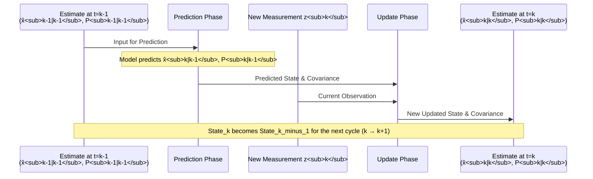

# Chapter 5: Recursive Nature

Welcome to Chapter 5! In [Chapter 4: Measurement (Observation)](04_measurement__observation__.md), we learned how the Kalman Filter gets new information about the system from noisy sensors. This information comes in as a stream of measurements over time.

A big question might be: how does the filter handle all this data? If our dot is moving for a long time, and we get hundreds or thousands of measurements, does the filter need to remember every single one to make its current best guess? Does it get slower and slower as it collects more data?

Happily, the answer is no! This is thanks to a very important characteristic of the Kalman Filter: its **recursive nature**.

## What Does "Recursive" Mean Here? The Running Average Analogy

Imagine you want to calculate the average score of students on a test, but the scores come in one by one.

*   **Method 1 (Not Recursive)**: You write down every score. When you want the average, you add up *all* the scores you've received so far and divide by how many there are. If you have 100 scores, you add 100 numbers. If you have 101 scores, you add 101 numbers. The work grows with each new score.

*   **Method 2 (Recursive - like a "Running Average")**:
    1.  After the first score, the average is just that score.
    2.  When the second score arrives, you use your *previous average* and the new score to quickly calculate a new average.
    3.  When the third score arrives, you use the average you just calculated (from two scores) and the new third score to update it again.
    4.  And so on...

Notice in Method 2, to calculate the new average, you only needed:
1.  The *previous average*.
2.  The *new number*.
3.  How many numbers you had *before* the new one.

You didn't need to look back at *all* the individual scores from the past. This is very efficient!

The Kalman Filter works in a very similar "recursive" way:

1.  **Processes measurements one at a time**: As each new [Measurement (Observation)](04_measurement__observation__.md) arrives, the filter updates its estimate.
2.  **Doesn't need the full history**: To calculate its current best guess about the [System State (State Variables)](02_system_state__state_variables__.md), it doesn't need to store or re-process all past measurements or all its previous state estimates.
3.  **Only needs the immediate past**: It only requires:
    *   Its most recent "best guess" of the state (from the step just before the current one).
    *   Its most recent understanding of its own uncertainty ([Covariance (Error Covariance Matrix)](03_covariance__error_covariance_matrix__.md) `P` from the step just before).
    *   The brand new measurement.

This means the Kalman Filter is like a smart version of the running average calculator. It continuously refines its estimate with each new piece of data without getting bogged down by history.

## The Loop of Information

Think of the Kalman Filter's operation as a continuous loop. What it figures out at the end of one cycle (after processing one measurement) becomes the starting point for the next cycle (when the next measurement arrives).

```mermaid
graph TD
    A[Previous Best Guess <br> (State Estimate & Uncertainty P <br> from time k-1)] --> B(Prediction Phase <br> Predicts state & P for time k)
    B -- New Measurement <br> z_k arrives --> C(Update Phase <br> Compares prediction with z_k)
    C -- Blends them --> D[New, Improved Best Guess <br> (State Estimate & Uncertainty P <br> for time k)]
    D -- Becomes the "Previous Best Guess" for the next cycle --> A
```

This loop – Predict then Update – repeats for every new measurement. The output of the "Update" phase (the new state estimate and new uncertainty `P`) is fed directly back into the "Prediction" phase for the very next time step. This is the essence of its recursive behavior.

## Why is this Recursive Nature So Useful?

This way of operating has two huge advantages:

1.  **Computational Efficiency**:
    *   **Memory Saving**: The filter doesn't need to store a long history of all past measurements or all its previous state estimates. It only needs to keep track of its *current* state estimate and *current* uncertainty. Imagine tracking a satellite for years – storing every single piece of data would be enormous! The Kalman filter avoids this.
    *   **Speed**: The amount of calculation at each step remains roughly the same, no matter how many measurements have been processed before. It doesn't get slower as time goes on.

2.  **Perfect for Real-Time Applications**:
    *   Because it's efficient and processes data "on the fly," the Kalman Filter is ideal for systems where data arrives continuously and decisions or estimates are needed quickly.
    *   Examples:
        *   **GPS Navigation**: Your phone constantly gets noisy satellite signals. A Kalman filter recursively updates your position smoothly and quickly.
        *   **Robotics**: A robot's sensors (cameras, lasers) provide a stream of data about its surroundings. The filter helps it track objects or its own location in real-time.
        *   **Economic Forecasting**: As new economic data (like monthly inflation rates) comes in, models can be recursively updated.

## The Predict-Update Cycle: A Recursive View

We've mentioned the [Prediction Phase](06_prediction_phase_.md) and [Update Phase](08_update_phase_.md) before. The recursive nature is precisely how these two phases work together over time:

1.  **Start**: We begin with an initial guess of the [System State (State Variables)](02_system_state__state_variables__.md) (let's call it `x_0_updated`) and its [Covariance (Error Covariance Matrix)](03_covariance__error_covariance_matrix__.md) (`P_0_updated`). This is our "best guess" at time `k=0`.

2.  **For Time Step `k=1`**:
    *   **Predict**: Using `x_0_updated` and `P_0_updated`, the filter predicts the state `x_1_predicted` and covariance `P_1_predicted`.
    *   A new [Measurement (Observation)](04_measurement__observation__.md) `z_1` arrives.
    *   **Update**: The filter combines `x_1_predicted`, `P_1_predicted` with `z_1` (and its uncertainty `R_1`) to get a refined estimate: `x_1_updated` and `P_1_updated`.

3.  **For Time Step `k=2`**:
    *   **Predict**: Now, the filter uses `x_1_updated` and `P_1_updated` (the results from the *previous* step) to predict `x_2_predicted` and `P_2_predicted`. It *doesn't* need `x_0_updated` or `z_0` anymore!
    *   A new measurement `z_2` arrives.
    *   **Update**: The filter combines `x_2_predicted`, `P_2_predicted` with `z_2` (and `R_2`) to get `x_2_updated` and `P_2_updated`.

4.  **And so on...** This cycle continues for `k=3, 4, ...`

The output of the update at time `k-1` becomes the input for the prediction at time `k`.

```python
# Conceptual Python-like loop for the Kalman Filter
# This shows the recursive flow, not the detailed math.

# Initial state and covariance (our best guess at the very start)
current_state_estimate = initial_state_at_time_0 
current_covariance = initial_covariance_at_time_0

# Imagine a stream of measurements coming in
for time_step_k in range(1, number_of_time_steps):
    
    # --- PREDICTION PHASE for time_step_k ---
    # Predicts based *only* on the state from time_step_k-1
    # (which are current_state_estimate and current_covariance)
    predicted_state_k, predicted_covariance_k = predict_next_state(
        current_state_estimate, 
        current_covariance,
        # ... other model info like F, Q ...
    )
    
    # Get the new measurement for this time_step_k
    new_measurement_z_k = get_measurement_at_time_k(time_step_k)
    
    # --- UPDATE PHASE for time_step_k ---
    # Updates the prediction using the new_measurement_z_k
    # (and its uncertainty R_k, and observation model H_k)
    updated_state_k, updated_covariance_k = update_with_measurement(
        predicted_state_k, 
        predicted_covariance_k, 
        new_measurement_z_k,
        # ... other model info like H, R ...
    )
    
    # The results of this step become the "current" ones for the *next* loop iteration
    current_state_estimate = updated_state_k
    current_covariance = updated_covariance_k
    
    print(f"At time {time_step_k}, best estimate is: {current_state_estimate}")

# After the loop, current_state_estimate is our best guess using all data up to number_of_time_steps
```
This conceptual code shows that within the loop, we only ever use the `current_state_estimate` and `current_covariance` from the end of the *previous* iteration to start the current one. We don't accumulate `all_past_states` or `all_past_measurements` in a giant list to do the calculations.

## What "Recursive" Doesn't Mean Here

It's worth noting that "recursive" here doesn't typically mean a programming function that calls itself (which is a common meaning of recursion in computer science). Instead, it refers to the filter's process: it **recursively applies the same two-step procedure (Predict and Update) to its own most recent output.** It's an iterative process where each iteration builds upon the last one in a very specific and memory-efficient way.

## Visualizing the Flow

Here's another way to see how the information flows from one time step to the next, making the filter recursive:



This diagram shows that the `Estimate at t=k` (output of the update phase) effectively becomes the `Estimate at t=k-1` for the start of the *next* processing cycle.

## Conclusion

The **recursive nature** of the Kalman Filter is a cornerstone of its power and practicality. It means the filter:
*   Processes data one measurement at a time.
*   Doesn't need to store or re-process all past data.
*   Only uses its immediately preceding estimate and the current measurement to update its understanding.

This makes the Kalman Filter computationally lean, memory-efficient, and perfectly suited for real-time systems where data streams in continuously. It's like having a very smart calculator that keeps a running tally of the "truth" without needing to look back at every single old number it has seen.

Now that we understand this efficient, iterative way the Kalman Filter operates, we're ready to dive into the details of its two main steps. In the next chapter, we'll explore the first of these: the [Prediction Phase](06_prediction_phase_.md).

---

Generated by [AI Codebase Knowledge Builder](https://github.com/The-Pocket/Tutorial-Codebase-Knowledge)